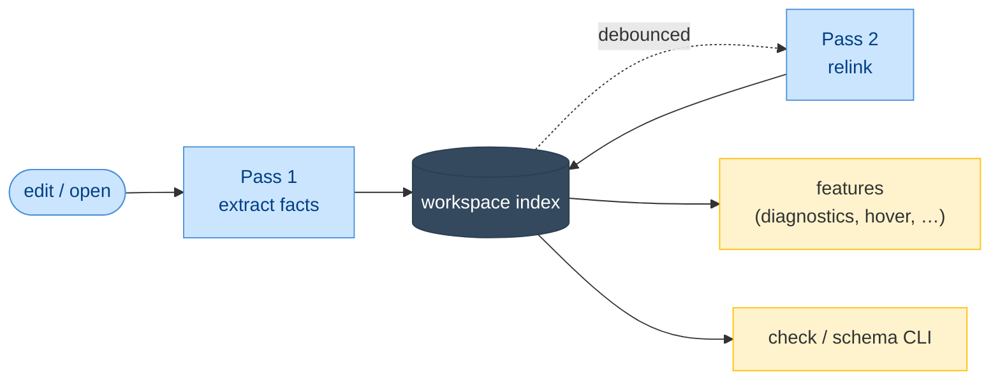

# SQLAlchemy LSP — Overview

> **Status:** Approved
>
> **Version:** 1.0   ·   **Last updated:** 2026-06-17
>
> **Purpose:** What this application is, who it's for, and the shape of the whole thing — in plain language, before any technical detail.

---

## 1. What it is

`sqlalchemy-lsp` is a language server that makes your editor understand SQLAlchemy. When you write ORM models and Alembic migrations, it catches the mistakes a type checker can't — a foreign key pointing at a table that doesn't exist, a `back_populates` that doesn't match its partner, a relationship with no column to join on — and it helps you write them faster with completions, hovers, and one-click fixes.

It is a focused specialist. It does **not** try to be your Python language server; it runs *alongside* Pyright or `pylsp` and only speaks up inside SQLAlchemy and Alembic code.

## 2. Who it's for

Python developers building applications on SQLAlchemy 2.0 and Alembic — the kind of person maintaining the `clean-blog` schema from the [constitution](constitution.md): a handful of related models (`User`, `Post`, `Comment`, `Tag`) and a chain of migrations. They already run a Python LSP and a linter; they want the extra layer of *ORM-aware* help those tools don't provide.

## 3. What it does

- **Diagnostics** — flags ORM correctness bugs (bad FKs, mismatched `back_populates`, cascade errors) and best-practice issues (deprecated `backref`, naive `DateTime`, mutable defaults). See [F01](features/F01-orm-correctness-diagnostics.md), [F02](features/F02-best-practice-lints.md).
- **Completions & signature help** — context-aware suggestions inside `ForeignKey("…")`, `relationship(...)`, `mapped_column(...)`, `__table_args__`, model constructors, and Alembic `op.*`. See [F03](features/F03-completions.md), [F09](features/F09-signature-help.md).
- **Hover & navigation** — rich cards for models and columns, go-to-definition and find-references across FKs and relationships, and workspace-wide rename. See [F04](features/F04-hover.md)–[F07](features/F07-rename.md).
- **Inlay hints & schema view** — inline FK/relationship hints and an ER diagram of your models (Mermaid, Graphviz, or ASCII). See [F10](features/F10-inlay-hints.md), [F12](features/F12-schema-visualization.md).
- **Quick fixes** — generate a missing `__tablename__`, fix a `back_populates`, modernize a `backref`, and more — identical to what the CLI's `--fix` applies. See [F11](features/F11-code-actions.md).
- **Alembic intelligence** — migration-chain checks, op completions, and jump-to-model; you can also jump to a migration by its revision id or message. See [F13](features/F13-alembic-support.md), [F08](features/F08-symbols.md).
- **A headless CLI** — `sqlalchemy-lsp check` runs the same diagnostics in CI with ruff-style output; `schema` and `stats` round it out. See [F14](features/F14-cli-linter.md).
- **Editor extensions** — Zed, Helix, Neovim, and VS Code. See [F15](features/F15-editor-integration.md).

## 4. How it's shaped

One Rust binary speaks LSP over stdio. It parses Python with tree-sitter, extracts SQLAlchemy/Alembic facts per file (Pass 1), and links them into a workspace index (Pass 2). Every feature is a pure function reading that index. The same engine backs the CLI. The detail lives in [E01-architecture](foundations/E01-architecture.md).

## 5. What it is not

- **Not a general Python LSP.** Generic completion, type checking, and imports belong to your Python server (constitution P5).
- **Not a SQL linter.** Raw SQL inside `text()`/`execute()` is out of scope (see [ADR-004](decisions/ADR-004-exclude-rawsql-and-drift.md)).
- **Not a schema-drift tool.** It never connects to a database or compares models against a live schema (P1; ADR-004).
- **Not a migration generator.** It analyzes Alembic files; it doesn't autogenerate them.

## 6. Cross-References

- **Related:** [roadmap](roadmap.md), [E01-architecture](foundations/E01-architecture.md), [index](index.md), [constitution](constitution.md).

## 7. Changelog

- **2026-06-18** — Repointed the hover/navigation bullet to [F04]–[F07] (F08 is no longer a model-navigation feature) and noted in the Alembic bullet that you can jump to a migration by revision id or message ([F08]).
- **2026-06-17** — Initial overview.
