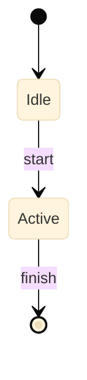

<!--
  SPEC TEMPLATE — copy this to features/F##-name.md or foundations/E##-name.md.
  Fill the <placeholders>, delete sections you don't need, and delete these
  HTML comments as you go. Before writing any body text, read references/writing-style.md.
  Always keep Purpose, Detailed Specification, Cross-References, and Changelog.
-->

# F## — <Feature Name>

> **Status:** Draft
>
> **Version:** 0.1   ·   **Last updated:** <YYYY-MM-DD>
>
> **Purpose:** <One or two sentences. What this spec defines and what it delivers. If you can't say it in two sentences, the spec is doing too much.>
>
> **Depends on:** [<spec>](<path>.md)   ·   **Related:** [<spec>](<path>.md)

> Requirement tag: **<TAG>**   <!-- short uppercase prefix for REQ-<TAG>-NN; delete this line if the spec won't use requirement IDs -->

---

## 1. Purpose & Scope

<!-- Open with the plain-language summary, then list what's in scope. -->

<One-sentence plain-language summary of what this feature is.>

This spec covers:

- <in-scope item>
- <in-scope item>

## 2. Non-Goals / Out of Scope

<!-- What this deliberately excludes, and who owns it instead. -->

- <thing this spec does NOT cover> — owned by [<spec>](<path>.md).

## 3. Background & Rationale

<!-- Why this exists and how it fits the whole. Keep it short. -->

<Context the reader needs to follow the decisions below.>

## 4. Concepts & Definitions

<!-- Terms used or introduced. Canonical terms → link to glossary.md instead of redefining. -->

- **<Term>** — <definition>. (Canonical definition in [glossary](../glossary.md).)

## 5. Detailed Specification

<!-- The body. Use numbered subsections. Lead each with a plain summary.
     If using requirement IDs, give each load-bearing rule a REQ-<TAG>-NN. -->

### 5.1 <Subsection — e.g. Routes>

<Plain-language summary of this subsection.>

**REQ-<TAG>-01 — <short title of the rule>.**

<The rule, one idea per sentence. State pre/postconditions where they matter.>

### 5.2 Data model

<Say what these tables are before showing them. Label code with its file path.>

```dart
// lib/data/tables/<name>.dart
class <Name>s extends Table {
  IntColumn get id => integer().autoIncrement()();
  // ...
}
```

<Then explain the keys, indexes, and nullability rules in prose.>

### 5.3 Screens

<Describe each surface and the behavior behind it — what it shows, what the
user can do, how it routes. Put the visual sketch in §6 (UI Mockups) and
reference it here: "see §6.1".>

## 6. UI Mockups

<!-- REQUIRED for any spec with a UI; drop only for pure backend/data specs.
     One ASCII mockup (~78 cols wide) for EVERY visual component this spec
     introduces — ANYTHING the user sees or interacts with, no exceptions.
     This is not a fixed catalog: windows, dialogs, forms, popovers, popups,
     menus, toasts, sidebars, panels, cards, banners, tooltips, drawers, tabs,
     wizards, tables, empty states, loaders, notifications, context menus,
     onboarding screens — and anything else. If it renders, sketch it.
     The mockup is the layout contract — don't describe a surface in prose
     alone. Add a 6.N subsection per component: lead with one line naming it
     and when it appears, then the mockup, then its states. Annotate
     interactive bits in <…> and keep aligned with §5.3.
     The examples below are illustrative shapes, not the allowed set.
     See references/ascii-mockups.md for the palette, annotations, and gallery. -->

### 6.1 <Component — e.g. Main window>

<One line: what this is and when the user sees it.>

```
┌─ <Window title> ─────────────────────────────────── [_][□][✕] ┐
│                                                                │
│  <layout sketch — sidebar, content, controls>                  │
│                                                                │
└────────────────────────────────────────────────────────────── ┘
```

States: empty · loading · error · <feature-specific>.

### 6.2 <Dialog — e.g. Confirm delete>

<One line: what triggers it.>

```
        ┌─ Delete recording? ───────────────────┐
        │                                        │
        │  This can't be undone.                 │
        │                                        │
        │                 [ Cancel ]  [ Delete ] │
        └────────────────────────────────────────┘
```

### 6.3 <Popover / popup / menu — e.g. Row actions>

<One line: what anchors it and how it's dismissed.>

```
   ⋮
   ╭───────────────╮
   │  Rename       │
   │  Duplicate    │
   │  Delete       │
   ╰───────────────╯
```

### 6.4 <Form — e.g. New item>

<One line: where this form lives and what it submits.>

```
  Name      [____________________________]
  Category  [ <select> ▾ ]
  Notes     [____________________________]
            [____________________________]

                          [ Cancel ]  [ Save ]
```

## 7. Visualizations

<!-- For flows, lifecycles, state machines, and matrices — NOT screens
     (those live in §6 UI Mockups). Mermaid for diagrams (follow
     references/mermaid.md — init block, labeled arrows, colored nodes);
     tables for matrices and catalogs. Don't diagram what a sentence says. -->



## 8. Data Shapes

<!-- Concrete payloads crossing a boundary. Quote verbatim — it's a contract. -->

```json
{ "id": "string", "createdAt": "ISO-8601" }
```

## 9. Examples & Use Cases

<!-- Walk a realistic scenario using the constitution's example cast. -->

<A concrete walk-through with the recurring characters/data.>

## 10. Edge Cases & Failure Modes

<!-- Empty states, failures, races, conflicting input. Not just the happy path. -->

- <case> → <behavior>.

## 11. Testing

<!-- REQUIRED. Every feature ships a test plan covering 100% of its scope.
     Follow E17-testing for categories, tools, and the fixtures registry —
     link to it rather than restating. Map every REQ-<TAG>-NN to a test, and
     cover every screen state (§6) and edge case (§10). -->

<One-line summary of how this feature is tested.>

### 11.1 Scope & coverage

Target: **100% of this feature's behavior is covered.** Every `REQ-<TAG>-NN` below maps to at least one test; every screen state (§6) and edge case (§10) has a test. See the policy in [E17-testing](../foundations/E17-testing.md#2-coverage-policy).

### 11.2 Test plan

<Each row is a behavior under test. Link shared fixtures to E17-testing; name the requirement(s) it verifies.>

| Behavior / scenario | Type | Fixtures | Verifies |
|---|---|---|---|
| <what is exercised> | unit / widget / integration | [<fixture>](../foundations/E17-testing.md#<anchor>) | REQ-<TAG>-01 |

### 11.3 Fixtures

<Reusable fixtures live in [E17-testing](../foundations/E17-testing.md#5-fixtures-registry) — link them above. Define feature-local fixtures here, and cross-link them from anywhere that reuses them.>

- **<fixtureName>** — <what it sets up>. Reused by [<spec>](<path>.md).

### 11.4 Requirement coverage

Every load-bearing requirement maps to a test — this table is the proof.

| Requirement | Covered by |
|---|---|
| REQ-<TAG>-01 | <test name> |

## 12. End-to-End Test Plan

<!-- OPTIONAL — expected for user-facing features; drop for features with no
     E2E surface. Cover 100% of the feature's user-visible scope: the happy
     path AND every reasonably possible error path. Follow E29-e2e-testing for
     tools, harness, and patterns — link to it rather than restating. -->

<One-line summary of the end-to-end journeys this feature must pass.>

### 12.1 Coverage target

**100% of the feature's scope, end to end** — the happy path plus all reasonably possible error paths (validation, network, permission, empty, conflict). See the policy in [E29-e2e-testing](../foundations/E29-e2e-testing.md#2-coverage-policy).

### 12.2 Scenarios

<Enumerate journeys from this feature's flows and §10 edge cases. One row per scenario; assert a concrete outcome.>

| # | Journey | Path | Expected outcome |
|---|---|---|---|
| E2E-01 | <happy path> | happy | <result> |
| E2E-02 | <error: …> | error | <result> |

### 12.3 Acceptance criteria & Definition of Done

<!-- OPT-IN — include only if the project enabled acceptance criteria
     (constitution §4.6). The E2E scenarios ARE the acceptance criteria
     (Specification by Example): write them Given/When/Then so they read as the
     contract and run as the test. -->

The §12.2 scenarios, written Given/When/Then, are this feature's acceptance criteria:

| # | Given | When | Then |
|---|---|---|---|
| AC-01 | <starting state> | <user action> | <observable outcome> |

**Definition of Done:** every `REQ-<TAG>-NN` has a passing test (§11.4), every acceptance scenario above passes, and every enabled non-functional concern (§13) is verified.

## 13. Non-Functional Requirements

<!-- The feature's quality requirements. 13.1 is always required; 13.2 is
     required for UI features; 13.3–13.5 are opt-in — include a subsection only
     if the project enabled that concern (constitution §4.6). Keep entries
     concrete and lean: reference standards and inherited platform defaults
     rather than restating them. Depth scales with risk. -->

### 13.1 Security & Privacy

<!-- REQUIRED. A read-only screen is two lines; a payments flow is a page.
     Link the engines: E19-authentication / E20-authorization. -->

- **Access & authorization** — who may do what, and the trust boundary this feature crosses.
- **Input & validation** — what input is untrusted, and how it's validated/sanitized.
- **Data sensitivity** — any PII / secret / regulated data, its classification, and retention.
- **Baseline** — meets <OWASP ASVS level>; notable threats (STRIDE) and their mitigations: <…>.

### 13.2 Accessibility

<!-- REQUIRED for UI features; drop for non-UI specs. Target WCAG 2.2 AA.
     Inherited defaults are valid entries (e.g. "uses the design system's
     accessible components"). Links D09-accessibility. -->

- **Keyboard & focus** — every action is keyboard-operable; logical focus order; no traps.
- **Screen reader** — labels/roles for every control and state in §6.
- **Visual** — contrast ≥ 4.5:1 (3:1 for large text); color is never the only signal; targets ≥ 44×44px.
- **Motion** — respects reduced-motion; no autoplay without a control.

### 13.3 Permissions & Roles

<!-- OPT-IN (constitution §4.6). The access matrix for multi-role apps.
     Links E11-permissions / E20-authorization. -->

| Role | <action> | <action> |
|---|---|---|
| <role> | ✅ / — | ✅ / — |

### 13.4 Performance & Scale

<!-- OPT-IN (constitution §4.6). State budgets as SLIs/SLOs, not adjectives. -->

- **Latency** — <p50 / p99 targets> for <operation>.
- **Volume & scale** — expected data sizes, growth, pagination, caching strategy.
- **Load** — <throughput / concurrency> the feature must sustain.

### 13.5 Observability

<!-- OPT-IN (constitution §4.6). The three pillars + "what healthy looks like".
     Links E26-analytics. -->

- **Metrics** — <key counters/gauges and their healthy ranges>.
- **Logs / traces** — <events emitted; trace spans for cross-service calls>.
- **Alerts & health** — healthy = <condition>; page when <condition>.

## 14. Rollout & Migration

<!-- OPT-IN (constitution §4.6). How this ships safely and reversibly. -->

<One-line summary of how this feature is rolled out.>

- **Flagging & ramp** — flag `<name>`; ramp <1% → 10% → 100%>; flag-cleanup deadline <date>.
- **Data migration** — expand-contract: add the new shape, dual-write/read, then drop the old.
- **Backward compatibility** — old clients and data keep working throughout the ramp.
- **Rollback** — trigger (<error/latency threshold>) and the steps to revert.

## 15. Open Questions & Decisions

<!-- Undecided items as OQ-<TAG>-NN; record resolved decisions too. -->

- **OQ-<TAG>-1** — <open question>.

## 16. Cross-References

<!-- The complete list of connected specs, grouped like the header. -->

- **Depends on:** [<spec>](<path>.md) — <why>.
- **Related:** [<spec>](<path>.md) — <why>.

## 17. Changelog

<!-- Newest first. ISO dates. Narrative entries — what changed and why. -->

- **<YYYY-MM-DD>** — Initial draft.
