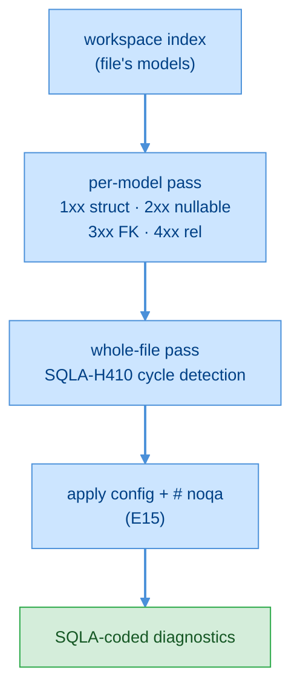

# F01 — ORM Correctness Diagnostics

> **Status:** Draft
>
> **Version:** 0.2   ·   **Last updated:** 2026-06-18
>
> **Purpose:** The correctness core of the linter — the default-on diagnostics that flag a SQLAlchemy model that is structurally wrong: a missing or duplicate table name, a foreign key pointing nowhere, a relationship wired to the wrong counterpart. These are the findings ported from the legacy server, re-coded under the `SQLA-` scheme.
>
> **Depends on:** [constitution](../constitution.md)   ·   [E07-data-model](../foundations/E07-data-model.md)   ·   [E30-extraction-and-indexing](../foundations/E30-extraction-and-indexing.md)   ·   [E16-conventions](../foundations/E16-conventions.md)   ·   [E15-app-config](../foundations/E15-app-config.md)   ·   **Related:** [F02-best-practice-lints](F02-best-practice-lints.md)   ·   [F11-code-actions](F11-code-actions.md)   ·   [F13-alembic-support](F13-alembic-support.md)   ·   [E17-testing](../foundations/E17-testing.md)   ·   [E29-e2e-testing](../foundations/E29-e2e-testing.md)

> Requirement tag: **DIAG**

---

## 1. Purpose & Scope

This spec defines the correctness diagnostics — the findings that tell you a SQLAlchemy model won't behave the way the code says it should.

A correctness diagnostic fires when something is *positively* wrong: a model with no table name, a foreign key to a table that doesn't exist, a relationship whose `back_populates` points at the wrong attribute. These are the rules the legacy server proved against real projects, ported here under the `SQLA-` code scheme and the shared diagnostics engine. They all default **on**, because a project with one of these defects is broken in a way no style preference excuses.

This spec covers exactly these rules:

- **`SQLA-1xx` — structure & constraints:** `W101` missing-tablename, `E102` duplicate-tablename, `E103` duplicate-column, `E105` table-arg-column-not-found.
- **`SQLA-2xx` — columns & types:** `W201` nullable-not-optional (the one column-type rule the legacy server shipped).
- **`SQLA-3xx` — foreign keys:** `E301` unknown-fk-table, `E302` fk-column-not-found, `W303` fk-type-mismatch.
- **`SQLA-4xx` — relationships:** `E401` rel-target-not-found, `W402` back-populates-mismatch, `W403` back-populates-not-found, `W404` uselist-mismatch, `W405` target-mismatch, `H406` missing-fk-for-relationship, `H407` unique-missing-one-to-one, `W408` unknown-cascade, `W409` orphan-without-delete, `H410` circular-relationship.

Every rule reads only the workspace index ([E07](../foundations/E07-data-model.md)) and emits a `SQLA-`-coded `Diagnostic`. Each is configurable and suppressible (§5.3); the mechanics live in [E15](../foundations/E15-app-config.md).

## 2. Non-Goals / Out of Scope

- **The best-practice lints** — the modernization rules, the harder relationship heuristics, and the other `1xx`–`4xx` codes not listed above (`W104`, `H106`, `H107`, `W202`, `W203`, `W204`, `H205`, `H206`, `I207`, `W304`, `W305`, `W411`, `H412`, `W413`, `H414`, `H415`, `H416`) — are owned by [F02-best-practice-lints](F02-best-practice-lints.md). They share this spec's engine and code scheme; only the rule definitions live there.
- **The Alembic rules** (`SQLA-7xx`) — `W701`/`W702`/`H703` — are owned by [F13-alembic-support](F13-alembic-support.md), which reads the migration facts rather than the model facts.
- **The quick-fixes** that resolve these findings (generate a `__tablename__`, fix a `back_populates`, add a missing FK column) are owned by [F11-code-actions](F11-code-actions.md). This spec defines the finding; F11 defines the repair.
- **How a file becomes facts** — the tree-sitter walk and the resolution of `Annotated[...]`, forward references, and the user's declarative base — is owned by [E30](../foundations/E30-extraction-and-indexing.md). This spec reads the resolved facts; it never re-parses.
- **The config and suppression machinery** — `select`/`ignore`/`severity` and `# noqa` parsing — is owned by [E15](../foundations/E15-app-config.md). This spec states which knobs apply, not how they work.
- **Generic Python errors** — undefined names, bad imports, type errors outside SQLAlchemy constructs — belong to the user's Python LSP (constitution P5).

## 3. Background & Rationale

SQLAlchemy lets you describe a database schema in Python, and most of the time that description is just code — the interpreter won't complain until you actually run a query or create the tables, and even then the error is a stack trace far from the typo that caused it. A foreign key that names the wrong table, a relationship whose two halves disagree, a column declared `nullable=True` but typed as non-optional: each is a latent bug the editor could have caught the moment you typed it.

That is what these diagnostics do. They are the **correctness core** — separated from the best-practice lints ([F02](F02-best-practice-lints.md)) because they catch defects, not style. A team can disagree about whether to require `timezone=True` on a datetime; nobody wants a foreign key pointing at a table that isn't there. So they default on, and most carry an `E` (error) or `W` (warning) default severity rather than a hint.

The rules and their logic are ported from the legacy SQLAlchemy LSP's `diagnostics.rs`, which validated them against real-world projects. We keep the behavior and re-home it: every legacy slug (`missing-tablename`, `fk-type-mismatch`, …) becomes a `SQLA-` code, every finding flows through the one shared engine that also backs the `check` CLI ([F14](F14-cli-linter.md)), and every rule answers to the `select`/`ignore`/`severity`/`# noqa` controls the legacy server lacked.

## 4. Concepts & Definitions

These terms are canonical across the suite; the glossary owns the full definitions.

- **Diagnostic code** — a `SQLA-<SEV><CLASS><NN>` identifier for a finding. (Canonical definition in [glossary](../glossary.md); scheme in [E15 §5.5](../foundations/E15-app-config.md).)
- **Default severity** — the level a rule reports at unless [E15](../foundations/E15-app-config.md) overrides it; encoded in the code's `<SEV>` letter (`E`/`W`/`I`/`H`). The code never changes when the severity is overridden.
- **Model / Column / Relationship / FK / `back_populates` / cascade / `uselist`** — the SQLAlchemy facts these rules read. (Canonical definitions in [glossary](../glossary.md); shapes in [E07](../foundations/E07-data-model.md).)
- **Resolve** — to follow a name through the workspace index to the model it denotes — `table_index["users"] → "User"`, then `model_index["User"]`. (Owned by [E07](../foundations/E07-data-model.md)/[E30](../foundations/E30-extraction-and-indexing.md).)
- **Range** — the half-open source span a finding points at; translated to the negotiated encoding per [E01](../foundations/E01-architecture.md).

## 5. Detailed Specification

The diagnostics engine walks each indexed model in a file and, for that model and its columns, table-args, and relationships, emits zero or more `SQLA-`-coded findings. A second pass detects relationship cycles across the whole file. This section gives each rule a `REQ-DIAG-NN` with its code, default severity, trigger, message, a `clean-blog`-based example, and a note on what makes it detectable (and when it must stay silent, per P4).

### 5.0 How a rule is described

Every rule below states the same six things, so you can read any one in isolation:

- **Code & default severity** — the `SQLA-` code and its `<SEV>` letter.
- **Triggers when** — the exact condition on the resolved facts.
- **Message** — the text the user sees, with `{placeholders}` filled from the facts. Messages name the human form, never the code (the code travels in the `Diagnostic.code` field).
- **Range** — where the squiggle lands.
- **Example** — a `clean-blog` mutation that fires it.
- **Detectability** — why we can know this for sure, and when P4 forces silence.

All findings carry `source: "sqlalchemy-lsp"` and the `SQLA-` code in `Diagnostic.code` (see §8). All are subject to the suppression and severity rules in §5.3.

### 5.1 Structure & constraints (`SQLA-1xx`)

These rules check that a model declares the table-level facts SQLAlchemy needs to map it: a table name, no duplicates, and table-args that name real columns.

**REQ-DIAG-01 — `SQLA-W101` missing-tablename (warning).**

A mapped model needs a table to map to. This fires when a model declares no `__tablename__` *and* none of its base classes resolves to a SQLAlchemy abstract base (`DeclarativeBase`, `DeclarativeBaseNoMeta`, `MappedAsDataclass`) — an abstract base legitimately has no table, but a concrete model must name one.

- **Triggers when** `model.table_name` is `None` and no entry in `model.bases` resolves to an abstract SQLAlchemy base ([E30 REQ-EXTRACT-09](../foundations/E30-extraction-and-indexing.md)).
- **Message:** `` Model `{model}` has no __tablename__ ``
- **Range:** the model's `name_range` (the class-name identifier).
- **Example:** the [missing-tablename](../foundations/E17-testing.md#missing-tablename) fixture — `clean-blog` with `User`'s `__tablename__` line removed.

```python
# models/user.py — __tablename__ removed
class User(Base):
    id: Mapped[int] = mapped_column(primary_key=True)   # ← SQLA-W101 on `User`
```

- **Detectability:** the model is in the index (it has a resolved base), so we know it is concrete; the absence of `table_name` is a fact, not a guess. A *dynamic* `__tablename__` (computed, not a literal) leaves `table_name` `None` too — but [E30](../foundations/E30-extraction-and-indexing.md) only indexes such a class as a model when it has a resolved base, and we cannot tell a missing name from a dynamic one, so this is the one place the rule may be conservative. The legacy server reported it regardless; we keep that, and the quick-fix in [F11](F11-code-actions.md) makes it cheap to dismiss.

**REQ-DIAG-02 — `SQLA-E102` duplicate-tablename (error).**

Two models cannot own the same table — SQLAlchemy raises at mapper-configuration time. This fires when a model's `__tablename__` is already claimed in `table_index` by a *different* model.

- **Triggers when** `model.table_name` is `Some(t)` and `table_index[t]` resolves to a model name other than this one.
- **Message:** `` Duplicate table name `{table}` (also used by `{other_model}`) ``
- **Range:** the model's `name_range`.
- **Example:** the [duplicate-tablename](../foundations/E17-testing.md#duplicate-tablename) fixture — a second model also declaring `__tablename__ = "users"`.

```python
# models/account.py
class Account(Base):
    __tablename__ = "users"          # ← SQLA-E102: also used by `User`
    id: Mapped[int] = mapped_column(primary_key=True)
```

- **Detectability:** cross-file and exact — the reverse index ([E07](../foundations/E07-data-model.md)) holds the last writer, and the collision is real because both names resolved. When the two models live in different files, editing one re-indexes and re-runs the other's diagnostics ([E29 external-write→re-index](../foundations/E29-e2e-testing.md)).

**REQ-DIAG-03 — `SQLA-E103` duplicate-column (error).**

A class body that assigns the same mapped attribute twice silently keeps only the last — the earlier column vanishes. This fires once per shadowed definition.

- **Triggers when** `model.duplicate_columns` is non-empty; one finding per `(name, range)` entry ([E30 REQ-EXTRACT-06](../foundations/E30-extraction-and-indexing.md) records these).
- **Message:** `` Duplicate column `{column}` on model `{model}` ``
- **Range:** the earlier definition's name range (carried in `duplicate_columns`), so the squiggle lands on the shadowed line.
- **Example:** the [duplicate-column](../foundations/E17-testing.md#duplicate-column) fixture — `Post` declaring `title` twice.

```python
# models/post.py
class Post(Base):
    __tablename__ = "posts"
    title: Mapped[str] = mapped_column(String(200))   # ← SQLA-E103 (shadowed)
    title: Mapped[str] = mapped_column(String(120))
```

- **Detectability:** purely structural — the extractor saw two assignments to one attribute name in one class body. No resolution needed.

**REQ-DIAG-04 — `SQLA-E105` table-arg-column-not-found (error).**

An `Index`, `UniqueConstraint`, or `PrimaryKeyConstraint` in `__table_args__` references columns by name; a name the model doesn't define is a typo that fails at table-creation. This fires per offending column string.

- **Triggers when** a `TableArg` names a column not present in `model.columns`; one finding per unresolved column, using the parallel `column_ranges` ([E07 REQ-DATA-06](../foundations/E07-data-model.md)).
- **Message:** `` Column `{column}` not found on model `{model}` (in {kind}) ``
- **Range:** the exact column-string range inside the `__table_args__` construct.
- **Example:** the [table-arg-column-not-found](../foundations/E17-testing.md#table-arg-column-not-found) fixture — `Post.__table_args__` indexing a non-existent column.

```python
# models/post.py
class Post(Base):
    __tablename__ = "posts"
    title: Mapped[str] = mapped_column(String(120))
    __table_args__ = (Index("ix_post_titel", "titel"),)   # ← SQLA-E105 on "titel"
```

- **Detectability:** the column set is the model's own — no cross-file resolution — so an unmatched name is unambiguous. Matching is against the Python attribute name as written in the construct.

### 5.2 Columns & types (`SQLA-2xx`)

The correctness core ships exactly one column-type rule — the nullable-versus-`Optional` check the legacy server had. The rest of the `2xx` class (`H205` naive-datetime, `W203` mutable-default, and friends) is best-practice and lives in [F02](F02-best-practice-lints.md).

**REQ-DIAG-05 — `SQLA-W201` nullable-not-optional (warning).**

A column declared `nullable=True` should be typed `Optional` (or `T | None`), or the Python type lies about what the database allows. The legacy server checked this specifically for foreign-key columns, where the mismatch most often hides a bug; this spec preserves that scope.

- **Triggers when** a column has a foreign key, `args.nullable` is `true`, `args.primary_key` is `false`, and its `MappedType` is **not** `Optional(_)`.
- **Message:** `` Column `{column}` is nullable but type is not Optional ``
- **Range:** the column's `name_range`.
- **Example:** the [nullable-not-optional](../foundations/E17-testing.md#nullable-not-optional) fixture — a `Mapped[str]` FK column declared `nullable=True`.

```python
# models/post.py
class Post(Base):
    __tablename__ = "posts"
    author_id: Mapped[int] = mapped_column(ForeignKey("users.id"), nullable=True)
    # ↑ SQLA-W201: nullable but Mapped[int], not Mapped[Optional[int]]
```

- **Detectability:** nullability is read from the explicit `nullable=` arg or inferred from the annotation ([E30 REQ-EXTRACT-08d](../foundations/E30-extraction-and-indexing.md)); the optionality is read from the resolved `MappedType`. When the type is `Unknown` we cannot compare, so the rule stays silent (P4). The quick-fix wraps the type in `Optional[...]` ([F11](F11-code-actions.md)).

> **Note:** This is intentionally the FK-scoped legacy rule. Its mirror image — a column typed `Optional` but declared `nullable=False` (`SQLA-H202`), and the broader non-FK nullable check — belongs to [F02](F02-best-practice-lints.md). Cross-reference, don't expect it here.

### 5.3 Foreign keys (`SQLA-3xx`)

These rules resolve a `ForeignKey("table.column")` against the workspace index and report when the target is missing or the types disagree.

**REQ-DIAG-06 — `SQLA-E301` unknown-fk-table (error).**

A foreign key names a table; if no indexed model owns that table, the FK can never resolve. This fires only when the table is genuinely unknown.

- **Triggers when** a column's `ForeignKeyRef.table` resolves to no model **and** the name is absent from both `table_index` and `model_index` ([E07](../foundations/E07-data-model.md)).
- **Message:** `` Foreign key references unknown table `{table}` ``
- **Range:** the FK argument's `range` (the `"table.column"` literal).
- **Example:** the [bad-fk](../foundations/E17-testing.md#bad-fk) fixture — `ForeignKey("user.id")` where the table is `users`.

```python
# models/post.py
author_id: Mapped[int] = mapped_column(ForeignKey("user.id"))
# ↑ SQLA-E301: no table or model named `user` (it's `users`)
```

- **Detectability:** this is the rule that most needs P4's discipline. We fire **only** when the name is in neither reverse index — so a target defined in another file that simply hasn't indexed yet does not false-positive, and the cross-file case (FK in `post.py` → `User` in `user.py`) resolves cleanly ([E29 cross-file scenario](../foundations/E29-e2e-testing.md)). When the workspace genuinely has no such table, we are certain.

**REQ-DIAG-07 — `SQLA-E302` fk-column-not-found (error).**

The table resolved, but the column half of `"table.column"` isn't on it — a column-level typo. This fires when the target model exists but lacks the named column.

- **Triggers when** the FK's table resolves to a model, but that model has no column matching `ForeignKeyRef.column`.
- **Message:** `` Column `{column}` not found on table `{table}` ``
- **Range:** the FK argument's `range`.
- **Example:** the [fk-column-not-found](../foundations/E17-testing.md#fk-column-not-found) fixture — `ForeignKey("users.uid")` where `users` has `id`, not `uid`.

```python
# models/post.py
author_id: Mapped[int] = mapped_column(ForeignKey("users.uid"))
# ↑ SQLA-E302: `users` has no column `uid`
```

- **Detectability:** the target model is resolved, so its column set is known and the miss is exact. Matching is against the target model's column keys.

**REQ-DIAG-08 — `SQLA-W303` fk-type-mismatch (warning).**

A foreign-key column should share the type of the column it references; a `Mapped[str]` pointing at an integer primary key is a join waiting to break. This fires when both sides have a known, comparable type and the base types differ.

- **Triggers when** the FK resolves to a target column, and the two columns' base types (the inner type for an `Optional`) are both classifiable and unequal.
- **Message:** `` Type mismatch: `{column}` is {own_type} but `{table}.{target_col}` is {target_type} ``
- **Range:** the FK argument's `range`.
- **Example:** the [fk-type-mismatch](../foundations/E17-testing.md#fk-type-mismatch) fixture — `Post.author_id` declared `Mapped[str]` against integer `users.id`.

```python
# models/post.py
author_id: Mapped[str] = mapped_column(ForeignKey("users.id"))
# ↑ SQLA-W303: author_id is str but users.id is Integer
```

- **Detectability:** we compare *base* types, so `Mapped[Optional[int]]` matches `Mapped[int]`. When either side resolves to `MappedType::Unknown` — an unclassifiable or custom type — the comparison is skipped entirely and no finding is emitted (P4). It is a warning, not an error, because compatible-but-differently-spelled types do exist; the rule only flags clear mismatches.

### 5.4 Relationships (`SQLA-4xx`)

This is the richest class. A `relationship(...)` wires two models together, and there are many ways to wire it wrong: a missing target, a `back_populates` that doesn't match, a `uselist` that fights the annotation, a cascade typo. Each rule below reads the `Relationship` fact ([E07 REQ-DATA-05](../foundations/E07-data-model.md)).

**REQ-DIAG-09 — `SQLA-E401` rel-target-not-found (error).**

A relationship must target a model the index knows. This fires when the resolved `target_model` matches no indexed model.

- **Triggers when** `rel.target_model` is absent from `model_index`.
- **Message:** `` Relationship target model `{target}` not found ``
- **Range:** `rel.target_range` when present, else `rel.name_range`.
- **Example:** the [rel-target-not-found](../foundations/E17-testing.md#rel-target-not-found) fixture — `relationship("Auther")`.

```python
# models/post.py
author: Mapped["Auther"] = relationship(back_populates="posts")
# ↑ SQLA-E401: no model named `Auther`
```

- **Detectability:** [E30 REQ-EXTRACT-08c](../foundations/E30-extraction-and-indexing.md) normalizes strings, lambdas, and quoted annotations to one `target_model`; if that name is in no index, it is genuinely undefined. Navigation onto it stays silent (P4), but the diagnostic still fires — a named target that resolves to nothing is positively wrong.

**REQ-DIAG-10 — `SQLA-W402` back-populates-mismatch (warning).**

`back_populates` names the reverse attribute, and the two halves must agree: if `Post.author` says `back_populates="posts"`, then `User.posts` must say `back_populates="author"`. This fires when the counterpart exists but points back at the wrong attribute.

- **Triggers when** `rel.back_populates = Some(bp)`, the target model resolves, it *has* a relationship named `bp`, that counterpart sets its own `back_populates`, and the counterpart's value differs from this relationship's `name`.
- **Message:** `` back_populates mismatch: `{target}.{bp}` points to `{counterpart_bp}`, not `{name}` ``
- **Range:** `rel.back_populates_range` when present, else `rel.name_range`.
- **Example:** the [back-populates-mismatch](../foundations/E17-testing.md#back-populates-mismatch) fixture — `Post.author` sets `back_populates="post"` but `User` exposes `posts`.

```python
# models/post.py
author: Mapped["User"] = relationship(back_populates="posts")
# models/user.py
posts: Mapped[list["Post"]] = relationship(back_populates="post")
# ↑ SQLA-W402 on `Post.author`: User.posts points to `post`, not `author`
```

- **Detectability:** both halves are resolved facts, so the disagreement is exact and cross-file. We only fire when the counterpart *sets* its own `back_populates` — a counterpart that omits it is W403's domain, not this one's.

**REQ-DIAG-11 — `SQLA-W403` back-populates-not-found (warning).**

A `back_populates` value must name a relationship that actually exists on the target. This fires when the target model resolves but has no relationship by that name.

- **Triggers when** `rel.back_populates = Some(bp)`, the target model resolves, and it has **no** relationship named `bp`.
- **Message:** `` back_populates `{bp}` not found on model `{target}` ``
- **Range:** `rel.back_populates_range` when present, else `rel.name_range`.
- **Example:** the [back-populates-not-found](../foundations/E17-testing.md#back-populates-not-found) fixture — `Post.author` names a `back_populates` attribute `User` doesn't have.

```python
# models/post.py
author: Mapped["User"] = relationship(back_populates="articles")
# ↑ SQLA-W403: User has no relationship `articles`
```

- **Detectability:** the target's relationship set is known once it resolves, so the miss is exact. When the target itself can't resolve, neither this rule nor W402 fires — there is nothing to compare against (P4).

**REQ-DIAG-12 — `SQLA-W404` uselist-mismatch (warning).**

An explicit `uselist=` should agree with the annotation: `uselist=False` on a `Mapped[list[...]]`, or `uselist=True` on a scalar `Mapped[...]`, contradict each other. This fires on either contradiction.

- **Triggers when** `rel.uselist = Some(false)` and `rel.is_list` is `true`, **or** `rel.uselist = Some(true)` and `rel.is_list` is `false`.
- **Message:** `` `uselist={value}` but type annotation for `{name}` is {"a list" | "not a list"} `` (phrased to match the case).
- **Range:** `rel.full_range`.
- **Example:** the [uselist-mismatch](../foundations/E17-testing.md#uselist-mismatch) fixture.

```python
# models/user.py
posts: Mapped[list["Post"]] = relationship(uselist=False)
# ↑ SQLA-W404: uselist=False but the annotation is a collection
```

- **Detectability:** `is_list` is inferred from the collection wrapper in the annotation ([E30 REQ-EXTRACT-08d](../foundations/E30-extraction-and-indexing.md)); `uselist` is read verbatim. We only fire when `uselist` is *explicitly set* — an omitted `uselist` is inferred from the annotation and can never disagree with it.

**REQ-DIAG-13 — `SQLA-W405` target-mismatch (warning).**

When a relationship both annotates a target and passes one to `relationship(...)`, the two should name the same model. This fires when the annotation's resolved target and the explicit positional argument disagree.

- **Triggers when** `rel.explicit_target = Some(e)` and `e` differs from `rel.target_model` (the type-annotation-resolved target).
- **Message:** `` Type annotation says `{target}` but relationship() argument says `{explicit}` ``
- **Range:** `rel.target_range` when present, else `rel.name_range`.
- **Example:** the annotation says one model, the call says another.

```python
# models/post.py
author: Mapped["User"] = relationship("Account", back_populates="posts")
# ↑ SQLA-W405: annotation says `User`, argument says `Account`
```

- **Detectability:** both spellings are kept on the fact ([E07 REQ-DATA-05](../foundations/E07-data-model.md)) — `target_model` from the annotation, `explicit_target` from the call — so the disagreement is purely local and exact. When only one spelling is present they trivially agree and nothing fires.

**REQ-DIAG-14 — `SQLA-H406` missing-fk-for-relationship (hint).**

A scalar relationship with no `secondary` join table needs a foreign key somewhere linking the two models, or SQLAlchemy can't infer the join. This fires when no such FK can be found on either side and no naming-convention column suggests one.

- **Triggers when** `rel.is_list` is `false`, `rel.secondary` is `None`, the target model is indexed and resolves, both models have known table names, and **none** of the following holds: this model has a column whose FK targets the other's table or model name; the target model has a column whose FK targets this model's table or name; this model has a column literally named `{rel_name}_id` or `{target_model_lowercased}_id`.
- **Message:** `` No foreign key column found linking `{model}` to `{target}` — consider adding one or using `secondary` ``
- **Range:** `rel.name_range`.
- **Example:** the [missing-fk-for-relationship](../foundations/E17-testing.md#missing-fk-for-relationship) fixture — a relationship whose two models share no FK.

```python
# models/profile.py
class Profile(Base):
    __tablename__ = "profiles"
    id: Mapped[int] = mapped_column(primary_key=True)
    user: Mapped["User"] = relationship()   # ← SQLA-H406: no FK links profiles ↔ users
```

- **Detectability:** this is a hint, not an error, because the FK might be expressed in a way we can't see — a `primaryjoin`, a deferred column, an `Annotated` alias the resolver missed. We check both directions and the `{name}_id` naming convention before firing, and we stay silent when either table name is unknown (P4). The quick-fix scaffolds the FK column ([F11](F11-code-actions.md)).

**REQ-DIAG-15 — `SQLA-H407` unique-missing-one-to-one (hint).**

A one-to-one relationship is enforced by a `unique=True` on the foreign-key column; without it, the "one" side can have many rows. This fires on a scalar relationship whose backing FK column is neither unique nor a primary key.

- **Triggers when** the relationship is scalar (`uselist = Some(false)`, or `is_list` is `false` with `uselist` unset), the target resolves with a known table, and this model has an FK column targeting that table (or the target's model name) that is **not** `unique` and **not** `primary_key` — and `uselist` is explicitly `Some(false)`.
- **Message:** `` One-to-one relationship `{name}` — consider adding `unique=True` to column `{column}` ``
- **Range:** the FK column's `name_range`.
- **Example:** the [unique-missing-one-to-one](../foundations/E17-testing.md#unique-missing-one-to-one) fixture — `User.profile` one-to-one whose backing FK lacks `unique=True`.

```python
# models/profile.py
user_id: Mapped[int] = mapped_column(ForeignKey("users.id"))   # no unique=True
user: Mapped["User"] = relationship(uselist=False, back_populates="profile")
# ↑ SQLA-H407 on `user_id`: a one-to-one wants unique=True
```

- **Detectability:** a hint, because intent ("this is one-to-one") is inferred and a unique might be enforced at the table level via `__table_args__` in a way this narrow check doesn't credit. We require an explicit `uselist=False` for the firing path, keeping false positives low. The quick-fix adds `unique=True` ([F11](F11-code-actions.md)).

**REQ-DIAG-16 — `SQLA-W408` unknown-cascade (warning).**

The `cascade=` string is a comma-separated set of known tokens; a misspelling silently does nothing. This fires per unrecognized token.

- **Triggers when** `rel.cascade` splits on commas into a token not in the valid set: `save-update`, `merge`, `expunge`, `delete`, `delete-orphan`, `refresh-expire`, `all`. One finding per bad token; empty tokens are ignored.
- **Message:** `` Unknown cascade option `{token}` ``
- **Range:** `rel.cascade_range` when present, else `rel.full_range`.
- **Example:** the [unknown-cascade](../foundations/E17-testing.md#unknown-cascade) fixture — `cascade="all, delete-orphen"`.

```python
# models/user.py
posts: Mapped[list["Post"]] = relationship(cascade="all, delete-orphen")
# ↑ SQLA-W408: `delete-orphen` is not a cascade token (meant `delete-orphan`)
```

- **Detectability:** the token set is fixed and known, so an unrecognized token is unambiguous. Whitespace around tokens is trimmed before the check.

**REQ-DIAG-17 — `SQLA-W409` orphan-without-delete (warning).**

`delete-orphan` only works alongside `delete` (or `all`, which implies it); on its own it is inert. This fires when `delete-orphan` is present without `delete` or `all`.

- **Triggers when** the cascade tokens contain `delete-orphan` but contain neither `delete` nor `all`.
- **Message:** `` `delete-orphan` cascade requires `delete` or `all` ``
- **Range:** `rel.cascade_range` when present, else `rel.full_range`.
- **Example:** the [orphan-without-delete](../foundations/E17-testing.md#orphan-without-delete) fixture — `cascade="delete-orphan"` with no `delete`.

```python
# models/user.py
posts: Mapped[list["Post"]] = relationship(cascade="save-update, delete-orphan")
# ↑ SQLA-W409: delete-orphan without delete or all
```

- **Detectability:** the rule reads the same parsed token set as W408, so it composes with it — a cascade can trigger both an unknown-token finding and this one. The quick-fix rewrites the cascade to `all, delete-orphan` ([F11](F11-code-actions.md)).

**REQ-DIAG-18 — `SQLA-H410` circular-relationship (hint).**

Relationships that loop back on themselves through more than two models can produce surprising cascade and load behavior. This fires when a directed cycle longer than two models is found among the relationships that are *not* declared as `back_populates` pairs (those are intentional bidirectional links and are excluded).

- **Triggers when** a depth-first walk of the relationship graph — nodes are models, edges are relationships whose `back_populates` is `None` — finds a cycle whose length exceeds two models. One finding is emitted on each edge in the cycle, so every participating relationship is flagged.
- **Message:** `` Circular relationship detected: {A → B → C → A} `` (the cycle path, arrow-joined).
- **Range:** each cycle edge's relationship `name_range`.
- **Example:** the [circular-relationship](../foundations/E17-testing.md#circular-relationship) fixture — three models whose non-`back_populates` relationships form a loop.

```python
# A → B → C → A, none using back_populates
class A(Base): ...; b: Mapped["B"] = relationship()
class B(Base): ...; c: Mapped["C"] = relationship()
class C(Base): ...; a: Mapped["A"] = relationship()   # ← SQLA-H410 on each edge
```

- **Detectability:** a hint, because a cycle is not by itself a bug — it is a smell worth a glance. We deliberately exclude `back_populates` pairs so an ordinary bidirectional `User ↔ Post` link never trips it, and we require a length above two so a simple two-model loop is left alone. This is the one whole-file rule; it runs after the per-model pass over all models in the file.

### 5.5 Severity, configuration, and suppression

Every rule above answers to the same controls, defined in [E15](../foundations/E15-app-config.md); this spec states which ones apply, not how they work.

**REQ-DIAG-19 — Each rule's severity is configurable; its code is stable.**

The `<SEV>` letter in each code is the *default* severity, not a fixed one. A project can re-level any rule through `diagnostics.severity` — bump `SQLA-H406` to a warning, or drop `SQLA-W303` to a hint — and the code never changes. `SQLA-W303` stays `SQLA-W303` whatever level it reports at, so a `# noqa: SQLA-W303` keeps working. The default-on policy ([E15 REQ-CFG-07](../foundations/E15-app-config.md)) covers every F01 rule — none of them is off by default.

**REQ-DIAG-20 — Each finding is suppressible by `# noqa`.**

Any F01 finding is silenced inline with `# noqa: SQLA-<code>` on its line, a bare `# noqa` for all SQLA findings on that line, or `# noqa: file` for the whole file ([E15 REQ-CFG-09](../foundations/E15-app-config.md)). Because the codes carry the `SQLA-` namespace, a suppression never collides with a co-resident flake8/ruff `# noqa: E501`. A suppression that matches no finding is itself reported as `SQLA-W901` ([E15 REQ-CFG-10](../foundations/E15-app-config.md)). The CLI ([F14](F14-cli-linter.md)) honors the identical markers, so the editor and CI agree.

### 5.6 Engine, ordering, and parity

All of these findings come out of one engine, and that engine is shared.

**REQ-DIAG-21 — One engine produces the same findings for the server and the CLI.**

The diagnostics engine is a pure function of the workspace index ([E16 REQ-CONV-07](../foundations/E16-conventions.md)): given a file's models and the index, it returns the finding list. The editor server publishes that list; the `check` CLI ([F14](F14-cli-linter.md)) prints it. They cannot disagree, because they call the same function — the CLI/server parity rule ([E17 REQ-TST-05](../foundations/E17-testing.md)). Findings are emitted in a deterministic order (per model in source order, then columns, table-args, and relationships; the circular pass last) so snapshots and parity comparisons are stable.

**REQ-DIAG-22 — A broken or partial file degrades, never crashes.**

The engine reads only what the extractor produced. A file full of `ERROR` nodes yields the facts that parsed and no more; a rule whose inputs are missing simply doesn't fire ([E16 REQ-CONV-01/02/04](../foundations/E16-conventions.md)). No rule panics on a partial model, and an unresolvable reference produces silence, not a guess (P4).

## 7. Visualizations

The catalog at a glance — every rule this spec owns, with its default severity, the fact it reads, and where it points. (Best-practice and Alembic rules are cross-referenced, not listed.)

| Code | Default | Rule | Reads | Range |
|---|---|---|---|---|
| `SQLA-W101` | warning | missing-tablename | `Model.table_name`, `bases` | model name |
| `SQLA-E102` | error | duplicate-tablename | `table_index` | model name |
| `SQLA-E103` | error | duplicate-column | `Model.duplicate_columns` | shadowed attr |
| `SQLA-E105` | error | table-arg-column-not-found | `TableArg.columns` vs `columns` | column string |
| `SQLA-W201` | warning | nullable-not-optional | FK `Column.args.nullable` + `MappedType` | column name |
| `SQLA-E301` | error | unknown-fk-table | `ForeignKeyRef.table` + indexes | FK literal |
| `SQLA-E302` | error | fk-column-not-found | target model columns | FK literal |
| `SQLA-W303` | warning | fk-type-mismatch | both columns' base `MappedType` | FK literal |
| `SQLA-E401` | error | rel-target-not-found | `Relationship.target_model` + `model_index` | target |
| `SQLA-W402` | warning | back-populates-mismatch | counterpart's `back_populates` | `back_populates` |
| `SQLA-W403` | warning | back-populates-not-found | target's relationships | `back_populates` |
| `SQLA-W404` | warning | uselist-mismatch | `uselist` vs `is_list` | full rel |
| `SQLA-W405` | warning | target-mismatch | `target_model` vs `explicit_target` | target |
| `SQLA-H406` | hint | missing-fk-for-relationship | both models' FK columns | rel name |
| `SQLA-H407` | hint | unique-missing-one-to-one | FK column `unique`/`primary_key` | FK column |
| `SQLA-W408` | warning | unknown-cascade | `cascade` tokens | cascade |
| `SQLA-W409` | warning | orphan-without-delete | `cascade` tokens | cascade |
| `SQLA-H410` | hint | circular-relationship | relationship graph | each cycle edge |

The engine runs two passes over each file: a per-model pass for the first seventeen rules, then a whole-file cycle pass for `SQLA-H410`.



## 8. Data Shapes

Every finding is an LSP `Diagnostic`. The contract: the `SQLA-` code travels in `code` as a string, `source` is always `"sqlalchemy-lsp"`, and `severity` is the rule's resolved level. This is the `SQLA-E301` finding from the [bad-fk](../foundations/E17-testing.md#bad-fk) fixture, shown as the wire payload:

```jsonc
{
  "range": {
    "start": { "line": 11, "character": 43 },
    "end":   { "line": 11, "character": 54 }
  },
  "severity": 1,                       // 1 = Error
  "code": "SQLA-E301",
  "source": "sqlalchemy-lsp",
  "message": "Foreign key references unknown table `user`"
}
```

The `severity` integer follows the LSP enum (1 error, 2 warning, 3 info, 4 hint) and reflects the *resolved* level — so a re-leveled rule changes this number while `code` stays put (REQ-DIAG-19).

Correctness findings also carry **tags** per the shared diagnostic model in [E16](../foundations/E16-conventions.md), so the same plumbing is exercised across F01 and F02. F01 leans on this lightly: most of its codes set only the `Fixable` tag, and only when a quick-fix exists for them in [F11](F11-code-actions.md) — the rest carry no tag. None of F01's findings is ever tagged `Deprecated` or `Unnecessary`; those flag legacy or redundant constructs, which are [F02](F02-best-practice-lints.md)'s territory, not the correctness core's. The tag travels in `Diagnostic.tags`; it is additive to the code, severity, and message above.

## 9. Examples & Use Cases

Walk a realistic edit through the engine, using the `clean-blog` cast. You open the lint-clean workspace; the engine runs on every model file and publishes an empty diagnostic list for each — zero findings, the baseline.

Now you fat-finger an edit in `models/post.py`: you change `author_id`'s FK to `ForeignKey("user.id")`, dropping the `s`. On the next debounce, `post.py` re-extracts and the engine re-runs. It resolves `"user"` against both reverse indexes, finds nothing — the table is `users`, owned by `User` — and emits `SQLA-E301` on the FK literal (REQ-DIAG-06). The squiggle lands exactly on `"user.id"`. Nothing else fires: the relationship still resolves, the back_populates pair still agrees.

You hover the squiggle, read "Foreign key references unknown table `user`", and fix the typo back to `"users.id"`. The file re-extracts, the FK resolves, and the engine publishes a fresh empty list for `post.py` — an explicit empty publish clears the finding ([E29 relink→empty-publish](../foundations/E29-e2e-testing.md)). Had you instead opened `models/user.py` and renamed the `User` table, `post.py`'s diagnostic would have updated *without reopening it*, because the reverse index rebuilt and `post.py` re-ran ([E29 external-write→re-index](../foundations/E29-e2e-testing.md)).

## 10. Edge Cases & Failure Modes

- **Unclassifiable type on either side of an FK** → `SQLA-W303` skips the comparison and stays silent (P4); `SQLA-E301`/`E302` still resolve table and column normally.
- **FK target in another, not-yet-indexed file** → no `SQLA-E301`; the rule fires only when the name is in *neither* reverse index, so a real cross-file target never false-positives.
- **Relationship target that resolves to nothing** → `SQLA-E401` fires, but `SQLA-W402`/`W403` do *not* — there is no counterpart to compare against.
- **`uselist` omitted** → `SQLA-W404` never fires; an inferred `uselist` can't contradict the annotation it was inferred from.
- **Cascade with both a typo and a missing `delete`** → both `SQLA-W408` (per bad token) and `SQLA-W409` fire; they read the same parsed token set.
- **Two-model `back_populates` loop** → `SQLA-H410` does *not* fire; cycles of length ≤ 2 and all `back_populates` pairs are excluded.
- **Abstract base class (no `__tablename__`, extends `DeclarativeBase`)** → `SQLA-W101` does *not* fire; an abstract base legitimately has no table.
- **Partial parse (`ERROR` nodes)** → the engine runs on the facts that extracted and emits findings for them; the broken statement contributes nothing and there is no crash ([E16](../foundations/E16-conventions.md)).
- **Duplicate `__tablename__` across files** → `SQLA-E102` fires on the later-indexed model; editing either file re-runs both.

## 11. Testing

Each rule is unit-tested on a minimal snippet, each cross-file rule on a multi-file fixture, and the whole engine on the `clean-blog` baseline for the zero-findings guarantee. The strategy, categories, tools, and fixtures defer to [E17-testing](../foundations/E17-testing.md); this section maps every `REQ-DIAG-NN` to its test.

### 11.1 Scope & coverage

Target: **100% of this feature's behavior is covered.** Every `REQ-DIAG-NN` maps to at least one test, and every edge case (§10) has a test. The proof is the §11.4 table, not a line percentage. See the policy in [E17-testing](../foundations/E17-testing.md#2-coverage-policy).

Per [E17 REQ-TST-04](../foundations/E17-testing.md), every code this spec owns has exactly one named broken fixture that triggers it and nothing else, so each rule's test asserts a single code and range with no noise.

### 11.2 Test plan

Each row is a behavior under test; the fixtures link to the [E17 registry](../foundations/E17-testing.md#5-fixtures-registry).

| Behavior / scenario | Type | Fixtures | Verifies |
|---|---|---|---|
| Concrete model without `__tablename__` → `SQLA-W101`; abstract base → none | unit | [missing-tablename](../foundations/E17-testing.md#missing-tablename) | REQ-DIAG-01 |
| Two models claim one table → `SQLA-E102` on the later one | integration | [duplicate-tablename](../foundations/E17-testing.md#duplicate-tablename) | REQ-DIAG-02 |
| Attribute assigned twice → `SQLA-E103` on the shadowed line | unit | [duplicate-column](../foundations/E17-testing.md#duplicate-column) | REQ-DIAG-03 |
| `__table_args__` names a missing column → `SQLA-E105` on the string | unit | [table-arg-column-not-found](../foundations/E17-testing.md#table-arg-column-not-found) | REQ-DIAG-04 |
| Nullable non-Optional FK column → `SQLA-W201`; `Unknown` type → none | unit | [nullable-not-optional](../foundations/E17-testing.md#nullable-not-optional) | REQ-DIAG-05 |
| FK to unknown table → `SQLA-E301`; cross-file target → no false positive | integration | [bad-fk](../foundations/E17-testing.md#bad-fk) | REQ-DIAG-06 |
| FK to missing column on a real table → `SQLA-E302` | integration | [fk-column-not-found](../foundations/E17-testing.md#fk-column-not-found) | REQ-DIAG-07 |
| FK type ≠ target type → `SQLA-W303`; either side `Unknown` → none | integration | [fk-type-mismatch](../foundations/E17-testing.md#fk-type-mismatch) | REQ-DIAG-08 |
| Relationship to unknown model → `SQLA-E401` | integration | [rel-target-not-found](../foundations/E17-testing.md#rel-target-not-found) | REQ-DIAG-09 |
| Counterpart points back at wrong attr → `SQLA-W402` | integration | [back-populates-mismatch](../foundations/E17-testing.md#back-populates-mismatch) | REQ-DIAG-10 |
| `back_populates` attr absent on target → `SQLA-W403` | integration | [back-populates-not-found](../foundations/E17-testing.md#back-populates-not-found) | REQ-DIAG-11 |
| `uselist` contradicts annotation (both directions) → `SQLA-W404`; omitted → none | unit | [uselist-mismatch](../foundations/E17-testing.md#uselist-mismatch) | REQ-DIAG-12 |
| Annotation target ≠ `relationship()` arg → `SQLA-W405` | unit | feature-local `target-mismatch` | REQ-DIAG-13 |
| Scalar relationship with no linking FK → `SQLA-H406`; `{name}_id` present → none | integration | [missing-fk-for-relationship](../foundations/E17-testing.md#missing-fk-for-relationship) | REQ-DIAG-14 |
| One-to-one FK column without `unique`/`pk` → `SQLA-H407` | integration | [unique-missing-one-to-one](../foundations/E17-testing.md#unique-missing-one-to-one) | REQ-DIAG-15 |
| Misspelled cascade token → `SQLA-W408` per bad token | unit | [unknown-cascade](../foundations/E17-testing.md#unknown-cascade) | REQ-DIAG-16 |
| `delete-orphan` without `delete`/`all` → `SQLA-W409` | unit | [orphan-without-delete](../foundations/E17-testing.md#orphan-without-delete) | REQ-DIAG-17 |
| Cycle > 2 models (non-`back_populates`) → `SQLA-H410`; bidirectional pair → none | integration | [circular-relationship](../foundations/E17-testing.md#circular-relationship) | REQ-DIAG-18 |
| Severity override re-levels a rule; code unchanged; `# noqa` still works | integration | [fk-type-mismatch](../foundations/E17-testing.md#fk-type-mismatch) | REQ-DIAG-19 |
| `# noqa: SQLA-<code>`, bare `# noqa`, `# noqa: file` each suppress correctly | integration | [bad-fk](../foundations/E17-testing.md#bad-fk) | REQ-DIAG-20 |
| `check` and server emit identical findings for the same fixture | integration | [duplicate-tablename](../foundations/E17-testing.md#duplicate-tablename) | REQ-DIAG-21 |
| Partial / `ERROR`-node file → findings for parsed facts, no panic | unit | feature-local `partial-model` | REQ-DIAG-22 |
| `clean-blog` baseline → zero findings | integration | [clean-blog](../foundations/E17-testing.md#clean-blog) | REQ-DIAG-01…22 |

### 11.3 Fixtures

Shared fixtures live in the [E17 fixtures registry](../foundations/E17-testing.md#5-fixtures-registry) — one named broken variant per code, linked above. This feature defines two local fixtures:

- **target-mismatch** — `clean-blog` with `Post.author` annotated `Mapped["User"]` but calling `relationship("Account")`. Triggers `SQLA-W405`. (No standalone registry entry; lives with this spec.)
- **partial-model** — a model file with a syntactically broken statement producing `ERROR` nodes alongside well-formed columns, asserting the engine extracts the good columns and never panics (REQ-DIAG-22). Reused by [E16](../foundations/E16-conventions.md)'s resilience tests.

### 11.4 Requirement coverage

Every load-bearing requirement maps to a test — this table is the proof.

| Requirement | Covered by |
|---|---|
| REQ-DIAG-01 | `req_diag_01_missing_tablename` (concrete fires, abstract base silent) |
| REQ-DIAG-02 | `req_diag_02_duplicate_tablename` |
| REQ-DIAG-03 | `req_diag_03_duplicate_column` |
| REQ-DIAG-04 | `req_diag_04_table_arg_column_not_found` |
| REQ-DIAG-05 | `req_diag_05_nullable_not_optional` (+ `Unknown`-type silence) |
| REQ-DIAG-06 | `req_diag_06_unknown_fk_table` (+ cross-file no-false-positive) |
| REQ-DIAG-07 | `req_diag_07_fk_column_not_found` |
| REQ-DIAG-08 | `req_diag_08_fk_type_mismatch` (+ `Unknown`-type skip) |
| REQ-DIAG-09 | `req_diag_09_rel_target_not_found` |
| REQ-DIAG-10 | `req_diag_10_back_populates_mismatch` |
| REQ-DIAG-11 | `req_diag_11_back_populates_not_found` |
| REQ-DIAG-12 | `req_diag_12_uselist_mismatch` (both directions, omitted silent) |
| REQ-DIAG-13 | `req_diag_13_target_mismatch` |
| REQ-DIAG-14 | `req_diag_14_missing_fk_for_relationship` (+ `{name}_id` silence) |
| REQ-DIAG-15 | `req_diag_15_unique_missing_one_to_one` |
| REQ-DIAG-16 | `req_diag_16_unknown_cascade` |
| REQ-DIAG-17 | `req_diag_17_orphan_without_delete` |
| REQ-DIAG-18 | `req_diag_18_circular_relationship` (+ bidirectional-pair silence) |
| REQ-DIAG-19 | `req_diag_19_severity_override_keeps_code` |
| REQ-DIAG-20 | `req_diag_20_noqa_suppression` (three forms) |
| REQ-DIAG-21 | `req_diag_21_cli_server_parity` ([E17 REQ-TST-05](../foundations/E17-testing.md)) |
| REQ-DIAG-22 | `req_diag_22_partial_file_no_panic` |

## 12. End-to-End Test Plan

The end-to-end journeys drive the built binary over stdio and assert published diagnostics — code, range, and severity — for the `clean-blog` baseline and each broken fixture, plus the cross-file and edit-clears journeys. Harness, isolation, and patterns defer to [E29-e2e-testing](../foundations/E29-e2e-testing.md); the shared protocol-conformance journeys (open→publish, relink→empty-publish, external-write→re-index) are inherited, not re-tested here.

### 12.1 Coverage target

**100% of the feature's scope, end to end** — the happy path (clean workspace → no diagnostics) plus every error path (each broken fixture → its exact code and range), the cross-file resolution path, and the edit-clears-diagnostic path. See the policy in [E29-e2e-testing](../foundations/E29-e2e-testing.md#2-coverage-policy).

### 12.2 Scenarios

Each scenario seeds a fixture from the [E17 registry](../foundations/E17-testing.md#5-fixtures-registry), opens it over stdio, and asserts the published diagnostics under both negotiated encodings ([E29 dual-encoding pattern](../foundations/E29-e2e-testing.md)).

| # | Journey | Path | Expected outcome |
|---|---|---|---|
| E2E-01 | Open `clean-blog` | happy | Every model file publishes an empty diagnostic list — zero findings. |
| E2E-02 | Open `missing-tablename` | error | One `SQLA-W101` on the `User` class name. |
| E2E-03 | Open `duplicate-tablename` | error | One `SQLA-E102` on the later model's class name. |
| E2E-04 | Open `duplicate-column` | error | One `SQLA-E103` on the shadowed `title`. |
| E2E-05 | Open `table-arg-column-not-found` | error | One `SQLA-E105` on the offending column string. |
| E2E-06 | Open `nullable-not-optional` | error | One `SQLA-W201` on the FK column. |
| E2E-07 | Open `bad-fk` | error | One `SQLA-E301` on the FK literal `"user.id"`. |
| E2E-08 | Open `fk-column-not-found` | error | One `SQLA-E302` on the FK literal. |
| E2E-09 | Open `fk-type-mismatch` | error | One `SQLA-W303` on the FK literal. |
| E2E-10 | Open `rel-target-not-found` | error | One `SQLA-E401` on the relationship target. |
| E2E-11 | Open `back-populates-mismatch` | error | One `SQLA-W402` on the `back_populates` string. |
| E2E-12 | Open `back-populates-not-found` | error | One `SQLA-W403` on the `back_populates` string. |
| E2E-13 | Open `uselist-mismatch` | error | One `SQLA-W404` on the relationship. |
| E2E-14 | Open `target-mismatch` (local) | error | One `SQLA-W405` on the relationship target. |
| E2E-15 | Open `missing-fk-for-relationship` | error | One `SQLA-H406` on the relationship name. |
| E2E-16 | Open `unique-missing-one-to-one` | error | One `SQLA-H407` on the FK column. |
| E2E-17 | Open `unknown-cascade` | error | One `SQLA-W408` on the cascade string. |
| E2E-18 | Open `orphan-without-delete` | error | One `SQLA-W409` on the cascade string. |
| E2E-19 | Open `circular-relationship` | error | `SQLA-H410` on each edge of the cycle. |
| E2E-20 | Cross-file FK resolves | happy | `clean-blog` FK in `post.py` → `User` in `user.py` produces no `SQLA-E301`. |
| E2E-21 | Edit clears the finding | happy | Fixing `bad-fk`'s `"user.id"` → `"users.id"` triggers an empty re-publish for that file. |
| E2E-22 | Cross-file edit updates a dependent file | happy | Renaming the `users` table in `user.py` updates `post.py`'s FK diagnostic without reopening `post.py`. |
| E2E-23 | `# noqa: SQLA-E301` suppresses | happy | `bad-fk` with the suppression comment → no published `SQLA-E301`. |
| E2E-24 | Partial / mid-keystroke file | error | A file with `ERROR` nodes publishes findings for the parsed facts and the server does not crash. |

### 12.3 Acceptance criteria & Definition of Done

The §12.2 scenarios, written Given/When/Then, are this feature's acceptance criteria:

| # | Given | When | Then |
|---|---|---|---|
| AC-01 | The lint-clean `clean-blog` workspace | The client opens every model file | Each file receives an empty diagnostic publish. |
| AC-02 | A broken fixture for code `SQLA-<X>` | The client opens the mutated file | Exactly one `SQLA-<X>` is published, on the documented range. |
| AC-03 | A `bad-fk` workspace whose target lives in another file | The client opens both files | No `SQLA-E301` is published — the cross-file FK resolves. |
| AC-04 | An open file showing a `SQLA-E301` | The user edits the FK to a valid target | A new publish arrives with the finding gone. |
| AC-05 | An open file with a `# noqa: SQLA-E301` on the FK line | The client opens the file | No `SQLA-E301` is published for that line. |
| AC-06 | A file with a syntax error and one good model | The client opens it | The good model's findings publish and the server stays up. |

**Definition of Done:** every `REQ-DIAG-NN` has a passing test (§11.4), every acceptance scenario above passes, CLI/server parity holds (REQ-DIAG-21), and the §13.1 security posture is verified.

## 13. Non-Functional Requirements

### 13.1 Security & Privacy

This feature inherits the suite's static-analysis-only envelope (constitution §13.1, stated once and inherited here):

- **Access & authorization** — none; a single-user developer tool with no auth surface. The only trust boundary is reading local workspace files.
- **Input & validation** — the untrusted input is the user's own Python source. It is never imported or executed (constitution P1) — the engine reads the tree-sitter AST and the derived index only. A malformed or hostile file produces, at worst, partial facts and no findings; it can never cause code execution (REQ-DIAG-22).
- **Data sensitivity** — no PII, secrets, or regulated data are read or stored. Findings reference only model/column/table names and source ranges. Nothing is sent anywhere — no network calls, no telemetry.
- **Baseline** — diagnostics open no connections and shell out to nothing; logs go to stderr or `log_file` only, never stdout ([E16 REQ-CONV-05](../foundations/E16-conventions.md)). The notable threat — malicious source triggering code execution — is mitigated by the never-import rule (P1); a parse-bomb is bounded by tree-sitter and the never-panic contract (REQ-DIAG-22).

Performance budgets, observability, accessibility, permissions, and rollout are N/A or defined once elsewhere per the constitution's §4.6 scope table — this spec does not restate them.

## 15. Open Questions & Decisions

- **OQ-DIAG-1** — `SQLA-W101` (missing-tablename) cannot distinguish a genuinely missing `__tablename__` from a *dynamic* one computed at class-definition time. The legacy server reported both. We keep that behavior and lean on the quick-fix and `# noqa` for the dynamic case; revisit if the false-positive rate proves annoying in practice.
- **OQ-DIAG-2** — `SQLA-H406`'s naming-convention heuristic (`{rel_name}_id`, `{target}_id`) is a port of the legacy logic and may miss FKs expressed via `primaryjoin`. Because it is a hint, the cost of a miss is low; a future revision could read `primaryjoin` to tighten it.
- **Resolved** — F01 carries the *correctness* slice only; the broader nullable checks, the modernization rules, and the harder relationship heuristics live in [F02](F02-best-practice-lints.md) (per [ADR-003](../decisions/ADR-003-comprehensive-lints-defaults.md)). The Alembic rules live in [F13](F13-alembic-support.md).

## 16. Cross-References

- **Depends on:** [constitution](../constitution.md) — P1 (static only), P3 (never panic), P4 (silence on the unresolvable), and the one-engine principle these rules embody; [E07-data-model](../foundations/E07-data-model.md) — the `Model`/`Column`/`Relationship`/`TableArg`/`MappedType` facts every rule reads; [E30-extraction-and-indexing](../foundations/E30-extraction-and-indexing.md) — the resolution that fills those facts (forward refs, `Annotated`, the user's base) so a rule reads truth, not spelling; [E16-conventions](../foundations/E16-conventions.md) — the resilience contract (degrade, stay silent, never panic) and pure-function rule; [E15-app-config](../foundations/E15-app-config.md) — the `SQLA-` code scheme, default-on policy, severity overrides, and `# noqa` suppression.
- **Related:** [F02-best-practice-lints](F02-best-practice-lints.md) — the best-practice rules sharing this engine and the rest of the `1xx`–`4xx` classes; [F11-code-actions](F11-code-actions.md) — the quick-fixes that repair these findings (byte-identical to `check --fix`); [F13-alembic-support](F13-alembic-support.md) — the Alembic diagnostics on the same engine; [F14-cli-linter](F14-cli-linter.md) — the headless `check` that prints these findings; [E17-testing](../foundations/E17-testing.md) — the per-code fixtures and the CLI/server parity rule; [E29-e2e-testing](../foundations/E29-e2e-testing.md) — the harness and the inherited protocol-conformance journeys.

## 17. Changelog

- **2026-06-18** — v0.2: Noted in §8 that correctness findings carry diagnostic **tags** per the [E16](../foundations/E16-conventions.md) model so the tag plumbing is exercised uniformly with F02 — F01 codes mostly set only `Fixable` when a quick-fix exists, and none are `Deprecated`/`Unnecessary`.
- **2026-06-17** — Initial draft. Ported the legacy correctness diagnostics (`diagnostics.rs`) into the `SQLA-` scheme: `1xx` structure (`W101`, `E102`, `E103`, `E105`), the `2xx` nullable rule (`W201`), `3xx` foreign keys (`E301`, `E302`, `W303`), and `4xx` relationships (`E401`, `W402`, `W403`, `W404`, `W405`, `H406`, `H407`, `W408`, `W409`, `H410`). Mapped each to a `REQ-DIAG-NN` with trigger, message, `clean-blog` example, and detectability notes; added the configuration/suppression and engine-parity requirements, the catalog table, the two-pass engine diagram, the per-code test plan with §11.4 coverage, the full E2E scenario set, and the inherited static-analysis security posture. Deferred the remaining `1xx`–`4xx` codes to [F02](F02-best-practice-lints.md) and the `7xx` Alembic rules to [F13](F13-alembic-support.md).
