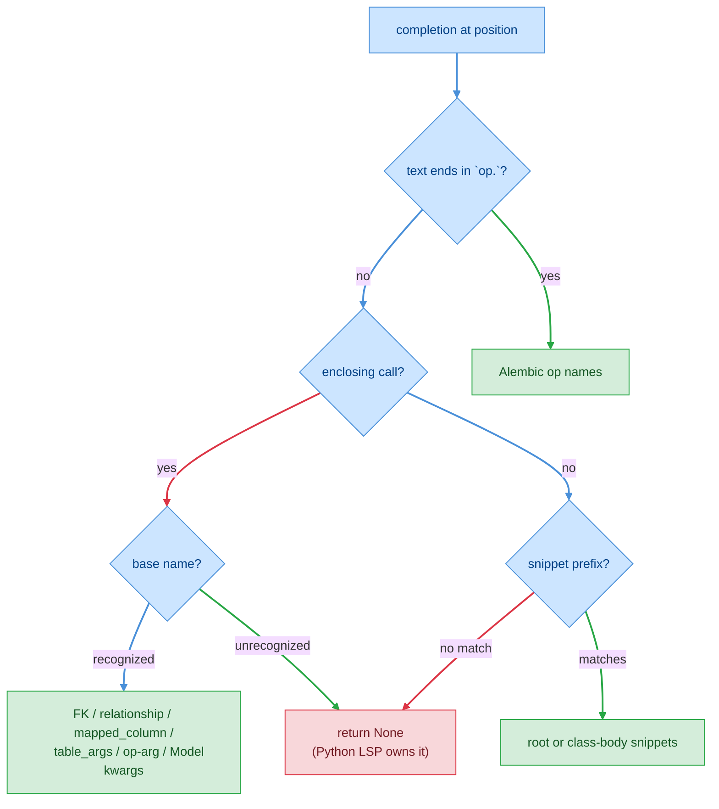

# F03 — Completions

> **Status:** Draft
>
> **Version:** 0.1   ·   **Last updated:** 2026-06-17
>
> **Purpose:** Context-aware completions that fire only inside SQLAlchemy and Alembic constructs — foreign-key strings, `relationship()`/`mapped_column()` kwargs and values, `__table_args__` column names, model-constructor keywords, Alembic op names and arguments, plus a small set of code snippets. In plain-Python positions it returns nothing.
>
> **Depends on:** [constitution](../constitution.md), [E07-data-model](../foundations/E07-data-model.md), [E30-extraction-and-indexing](../foundations/E30-extraction-and-indexing.md)   ·   **Related:** [F09-signature-help](F09-signature-help.md), [E01-architecture](../foundations/E01-architecture.md), [E17-testing](../foundations/E17-testing.md), [E29-e2e-testing](../foundations/E29-e2e-testing.md), [ADR-007](../decisions/ADR-007-companion-to-python-lsp.md)

> Requirement tag: **CMP**

---

## 1. Purpose & Scope

When you type inside `relationship(...)`, `ForeignKey("…")`, or an Alembic `op.*` call, the server offers exactly the completions that construct needs — the columns a foreign key can point at, the kwargs a relationship accepts, the cascade tokens that are legal, the migration operations Alembic exposes. Everywhere else, it stays out of the way and lets your Python language server do its job.

This spec covers:

- **Alembic op completions** — `op.` → the operation names; op arguments → table/column names from the index.
- **Foreign-key string completions** — `ForeignKey("…")` → `table.column` targets.
- **Relationship completions** — `relationship(…)` kwargs, plus values for `lazy`, `cascade`, `back_populates`, `uselist`, `secondary`, `foreign_keys`, `viewonly`.
- **`mapped_column()` kwarg completions.**
- **`__table_args__` column-name completions** — inside `Index(...)`, `UniqueConstraint(...)`, `PrimaryKeyConstraint(...)`.
- **Model-constructor keyword completions** — `User($cursor)` → the model's columns and relationships as keyword arguments (pairs with the constructor signature in [F09](F09-signature-help.md)).
- **Snippets** — file-root (`samodel`, `saimport`, `sabase`, …) and class-body (`sapk`, `sacol`, `safk`, `sarel`, `satable`, …).
- **The negative contract** — a plain-Python position yields no completions at all.

## 2. Non-Goals / Out of Scope

- **Ordinary Python completion** — local variables, imports, stdlib, method names on arbitrary objects — owned by the user's Python LSP (Pyright/`pylsp`/Ruff), per [P5](../constitution.md) and [ADR-007](../decisions/ADR-007-companion-to-python-lsp.md). We never shadow it.
- **The signatures and active-parameter highlighting** that accompany these call sites — owned by [F09-signature-help](F09-signature-help.md). F03 offers *what to type*; F09 shows *the shape of the call*.
- **How facts are extracted and the index is built** — owned by [E30](../foundations/E30-extraction-and-indexing.md) and [E07](../foundations/E07-data-model.md). Completions only *read* the index.
- **Raw-SQL completion inside `text()`/`execute()`** — a deliberate Non-Goal, see [ADR-004](../decisions/ADR-004-exclude-rawsql-and-drift.md).

## 3. Background & Rationale

A SQLAlchemy author types the same handful of strings over and over: a foreign-key target, a `back_populates` name, a cascade rule. Each is a value that *already exists somewhere else in the workspace* — a table name, a reverse relationship, a fixed vocabulary. The server knows all of it from the index, so it can complete these precisely where a generic Python LSP can only guess.

The discipline that makes this work is the **companion principle** ([P5](../constitution.md), [ADR-007](../decisions/ADR-007-companion-to-python-lsp.md)): we contribute completions *only* when the cursor sits inside a SQLAlchemy or Alembic construct we recognize. Anywhere else we return nothing, so the user's Python LSP owns the suggestion list uncontested. This is why every rule below is gated on a recognized call site, and why §5.9 spells out the negative case as a first-class requirement.

The behavior is ported from the legacy SQLAlchemy LSP, whose completion handler proved these triggers against real projects. We keep its trigger logic and refine the resolution to read the [E30](../foundations/E30-extraction-and-indexing.md) index (forward references, aliases, resolved bases).

## 4. Concepts & Definitions

These terms are canonical across the suite; the glossary owns the full definitions.

- **Companion LSP** — the general Python language server we run alongside; it owns generic Python completion. (Canonical definition in [glossary](../glossary.md).)
- **Enclosing call** — the innermost `call` node whose argument list contains the cursor, resolved to its dotted name (`relationship`, `sa.ForeignKey`, `op.add_column`). The base name is the last dotted segment.
- **Trigger context** — the SQLAlchemy/Alembic construct the cursor sits in, which selects the completion set. If there is no trigger context, there are no completions.
- **Completion item** — one entry in the returned list: a label, a kind (field, property, enum member, snippet…), an optional detail string, and optional snippet insert text.

## 5. Detailed Specification

The handler is a pure function of the workspace state and a position. It reads the cached source line and parse tree for the file ([E07 REQ-DATA-13](../foundations/E07-data-model.md)), classifies the cursor's trigger context, and returns the matching items — or `None`. It never re-parses and never opens a file off disk.

### 5.1 Trigger classification & the companion gate

The first job is to decide *what kind of place the cursor is in*. Only a recognized SQLAlchemy/Alembic context produces completions.

**REQ-CMP-01 — Completions fire only inside a recognized SQLAlchemy/Alembic construct.**

The handler classifies the cursor against these contexts, in order: a bare `op.` member access; an enclosing `op.*` call; an enclosing `ForeignKey`, `relationship`, `mapped_column`, `Index`/`UniqueConstraint`/`PrimaryKeyConstraint`, or model-constructor call; or — when there is no enclosing call — a snippet prefix at file root or in a class body. If none of these match, the handler returns `None` and contributes nothing. This is the companion gate ([P5](../constitution.md)); §5.9 states the negative outcome as its own requirement.

**REQ-CMP-02 — The enclosing call is resolved by its base name.**

The handler finds the innermost call whose arguments contain the cursor and reduces its dotted name to the last segment: `sa.ForeignKey` → `ForeignKey`, `orm.relationship` → `relationship`. The base name selects the completion set. A call the server doesn't recognize (an arbitrary function) yields `None`, even though the cursor is technically inside a call.

### 5.2 Alembic op completions

Inside a migration, the server completes both the operation name and its arguments. This is the most-used surface in an Alembic file.

**REQ-CMP-03 — `op.` completes the Alembic operation names.**

When the text before the cursor ends in `op.`, the handler offers the Alembic operations as method snippets — `add_column`, `drop_column`, `alter_column`, `create_table`, `drop_table`, `create_index`, `drop_index`, `create_unique_constraint`, `drop_constraint`, `create_foreign_key`, `rename_table`, `execute`, `bulk_insert`. Each carries a one-line detail and a snippet body with tab stops.

**REQ-CMP-04 — Op string arguments complete table and column names from the index.**

Inside an `op.*` call, when the cursor is in a string literal at the position that names a table, the handler offers the workspace table names (from `table_index`, [E07](../foundations/E07-data-model.md)). When it names a column of an already-named table — `op.drop_column("posts", "$cursor")` — it resolves that table to its model and offers that model's columns. The argument position is counted by top-level commas, ignoring commas inside nested parens and strings. Operations and their completing positions: `create_table`/`drop_table`/`rename_table` → table at arg 0; `add_column`/`drop_column`/`alter_column` → table at arg 0, column (for drop/alter) once the table is known; `create_index`/`create_unique_constraint` → table at arg 1; `create_foreign_key` → tables at args 1 and 2. Outside a string, op arguments get no completions (the signature in [F09](F09-signature-help.md) guides them instead).

### 5.3 Foreign-key string completions

Inside a `ForeignKey("…")` string, the server completes the `table.column` targets that exist in the workspace.

**REQ-CMP-05 — `ForeignKey("…")` completes `table.column` targets.**

For every indexed model that has a `__tablename__`, the handler offers one item per column, labelled `table.column` (e.g. `users.id`), with a detail showing the owning model and the column's type (`User.id (int)`). The inserted text is the quoted string. The list is filtered by the prefix already typed inside the quotes and sorted alphabetically. A model without a resolved table name contributes nothing (there is no table to name).

### 5.4 Relationship completions

`relationship(...)` is the richest site: the server completes the kwargs themselves, and the values of the ones with a fixed or resolvable vocabulary.

**REQ-CMP-06 — Relationship kwargs complete as keyword snippets.**

When the cursor is at an argument position that isn't inside a string and isn't immediately after a `=`, the handler offers the relationship kwargs: `back_populates=`, `lazy=`, `uselist=`, `secondary=`, `cascade=`, `order_by=`, `foreign_keys=`, `viewonly=`. Each inserts a snippet (`back_populates="$1"`, `uselist=$1`, `foreign_keys=[$1]`). The list is filtered by the partial kwarg already typed.

**REQ-CMP-07 — `lazy=` completes the loading-strategy vocabulary.**

For `lazy=` — both at the bare `=` and inside its string — the handler offers the SQLAlchemy loader strategies, each with a one-line description: `select`, `joined`, `subquery`, `selectin`, `raise`, `raise_on_sql`, `write_only`, `dynamic`, `noload`.

**REQ-CMP-08 — `cascade=` completes tokens and common combinations.**

For `cascade=`, the handler offers the individual cascade tokens — `save-update`, `merge`, `expunge`, `delete`, `delete-orphan`, `refresh-expire`, `all` — and two ready-made combinations, `all, delete-orphan` and `save-update, merge`. Because cascade is a comma-separated list inside one string, completion inside the string filters by the token after the last comma, so a second token completes correctly.

**REQ-CMP-09 — `back_populates=` completes the reverse relationship names on the *target* model.**

This is the cross-file case. The handler reads the relationship's target — taken from the `Mapped["Target"]` annotation on the same line — resolves it through the index ([E30](../foundations/E30-extraction-and-indexing.md)), and offers that target model's relationship names, each detailed as `Target.name`. So in `Post.author: Mapped["User"] = relationship(back_populates="$cursor")`, the list is `User`'s relationships (`posts`, `profile`, …). When the target can't be resolved, the handler stays silent ([P4](../constitution.md)).

**REQ-CMP-10 — The relationship's positional/string target completes model names.**

When the cursor is inside the positional target string — `relationship("$cursor")` — and no kwarg context applies, the handler offers the indexed model names (`User`, `Post`, `Comment`, `Tag`), filtered by prefix.

### 5.5 `mapped_column()` kwarg completions

Inside `mapped_column(...)`, the server completes the column-configuration kwargs.

**REQ-CMP-11 — `mapped_column()` completes its configuration kwargs.**

At an argument position, the handler offers `primary_key=`, `nullable=`, `unique=`, `index=`, `default=`, `server_default=`, `name=`, `type_=`, and a `ForeignKey()` snippet. Boolean kwargs insert a sensible default (`primary_key=True`); value kwargs insert a tab stop (`default=$1`). The list filters by the partial kwarg typed.

### 5.6 `__table_args__` column-name completions

Inside the constraint constructs in `__table_args__`, string positions that name a column complete from the enclosing model.

**REQ-CMP-12 — Column strings in `Index`/`UniqueConstraint`/`PrimaryKeyConstraint` complete the model's columns.**

When the cursor sits inside a string argument of one of these constructs, the handler finds the enclosing class, resolves it to its model, and offers that model's column names (each detailed with its type), filtered by prefix. Outside a string — at the constraint's name argument, say — these constructs get no completions.

### 5.7 Model-constructor keyword completions

Constructing a model — `User($cursor)` — completes the columns and relationships as keyword arguments. This pairs with the synthesized constructor signature in [F09](F09-signature-help.md) at the very same site.

**REQ-CMP-13 — `Model(…)` completes the model's columns and relationships as keywords.**

When the enclosing call's base name resolves to an indexed model, the handler offers one `name=` item per column (detail: the column type) and one per relationship (detail: `Target` or `list[Target]`). Columns sort before relationships. The list filters by the partial keyword typed; once the cursor is past an `=` (typing a value), the handler returns nothing — value completion belongs to the Python LSP.

### 5.8 Snippets

When the cursor is *not* inside any call, the server offers a small library of SQLAlchemy snippets, scoped by whether the cursor is at file root or in a class body.

**REQ-CMP-14 — Snippets complete by prefix, scoped to root vs. class body.**

When there is no enclosing call and the current word is non-empty, the handler offers snippets filtered by that word. At file root the set is import/scaffolding: `sa` (`import sqlalchemy as sa`), `saorm`, `saimport`, `sabase`, `samodel`. Inside a class body the set is member scaffolding: `satable`, `sapk`, `sacol`, `saopt`, `safk`, `sarel`, `sarelmany`, `sam2m`, `saidx`. Each is a `SNIPPET`-kind item whose body uses LSP tab stops (`${1:Model}`, `$0`). When the word matches no snippet, the result is empty — and, since there is no other context, the overall result is `None`.

### 5.9 The negative contract — plain Python yields nothing

The single most important rule: outside a recognized construct, the server contributes no completions.

**REQ-CMP-15 — A plain-Python position returns no completions.**

If the cursor is not in any context from §5.1 — an ordinary statement, a function body, an arbitrary call, a comment, a position where no snippet prefix matches — the handler returns `None`. It never returns an empty-but-present list that could suppress the Python LSP's items, and never returns SQLAlchemy items speculatively. This is the companion principle made testable; the E2E plan (§12) pins it with an explicit negative scenario.

### 5.10 Trigger characters

The server advertises a small set of completion trigger characters so the editor re-requests at the right moments.

**REQ-CMP-16 — The advertised trigger characters are `.`, `"`, `'`, `(`, and `,`.**

`.` drives `op.` member completion; `"`/`'` drive string-argument completion (FK targets, cascade tokens, `back_populates`); `(` and `,` drive kwarg and positional-argument completion. The editor also re-requests on ordinary identifier typing, which drives prefix filtering.

## 6. UI Mockups

These sketch the completion list as the editor renders it from our items. The list itself is the editor's widget; what we control is the labels, kinds, details, and order. Each mockup shows the popover anchored under the cursor at a trigger site.

### 6.1 Foreign-key target list — inside `ForeignKey("…")`

Appears when you open the FK string and start typing; filtered by the prefix inside the quotes.

```
    author_id: Mapped[int] = mapped_column(ForeignKey("us│"))
                                                         ╰─────────────────────────────╮
                                                         │ ⛁ users.id      User.id (int)│  ◀ selected
                                                         │ ⛁ users.email   User.email…  │
                                                         │ ⛁ users.created User.created…│
                                                         ╰──────────────────────────────╯
```

States: typing (filtered to the prefix) · empty (no model has a `__tablename__` → no list, Python LSP shows).

### 6.2 Relationship kwarg list — inside `relationship(…)`

Appears at an argument position that is not inside a string and not after `=`.

```
    posts: Mapped[list["Post"]] = relationship(ba│)
                                               ╰──────────────────────────────────────╮
                                               │ ◇ back_populates=  reverse relationship│  ◀ selected
                                               │ ◇ cascade=         cascade options      │
                                               ╰─────────────────────────────────────────╯
```

States: kwarg list (above) · value list (§6.3) · empty when the prefix matches no kwarg.

### 6.3 `cascade=` value list — token vocabulary with combinations

Appears inside the `cascade="…"` string; the second token filters after the last comma.

```
    relationship(back_populates="posts", cascade="all, de│")
                                                  ╰──────────────────────────────────╮
                                                  │ ▣ delete         cascade delete    │  ◀ selected
                                                  │ ▣ delete-orphan  delete orphans     │
                                                  │ ▣ all, delete-orphan  full + orphan │
                                                  ╰──────────────────────────────────────╯
```

States: token list · combination entries (`all, delete-orphan`) shown after single tokens.

### 6.4 `back_populates=` list — reverse names on the target model

Appears inside `back_populates="…"`; the items come from the *target* model resolved across files.

```
    author: Mapped["User"] = relationship(back_populates="│")
                                                          ╰──────────────────────────╮
                                                          │ ◇ posts     User.posts     │  ◀ selected
                                                          │ ◇ profile   User.profile    │
                                                          ╰──────────────────────────────╯
```

States: resolved (list of target's relationships) · unresolved target (no list — silence, [P4](../constitution.md)).

### 6.5 Model-constructor keyword list — at `User($cursor)`

Appears when constructing an indexed model; columns first, then relationships. Pairs with the signature popover in [F09 §6.1](F09-signature-help.md).

```
    u = User(│)
            ╰──────────────────────────────╮
            │ ▤ id=          int             │  ◀ selected
            │ ▤ full_name=   str             │
            │ ▤ email=       str             │
            │ ◇ posts=       list[Post]      │
            │ ◇ profile=     Profile         │
            ╰─────────────────────────────────╯
```

States: keyword list (above) · after `=` (no list — value completion is the Python LSP's).

### 6.6 Alembic operation list — after `op.`

Appears in a migration when the text ends in `op.`.

```
    op.│
      ╰────────────────────────────────────────╮
      │ ƒ add_column     Add a column to a table │  ◀ selected
      │ ƒ create_table   Create a new table       │
      │ ƒ drop_column    Drop a column            │
      │ ƒ create_index   Create an index          │
      ╰────────────────────────────────────────────╯
```

States: full op list · op-argument list (table/column names) once inside a call's string.

### 6.7 Snippet list — file root and class body

Appears when no call encloses the cursor and the typed word prefixes a snippet. The set differs by scope.

```
  File root (no class):              Class body (inside a model):
  sam│                               sap│
  ╭────────────────────────────╮     ╭────────────────────────────────╮
  │ ⌘ samodel  Full model class │     │ ⌘ sapk   Integer primary key    │
  │ ⌘ saimport SA + ORM imports │     │ ⌘ sacol  Generic mapped column  │
  ╰────────────────────────────╯     ╰────────────────────────────────╯
```

States: root snippets · class-body snippets · no match (no list — Python LSP shows).

## 7. Visualizations

This decision tree shows how the cursor's position selects a completion set — and where every unmatched path lands on "no completions," the companion gate.



## 8. Data Shapes

Completions cross the wire as the LSP `CompletionItem` array. The fields we set are the contract editors render; the shape below is illustrative of one FK item and one cascade item.

```json
[
  {
    "label": "users.id",
    "kind": 18,
    "detail": "User.id (int)",
    "insertText": "\"users.id\"",
    "insertTextFormat": 1
  },
  {
    "label": "all, delete-orphan",
    "kind": 20,
    "detail": "Full cascade with orphan deletion",
    "sortText": "100"
  }
]
```

`kind` uses the LSP `CompletionItemKind` enum (18 = Reference, 20 = EnumMember, 15 = Snippet, 5 = Field, 10 = Property). `insertTextFormat` is 1 (plain text) for literal inserts and 2 (snippet) for tab-stop bodies. `sortText` pins ordering so combinations follow single tokens and columns precede relationships.

## 9. Examples & Use Cases

Take the `clean-blog` cast. You are writing `Post` and have just typed the author relationship:

```python
# models/post.py
class Post(Base):
    __tablename__ = "posts"
    id: Mapped[int] = mapped_column(primary_key=True)
    author_id: Mapped[int] = mapped_column(ForeignKey("us"))   # ← FK string
    author: Mapped["User"] = relationship(back_populates="")   # ← back_populates
```

On the FK line, opening the string and typing `us` gives `users.id`, `users.email`, `users.created` — every column of the table whose name starts with `us`, each labelled `User.<col>` (§5.3). You pick `users.id`.

On the relationship line, with the cursor inside `back_populates=""`, the server reads the `Mapped["User"]` target, resolves `User` through the index, and offers `posts` and `profile` — `User`'s relationships, not `Post`'s (§5.9-cross-file rule, REQ-CMP-09). You pick `posts`, wiring `Post.author ↔ User.posts`.

Later, constructing one: `Post(│)` offers `id=`, `author_id=`, `title=`, `body=`, then `author=`, `comments=`, `tags=` — and the [F09](F09-signature-help.md) signature popover shows the same parameters with the active one highlighted.

Now the negative case. In a plain function in the same file:

```python
def slugify(title):
    return title.│   # ← here we return NOTHING; the Python LSP completes str methods
```

The cursor is inside no SQLAlchemy construct, so the handler returns `None` and the user's Python LSP owns the list (REQ-CMP-15).

## 10. Edge Cases & Failure Modes

- **Unparsed / `ERROR` tree around the cursor** → the handler reads what tree-sitter produced and the raw line text; if it can't find an enclosing call it falls through to the snippet/None path. It never crashes ([P3](../constitution.md)).
- **`back_populates=` whose target model isn't indexed** → no value list (silence, [P4](../constitution.md)); the Python LSP still completes nothing wrong.
- **`ForeignKey("…")` when no model has a `__tablename__`** → empty FK list → overall `None`.
- **Cursor after `=` in a model constructor** (typing a value, not a keyword) → `None`; value completion is the Python LSP's.
- **Op-argument position outside a string** → no completions (the [F09](F09-signature-help.md) signature guides instead).
- **A recognized call name that is actually a user function shadowing `relationship`** → still completes as a relationship; we resolve by base name, accepting this rare false positive over re-running type inference ([P4](../constitution.md) keeps it silent only on unresolvable input, not on shadowing).
- **Multi-line call where the cursor is on a continuation line** → argument index is counted from the line text before the cursor; nested-paren and string awareness keeps the count correct.

## 11. Testing

Completions are tested as a pure function — given a fixture workspace and a cursor position, assert the exact item set, labels, kinds, and order — plus E2E over the protocol.

### 11.1 Scope & coverage

Target: **100% of this feature's behavior is covered.** Every `REQ-CMP-NN` maps to at least one test; every popover state (§6) and edge case (§10) has a test, including the negative companion-gate case. See the policy in [E17-testing](../foundations/E17-testing.md#2-coverage-policy).

### 11.2 Test plan

Each row is a behavior under test. Shared fixtures link to the registry in [E17](../foundations/E17-testing.md#5-fixtures-registry).

| Behavior / scenario | Type | Fixtures | Verifies |
|---|---|---|---|
| Trigger classification routes each context correctly | unit | [clean-blog](../foundations/E17-testing.md#5-fixtures-registry) | REQ-CMP-01, REQ-CMP-02 |
| `op.` → operation names with snippet bodies | unit | [clean-blog](../foundations/E17-testing.md#5-fixtures-registry) | REQ-CMP-03 |
| Op string args → table/column names by position | unit | [clean-blog](../foundations/E17-testing.md#5-fixtures-registry) | REQ-CMP-04 |
| `ForeignKey("…")` → `table.column`, prefix-filtered | unit | [clean-blog](../foundations/E17-testing.md#5-fixtures-registry) | REQ-CMP-05 |
| relationship kwargs offered, prefix-filtered | unit | [clean-blog](../foundations/E17-testing.md#5-fixtures-registry) | REQ-CMP-06 |
| `lazy=` → loader vocabulary | unit | [clean-blog](../foundations/E17-testing.md#5-fixtures-registry) | REQ-CMP-07 |
| `cascade=` → tokens + combinations; second token filters | unit | [clean-blog](../foundations/E17-testing.md#5-fixtures-registry) | REQ-CMP-08 |
| `back_populates=` → target model's relationships (cross-file) | unit | [clean-blog](../foundations/E17-testing.md#5-fixtures-registry) | REQ-CMP-09 |
| relationship positional string → model names | unit | [clean-blog](../foundations/E17-testing.md#5-fixtures-registry) | REQ-CMP-10 |
| `mapped_column()` kwargs offered | unit | [clean-blog](../foundations/E17-testing.md#5-fixtures-registry) | REQ-CMP-11 |
| `__table_args__` constraint strings → model columns | unit | [clean-blog](../foundations/E17-testing.md#5-fixtures-registry) | REQ-CMP-12 |
| `User(…)` → column + relationship keywords; after `=` empty | unit | [clean-blog](../foundations/E17-testing.md#5-fixtures-registry) | REQ-CMP-13 |
| Snippets: root set vs class-body set, prefix-filtered | unit | [clean-blog](../foundations/E17-testing.md#5-fixtures-registry) | REQ-CMP-14 |
| Plain-Python position → `None` (no items) | unit | [clean-blog](../foundations/E17-testing.md#5-fixtures-registry) | REQ-CMP-15 |
| Unrecognized enclosing call → `None` | unit | [clean-blog](../foundations/E17-testing.md#5-fixtures-registry) | REQ-CMP-02, REQ-CMP-15 |
| Trigger characters advertised at `initialize` | integration | [clean-blog](../foundations/E17-testing.md#5-fixtures-registry) | REQ-CMP-16 |
| Unparsed tree near cursor → no crash, graceful fallthrough | unit | [clean-blog](../foundations/E17-testing.md#5-fixtures-registry) | REQ-CMP-01, REQ-CMP-15 |

### 11.3 Fixtures

Reusable fixtures live in [E17-testing](../foundations/E17-testing.md#5-fixtures-registry) — linked above. This feature reuses the baseline `clean-blog` workspace for every case; it adds no broken-variant fixtures, since completion has no findings of its own. Cursor positions are expressed as test-local constants over the `clean-blog` files.

### 11.4 Requirement coverage

Every load-bearing requirement maps to a test — this table is the proof.

| Requirement | Covered by |
|---|---|
| REQ-CMP-01 | Trigger classification; unparsed-tree fallthrough |
| REQ-CMP-02 | Trigger classification; unrecognized-call → None |
| REQ-CMP-03 | `op.` operation names |
| REQ-CMP-04 | Op string args → table/column |
| REQ-CMP-05 | FK `table.column` completion |
| REQ-CMP-06 | relationship kwargs |
| REQ-CMP-07 | `lazy=` vocabulary |
| REQ-CMP-08 | `cascade=` tokens + combinations |
| REQ-CMP-09 | `back_populates=` cross-file target relationships |
| REQ-CMP-10 | relationship positional string → models |
| REQ-CMP-11 | `mapped_column()` kwargs |
| REQ-CMP-12 | `__table_args__` constraint column strings |
| REQ-CMP-13 | model-constructor keywords |
| REQ-CMP-14 | root vs class-body snippets |
| REQ-CMP-15 | plain-Python → None; unrecognized call → None |
| REQ-CMP-16 | trigger characters advertised |

## 12. End-to-End Test Plan

The E2E suite drives the built binary over stdio with `pytest-lsp`, requesting completion at fixed positions in the `clean-blog` workspace and asserting the returned items — including the negative plain-Python case.

### 12.1 Coverage target

**100% of the feature's scope, end to end** — every trigger context produces its expected items, and the plain-Python position produces none. See the policy in [E29-e2e-testing](../foundations/E29-e2e-testing.md#2-coverage-policy).

### 12.2 Scenarios

| # | Journey | Path | Expected outcome |
|---|---|---|---|
| E2E-01 | Completion in `ForeignKey("us")` | happy | Items include `users.id`, labelled `User.id (int)`, inserting `"users.id"` |
| E2E-02 | Completion at relationship arg position | happy | Items include `back_populates=`, `cascade=`, `lazy=` |
| E2E-03 | Completion in `cascade="all, "` | happy | Items include `delete-orphan` and `all, delete-orphan` |
| E2E-04 | Completion in `back_populates=""` on `Post.author` | happy | Items are `User`'s relationships (`posts`, `profile`), not `Post`'s |
| E2E-05 | Completion in `mapped_column(` | happy | Items include `primary_key=`, `nullable=`, `unique=` |
| E2E-06 | Completion in `Index("…")` in `__table_args__` | happy | Items are the model's column names |
| E2E-07 | Completion at `User(` constructor | happy | Items include `id=`, `full_name=`, `posts=` |
| E2E-08 | Completion after `op.` in a migration | happy | Items include `add_column`, `create_table` |
| E2E-09 | Completion in `op.drop_column("posts", "")` | happy | Items are `posts` columns |
| E2E-10 | Snippet `samodel` at file root | happy | One `SNIPPET`-kind item `samodel` with a tab-stop body |
| E2E-11 | **Completion in a plain-Python expression** (`return title.`) | error/negative | Server returns no SQLAlchemy items (null or empty), Python LSP unaffected |
| E2E-12 | Completion inside an arbitrary user call `foo(` | error/negative | Server returns nothing |
| E2E-13 | `initialize` advertises completion trigger characters | happy | `triggerCharacters` includes `.`, `"`, `'`, `(`, `,` |
| E2E-14 | Completion request in a file with a syntax error near cursor | error | No crash; server returns nothing or the matching context's items |

### 12.3 Acceptance criteria & Definition of Done

The §12.2 scenarios, written Given/When/Then, are this feature's acceptance criteria:

| # | Given | When | Then |
|---|---|---|---|
| AC-01 | The `clean-blog` workspace is indexed | I request completion inside `ForeignKey("us")` | I get `users.id` and the other `us…` targets |
| AC-02 | `Post.author` is annotated `Mapped["User"]` | I request completion in its `back_populates=""` | I get `User`'s relationship names, resolved across files |
| AC-03 | I am editing `User($cursor)` | I request completion | I get the model's columns and relationships as `name=` keywords |
| AC-04 | The cursor is in an ordinary Python expression | I request completion | The server contributes no items, leaving the Python LSP in charge |

**Definition of Done:** every `REQ-CMP-NN` has a passing test (§11.4), every acceptance scenario above passes, CLI/server parity is N/A (completions are an editor-only surface), and every enabled non-functional concern (§13) is verified.

## 13. Non-Functional Requirements

### 13.1 Security & Privacy

- **Access & authorization** — none; completions read only the in-memory index built from local workspace files. No trust boundary is crossed.
- **Input & validation** — the only input is a source position and the cached tree/source; both are already-parsed local data. The handler tolerates `ERROR` nodes and out-of-range columns without crashing ([P3](../constitution.md)).
- **Data sensitivity** — none; labels and details are derived from the user's own source (model/column names, types). Nothing is transmitted, persisted, or logged beyond the inherited `tracing` envelope (stderr/`log_file`, never stdout).
- **Baseline** — within the suite-wide posture (constitution §13.1 inheritance): reads only local files, executes no user code ([P1](../constitution.md)), opens no network connection, sends no telemetry. Completions never shell out and never read a file off disk on the request path.

### 13.2 Accessibility

**N/A** — the editor renders the completion list; the server emits only text (labels, details, kinds). The one inherited content rule applies: item *kind* and *detail* convey meaning in words, never by color alone. See constitution §4.6.

## 16. Cross-References

- **Depends on:** [constitution](../constitution.md) — P4 (silence on unresolvable input), P5 (companion principle, the gate every rule rests on); [E07-data-model](../foundations/E07-data-model.md) — the index (`table_index`, `model_index`, `Model`/`Column`/`Relationship`) every completion reads; [E30-extraction-and-indexing](../foundations/E30-extraction-and-indexing.md) — forward-reference/alias/base resolution that makes `back_populates` and FK targets resolvable.
- **Related:** [F09-signature-help](F09-signature-help.md) — the signatures that accompany these call sites, sharing the model-constructor site; [E01-architecture](../foundations/E01-architecture.md) — the pure-function dispatch and cached source/tree this handler reads; [E17-testing](../foundations/E17-testing.md) — the `clean-blog` fixture and coverage policy; [E29-e2e-testing](../foundations/E29-e2e-testing.md) — the stdio harness and protocol-conformance journeys; [ADR-007](../decisions/ADR-007-companion-to-python-lsp.md) — the companion decision the negative contract enforces; [ADR-004](../decisions/ADR-004-exclude-rawsql-and-drift.md) — raw-SQL completion is excluded.

## 17. Changelog

- **2026-06-17** — Initial draft. Specified the context-aware completion sets (Alembic ops + args, FK strings, relationship kwargs/values, `mapped_column` kwargs, `__table_args__` columns, model-constructor keywords) and the file-root/class-body snippets, all ported from the legacy completion handler; pinned the companion-gate negative contract (REQ-CMP-15) and the trigger-character set; added the §6 completion-list mockups and the §7 trigger decision tree.
</content>
</invoke>
