# F04 — Hover

> **Status:** Approved
>
> **Version:** 0.1   ·   **Last updated:** 2026-06-18
>
> **Purpose:** The hover cards the server renders for SQLAlchemy constructs — models, columns, relationships, foreign keys, cascade tokens, and `back_populates` — including the cross-referenced attribute-access card for `User.name` that joins facts from across the workspace.
>
> **Depends on:** [constitution](../constitution.md), [E07-data-model](../foundations/E07-data-model.md), [E30-extraction-and-indexing](../foundations/E30-extraction-and-indexing.md)   ·   **Related:** [E01-architecture](../foundations/E01-architecture.md), [E17-testing](../foundations/E17-testing.md), [E29-e2e-testing](../foundations/E29-e2e-testing.md), [F05-go-to-definition](F05-go-to-definition.md)

> Requirement tag: **HOV**

---

## 1. Purpose & Scope

When you hover a SQLAlchemy construct, the server answers with a compact card describing exactly what the construct is — and, where it can, what it connects to across the workspace. This spec defines every card the hover handler renders and the rules for when it fires.

This spec covers:

- Hover on a **model** — its table, columns, relationships, and docstring.
- Hover on a **column attribute** (`User.name`) — the headline cross-referenced card: owning model and table, the DB-column alias, type, nullability, uniqueness, PK and default flags, `comment=`, the Python doc, index membership, the FK target resolved across files, and the relationships that use the column.
- Hover on a **foreign-key string** (`ForeignKey("users.id")`) — the target table, column, and resolved model.
- Hover on a **relationship** — its target, wiring kwargs, and cardinality.
- Hover on a **cascade token** and on a **`back_populates`** value — what the token means and the counterpart it names.
- Recognizing both bare (`mapped_column`) and `sa.`-prefixed (`sa.orm.mapped_column`) forms.
- The negative rule: hovering a non-SQLAlchemy symbol returns null.

## 2. Non-Goals / Out of Scope

- Generic Python hover — variable types, function signatures, stdlib docs — is owned by the user's Python LSP (constitution P5). We never shadow it; see [ADR-007](../decisions/ADR-007-companion-to-python-lsp.md).
- Jumping to the definition behind a hovered target — owned by [F05-go-to-definition](F05-go-to-definition.md).
- The fact shapes the cards read — owned by [E07-data-model](../foundations/E07-data-model.md).
- How those facts are extracted and how the alias, forward-ref, and base resolution work — owned by [E30-extraction-and-indexing](../foundations/E30-extraction-and-indexing.md).

## 3. Background & Rationale

A model's meaning is scattered across files. Hover an `author_id` column and the interesting facts — what table it belongs to, which model its foreign key targets, which relationship rides on it — live in two or three different files. The Python LSP can tell you `author_id: int`; it cannot tell you it points at `User.id` two files away. That gap is what this feature fills.

The legacy server rendered useful cards but kept them shallow: a column card showed type and constraints, and the foreign-key card noted only that the target existed. The headline change here is the **cross-referenced column card**. Hovering `User.name` now resolves the column's DB alias, its index membership from `__table_args__`, its FK target across files, and every relationship that uses it — a single card that answers "what is this attribute, really?" without opening another file.

Because we are a companion, not a replacement (P5), hover fires **only** on constructs we own. A plain local variable, an imported function, a keyword — none of those produce a card. The user's Python LSP answers those, and the editor merges the two responses.

## 4. Concepts & Definitions

These terms are canonical across the suite; the glossary owns the full definitions.

- **Column alias / `key`** — when `mapped_column(name="full_name")` differs from the Python attribute (`name`), the DB column and the attribute names diverge. The column card shows both. (Canonical definition in [glossary](../glossary.md).)
- **Cascade** — the `cascade=` string controlling how operations propagate; tokens include `save-update`, `merge`, `delete`, `delete-orphan`, `all`. (Canonical definition in [glossary](../glossary.md).)
- **`back_populates`** — names the reverse relationship on the target model, wiring a bidirectional pair. (Canonical definition in [glossary](../glossary.md).)
- **Hover card** — the rendered markdown the server returns in a `Hover` response, plus the source range it applies to.

## 5. Detailed Specification

The hover handler is a pure function: it takes the workspace state, a URI, and a position, and returns an `Option<Hover>` ([E01 §5.4](../foundations/E01-architecture.md#54-feature-dispatch)). It walks the file's models, finds the innermost construct whose range contains the position, and renders the matching card. When nothing SQLAlchemy-specific sits under the cursor, it returns null.

### 5.1 Hit-testing under the cursor

Hover resolves the most specific construct at the cursor before choosing a card.

**REQ-HOV-01 — The handler returns the card for the innermost matching construct, or null.**

For the file at the request URI, the handler reads its models from the index and tests the position against each construct's range in specificity order: a column's FK-string range and a relationship's `back_populates`/cascade/target ranges before the column or relationship name itself, then the model name. The first range that contains the position selects the card. When the position matches no SQLAlchemy construct, the handler returns null — never an empty or placeholder card (constitution P5; see [§5.8](#58-the-non-sqlalchemy-rule)).

The position is interpreted under the negotiated position encoding ([E01 §5.6](../foundations/E01-architecture.md#56-protocol-conduct)); ranges in the returned `Hover` are emitted in that same encoding so the highlight lands on the right characters even for multi-byte identifiers.

### 5.2 The column card — the headline cross-referenced hover

Hovering a column attribute renders the richest card in the suite, because a column's full story is spread across files.

**REQ-HOV-02 — The column card shows the column's own facts: table, alias, type, flags, comment, and doc.**

When you hover `User.name`, the card names the owning model and its table, then the column's type. It shows the **DB-column alias** when the `mapped_column(name=…)`/`key=` override makes the Python attribute (`name`) differ from the database column (`full_name`) — reading `Column.key` from the fact ([E07 REQ-DATA-02](../foundations/E07-data-model.md#52-the-column-fact)). It renders nullability, uniqueness, primary-key, and default flags from `ColumnArgs`, the `comment=` string, and the Python `doc=`/inline comment. See the card in [§6.1](#61-column-card--username).

Each flag is shown in words, never by color alone — `nullable false`, `unique true` — so the card is readable in any theme and by a screen reader (constitution §4.6 content rule).

**REQ-HOV-03 — The column card resolves cross-file references: index membership, FK target, and relationships that use it.**

The cross-referenced half of the card is what the legacy server lacked. From the same column, the handler resolves three things against the workspace index, never re-parsing ([E07 §5.7](../foundations/E07-data-model.md#57-the-workspace-index)):

- **Index / constraint membership** — whether any `TableArg` on the model names this column, rendering the index or constraint name (`ix_users_full_name`).
- **The FK target across files** — when the column carries a `ForeignKeyRef`, it follows `table_index` then `model_index` to render the resolved target (`→ users.id (User.id)`).
- **Relationships that use the column** — any relationship on the owning model whose foreign key or `foreign_keys=` rides on this column, rendered as `Post.author ↔ User.posts`. When no relationship references it, the card says so plainly (`— (no relationship references this column)`).

When a cross-reference can't be resolved — an FK to a table no model defines, a forward-ref target the index doesn't know — that line is omitted or marked unresolved rather than guessed (constitution P4). The column's own facts always render; only the cross-referenced lines depend on resolution.

### 5.3 The foreign-key string card

Hovering inside the `"users.id"` literal of a `ForeignKey(...)` renders a focused card about the target.

**REQ-HOV-04 — The FK-string card shows the target table, column, and resolved model.**

The card splits the literal into its table and column halves (`users` / `id`) from the `ForeignKeyRef`, then resolves the table through `table_index` → `model_index` to name the target model and the file it lives in. When the target table resolves, the card reads `→ users.id (User.id)`; when it doesn't, the card states the table is not found in the workspace rather than inventing a target (P4). This is the same resolution the FK column card's "foreign" line uses; see [§6.2](#62-fk-column-card--postauthor_id).

### 5.4 The relationship card

Hovering a relationship attribute renders its target and wiring.

**REQ-HOV-05 — The relationship card shows the target model, cardinality, and wiring kwargs.**

The card names the relationship and its resolved target model, the cardinality from `is_list` (`list[Post]` for a collection, `→ User` for a scalar), and the wiring kwargs that are present — `back_populates`, `lazy`, `uselist`, `secondary`, `cascade`. A many-to-many through a `secondary` association table is rendered as `list[Tag] (m2m)`. When the target model is not in the index, the target line is marked unresolved (P4) and the rest of the card still renders.

### 5.5 The cascade-token card

Hovering inside a `cascade=` string documents the tokens it contains.

**REQ-HOV-06 — The cascade card documents each token in the string, flagging unknown ones.**

The handler splits the `cascade=` value on commas and renders one row per token with its meaning — `save-update`, `merge`, `expunge`, `delete`, `delete-orphan`, `refresh-expire`, and the `all` shorthand. A token that matches none of these is marked unknown in words (it is also the `SQLA-W408` diagnostic, owned by [F01](F01-orm-correctness-diagnostics.md)), so the hover explains a typo the diagnostic flagged. See [§6.4](#64-cascade-token-card).

### 5.6 The `back_populates` card

Hovering a `back_populates` value resolves the counterpart relationship it names.

**REQ-HOV-07 — The `back_populates` card resolves and renders the counterpart relationship.**

From `Post.author`'s `back_populates="posts"`, the handler resolves the target model (`User`) through the index, then looks up the named attribute (`posts`) among that model's relationships and renders the counterpart's card. When the counterpart exists, you see `User.posts` and its wiring; when the named attribute doesn't exist on the target (the `SQLA-W403` case) or the target model isn't indexed, the card states the counterpart was not found rather than fabricating one (P4).

### 5.7 Recognizing `sa.`-prefixed forms

Hover fires the same whether the construct is imported bare or used through a module alias.

**REQ-HOV-08 — Hover recognizes bare and `sa.`-prefixed constructs identically.**

A project may write `mapped_column(...)` or `sa.orm.mapped_column(...)`, `relationship(...)` or `sa.orm.relationship(...)`, `ForeignKey(...)` or `sa.ForeignKey(...)`. Because the facts are already normalized during extraction ([E30](../foundations/E30-extraction-and-indexing.md)), the hover handler reads the same `Column`/`Relationship`/`ForeignKeyRef` regardless of the surface form, and the cards are identical. The conventional alias is `sa`; the import-alias lint (`SQLA-I505`) is a separate concern owned by [F02](F02-best-practice-lints.md).

### 5.8 The non-SQLAlchemy rule

Hover stays silent on anything we don't own.

**REQ-HOV-09 — Hovering a non-SQLAlchemy symbol returns null.**

A plain local variable, an imported function, a stdlib type, a keyword, a string that isn't an FK literal — none of these produce a card. The handler returns `None`, and the editor falls through to the user's Python LSP, which answers generic Python hover (constitution P5). This is the companion principle made concrete: we add a card only where we have something SQLAlchemy-specific to say, and we get out of the way everywhere else.

## 6. UI Mockups

Hover cards render as Markdown in the editor's hover popover. The sketches below are the layout contract — the exact fields, order, and labels each card shows. They are drawn as bordered cards for review; the editor renders the underlying Markdown in its own popover chrome. Severity and state are always conveyed in words, never color alone (constitution §4.6).

### 6.1 Column card — `User.name`

Shown when the cursor is on a column attribute. The headline cross-referenced card: the column's own facts plus everything that references it across the workspace.

```
┌────────────────────────────────────────────────────────┐
│ User.name                                  (column)     │
├────────────────────────────────────────────────────────┤
│ table     users                                         │
│ column    full_name        ← aliased (attr `name`)      │
│ type      Mapped[str]  ·  String(120)                   │
│ nullable  false    unique  true    primary key  false   │
│ default   —         index  ix_users_full_name           │
│ comment   "Display name shown in the UI"                │
│ doc       The user's preferred display name.            │
│ used by   — (no relationship references this column)    │
└────────────────────────────────────────────────────────┘
```

States: aliased (the `column` line shown) vs. not aliased (line omitted) · with a `comment=`/`doc` vs. without (line omitted) · in an index/constraint vs. not · `used by` listing relationships vs. the empty `—` line.

### 6.2 FK column card — `Post.author_id`

Shown when the cursor is on a column attribute that carries a foreign key. Adds the resolved FK target and the relationships it backs.

```
┌────────────────────────────────────────────────────────┐
│ Post.author_id                             (column, FK) │
├────────────────────────────────────────────────────────┤
│ table     posts                                         │
│ type      Mapped[int]  ·  Integer                       │
│ nullable  false    unique  false                        │
│ foreign   → users.id        (User.id)                   │
│ backs     relationship Post.author ↔ User.posts         │
└────────────────────────────────────────────────────────┘
```

States: FK target resolved (`→ users.id (User.id)`) vs. unresolved (`→ users.id (target not in workspace)`) · `backs` a relationship vs. no backing relationship (line omitted).

### 6.3 Model card — `User`

Shown when the cursor is on a model's class name. Summarizes the model's table, columns, relationships, and docstring.

```
┌────────────────────────────────────────────────────────┐
│ class User(Base)                            (model)     │
├────────────────────────────────────────────────────────┤
│ table     users                                         │
│ columns   id (pk), full_name, email (unique), created   │
│ relations posts → list[Post],  profile → Profile (1:1)  │
│ doc       A registered account holder.                  │
└────────────────────────────────────────────────────────┘
```

States: has `__tablename__` vs. not (the `table` line reads `— (no __tablename__)`) · has a docstring vs. not (line omitted) · a relationship target that resolves vs. one marked unresolved.

### 6.4 Cascade-token card

Shown when the cursor is inside a `cascade=` string. One row per token with its meaning; unknown tokens are flagged in words.

```
┌─ cascade "all, delete-orphan" ──────────────────────────┐
│ all            save-update + merge + refresh-expire +   │
│                expunge + delete                         │
│ delete-orphan  child rows are deleted when de-associated│
│                from the parent, not only on parent del. │
└─────────────────────────────────────────────────────────┘
```

States: all tokens known · an unknown token rendered as `delete-orphen   ⚠ unknown cascade token` (also `SQLA-W408`).

### 6.5 Relationship and `back_populates` cards

Shown on a relationship attribute, or on its `back_populates` value (which renders the resolved counterpart's card).

```
┌────────────────────────────────────────────────────────┐
│ Post.author                          (relationship)     │
├────────────────────────────────────────────────────────┤
│ target    → User       (scalar)                         │
│ back_populates  posts                                   │
│ lazy      select                                        │
└────────────────────────────────────────────────────────┘
```

States: scalar (`→ User`) vs. collection (`list[Comment]`) vs. m2m (`list[Tag] (m2m)`) · counterpart resolved vs. `back_populates` counterpart not found on target (P4).

## 7. Visualizations

The column card is a join across the index. Hovering `Post.author_id` fans the column's foreign key out through the two reverse indexes to the target model, all from memory.

```mermaid
%%{init: {'theme': 'base', 'themeVariables': {'fontSize': '14px'}}}%%
flowchart LR
    classDef src fill:#CCE5FF,stroke:#4A90D9,color:#004085
    classDef idx fill:#FFF3CD,stroke:#FFC107,color:#333
    classDef card fill:#D4EDDA,stroke:#28A745,color:#155724

    hov["hover on Post.author_id"]:::src
    col["Column author_id\nForeignKeyRef users.id"]:::src
    tbl["table_index\nusers → User"]:::idx
    mdl["model_index\nUser → uri + Model"]:::idx
    out["column card\n→ users.id (User.id)"]:::card

    hov -->|"hit-test range"| col
    col -->|"split table.column"| tbl
    tbl -->|"table → model"| mdl
    mdl -->|"render target line"| out

    linkStyle 0 stroke:#4A90D9,stroke-width:2px
    linkStyle 1 stroke:#FFC107,stroke-width:2px
    linkStyle 2 stroke:#FFC107,stroke-width:2px
    linkStyle 3 stroke:#28A745,stroke-width:2px
```



## 8. Data Shapes

Hover returns the LSP `Hover` shape: Markdown content plus the source range it applies to. The range is emitted under the negotiated position encoding ([E01 REQ-ARCH-10](../foundations/E01-architecture.md#56-protocol-conduct)).

```jsonc
// textDocument/hover response
{
  "contents": { "kind": "markdown", "value": "…the rendered card…" },
  "range": { "start": { "line": 11, "character": 4 },
             "end":   { "line": 11, "character": 13 } }
}
```

When there is nothing to show, the response is `null` (REQ-HOV-09).

## 9. Examples & Use Cases

Walk the `clean-blog` cast. You open `models/post.py` and hover the `author_id` attribute. The handler reads `Post` from the index, finds the column under the cursor, and sees its `ForeignKeyRef { table: "users", column: "id" }`. It follows `table_index["users"] → "User"` and `model_index["User"]`, renders `foreign → users.id (User.id)`, then scans `Post`'s relationships and finds `author` rides on this FK, rendering `backs relationship Post.author ↔ User.posts`. No file but `post.py`'s already-cached facts were touched ([§6.2](#62-fk-column-card--postauthor_id)).

Now you hover `name` in `models/user.py`. Because `User.name` was declared `mapped_column(name="full_name")`, the card shows both the attribute and the DB column — `column full_name ← aliased (attr name)` — plus its `String(120)` type, `unique true`, and its membership in `ix_users_full_name` resolved from `__table_args__` ([§6.1](#61-column-card--username)). Finally you hover `posts` and get the relationship card; hover its `back_populates="posts"`-counterpart on `Post.author` and the `back_populates` card resolves to `User.posts`.

Hover a plain local variable in the same file — say a helper `now = datetime.utcnow()` — and the handler returns null. Your Python LSP answers that one (P5).

## 10. Edge Cases & Failure Modes

- Cursor on a non-SQLAlchemy symbol → null; the Python LSP answers (REQ-HOV-09).
- Column with no alias → the `column` line is omitted; the attribute name is the DB column.
- FK whose target table no model defines → the `foreign` line reads `target not in workspace`; the rest of the card renders (P4).
- `back_populates` naming an attribute the target lacks → counterpart-not-found line; no fabricated card (P4, the `SQLA-W403` case).
- A type that couldn't be classified → rendered as the verbatim source text from `MappedType::Unknown`; no inferred SQL type line (P4).
- A half-typed file with `ERROR` nodes around the hovered construct → the handler renders whatever facts extraction recovered, or returns null if the construct itself didn't parse (constitution P3).
- Multi-byte identifiers (the `non-ascii` fixture) → the returned range lands on the right characters under both negotiated encodings.
- A model with no `__tablename__` → the model card's `table` line reads `— (no __tablename__)`.

## 11. Testing

Hover is tested by rendering each card against a fixture and snapshotting the exact Markdown, plus asserting null on non-SQLAlchemy positions. Every `REQ-HOV-NN` maps to at least one test.

### 11.1 Scope & coverage

Target: **100% of this feature's behavior is covered.** Every `REQ-HOV-NN` maps to at least one test; every card state (§6) and edge case (§10) has a test. See the policy in [E17-testing](../foundations/E17-testing.md#2-coverage-policy).

### 11.2 Test plan

Each row is a behavior under test. Rendered cards are snapshotted with `insta` ([E17 §4](../foundations/E17-testing.md#4-tools--frameworks)); cross-file resolution needs the workspace index, so those are integration tests.

| Behavior / scenario | Type | Fixtures | Verifies |
|---|---|---|---|
| Hit-test picks innermost construct; null elsewhere | unit | [clean-blog](../foundations/E17-testing.md#clean-blog) | REQ-HOV-01 |
| Column card: alias, type, flags, comment, doc | integration | [clean-blog](../foundations/E17-testing.md#clean-blog) | REQ-HOV-02 |
| Column card: index membership, FK target, relationships-that-use | integration | [clean-blog](../foundations/E17-testing.md#clean-blog) | REQ-HOV-03 |
| FK-string card resolves target model | integration | [clean-blog](../foundations/E17-testing.md#clean-blog) | REQ-HOV-04 |
| FK-string card on unresolvable table → "not in workspace" | integration | [bad-fk](../foundations/E17-testing.md#bad-fk) | REQ-HOV-04 |
| Relationship card: target, cardinality, kwargs, m2m | integration | [clean-blog](../foundations/E17-testing.md#clean-blog) | REQ-HOV-05 |
| Cascade card documents tokens; flags unknown | unit | [unknown-cascade](../foundations/E17-testing.md#unknown-cascade) | REQ-HOV-06 |
| `back_populates` card resolves counterpart | integration | [clean-blog](../foundations/E17-testing.md#clean-blog) | REQ-HOV-07 |
| `back_populates` card on missing counterpart → not-found | integration | [back-populates-not-found](../foundations/E17-testing.md#back-populates-not-found) | REQ-HOV-07 |
| `sa.`-prefixed forms render identical cards | unit | [clean-blog](../foundations/E17-testing.md#clean-blog) | REQ-HOV-08 |
| Non-SQLAlchemy symbol → null | unit | [clean-blog](../foundations/E17-testing.md#clean-blog) | REQ-HOV-09 |
| Range correct under UTF-8 and UTF-16 | integration | [non-ascii](../foundations/E17-testing.md#non-ascii) | REQ-HOV-01 |
| Model card with no `__tablename__` | integration | [missing-tablename](../foundations/E17-testing.md#missing-tablename) | REQ-HOV-02 |

### 11.3 Fixtures

All fixtures are the shared ones in the [E17 registry](../foundations/E17-testing.md#5-fixtures-registry) — [clean-blog](../foundations/E17-testing.md#clean-blog) for the happy-path cards, [bad-fk](../foundations/E17-testing.md#bad-fk) and [back-populates-not-found](../foundations/E17-testing.md#back-populates-not-found) for the unresolved paths, [unknown-cascade](../foundations/E17-testing.md#unknown-cascade) for the cascade card, and [non-ascii](../foundations/E17-testing.md#non-ascii) for encoding ranges. Hover defines no feature-local fixtures.

### 11.4 Requirement coverage

Every load-bearing requirement maps to a test — this table is the proof.

| Requirement | Covered by |
|---|---|
| REQ-HOV-01 | `req_hov_01_hit_test_innermost`, `req_hov_01_range_both_encodings` |
| REQ-HOV-02 | `req_hov_02_column_card_facts`, `req_hov_02_model_card_no_tablename` |
| REQ-HOV-03 | `req_hov_03_column_card_cross_refs` |
| REQ-HOV-04 | `req_hov_04_fk_string_resolves`, `req_hov_04_fk_string_unresolved` |
| REQ-HOV-05 | `req_hov_05_relationship_card` |
| REQ-HOV-06 | `req_hov_06_cascade_tokens` |
| REQ-HOV-07 | `req_hov_07_back_populates_counterpart`, `req_hov_07_back_populates_missing` |
| REQ-HOV-08 | `req_hov_08_sa_prefixed_forms` |
| REQ-HOV-09 | `req_hov_09_non_sa_returns_null` |

## 12. End-to-End Test Plan

The journeys drive the built binary over stdio with `pytest-lsp`, opening a fixture workspace and issuing `textDocument/hover` at concrete positions.

### 12.1 Coverage target

**100% of the feature's scope, end to end** — every card on its happy path plus the unresolved and non-SQLAlchemy paths. See the policy in [E29-e2e-testing](../foundations/E29-e2e-testing.md#2-coverage-policy). The shared protocol-conformance journeys ([E29 REQ-E2E-03](../foundations/E29-e2e-testing.md#5-patterns)) are inherited, not re-tested here.

### 12.2 Scenarios

Each scenario seeds a fixture from the [E17 registry](../foundations/E17-testing.md#5-fixtures-registry), waits on the open→publish signal, then asserts the hover response content and range.

| # | Journey | Path | Expected outcome |
|---|---|---|---|
| E2E-01 | Hover the `User` class name | happy | Model card: table `users`, columns, relations, doc |
| E2E-02 | Hover `User.name` (aliased column) | happy | Column card with `full_name` alias, type, unique, index, comment, doc |
| E2E-03 | Hover `Post.author_id` (FK column) | happy | FK column card resolving `→ users.id (User.id)` and the backing relationship |
| E2E-04 | Hover inside `ForeignKey("users.id")` | happy | FK-string card resolving the `User` model |
| E2E-05 | Hover `Post.author` relationship | happy | Relationship card: `→ User`, `back_populates posts` |
| E2E-06 | Hover a `cascade="all, delete-orphan"` token | happy | Cascade card documenting both tokens |
| E2E-07 | Hover `back_populates="posts"` | happy | `back_populates` card resolving `User.posts` |
| E2E-08 | Hover an FK whose table no model defines | error | FK card states target not in workspace; no crash (P4) |
| E2E-09 | Hover a `back_populates` whose counterpart is missing | error | Card states counterpart not found |
| E2E-10 | Hover a plain local variable / non-SA symbol | error | Response is `null` (companion principle, P5) |
| E2E-11 | Hover a column in a file mid-edit with `ERROR` nodes | error | Card for recovered facts, or `null`; never a crash (P3) |
| E2E-12 | Hover an aliased column in the `non-ascii` fixture | happy | Range correct under both negotiated encodings |

### 12.3 Acceptance criteria & Definition of Done

The §12.2 scenarios, written Given/When/Then, are this feature's acceptance criteria:

| # | Given | When | Then |
|---|---|---|---|
| AC-01 | The `clean-blog` workspace is open | I hover `User.name` | A column card shows the `full_name` alias, `String(120)`, `unique true`, and the `ix_users_full_name` index |
| AC-02 | The `clean-blog` workspace is open | I hover `Post.author_id` | The card resolves `→ users.id (User.id)` and names the `Post.author ↔ User.posts` relationship |
| AC-03 | The `bad-fk` workspace is open | I hover the broken `ForeignKey` string | The card states the target table is not in the workspace and the server does not crash |
| AC-04 | Any workspace is open | I hover a non-SQLAlchemy symbol | The server returns `null` so the Python LSP can answer |

**Definition of Done:** every `REQ-HOV-NN` has a passing test (§11.4), every acceptance scenario above passes, and the enabled non-functional concern (§13.1) is verified.

## 13. Non-Functional Requirements

### 13.1 Security & Privacy

- **Access & authorization** — none. Hover is a read-only request answered from the in-memory index; it crosses no trust boundary.
- **Input & validation** — the only inputs are a URI and a position the editor sends. The handler reads only already-extracted facts and never executes user code (constitution P1); it shells out to nothing.
- **Data sensitivity** — none beyond the user's own source. No data leaves the process: the card is returned to the requesting editor, nothing is logged to stdout, and `tracing` goes to stderr/`log_file` only ([E01](../foundations/E01-architecture.md), constitution §13.5).
- **Baseline** — stays within the suite-wide envelope: local files only, no network, no telemetry, no secrets.

### 13.2 Accessibility

**N/A** — this is a headless server; the editor renders the hover popover and owns its accessibility. The one content rule we keep (constitution §4.6) applies to our rendered output: every flag and state in the cards is conveyed in **words, not color** — `nullable false`, `unique true`, `⚠ unknown cascade token` — so the cards read correctly in any theme and to a screen reader.

## 14. Open Questions & Decisions

- **Decision — the column card is the headline surface.** The cross-referenced column card (index membership + FK target + relationships-that-use) is the feature's reason to exist over the Python LSP's plain type hover. It is built first and snapshot-pinned.
- **OQ-HOV-1** — Whether to render a tiny inline ER fragment (the column's model and its immediate FK neighbor) in the column card, or keep cards textual. Deferred; textual for v1.

## 15. Cross-References

- **Depends on:** [constitution](../constitution.md) — P1 (static analysis), P4 (silence on unresolvable input), P5 (companion, not replacement), and the §4.6 words-not-color content rule the cards honor; [E07-data-model](../foundations/E07-data-model.md) — the `Column.key` alias, `ColumnArgs`, `ForeignKeyRef`, `Relationship`, and `TableArg` facts the cards read; [E30-extraction-and-indexing](../foundations/E30-extraction-and-indexing.md) — the alias, forward-ref, and `sa.`-prefix normalization the cards rely on.
- **Related:** [E01-architecture](../foundations/E01-architecture.md) — pure-function dispatch and the negotiated position encoding the ranges use; [E17-testing](../foundations/E17-testing.md) — the `insta` snapshots and the shared fixtures; [E29-e2e-testing](../foundations/E29-e2e-testing.md) — the harness and the inherited conformance journeys; [F05-go-to-definition](F05-go-to-definition.md) — jumps to the targets these cards resolve; [F01-orm-correctness-diagnostics](F01-orm-correctness-diagnostics.md) and [F02-best-practice-lints](F02-best-practice-lints.md) — the cascade and import-alias rules the cascade and `sa.`-form cards reference.

## 16. Changelog

- **2026-06-18** — Approved.
- **2026-06-17** — Initial draft. Ported the legacy hover cards (model, column, FK string, relationship, cascade, `back_populates`) and specified the new cross-referenced column card — DB alias, index/constraint membership, cross-file FK target, and relationships-that-use — plus the `sa.`-prefixed-form rule and the null-on-non-SQLAlchemy companion rule. Added the three canonical ASCII cards (column, FK column, model), the cascade and relationship card sketches, the testing and E2E plans, and the §13.1/§13.2 non-functional sections.
