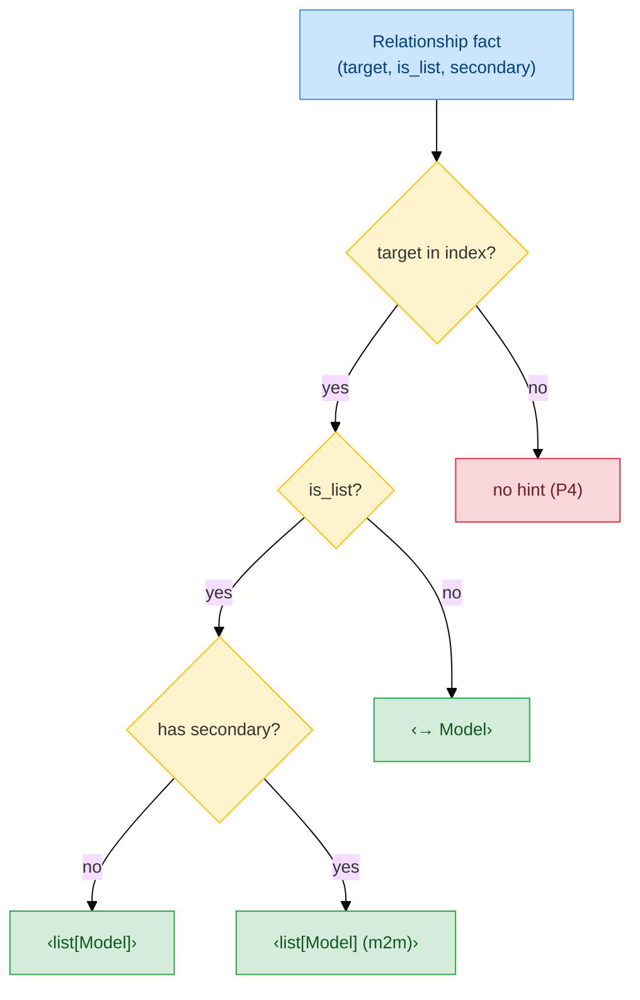

# F10 — Inlay Hints

> **Status:** Approved
>
> **Version:** 0.1   ·   **Last updated:** 2026-06-18
>
> **Purpose:** The inline hints the server renders at the end of a column or relationship line — `→ User.id` for a foreign key, `list[Comment]` or `→ User` for a relationship — and the refresh it fires after a re-index so those hints never go stale.
>
> **Depends on:** [constitution](../constitution.md), [E07-data-model](../foundations/E07-data-model.md), [E30-extraction-and-indexing](../foundations/E30-extraction-and-indexing.md)   ·   **Related:** [E01-architecture](../foundations/E01-architecture.md), [E17-testing](../foundations/E17-testing.md), [E29-e2e-testing](../foundations/E29-e2e-testing.md), [F04-hover](F04-hover.md)

> Requirement tag: **HINT**

---

## 1. Purpose & Scope

Inlay hints put the answer where your eyes already are. Reading a model, you see at the end of each mapped line where its foreign key points and what shape its relationship has — without hovering, without opening the target file. This spec defines the two hints the server renders and the rule that keeps them fresh.

This spec covers:

- The **foreign-key hint** — `→ Model.column` at the end of a column line that carries a `ForeignKey`.
- The **relationship hint** — `list[Model]` for a collection, `→ Model` for a scalar, `list[Model] (m2m)` for a many-to-many through a `secondary` table.
- Where each hint is positioned (end-of-line, after the statement) and how it's labeled.
- Firing `inlayHint/refresh` after a re-index when the client supports it, so hints re-pull without the server re-parsing.
- The rule that an unresolved target produces no hint (silence over a guess).

## 2. Non-Goals / Out of Scope

- Generic Python type hints — parameter names, inferred locals, return types — are the user's Python LSP's job (constitution P5). We render only SQLAlchemy hints and never duplicate the Python LSP's.
- The hover card behind a hinted target — owned by [F04-hover](F04-hover.md).
- The two-pass pipeline, the debounce, and the generation counter that drive *when* a re-index happens — owned by [E01-architecture](../foundations/E01-architecture.md). This spec only consumes the refresh hook.
- The fact shapes the hints read — owned by [E07-data-model](../foundations/E07-data-model.md).

## 3. Background & Rationale

A model file is a list of declarations whose meaning lives elsewhere. `author_id: Mapped[int] = mapped_column(ForeignKey("users.id"))` tells you the column is an integer; it doesn't tell you, at a glance, that it points at `User.id`. `comments: Mapped[list["Comment"]] = relationship(...)` is a forward reference whose target you have to resolve in your head. Inlay hints resolve both for you and print the answer inline.

The legacy server already rendered these, but coarsely — a relationship hint read `List Comment`, not the Python-shaped `list[Comment]`, and there was no many-to-many marker. This spec refines the labels to read like the types they describe and adds the `(m2m)` marker for `secondary` relationships.

The subtle part is freshness. Inlay hints are a **pull** capability: the editor asks for the hints in a visible range, the server answers, and the editor caches them. When a cross-file fact changes — you rename `User`, a teammate's commit lands a new column — the cached `→ User.id` could become stale. The fix is the refresh request: after each re-index, the server nudges the client to re-pull, and the client re-asks against the rebuilt index ([E01 REQ-ARCH-13](../foundations/E01-architecture.md#56-protocol-conduct)).

## 4. Concepts & Definitions

These terms are canonical across the suite; the glossary owns the full definitions.

- **Inlay hint** — a small, inline annotation the editor renders within a line of code, requested for a visible range via `textDocument/inlayHint`.
- **`inlayHint/refresh`** — a server→client request asking the editor to discard cached hints and re-pull them. Advertised by the client's capabilities; fired by the server after a relink ([E01](../foundations/E01-architecture.md)).
- **Forward reference** — a model named as a string or lambda before the class exists (`Mapped[list["Comment"]]`), resolved to the indexed model. (Canonical definition in [glossary](../glossary.md).)
- **Association table / `secondary`** — the join table wiring a many-to-many; a relationship through one gets the `(m2m)` marker. (Canonical definition in [glossary](../glossary.md).)

## 5. Detailed Specification

The inlay-hint handler is a pure function: given the workspace state, a URI, and a visible range, it returns the hints for the columns and relationships that fall in that range ([E01 §5.4](../foundations/E01-architecture.md#54-feature-dispatch)). It re-parses nothing — every label is resolved from the in-memory index.

### 5.1 Which lines get a hint

Hints are produced only for the constructs we own, only when they resolve, and only inside the requested range.

**REQ-HINT-01 — Hints are produced per visible range, for resolved targets only.**

The editor requests inlay hints for a visible range, and the handler returns hints only for the columns and relationships whose declaration falls inside it — a large file never resolves hints for off-screen lines. A column produces a hint only when it carries a `ForeignKeyRef` that resolves to an indexed model; a relationship produces one only when its target model resolves. When a target can't be resolved — an FK to a table no model defines, a forward-ref the index doesn't know — **no hint is rendered** (constitution P4). We print an answer or nothing; we never print a guess.

### 5.2 The foreign-key hint

A column carrying a foreign key gets a hint naming the column it points at.

**REQ-HINT-02 — A foreign-key column renders `→ Model.column` at end-of-line.**

For a column whose `ForeignKeyRef` resolves, the handler renders `→ <Model>.<column>` — the *model* name, not the raw table name, so the hint reads in the ORM's vocabulary. It resolves the target by following `table_index` then `model_index` ([E07 §5.7](../foundations/E07-data-model.md#57-the-workspace-index)): `ForeignKey("users.id")` becomes `→ User.id`. The hint's column half comes from the FK's column (`id`); its model half from the resolved model (`User`). See [§6.1](#61-inline-hints-in-a-model).

### 5.3 The relationship hint

A relationship gets a hint naming its target, shaped by its cardinality.

**REQ-HINT-03 — A relationship renders `list[Model]`, `→ Model`, or `list[Model] (m2m)`.**

The handler reads `is_list` from the relationship fact ([E07 REQ-DATA-05](../foundations/E07-data-model.md#53-the-relationship-fact)) to choose the shape:

- A **collection** (`Mapped[list["Comment"]]`, `is_list` true) renders `list[Comment]`.
- A **scalar** (`Mapped["User"]`, `is_list` false) renders `→ User`.
- A collection through a `secondary` association table renders `list[Tag] (m2m)`, the `(m2m)` marker distinguishing many-to-many from one-to-many at a glance.

The label reads like the Python type it stands for — lowercase `list[...]`, square brackets — so it sits naturally next to the `Mapped[...]` annotation it summarizes.

### 5.4 Positioning and kind

Hints sit at the end of the statement and are typed so the editor styles them as type annotations.

**REQ-HINT-04 — Hints are positioned at end-of-line with kind `Type` and a tooltip.**

Each hint's position is the end of the construct's full statement range, so it renders after the code, not inside it. The hint's kind is `Type`, which most editors render in the muted style used for inferred types. `padding_left` is set so a space separates the hint from the code. Each hint carries a tooltip giving the long form — `Foreign key to User.id`, `Relationship to Comment (collection)` — which the editor shows on hover over the hint itself. The rendered position is emitted under the negotiated position encoding ([E01 REQ-ARCH-10](../foundations/E01-architecture.md#56-protocol-conduct)).

### 5.5 Refresh after a re-index

Pulled hints can go stale when cross-file facts change, so the server nudges the client to re-pull.

**REQ-HINT-05 — The server fires `inlayHint/refresh` after a relink when the client supports it.**

Inlay hints are a pull capability: the editor caches what it pulled. When a relink (Pass 2) changes the index — a renamed model, a new or removed column, a watcher event from a teammate's commit — those cached hints can be wrong. So when the client advertised `workspace.inlayHint.refreshSupport`, the server fires `inlayHint/refresh` after each relink, and the client re-pulls the visible ranges against the rebuilt index ([E01 REQ-ARCH-13](../foundations/E01-architecture.md#56-protocol-conduct)). The server **re-parses nothing** to do this — refresh is a one-line nudge; the work happens when the client re-asks. When the client did not advertise refresh support, the server skips the request and the client refreshes on its own cadence (typically the next edit or scroll).

This is the consumer side of the architecture's refresh hook. The cross-file freshness guarantee — edit a model in file A and a hint in file B updates without reopening B — rests on it, and an [E29](../foundations/E29-e2e-testing.md) journey pins it.

## 6. UI Mockups

Inlay hints render inline, at the end of the line, in the editor's muted hint style. The mockups below use guillemets `‹ ›` to mark where a hint sits and what it reads — the guillemets are not literal characters the editor draws; they delimit the hint text for review (the editor renders the text in its own inlay styling).

### 6.1 Inline hints in a model

Shown while reading a model file. Each FK column and each relationship carries a hint after the statement.

```
class Post(Base):
    __tablename__ = "posts"
    id: Mapped[int] = mapped_column(primary_key=True)
    author_id: Mapped[int] = mapped_column(ForeignKey("users.id"))  ‹→ User.id›
    author:  Mapped["User"]       = relationship(back_populates="posts")  ‹→ User›
    comments: Mapped[list["Comment"]] = relationship(back_populates="post")  ‹list[Comment]›
    tags:    Mapped[list["Tag"]]   = relationship(secondary=post_tags)  ‹list[Tag] (m2m)›
```

States:
- **FK resolved** → `‹→ User.id›`; **FK unresolved** (target table absent) → no hint on that line (P4).
- **Scalar relationship** → `‹→ User›`; **collection** → `‹list[Comment]›`; **many-to-many** (`secondary`) → `‹list[Tag] (m2m)›`.
- **Relationship target unresolved** → no hint on that line (P4).
- **A non-FK column** (`id`, `title`) → no hint; only FK columns and relationships are annotated.

### 6.2 Hint tooltip

Shown when the cursor hovers the hint glyph itself. The editor renders the hint's long-form tooltip.

```
                                          ‹→ User.id›
                                          ╰─────────────────────────╮
                                          │ Foreign key to User.id  │
                                          ╰─────────────────────────╯
```

States: FK tooltip (`Foreign key to User.id`) · relationship tooltip (`Relationship to Comment (collection)` / `Relationship to User (scalar)`).

## 7. Visualizations

A relationship hint is chosen by cardinality. The handler reads one fact and the `secondary` slot, then picks the label shape.



## 8. Data Shapes

The handler returns a list of LSP `InlayHint` objects. Positions are emitted under the negotiated encoding ([E01 REQ-ARCH-10](../foundations/E01-architecture.md#56-protocol-conduct)).

```jsonc
// one entry of the textDocument/inlayHint response
{
  "position": { "line": 3, "character": 64 },
  "label": "→ User.id",
  "kind": 1,                                  // InlayHintKind.Type
  "tooltip": "Foreign key to User.id",
  "paddingLeft": true
}
```

The refresh is a parameterless server→client request:

```jsonc
// server → client, after a relink
{ "method": "workspace/inlayHint/refresh", "params": null }
```

## 9. Examples & Use Cases

Walk the `clean-blog` cast. You open `models/post.py` and scroll to the `Post` class. The editor pulls inlay hints for the visible range, and the handler returns four: `author_id` resolves its `ForeignKey("users.id")` through `table_index → model_index` to `‹→ User.id›`; `author` is a scalar `Mapped["User"]` so it reads `‹→ User›`; `comments` is `Mapped[list["Comment"]]` so it reads `‹list[Comment]›`; and `tags` rides a `secondary=post_tags`, so it reads `‹list[Tag] (m2m)›` ([§6.1](#61-inline-hints-in-a-model)). The plain `id` and `title` columns get nothing.

Now a teammate's `git pull` renames `User` to `Account` on disk. The file watcher fires, Pass 1 re-extracts `models/user.py`, and the debounced Pass 2 rebuilds the index ([E01](../foundations/E01-architecture.md)). Because your editor advertised refresh support, the server fires `inlayHint/refresh`; your editor re-pulls and the hint on `author_id` updates to `‹→ Account.id›` — in `post.py`, a file you never touched. Had the rename instead left `author_id` pointing at a table no model defines, the hint would simply vanish (P4) rather than show a stale or guessed target.

## 10. Edge Cases & Failure Modes

- FK target table not in the index → no hint on that line (P4).
- Relationship target model not in the index → no hint on that line (P4).
- A column with no foreign key → no hint; only FK columns are annotated.
- A relationship with `secondary` but a resolvable target → `list[Model] (m2m)`; with an unresolvable target → no hint.
- A request whose range covers no models → empty hint list, no error.
- A half-typed file with `ERROR` nodes → hints for the constructs extraction recovered; the unparsed region contributes none (constitution P3).
- The client did not advertise refresh support → the server skips `inlayHint/refresh`; hints refresh on the client's own cadence (REQ-HINT-05).
- Multi-byte identifiers (the `non-ascii` fixture) → the end-of-line position is correct under both negotiated encodings.

## 11. Testing

Inlay hints are tested by requesting hints over a range in a fixture and asserting the exact labels, positions, and kinds — plus a refresh-fires-after-relink test. Every `REQ-HINT-NN` maps to at least one test.

### 11.1 Scope & coverage

Target: **100% of this feature's behavior is covered.** Every `REQ-HINT-NN` maps to at least one test; every hint state (§6) and edge case (§10) has a test. See the policy in [E17-testing](../foundations/E17-testing.md#2-coverage-policy).

### 11.2 Test plan

Each row is a behavior under test. Label resolution needs the cross-file index, so those are integration tests; the cardinality label-shape choice is a unit test.

| Behavior / scenario | Type | Fixtures | Verifies |
|---|---|---|---|
| Hints produced only for in-range, resolved constructs | integration | [clean-blog](../foundations/E17-testing.md#clean-blog) | REQ-HINT-01 |
| Unresolvable FK target → no hint | integration | [bad-fk](../foundations/E17-testing.md#bad-fk) | REQ-HINT-01 |
| FK column renders `→ Model.column` | integration | [clean-blog](../foundations/E17-testing.md#clean-blog) | REQ-HINT-02 |
| Collection / scalar / m2m label shapes | unit | [clean-blog](../foundations/E17-testing.md#clean-blog) | REQ-HINT-03 |
| Position at end-of-line, kind `Type`, tooltip present | unit | [clean-blog](../foundations/E17-testing.md#clean-blog) | REQ-HINT-04 |
| `inlayHint/refresh` fires after a relink (client supports it) | integration | [clean-blog](../foundations/E17-testing.md#clean-blog) | REQ-HINT-05 |
| No refresh fired when client lacks support | integration | [clean-blog](../foundations/E17-testing.md#clean-blog) | REQ-HINT-05 |
| Positions correct under UTF-8 and UTF-16 | integration | [non-ascii](../foundations/E17-testing.md#non-ascii) | REQ-HINT-04 |

### 11.3 Fixtures

All fixtures are the shared ones in the [E17 registry](../foundations/E17-testing.md#5-fixtures-registry) — [clean-blog](../foundations/E17-testing.md#clean-blog) for the resolved hints and the refresh journey, [bad-fk](../foundations/E17-testing.md#bad-fk) for the no-hint-on-unresolved path, and [non-ascii](../foundations/E17-testing.md#non-ascii) for encoding positions. Inlay hints define no feature-local fixtures.

### 11.4 Requirement coverage

Every load-bearing requirement maps to a test — this table is the proof.

| Requirement | Covered by |
|---|---|
| REQ-HINT-01 | `req_hint_01_in_range_resolved`, `req_hint_01_unresolved_no_hint` |
| REQ-HINT-02 | `req_hint_02_fk_label` |
| REQ-HINT-03 | `req_hint_03_cardinality_labels` |
| REQ-HINT-04 | `req_hint_04_position_kind_tooltip`, `req_hint_04_position_both_encodings` |
| REQ-HINT-05 | `req_hint_05_refresh_after_relink`, `req_hint_05_no_refresh_without_support` |

## 12. End-to-End Test Plan

The journeys drive the built binary over stdio with `pytest-lsp`, requesting `textDocument/inlayHint` over a range and asserting the labels and positions, plus the refresh-after-re-index journey.

### 12.1 Coverage target

**100% of the feature's scope, end to end** — every hint shape on its happy path, the no-hint-on-unresolved path, and the refresh-after-relink journey. See the policy in [E29-e2e-testing](../foundations/E29-e2e-testing.md#2-coverage-policy). The shared protocol-conformance journeys ([E29 REQ-E2E-03](../foundations/E29-e2e-testing.md#5-patterns)) are inherited, not re-tested here.

### 12.2 Scenarios

Each scenario seeds a fixture from the [E17 registry](../foundations/E17-testing.md#5-fixtures-registry), waits on the open→publish signal, then requests inlay hints over the model's range.

| # | Journey | Path | Expected outcome |
|---|---|---|---|
| E2E-01 | Request hints over the `Post` class | happy | FK hint `→ User.id`; relationship hints `→ User`, `list[Comment]`, `list[Tag] (m2m)` at end-of-line |
| E2E-02 | Hover a rendered FK hint | happy | Tooltip reads `Foreign key to User.id` |
| E2E-03 | Request hints over a range with no models | happy | Empty hint list, no error |
| E2E-04 | FK whose target table no model defines | error | No hint on that line; no crash (P4) |
| E2E-05 | Relationship whose target model is absent | error | No hint on that line (P4) |
| E2E-06 | Rename `User` in file A, then re-request hints in file B | happy | After the relink, `inlayHint/refresh` fires and the re-pulled hint in B reflects the rename |
| E2E-07 | Client without refresh support; edit a model | error | Server sends no `inlayHint/refresh`; the next pull still returns correct hints |
| E2E-08 | Request hints in the `non-ascii` fixture | happy | End-of-line positions correct under both negotiated encodings |
| E2E-09 | Request hints in a file mid-edit with `ERROR` nodes | error | Hints for recovered constructs only; no crash (P3) |

### 12.3 Acceptance criteria & Definition of Done

The §12.2 scenarios, written Given/When/Then, are this feature's acceptance criteria:

| # | Given | When | Then |
|---|---|---|---|
| AC-01 | The `clean-blog` workspace is open | I request inlay hints over `Post` | I see `→ User.id`, `→ User`, `list[Comment]`, and `list[Tag] (m2m)` at the line ends |
| AC-02 | The `bad-fk` workspace is open | I request inlay hints | The broken FK line shows no hint and the server does not crash |
| AC-03 | The client advertised refresh support and `post.py` is open | A teammate's change renames `User` in `user.py` on disk | After the relink the server fires `inlayHint/refresh` and the re-pulled hint in `post.py` reflects the new name |
| AC-04 | The client did not advertise refresh support | A model is edited | The server sends no refresh request and a fresh pull still returns correct hints |

**Definition of Done:** every `REQ-HINT-NN` has a passing test (§11.4), every acceptance scenario above passes, and the enabled non-functional concern (§13.1) is verified.

## 13. Non-Functional Requirements

### 13.1 Security & Privacy

- **Access & authorization** — none. Inlay hints are a read-only pull answered from the in-memory index; the refresh is an outbound nudge with no payload. Neither crosses a trust boundary.
- **Input & validation** — the only inputs are a URI and a range the editor sends. The handler reads only already-extracted facts and runs no user code (constitution P1); it shells out to nothing.
- **Data sensitivity** — none beyond the user's own source. Hints are returned to the requesting editor; nothing leaves the process, nothing is logged to stdout, and `tracing` goes to stderr/`log_file` only (constitution §13.5).
- **Baseline** — stays within the suite-wide envelope: local files only, no network, no telemetry, no secrets.

### 13.2 Accessibility

**N/A** — this is a headless server; the editor renders the inlay hints and owns their accessibility (styling, focus, the muted-type appearance). The one content rule we keep (constitution §4.6) applies to our rendered output: the hint *text itself* carries the meaning — `→ User.id`, `list[Tag] (m2m)` — never color alone, so a hint reads correctly in any theme and to a screen reader that voices inlay text.

## 14. Open Questions & Decisions

- **Decision — hints carry a tooltip and `Type` kind.** The `Type` kind gets editors to render hints in their muted inferred-type style, and the tooltip gives the long form on demand. Both are inherited from the legacy behavior and kept.
- **OQ-HINT-1** — Whether to offer a config toggle to suppress the relationship hint when the `Mapped[list["…"]]` annotation already names the target (the FK hint adds more, the relationship hint can be redundant). Deferred; both render in v1.

## 15. Cross-References

- **Depends on:** [constitution](../constitution.md) — P1 (static analysis), P4 (no hint over a guess), P5 (companion, not replacement), and the §4.6 words-not-color content rule the hint labels honor; [E07-data-model](../foundations/E07-data-model.md) — the `ForeignKeyRef` and `Relationship` (`is_list`, `secondary`) facts the labels read; [E30-extraction-and-indexing](../foundations/E30-extraction-and-indexing.md) — the forward-ref and cardinality resolution the labels rely on.
- **Related:** [E01-architecture](../foundations/E01-architecture.md) — the refresh-after-relink hook ([REQ-ARCH-13](../foundations/E01-architecture.md#56-protocol-conduct)) this feature consumes, pure-function dispatch, and the negotiated position encoding; [E17-testing](../foundations/E17-testing.md) — the shared fixtures; [E29-e2e-testing](../foundations/E29-e2e-testing.md) — the harness and the cross-file-re-index conformance journey; [F04-hover](F04-hover.md) — the hover card behind a hinted target, sharing the same cross-file resolution.

## 16. Changelog

- **2026-06-18** — Approved.
- **2026-06-17** — Initial draft. Ported the legacy FK and relationship inlay hints, refined the labels to `→ Model.column` and Python-shaped `list[Model]` / `→ Model`, added the `(m2m)` marker for `secondary` relationships, and specified the `inlayHint/refresh`-after-relink consumer rule (cross-linking [E01](../foundations/E01-architecture.md)). Added the inline `‹ ›` mockup and the tooltip sketch, the cardinality decision diagram, the testing and E2E plans (including the refresh-after-reindex journey), and the §13.1/§13.2 non-functional sections.
