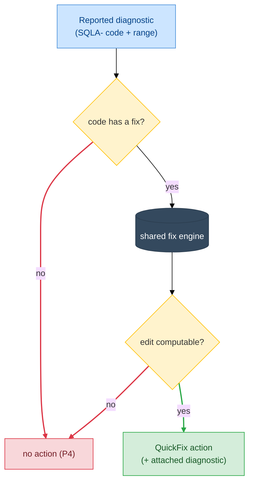

# F11 — Code Actions

> **Status:** Draft
>
> **Version:** 0.1   ·   **Last updated:** 2026-06-17
>
> **Purpose:** The quick fixes the server offers to repair a SQLAlchemy finding — generate a `__tablename__`, fix a `back_populates`, add a missing foreign-key column, modernize a `backref` — and the rule that every edit is byte-identical to what `check --fix` applies.
>
> **Depends on:** [constitution](../constitution.md), [E07-data-model](../foundations/E07-data-model.md), [E30-extraction-and-indexing](../foundations/E30-extraction-and-indexing.md), [E15-app-config](../foundations/E15-app-config.md), [E17-testing](../foundations/E17-testing.md)   ·   **Related:** [F01-orm-correctness-diagnostics](F01-orm-correctness-diagnostics.md), [F02-best-practice-lints](F02-best-practice-lints.md), [F14-cli-linter](F14-cli-linter.md), [E29-e2e-testing](../foundations/E29-e2e-testing.md)

> Requirement tag: **CA**

---

## 1. Purpose & Scope

A code action turns a diagnostic into a one-click fix. When the server flags `User` for a missing `__tablename__`, it also offers to write `__tablename__ = "users"` for you. This spec defines every quick fix the server produces, the diagnostic each one resolves, and the rule that binds them to the CLI: an editor quick fix and `check --fix` must apply the *same bytes*.

This spec covers:

- The **legacy ported fixes** — generate `__tablename__`, fix a `back_populates` value, add a missing foreign-key column, and proactively suggest a `back_populates` even when nothing is flagged.
- **One quick fix per fixable new lint** — backref→`back_populates`, `declarative_base()`→`DeclarativeBase`, add `timezone=True`, wrap a mutable default in its callable, add `Optional[...]`, add `Mapped[...]`, add `unique=True` for a one-to-one, rewrite a cascade to `all, delete-orphan`, name a constraint, scaffold a `naming_convention`, and add `foreign_keys=`.
- The **diagnostic-to-fix map** — which `SQLA-` code each action resolves.
- The **parity contract** — every edit is byte-identical to the edit `check --fix` ([F14](F14-cli-linter.md)) produces, pinned by [E17 REQ-TST-05](../foundations/E17-testing.md#6-conventions).

## 2. Non-Goals / Out of Scope

- **The diagnostics themselves** — the triggers, messages, and codes — are owned by [F01](F01-orm-correctness-diagnostics.md) and [F02](F02-best-practice-lints.md). This spec consumes a published diagnostic and offers a fix; it never decides *whether* something is wrong.
- **Applying fixes headlessly** — the `check --fix` command that writes fixes from the CLI is owned by [F14](F14-cli-linter.md). This spec defines the *edit*; F14 defines the *batch application* and reporting. The two share the same fix engine (parity).
- **Generic Python refactors** — extract-variable, organize-imports, rename-symbol — belong to the user's Python LSP (constitution P5). We offer only SQLAlchemy-specific repairs.
- **Rename** — the workspace refactor of a model/column/relationship is its own capability, owned by [F07](F07-rename.md). A few fixes here touch two files (a `backref` rewrite adds the counterpart attribute), but that is a fixed edit, not an interactive rename.
- **Fixes for findings that have none** — many diagnostics are deliberately fix-less because the *right* repair is a judgment call (which column is the primary key, what length a `String` needs). This spec ships fixes only for the rules listed in [§5.2](#52-the-fix-catalog).

## 3. Background & Rationale

A linter that only points at problems makes work; one that offers the repair removes it. The legacy server already shipped four code actions, and they were the most-used part of the tool — generating a `__tablename__` and fixing a `back_populates` are mechanical edits a human shouldn't have to type. This spec ports those four and adds a fix for every *new* lint whose repair is unambiguous.

The hard requirement is **parity with the CLI**. The constitution's *one engine, two front-ends* principle says the editor server and the `check` command can never disagree on findings. We extend that to fixes: the edit you apply with a click in your editor and the edit `check --fix` writes in CI must be the *same bytes*. If they drift, a fix applied locally and a fix applied in a pre-commit hook produce different source, and the team's diffs stop being reproducible. So both front-ends call one fix function per code, and a parity test ([E17 REQ-TST-05](../foundations/E17-testing.md#6-conventions)) applies both to the same broken fixture and asserts the results match character for character.

One fix is special: the **proactive `back_populates` suggestion**. Unlike every other action, it is offered with *no diagnostic attached* — when your cursor sits on a one-sided `relationship` whose counterpart exists, the server offers to wire the pair, even though nothing is flagged. It is a *refactor* action, not a *quickfix*, and it is the one place this feature reads the cursor position rather than a published diagnostic.

## 4. Concepts & Definitions

These terms are canonical across the suite; the glossary owns the full definitions.

- **Code action** — an edit (or command) the server offers for a range, returned from `textDocument/codeAction`. A **quick fix** (`CodeActionKind.QuickFix`) repairs a diagnostic; a **refactor** (`CodeActionKind.Refactor`) is offered without one.
- **Workspace edit** — the LSP `WorkspaceEdit` payload carrying the `TextEdit`s a fix applies, keyed by document URI. A single fix may edit more than one file.
- **Diagnostic code** — the `SQLA-<SEV><CLASS><NN>` identifier a fix resolves; the action attaches the diagnostic it answers so the editor can pair them. (Canonical definition in [glossary](../glossary.md).)
- **Parity** — the rule that `check` and the server emit identical findings, extended here to identical *fixes*. (Canonical definition in [glossary](../glossary.md); owned by [E17](../foundations/E17-testing.md).)
- **`back_populates`** — the kwarg naming the reverse relationship on the target model, wiring a bidirectional pair. (Canonical definition in [glossary](../glossary.md).)

## 5. Detailed Specification

The code-action handler is a pure function: given the workspace state, a URI, a range, and the diagnostics the editor reports for that range, it returns the actions that apply ([E01 §5.4](../foundations/E01-architecture.md#54-feature-dispatch)). It re-parses nothing — every edit is computed from the in-memory index plus the parse tree already held for the file.

### 5.1 How an action is offered

The handler walks the diagnostics in the requested range, and for each one whose code has a registered fix, it builds the edit and attaches the diagnostic. It then adds any proactive refactors for the cursor position.

**REQ-CA-01 — Fixes are offered per reported diagnostic; refactors per cursor.**

The editor sends `textDocument/codeAction` with a range and the diagnostics overlapping it. For each diagnostic carrying a `SQLA-` code that has a fix in the catalog ([§5.2](#52-the-fix-catalog)), the handler produces a `QuickFix` action whose `diagnostics` field references the diagnostic it resolves, so the editor can show it under that squiggle. The proactive `back_populates` action ([§5.3](#53-the-legacy-ported-fixes)) is the exception — it is a `Refactor` offered when the cursor sits inside a qualifying `relationship`, with no diagnostic attached. When a fix can't be computed — the target model is unresolved, the parse tree is missing the node — the handler offers nothing for that diagnostic rather than a partial or guessed edit (constitution P4).

**REQ-CA-02 — Every fix edit is byte-identical to `check --fix`.**

Each fix is produced by one shared function that both the code-action handler and `check --fix` ([F14](F14-cli-linter.md)) call. The `WorkspaceEdit` the editor applies and the bytes `check --fix` writes to disk for the same finding are identical — same insertion point, same text, same whitespace and quoting. This is the fix half of [E17 REQ-TST-05](../foundations/E17-testing.md#6-conventions), and a parity test applies both paths to a broken fixture and asserts the resulting source matches character for character.

### 5.2 The fix catalog

This is the authoritative list of every quick fix, the diagnostic it resolves, and what it edits. Each row is a load-bearing requirement; the prose for the load-bearing ones follows in [§5.3](#53-the-legacy-ported-fixes)–[§5.4](#54-the-new-lint-fixes). The "fixable" column of [F01](F01-orm-correctness-diagnostics.md) and the [F02 catalog](F02-best-practice-lints.md#57-orm-extensions-sqla-6xx) table list the same set from the diagnostic side.

| Req | Action title | Resolves | Source | What it edits |
|---|---|---|---|---|
| REQ-CA-03 | Add `__tablename__ = "…"` | `SQLA-W101` | F01 | Inserts `__tablename__` as the first class-body line, name = snake_case plural of the model |
| REQ-CA-04 | Fix `back_populates` to `…` | `SQLA-W402`, `SQLA-W403` | F01 | Replaces the wrong `back_populates` string with the resolved counterpart's attribute name |
| REQ-CA-05 | Add FK column `…_id` | `SQLA-H406` | F01 | Inserts a `Mapped[<pk-type>] = mapped_column(ForeignKey("…"))` line before the relationship |
| REQ-CA-06 | Add `back_populates="…"` (proactive) | *(none — refactor)* | F01 | Appends `back_populates="…"` to a one-sided `relationship` whose counterpart exists |
| REQ-CA-07 | Add `Optional[…]` | `SQLA-W201` | F01 | Wraps the column's `Mapped[T]` inner type in `Optional[…]` |
| REQ-CA-08 | Add `unique=True` | `SQLA-H407` | F01 | Adds `unique=True` to the backing FK column of a one-to-one |
| REQ-CA-09 | Rewrite cascade to `all, delete-orphan` | `SQLA-W409` | F01 | Replaces the cascade string with `all, delete-orphan` |
| REQ-CA-10 | Rewrite `backref` into a `back_populates` pair | `SQLA-W501` | F02 | Replaces `backref="x"` with `back_populates="x"` and adds the counterpart attribute on the target model |
| REQ-CA-11 | Use `class Base(DeclarativeBase)` | `SQLA-W502` | F02 | Rewrites `Base = declarative_base()` to the 2.0 class form |
| REQ-CA-12 | Add `timezone=True` | `SQLA-H205` | F02 | Adds `timezone=True` to the `DateTime(...)` type |
| REQ-CA-13 | Wrap mutable default in its callable | `SQLA-W203` | F02 | Rewrites `default=[]`→`default=list`, `default={}`→`default=dict`, `default=set()`→`default=set` |
| REQ-CA-14 | Add `Mapped[…]` annotation | `SQLA-W504` | F02 | Infers the type from the SQL type and adds the `Mapped[…]` annotation |
| REQ-CA-15 | Drop the contradicting `nullable` flag | `SQLA-H202` | F02 | Removes `nullable=False` when the type is already non-`Optional` |
| REQ-CA-16 | Name the constraint | `SQLA-H106` | F02 | Inserts a `name="…"` into the bare `__table_args__` constraint |
| REQ-CA-17 | Scaffold a `naming_convention` | `SQLA-H107` | F02 | Inserts a `metadata = MetaData(naming_convention=…)` block on the resolved base |
| REQ-CA-18 | Add `foreign_keys=…` | `SQLA-W304`, `SQLA-W305` | F02 | Scaffolds `foreign_keys=[…]` on the relationship with the candidate columns |
| REQ-CA-19 | Rename the import alias to `sa` | `SQLA-I505` | F02 | Renames `import sqlalchemy as <x>` to `as sa` and every use of `<x>` in the file |

> **Note:** Many diagnostics deliberately have no fix because the right repair is a judgment call — `SQLA-W104` missing-primary-key (which column?), `SQLA-H206` unbounded-string (what length?), `SQLA-W408` unknown-cascade (which token did you mean?). Those rules guide with their message; this feature stays out of the user's way.

### 5.3 The legacy ported fixes

These four are carried over from the legacy server, refined to the `SQLA-` codes and the parity contract. Their behavior is the baseline every new fix matches.

**REQ-CA-03 — Generate `__tablename__` from a snake_case plural.**

When `SQLA-W101` flags a model with no `__tablename__`, the fix inserts one as the first line of the class body. The table name is the model's class name converted to snake_case and pluralized with a trailing `s` — `User` → `"users"`, `BlogPost` → `"blog_posts"`. The edit inserts `    __tablename__ = "<name>"\n` at column 0 of the line after the class header, so it lands at the top of the body with four-space indentation. See the before/after in [§6.1](#61-quick-fix-menu-on-a-diagnostic) and [§6.2](#62-applying-generate-__tablename__).

> **Note:** The pluralization is the simple trailing-`s` rule the legacy server used (`Category` → `"categorys"`, not `"categories"`). It is intentionally naive and predictable — the user edits the rare irregular case, and a predictable rule is what keeps the edit byte-identical to `check --fix`. The action title shows the exact name so there is no surprise.

**REQ-CA-04 — Fix a `back_populates` to the resolved counterpart.**

When `SQLA-W402` (mismatch) or `SQLA-W403` (not-found) flags a relationship's `back_populates`, the fix replaces the wrong string with the correct one. It resolves the relationship's target model through the index ([E07 §5.7](../foundations/E07-data-model.md#57-the-workspace-index)), finds the counterpart relationship on that model that points back at this one, and replaces the `back_populates` string literal with the counterpart's attribute name. For `clean-blog`, a `Post.author` that wrongly says `back_populates="post"` is rewritten to `back_populates="posts"`. The edit replaces only the string-literal range, so quoting and surrounding args are untouched.

**REQ-CA-05 — Add the missing foreign-key column for a relationship.**

When `SQLA-H406` flags a `relationship` whose two models share no foreign key, the fix scaffolds the FK column. It resolves the target model, reads its primary-key column's name and mapped type, and inserts a new line *before* the relationship: `    <target>_id: Mapped[<pk-type>] = mapped_column(ForeignKey("<target-table>.<pk>"))`. The column name is the target model's snake_case name suffixed with `_id` (`Post.author` → `author_id`? — no: the legacy rule derives it from the *target model* name, so a relationship to `User` yields `user_id`). The indentation matches the relationship's column. The inserted FK gives the relationship something to join on.

**REQ-CA-06 — Proactively suggest a `back_populates` (refactor, no diagnostic).**

This action is offered with no diagnostic attached. When the cursor sits inside a `relationship(...)` that has no `back_populates`, and the target model exposes a counterpart relationship pointing back at this model, the handler offers to wire the pair. It locates the closing paren of the `relationship` call from the parse tree and appends `, back_populates="<counterpart>"` just inside it. Because nothing is *wrong* — a one-sided relationship is valid — this is a `Refactor`, not a `QuickFix`, and it is the only action this feature offers off a cursor rather than a finding. When the counterpart can't be resolved, the action is not offered (P4).

### 5.4 The new-lint fixes

Each fixable F02 lint gets a repair whose edit is, again, byte-identical to `check --fix`. The load-bearing ones:

**REQ-CA-07 — Add `Optional[...]` to a nullable column.** When `SQLA-W201` flags a `Mapped[str]` column declared `nullable=True`, the fix wraps the inner type: `Mapped[str]` → `Mapped[Optional[str]]`. The edit replaces the inner-type range of the annotation only.

**REQ-CA-08 — Add `unique=True` for a one-to-one.** When `SQLA-H407` flags a one-to-one whose backing FK column lacks uniqueness, the fix adds `unique=True` to that column's `mapped_column(...)` call.

**REQ-CA-09 — Rewrite a cascade to `all, delete-orphan`.** When `SQLA-W409` flags `cascade="delete-orphan"` without a `delete` token, the fix replaces the cascade string with `"all, delete-orphan"`, the canonical form that includes the delete behavior `delete-orphan` requires.

**REQ-CA-10 — Rewrite `backref` into a `back_populates` pair.** When `SQLA-W501` flags a `backref=`, the fix performs a two-edit repair: it replaces `backref="author"` on this relationship with `back_populates="author"`, and it adds the counterpart attribute (`author: Mapped[...] = relationship(back_populates="posts")`) on the target model — a second file when the models live apart. This is the one fix that always edits the target model too; the `WorkspaceEdit` carries both files' edits.

**REQ-CA-11 — Modernize `declarative_base()` to the class form.** When `SQLA-W502` flags `Base = declarative_base()`, the fix rewrites it to `class Base(DeclarativeBase):\n    pass`, the 2.0 declarative form, and ensures `DeclarativeBase` is imported.

**REQ-CA-12 — Add `timezone=True` to a naive `DateTime`.** When `SQLA-H205` flags a `DateTime` column without `timezone=True`, the fix adds the argument: `DateTime` → `DateTime(timezone=True)`, or `DateTime(...)` → `DateTime(..., timezone=True)`.

**REQ-CA-13 — Wrap a mutable default in its callable.** When `SQLA-W203` flags a shared mutable default, the fix swaps the literal for its zero-arg callable: `default=[]` → `default=list`, `default={}` → `default=dict`, `default=set()` → `default=set`. The callable runs per row, fixing the shared-state bug.

**REQ-CA-14 — Add a `Mapped[...]` annotation.** When `SQLA-W504` flags a bare `name = mapped_column(String(120))`, the fix infers the Python type from the SQL type (`String` → `str`, `Integer` → `int`, `Boolean` → `bool`, …) and rewrites it as `name: Mapped[str] = mapped_column(String(120))`. When the SQL type can't be classified, the action is not offered (P4).

**REQ-CA-15 — Drop a contradicting `nullable` flag.** When `SQLA-H202` flags `nullable=False` on a column whose type is already non-`Optional`, the fix removes the redundant argument, trimming the surrounding comma and whitespace cleanly.

**REQ-CA-16 — Name an unnamed constraint.** When `SQLA-H106` flags a bare `UniqueConstraint("email")` in `__table_args__`, the fix inserts a `name="uq_<table>_<col>"` argument, giving the constraint a stable, migration-friendly name.

**REQ-CA-17 — Scaffold a `naming_convention`.** When `SQLA-H107` flags a resolved base whose `MetaData` sets no `naming_convention`, the fix inserts a `metadata = MetaData(naming_convention={...})` block on the base class with the conventional indexes/constraints map. This fixes the root cause of many `SQLA-H106` findings at once.

**REQ-CA-18 — Add `foreign_keys=`.** When `SQLA-W304` (ambiguous) or `SQLA-W305` (composite) flags a relationship that needs an explicit join column, the fix scaffolds `foreign_keys=[<candidates>]` with the candidate columns the index found, so SQLAlchemy can disambiguate the join.

**REQ-CA-19 — Rename the import alias to `sa`.** When `SQLA-I505` flags `import sqlalchemy as sql`, the fix renames the alias in the import statement *and* every use of `sql.` in the file to `sa`. This is a file-local find-and-replace driven by the parse tree, not a workspace rename.

### 5.5 Ordering and engine

Actions return in a stable order, and they share the diagnostics engine so a fix can never reference a finding the engine wouldn't produce.

**REQ-CA-20 — Actions return in catalog order; the fix engine is shared.**

When a range carries more than one fixable diagnostic, the actions return in the catalog order of [§5.2](#52-the-fix-catalog) (by resolved code), so the menu is deterministic across editors and across runs. The fix functions live in the same engine that produces the diagnostics ([F01 §5.6](F01-orm-correctness-diagnostics.md#56-engine-ordering-and-parity)), so `check --fix` and the editor call the identical code path (REQ-CA-02).

## 6. UI Mockups

Code actions surface as a small menu the editor anchors at the diagnostic or the cursor (the lightbulb / `Ctrl+.` affordance). The mockups below show the menu and a representative before/after — they are the layout contract for what the user sees and what the fix writes.

### 6.1 Quick-fix menu on a diagnostic

Shown when the cursor is on a flagged line and the user opens the code-action menu. Each entry names the exact edit.

```
class User(Base):                       ⚠ SQLA-W101  model `User` has no __tablename__
    id: Mapped[int] = mapped_column(primary_key=True)
    ⋮  ◀ lightbulb / Ctrl+.
    ╭──────────────────────────────────────────────────╮
    │ Quick fix                                         │
    │  ▸ Add `__tablename__ = "users"`                  │
    │ Refactor                                          │
    │  ▸ Add `back_populates="posts"`        <proactive>│
    ╰──────────────────────────────────────────────────╯
```

States:
- **Single fix** → one `Quick fix` entry.
- **Several fixable diagnostics on the line** → one entry per diagnostic, in catalog order (REQ-CA-20).
- **No fixable diagnostic, cursor in a one-sided relationship** → only the `Refactor` entry (REQ-CA-06).
- **No fixable diagnostic, no proactive opportunity** → no SQLAlchemy entries (the editor may still show its Python LSP's actions).

### 6.2 Applying "Generate `__tablename__`"

The representative before/after. The fix inserts one line as the first body statement; nothing else moves.

```
Before — SQLA-W101 on `class User`:        After — fix applied:

class User(Base):                          class User(Base):
    id: Mapped[int] = mapped_column(            __tablename__ = "users"
        primary_key=True)                       id: Mapped[int] = mapped_column(
    name: Mapped[str]                               primary_key=True)
                                                name: Mapped[str]
```

The inserted text is exactly `    __tablename__ = "users"\n` at line-start of the body's first line — the identical bytes `check --fix` writes (REQ-CA-02).

### 6.3 Applying "Fix `back_populates`"

Shown for `SQLA-W402`. Only the string literal changes; the rest of the call is untouched.

```
Before — SQLA-W402 on `Post.author`:       After — fix applied:

author: Mapped["User"] = relationship(     author: Mapped["User"] = relationship(
    back_populates="post")                     back_populates="posts")
                  └── wrong                                    └── resolved counterpart
```

States: mismatch (`SQLA-W402`, wrong name) and not-found (`SQLA-W403`, missing name) both rewrite to the resolved counterpart; when the counterpart can't be resolved, no fix is offered (P4).

## 7. Visualizations

The handler's decision per diagnostic: look up a fix, build the edit if everything resolves, attach the diagnostic. The same fix function feeds the editor and `check --fix`.



## 8. Data Shapes

The handler returns LSP `CodeAction` objects. A quick fix carries the resolving diagnostic and a `WorkspaceEdit`; the proactive refactor carries the edit alone. Positions are emitted under the negotiated encoding ([E01 REQ-ARCH-10](../foundations/E01-architecture.md#56-protocol-conduct)).

A single-file quick fix — generate `__tablename__`:

```jsonc
// one entry of the textDocument/codeAction response
{
  "title": "Add `__tablename__ = \"users\"`",
  "kind": "quickfix",
  "diagnostics": [ { "code": "SQLA-W101", "range": { "...": "..." } } ],
  "edit": {
    "changes": {
      "file:///clean-blog/models/user.py": [
        {
          "range": { "start": { "line": 9, "character": 0 },
                     "end":   { "line": 9, "character": 0 } },
          "newText": "    __tablename__ = \"users\"\n"
        }
      ]
    }
  }
}
```

A two-file quick fix — rewrite `backref` into a `back_populates` pair — carries edits keyed by both URIs:

```jsonc
{
  "title": "Rewrite `backref` into a `back_populates` pair",
  "kind": "quickfix",
  "diagnostics": [ { "code": "SQLA-W501", "range": { "...": "..." } } ],
  "edit": {
    "changes": {
      "file:///clean-blog/models/user.py": [ { "range": { "...": "..." }, "newText": "back_populates=\"author\"" } ],
      "file:///clean-blog/models/post.py": [ { "range": { "...": "..." }, "newText": "    author: Mapped[\"User\"] = relationship(back_populates=\"posts\")\n" } ]
    }
  }
}
```

## 9. Examples & Use Cases

Walk the `clean-blog` cast. You are sketching a new `User` model and haven't named its table yet, so the server publishes `SQLA-W101` on the class header ([F01](F01-orm-correctness-diagnostics.md)). You put the cursor on the squiggle and press `Ctrl+.`; the menu offers **Add `__tablename__ = "users"`** ([§6.1](#61-quick-fix-menu-on-a-diagnostic)). You accept, and the server inserts `    __tablename__ = "users"` as the first body line ([§6.2](#62-applying-generate-__tablename__)). The diagnostic clears on the next publish.

Later you wire `Post.author` to `User` and type `back_populates="post"` by mistake. `SQLA-W402` fires because `User` exposes `posts`, not `post`. The fix **Fix `back_populates` to `posts`** resolves the counterpart through the index and rewrites just the string ([§6.3](#63-applying-fix-back_populates)). Now imagine you'd written the old-style `User.posts = relationship("Post", backref="author")` instead — `SQLA-W501` fires, and the fix rewrites `backref` into a proper pair: `back_populates="author"` on `User.posts` *and* a new `author` relationship on `Post`, an edit spanning both files (REQ-CA-10).

Finally, your teammate runs the same checks in CI with `sqlalchemy-lsp check --fix` ([F14](F14-cli-linter.md)). Because both front-ends call the same fix engine, the `__tablename__` line, the `back_populates` string, and the `backref` rewrite land as the *exact same bytes* the editor wrote — the parity contract (REQ-CA-02) means the CI diff and your local diff are identical.

## 10. Edge Cases & Failure Modes

- A diagnostic whose code has no fix (`SQLA-W104`, `SQLA-H206`, `SQLA-W408`) → no action offered; the message guides instead.
- A fixable diagnostic whose target model is unresolved (a `back_populates` fix where the counterpart can't be found) → no action offered (P4).
- A `backref` rewrite where the target model lives in another file → the `WorkspaceEdit` carries edits for both URIs (REQ-CA-10); if the target file can't be located, no fix is offered.
- A `Mapped[...]` fix where the SQL type can't be classified to a Python type → no action offered (P4).
- The proactive `back_populates` refactor where the relationship already has `back_populates`, or no counterpart exists → not offered (REQ-CA-06).
- Several fixable diagnostics on one line → one action each, in catalog order (REQ-CA-20).
- A half-typed file with `ERROR` nodes around the diagnostic → a fix is offered only when the node it must edit was recovered by extraction; otherwise nothing (constitution P3).
- A diagnostic the editor reports that the current index no longer produces (a stale squiggle after an edit) → the handler finds no matching fact and offers nothing rather than editing the wrong range.
- Multi-byte identifiers (the `non-ascii` fixture) → every inserted/replaced range is correct under both negotiated encodings.

## 11. Testing

Code actions are tested by publishing a diagnostic on a broken fixture, requesting the actions, asserting the offered titles and the exact `WorkspaceEdit`, then applying the edit and re-checking that the finding clears — plus the parity test against `check --fix`. Every `REQ-CA-NN` maps to at least one test.

### 11.1 Scope & coverage

Target: **100% of this feature's behavior is covered.** Every `REQ-CA-NN` maps to at least one test; every menu state (§6) and edge case (§10) has a test; every fix in the catalog ([§5.2](#52-the-fix-catalog)) is exercised both as *offered* and as *applied*. See the policy in [E17-testing](../foundations/E17-testing.md#2-coverage-policy).

### 11.2 Test plan

Each row is a behavior under test. Computing an edit from the index needs cross-file resolution, so those are integration tests; building an edit from a single in-file node is a unit test. Every fix's parity with `check --fix` is one shared assertion ([E17 REQ-TST-05](../foundations/E17-testing.md#6-conventions)).

| Behavior / scenario | Type | Fixtures | Verifies |
|---|---|---|---|
| Fix offered per reported diagnostic; refactor per cursor | integration | [clean-blog](../foundations/E17-testing.md#clean-blog) | REQ-CA-01 |
| Every fix edit is byte-identical to `check --fix` | integration | [missing-tablename](../foundations/E17-testing.md#missing-tablename), [back-populates-mismatch](../foundations/E17-testing.md#back-populates-mismatch), [backref-deprecated](../foundations/E17-testing.md#backref-deprecated) | REQ-CA-02 |
| Generate `__tablename__` (snake_case plural) offered + applied | integration | [missing-tablename](../foundations/E17-testing.md#missing-tablename) | REQ-CA-03 |
| Fix `back_populates` to resolved counterpart | integration | [back-populates-mismatch](../foundations/E17-testing.md#back-populates-mismatch) | REQ-CA-04 |
| Add missing FK column for a relationship | integration | [missing-fk-for-relationship](../foundations/E17-testing.md#missing-fk-for-relationship) | REQ-CA-05 |
| Proactive `back_populates` refactor at cursor; not offered when wired | integration | [clean-blog](../foundations/E17-testing.md#clean-blog) | REQ-CA-06 |
| Add `Optional[...]` to a nullable column | unit | [nullable-not-optional](../foundations/E17-testing.md#nullable-not-optional) | REQ-CA-07 |
| Add `unique=True` for a one-to-one | integration | [unique-missing-one-to-one](../foundations/E17-testing.md#unique-missing-one-to-one) | REQ-CA-08 |
| Rewrite cascade to `all, delete-orphan` | unit | [orphan-without-delete](../foundations/E17-testing.md#orphan-without-delete) | REQ-CA-09 |
| Rewrite `backref` into a two-file pair | integration | [backref-deprecated](../foundations/E17-testing.md#backref-deprecated) | REQ-CA-10 |
| Modernize `declarative_base()` to the class form | unit | [legacy-declarative-base](../foundations/E17-testing.md#legacy-declarative-base) | REQ-CA-11 |
| Add `timezone=True` to a `DateTime` | unit | [naive-datetime](../foundations/E17-testing.md#naive-datetime) | REQ-CA-12 |
| Wrap mutable default in its callable | unit | [mutable-default](../foundations/E17-testing.md#mutable-default) | REQ-CA-13 |
| Add `Mapped[...]`; not offered for unclassifiable type | unit | [missing-mapped-annotation](../foundations/E17-testing.md#missing-mapped-annotation) | REQ-CA-14 |
| Drop contradicting `nullable` flag | unit | [clean-blog](../foundations/E17-testing.md#clean-blog) | REQ-CA-15 |
| Name an unnamed constraint | integration | [unnamed-constraint](../foundations/E17-testing.md#unnamed-constraint) | REQ-CA-16 |
| Scaffold a `naming_convention` on the base | integration | [no-naming-convention](../foundations/E17-testing.md#no-naming-convention) | REQ-CA-17 |
| Add `foreign_keys=` for ambiguous/composite FKs | integration | [ambiguous-foreign-keys](../foundations/E17-testing.md#ambiguous-foreign-keys) | REQ-CA-18 |
| Rename import alias to `sa` across the file | unit | [import-alias](../foundations/E17-testing.md#import-alias) | REQ-CA-19 |
| Actions return in catalog order; engine shared | integration | [clean-blog](../foundations/E17-testing.md#clean-blog) | REQ-CA-20 |
| Edit ranges correct under UTF-8 and UTF-16 | integration | [non-ascii](../foundations/E17-testing.md#non-ascii) | REQ-CA-02 |

### 11.3 Fixtures

All fixtures are the shared per-code variants in the [E17 registry](../foundations/E17-testing.md#5-fixtures-registry) — each broken variant triggers exactly the diagnostic whose fix is under test, plus [clean-blog](../foundations/E17-testing.md#clean-blog) for the proactive-refactor and ordering cases and [non-ascii](../foundations/E17-testing.md#non-ascii) for encoding ranges. Code actions define no feature-local fixtures.

### 11.4 Requirement coverage

Every load-bearing requirement maps to a test — this table is the proof.

| Requirement | Covered by |
|---|---|
| REQ-CA-01 | `req_ca_01_fix_per_diag_refactor_per_cursor` |
| REQ-CA-02 | `req_ca_02_parity_with_check_fix`, `req_ca_02_ranges_both_encodings` |
| REQ-CA-03 | `req_ca_03_generate_tablename` |
| REQ-CA-04 | `req_ca_04_fix_back_populates` |
| REQ-CA-05 | `req_ca_05_add_fk_column` |
| REQ-CA-06 | `req_ca_06_proactive_back_populates`, `req_ca_06_not_offered_when_wired` |
| REQ-CA-07 | `req_ca_07_add_optional` |
| REQ-CA-08 | `req_ca_08_add_unique` |
| REQ-CA-09 | `req_ca_09_rewrite_cascade` |
| REQ-CA-10 | `req_ca_10_rewrite_backref_pair` |
| REQ-CA-11 | `req_ca_11_modernize_declarative_base` |
| REQ-CA-12 | `req_ca_12_add_timezone` |
| REQ-CA-13 | `req_ca_13_wrap_mutable_default` |
| REQ-CA-14 | `req_ca_14_add_mapped`, `req_ca_14_unclassifiable_no_fix` |
| REQ-CA-15 | `req_ca_15_drop_nullable_flag` |
| REQ-CA-16 | `req_ca_16_name_constraint` |
| REQ-CA-17 | `req_ca_17_scaffold_naming_convention` |
| REQ-CA-18 | `req_ca_18_add_foreign_keys` |
| REQ-CA-19 | `req_ca_19_rename_import_alias` |
| REQ-CA-20 | `req_ca_20_catalog_order_shared_engine` |

## 12. End-to-End Test Plan

The journeys drive the built binary over stdio with `pytest-lsp`: open a broken fixture, wait on the publish, request `textDocument/codeAction`, assert the offered actions, apply the `WorkspaceEdit`, and assert the finding clears on the next publish — plus the cross-front-end parity journey against `check --fix`.

### 12.1 Coverage target

**100% of the feature's scope, end to end** — every fix offered *and* applied, the proactive refactor, the two-file `backref` rewrite, the no-fix paths, and parity with `check --fix`. See the policy in [E29-e2e-testing](../foundations/E29-e2e-testing.md#2-coverage-policy). The shared protocol-conformance journeys ([E29 REQ-E2E-03](../foundations/E29-e2e-testing.md#5-patterns)) — including relink→empty-publish, which proves an applied fix clears its diagnostic — are inherited, not re-tested here.

### 12.2 Scenarios

Each scenario seeds a fixture from the [E17 registry](../foundations/E17-testing.md#5-fixtures-registry), waits on the open→publish signal, then exercises the code-action path.

| # | Journey | Path | Expected outcome |
|---|---|---|---|
| E2E-01 | Request actions on `SQLA-W101`, apply | happy | Menu offers `Add \`__tablename__ = "users"\``; applying inserts the line and the diagnostic clears |
| E2E-02 | Request actions on `SQLA-W402`, apply | happy | Offers `Fix back_populates to \`posts\``; applying rewrites the string and clears the finding |
| E2E-03 | Cursor in a one-sided `relationship` with a counterpart | happy | A `Refactor` action adds `back_populates="…"`; no diagnostic attached |
| E2E-04 | Apply the `backref` rewrite (`SQLA-W501`) | happy | Edits both `user.py` and `post.py`; both findings clear |
| E2E-05 | Apply each fixable F02 fix in turn | happy | Each applied edit clears its diagnostic on the next publish |
| E2E-06 | `check --fix` and editor fix on the same fixture | happy | Resulting source is byte-identical (parity, REQ-CA-02) |
| E2E-07 | Request actions on a fix-less finding (`SQLA-W104`) | error | No SQLAlchemy quick fix offered; server does not crash |
| E2E-08 | Fix whose counterpart/type can't resolve | error | No action offered (P4); no crash |
| E2E-09 | Several fixable diagnostics on one line | happy | One action each, in catalog order (REQ-CA-20) |
| E2E-10 | Request actions on a mid-edit file with `ERROR` nodes | error | Actions only for recovered nodes; no crash (P3) |
| E2E-11 | Apply a fix in the `non-ascii` fixture | happy | Edit lands on the right range under both negotiated encodings |

### 12.3 Acceptance criteria & Definition of Done

The §12.2 scenarios, written Given/When/Then, are this feature's acceptance criteria:

| # | Given | When | Then |
|---|---|---|---|
| AC-01 | The `missing-tablename` workspace is open and `SQLA-W101` is published | I open the code-action menu on the class and accept the fix | `__tablename__ = "users"` is inserted as the first body line and the diagnostic clears |
| AC-02 | The `back-populates-mismatch` workspace is open | I apply the `Fix back_populates` action | The string is rewritten to the resolved counterpart and the finding clears |
| AC-03 | The `backref-deprecated` workspace is open | I apply the `backref`→`back_populates` rewrite | Both the relationship file and the target-model file are edited and both findings clear |
| AC-04 | Any broken fixture with a fixable finding | I apply the editor fix and `check --fix` separately | The resulting source files are byte-identical |
| AC-05 | A finding with no registered fix is published | I open the code-action menu | No SQLAlchemy quick fix appears and the server does not crash |

**Definition of Done:** every `REQ-CA-NN` has a passing test (§11.4), every acceptance scenario above passes, and the enabled non-functional concern (§13.1) is verified.

## 13. Non-Functional Requirements

### 13.1 Security & Privacy

- **Access & authorization** — none. Code actions are a read request answered from the in-memory index plus the held parse tree; applying the returned `WorkspaceEdit` is the editor's act on the user's own files, within the editor's existing trust boundary. The server never writes files itself in the LSP path.
- **Input & validation** — the inputs are a URI, a range, and the diagnostics the editor reports. The handler reads only already-extracted facts and the parse tree, runs no user code (constitution P1), and shells out to nothing. A reported diagnostic the index can't corroborate yields no edit (it never edits a guessed range).
- **Data sensitivity** — none beyond the user's own source. The proposed edits are returned to the requesting editor; nothing leaves the process, nothing is logged to stdout, and `tracing` goes to stderr/`log_file` only (constitution §13.5).
- **Baseline** — stays within the suite-wide envelope: local files only, no network, no telemetry, no secrets. When the same fixes are applied headlessly by `check --fix`, that command writes only the workspace files it is fixing — see [F14](F14-cli-linter.md).

### 13.2 Accessibility

**N/A** — this is a headless server; the editor renders the code-action menu and owns its accessibility (keyboard navigation, the lightbulb affordance, focus). The one content rule we keep (constitution §4.6) applies to our output: each action's *title* states the exact edit in words — `Add \`__tablename__ = "users"\``, `Fix back_populates to \`posts\`` — so the menu reads correctly to a screen reader without relying on an icon or color.

## 14. Open Questions & Decisions

- **Decision — naive trailing-`s` pluralization for `__tablename__`.** The generated table name uses the legacy server's simple snake_case + `s` rule, not an English pluralizer. It is predictable, keeps the edit byte-identical to `check --fix`, and the action title shows the exact result, so the user can decline the rare irregular case.
- **Decision — the proactive `back_populates` action is a `Refactor`, not a `QuickFix`.** A one-sided relationship is valid, so there is no diagnostic to attach; offering it as a refactor keeps it out of the "errors to fix" affordance while still surfacing it at the cursor.
- **OQ-CA-1** — Whether to offer a workspace-wide "fix all `SQLA-Xxxx` in this file/workspace" aggregate action (the `source.fixAll` code-action kind) in addition to the per-finding fixes. Deferred; `check --fix` covers the batch case headlessly for now ([F14](F14-cli-linter.md)).
- **OQ-CA-2** — Whether the `declarative_base()`→`DeclarativeBase` fix should also migrate any mixins defined against the old base. Deferred; v1 rewrites only the base definition and leaves mixins to the user.

## 15. Cross-References

- **Depends on:** [constitution](../constitution.md) — P1 (static analysis), P4 (no edit over a guess), P5 (companion, not replacement), and the §4.6 words-not-color rule the action titles honor; [E07-data-model](../foundations/E07-data-model.md) — the model/column/relationship facts and the index the edits resolve against; [E30-extraction-and-indexing](../foundations/E30-extraction-and-indexing.md) — the base/forward-ref/type resolution several fixes rely on; [E15-app-config](../foundations/E15-app-config.md) — the `naming_convention` key the `SQLA-H107` fix scaffolds; [E17-testing](../foundations/E17-testing.md) — the per-code fixtures and the [REQ-TST-05](../foundations/E17-testing.md#6-conventions) fix-parity rule this feature is bound to.
- **Related:** [F01-orm-correctness-diagnostics](F01-orm-correctness-diagnostics.md) — the correctness findings (`SQLA-W101`/`W201`/`W402`/`W403`/`H406`/`H407`/`W409`) these fixes resolve; [F02-best-practice-lints](F02-best-practice-lints.md) — the best-practice findings (`SQLA-H106`/`H107`/`H202`/`W203`/`H205`/`W304`/`W305`/`W413`/`W501`/`W502`/`W504`/`I505`) these fixes resolve; [F14-cli-linter](F14-cli-linter.md) — the `check --fix` front-end that shares this fix engine; [F07-rename](F07-rename.md) — the workspace rename capability, distinct from these fixed edits; [E29-e2e-testing](../foundations/E29-e2e-testing.md) — the harness and the relink→empty-publish journey that proves an applied fix clears its finding.

## 16. Changelog

- **2026-06-17** — Initial draft. Ported the four legacy code actions (generate `__tablename__`, fix `back_populates`, add FK column, proactive `back_populates`) to the `SQLA-` codes, added a quick fix per fixable F01/F02 lint, mapped each fix to the diagnostic it resolves, and pinned the byte-identical parity with `check --fix` ([E17 REQ-TST-05](../foundations/E17-testing.md#6-conventions)). Added the quick-fix menu and generate-`__tablename__` before/after mockups, the decision flowchart, the data shapes for single- and two-file edits, and the testing, E2E, and non-functional sections.
