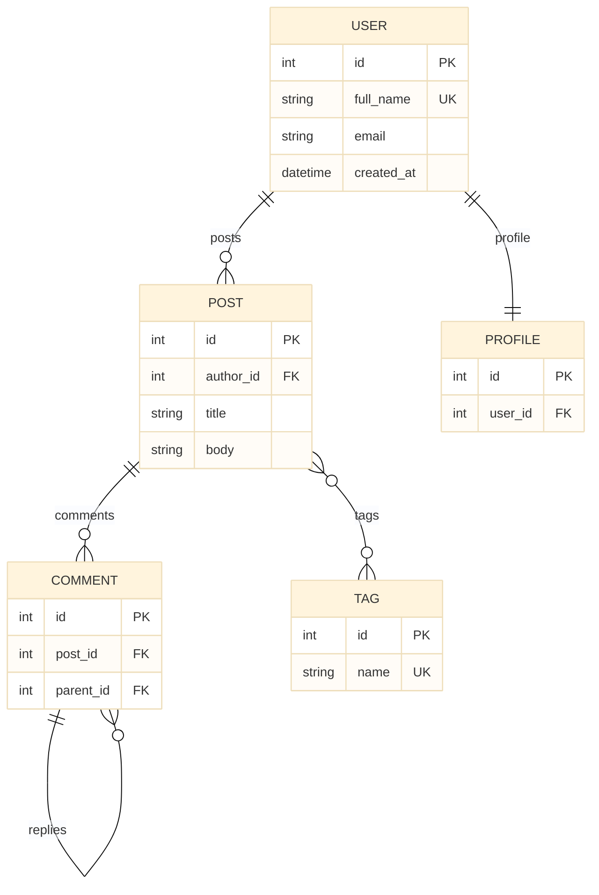
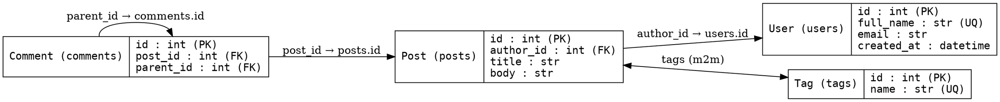

# F12 — Schema Visualization

> **Status:** Draft
>
> **Version:** 0.1   ·   **Last updated:** 2026-06-17
>
> **Purpose:** The schema diagram the server renders from the indexed models — an entity-relationship view of tables, columns, primary/foreign keys, and relationships — offered both as the `sqlalchemy.showSchema` editor command and as a `sqlalchemy-lsp schema` CLI subcommand that emits Mermaid, Graphviz DOT, or ASCII.
>
> **Depends on:** [constitution](../constitution.md), [E07-data-model](../foundations/E07-data-model.md), [E30-extraction-and-indexing](../foundations/E30-extraction-and-indexing.md), [F14-cli-linter](F14-cli-linter.md)   ·   **Related:** [E01-architecture](../foundations/E01-architecture.md), [E17-testing](../foundations/E17-testing.md), [E29-e2e-testing](../foundations/E29-e2e-testing.md), [F13-alembic-support](F13-alembic-support.md)

> Requirement tag: **SCHEMA**

---

## 1. Purpose & Scope

A schema view turns a folder of model files into one picture. Instead of opening four files to see how `User`, `Post`, `Comment`, and `Tag` relate, you ask the server for the schema and it draws the whole graph — every table, its columns and keys, and the relationships between them. This spec defines that rendering, the editor command that returns it, and the CLI subcommand that writes it in the format your toolchain wants.

This spec covers:

- The **`sqlalchemy.showSchema` execute-command** — an editor command that returns the schema diagram for the workspace.
- The **`sqlalchemy-lsp schema` CLI subcommand** — owned jointly with [F14](F14-cli-linter.md) — emitting **Mermaid** (default), **Graphviz DOT** (`--format graphviz`), or **ASCII** (`--format ascii`), with `--output FILE` to write to a file.
- What the diagram contains — models as entities, their columns with **PK/FK** markers, and relationships as labeled edges.
- The rule that a clean, empty, or partial workspace renders gracefully (never a crash).

## 2. Non-Goals / Out of Scope

- **Live-database introspection** — we draw the schema from *source*, never from a connected database. Schema-drift detection against a live DB is a deliberate Non-Goal ([ADR-004](../decisions/ADR-004-exclude-rawsql-and-drift.md)).
- **The migration-chain DAG** — the Alembic revision graph is a different diagram, owned by [F13](F13-alembic-support.md). This spec draws the ER model, not the migration history.
- **The rest of the CLI** — `check`, `stats`, output formats for findings, and exit codes are owned by [F14](F14-cli-linter.md). This spec owns only the `schema` subcommand's *content and formats*; F14 owns the CLI argument-parsing shell it plugs into.
- **Interactive/graphical rendering** — we emit text (Mermaid/DOT/ASCII). Turning Mermaid into a rendered image or an editor webview is the editor's or a downstream tool's job.
- **The facts themselves** — the model/column/relationship shapes are owned by [E07](../foundations/E07-data-model.md); their extraction by [E30](../foundations/E30-extraction-and-indexing.md). This spec only *renders* them.

## 3. Background & Rationale

The legacy server shipped one schema renderer: an ASCII box per model, printed by a command. It was useful but single-format and editor-only. This spec keeps the ASCII rendering, adds two more formats, and exposes the whole thing through both the editor and the CLI so it fits any workflow.

The two new formats earn their place. **Mermaid** is the default because it pastes straight into a Markdown file, a GitHub README, or a PR description and renders as a real ER diagram — the same renderer this spec suite uses for its own diagrams. **Graphviz DOT** is for teams that already run `dot` in their docs pipeline and want a PNG/SVG. **ASCII** is the legacy format, kept for a quick terminal glance with no tooling at all.

Everything is drawn from the index, statically (constitution P1). The renderer never imports a model or queries a database; it reads the same `Model`/`Column`/`Relationship` facts every other feature reads ([E07](../foundations/E07-data-model.md)). That is why it is safe to run on a half-written or broken project: it draws what it can resolve and stays quiet about the rest (P4). And because the editor command and the CLI subcommand share one rendering function per format, the diagram you see in your editor and the diagram CI writes to a file are the same bytes.

## 4. Concepts & Definitions

These terms are canonical across the suite; the glossary owns the full definitions.

- **Execute command** — an editor-initiated `workspace/executeCommand` request. `sqlalchemy.showSchema` is the command this feature registers; it returns the rendered diagram as a string.
- **ER diagram** — an entity-relationship diagram: each model is an entity (a table with its columns), and each relationship/foreign key is an edge between entities.
- **Mermaid `erDiagram`** — Mermaid's ER syntax; the default format. Renders on GitHub and in most Markdown viewers.
- **Graphviz DOT** — the `dot` graph language; the `--format graphviz` output, fed to `dot` to produce an image.
- **Workspace index** — the in-memory model/table lookup the renderer reads. (Canonical definition in [glossary](../glossary.md); owned by [E07](../foundations/E07-data-model.md).)
- **Foreign key / primary key** — the column constraints the renderer marks `FK` / `PK`. (Canonical definitions in [glossary](../glossary.md).)

## 5. Detailed Specification

The schema renderer is a pure function: given the workspace state and a target format, it walks the indexed models and returns a string in that format ([E01 §5.4](../foundations/E01-architecture.md#54-feature-dispatch)). It re-parses nothing and connects to nothing — every entity, column, and edge comes from the in-memory index.

### 5.1 What the diagram contains

Every format draws the same logical content: the models, their columns with key markers, and the relationships between them.

**REQ-SCHEMA-01 — The diagram renders every indexed model with table, columns, keys, and relationships.**

The renderer collects every model in the index that has a resolved table name ([E07 §5.7](../foundations/E07-data-model.md#57-the-workspace-index)), sorted by model name for a stable, reproducible output. For each model it draws:

- The **entity header** — the model name and its table name (`User (users)`).
- Each **column** — its name and mapped type, with markers for **PK** (primary key), **FK** (foreign key), **UQ** (unique), and **NN** (not-null).
- Each **relationship** — an edge to the target model, labeled with the relationship attribute and its cardinality (`posts → list[Post]`, `author → User`).
- Each **foreign key** — a key edge from the FK column to its target column (`Post.author_id → users.id`).

A model whose table name can't be resolved is omitted (P4) rather than drawn half-formed. The same content drives all three formats, so they never disagree on what the schema *is* — only on how it looks.

### 5.2 Stable, deterministic output

The output must be reproducible so a diagram committed to a repo doesn't churn between runs.

**REQ-SCHEMA-02 — Output is deterministic: models, columns, and edges are sorted.**

Models are emitted in alphabetical order by class name; within a model, columns are emitted in their declared order ([E07](../foundations/E07-data-model.md)) and relationships alphabetically by attribute name; foreign-key edges follow the column order. Two runs over the same index produce byte-identical output. This makes the rendering snapshot-testable ([E17](../foundations/E17-testing.md#4-tools--frameworks)) and keeps a checked-in diagram from generating noise diffs.

### 5.3 The `sqlalchemy.showSchema` editor command

The editor surface is an execute-command that returns the diagram as text.

**REQ-SCHEMA-03 — `sqlalchemy.showSchema` returns the rendered schema for the workspace.**

The server registers `sqlalchemy.showSchema` in its `executeCommandProvider` capabilities. When the editor invokes it via `workspace/executeCommand`, the server renders the schema from the current index and returns it as a string in the response. The default format for the command is **Mermaid**, so an editor can drop the result into a Markdown preview; an optional format argument (`"mermaid"`, `"graphviz"`, `"ascii"`) selects another. The command reads the index as it stands — it triggers no re-scan — so it answers as fast as any other read ([E01 §5.4](../foundations/E01-architecture.md#54-feature-dispatch)). What the editor does with the string (open a preview, a new buffer, a webview) is the editor integration's choice ([F15](F15-editor-integration.md)).

### 5.4 The `sqlalchemy-lsp schema` CLI subcommand

The headless surface is a subcommand of the CLI, sharing the renderer with the editor command.

**REQ-SCHEMA-04 — `sqlalchemy-lsp schema` emits the diagram, defaulting to Mermaid.**

The `schema` subcommand ([F14](F14-cli-linter.md) owns the CLI shell) builds the workspace index the same way `check` does — one shared indexing pipeline, no duplicate logic — then renders and prints the diagram to stdout. With no `--format`, it emits Mermaid. It exits `0` on success; an empty workspace is success, not an error ([§5.6](#56-empty-and-partial-workspaces)).

**REQ-SCHEMA-05 — `--format mermaid|graphviz|ascii` selects the output format.**

`--format` chooses the rendering:

- `--format mermaid` (the default) — a Mermaid `erDiagram` block (see [§7.1](#71-mermaid-er-diagram-of-clean-blog)).
- `--format graphviz` — a Graphviz `digraph` in DOT, ready for `dot -Tsvg` (see [§7.2](#72-graphviz-dot)).
- `--format ascii` — the boxed-table rendering ported from the legacy server (see [§6.1](#61-ascii-schema-rendering)).

An unknown format value is a usage error: the CLI prints the accepted values and exits `2` (the config-or-usage exit code [F14](F14-cli-linter.md) defines).

**REQ-SCHEMA-06 — `--output FILE` writes to a file instead of stdout.**

When `--output FILE` is given, the rendered diagram is written to `FILE` and nothing is printed to stdout. The command writes **only** to the path the user named — it creates no other files and touches nothing else on disk ([§13.1](#131-security--privacy)). If the file can't be written (a bad path, no permission), the CLI reports the error on stderr and exits non-zero. Without `--output`, the diagram goes to stdout, so it pipes cleanly into another tool.

### 5.5 The three formats

Each format renders the same content ([§5.1](#51-what-the-diagram-contains)) with its own conventions.

**REQ-SCHEMA-07 — Each format renders the shared content with format-appropriate markers.**

- **Mermaid** uses `erDiagram`: one entity block per model listing `type name` rows with `PK`/`FK`/`UK` key tags, and relationship lines (`USER ||--o{ POST : "posts"`) whose cardinality glyphs encode one-to-many, one-to-one, and many-to-many.
- **Graphviz** uses a `digraph` of record-shaped nodes (one row per column) with directed edges for foreign keys and relationships, labeled with the attribute name.
- **ASCII** draws one box per model — a header row of `Model (table)`, a column list with `[PK,FK,UQ,NN]` flag groups, a relationship section, and a trailing `Foreign Keys:` list of `Model.col → table.col` edges — the legacy layout, kept verbatim so existing snapshots hold.

A relationship through a `secondary` association table is drawn as a many-to-many edge in every format (the `(m2m)` marker in ASCII, `}o--o{` in Mermaid).

### 5.6 Empty and partial workspaces

The renderer never crashes on missing or broken input; it draws what it has.

**REQ-SCHEMA-08 — An empty or partial workspace renders gracefully.**

When the index holds no models with resolved tables, the renderer returns a clear, format-appropriate placeholder — for ASCII, the legacy `No SQLAlchemy models found in workspace.` line; for Mermaid and Graphviz, a valid-but-empty diagram with a comment to the same effect — and the CLI exits `0`. When only some models resolve (a half-typed file, an unresolved base), the renderer draws the resolved ones and omits the rest (P4); a relationship whose target isn't in the index is drawn as a node edge only if both ends resolve, otherwise dropped. A file full of `ERROR` nodes contributes whatever extraction recovered (constitution P3) and never aborts the render.

## 6. UI Mockups

The schema view renders as text. The ASCII format is itself the rendered surface a user reads in a terminal or an editor buffer; the mockups below show that rendering and the editor command's result.

### 6.1 ASCII schema rendering

Shown when the user runs `sqlalchemy-lsp schema --format ascii` or invokes `sqlalchemy.showSchema` with the `ascii` argument. One box per model, then the foreign-key list.

```
$ sqlalchemy-lsp schema --format ascii

┌──────────────────────────────────┐
│           Post (posts)           │
├──────────────────────────────────┤
│ id: int [PK,NN]                  │
│ author_id: int [FK,NN]           │
│ title: str [NN]                  │
│ body: str                        │
├──────────────────────────────────┤
│ author → User                    │
│ comments → list[Comment]         │
│ tags → list[Tag] (m2m)           │
└──────────────────────────────────┘

┌──────────────────────────────────┐
│           User (users)           │
├──────────────────────────────────┤
│ id: int [PK,NN]                  │
│ full_name: str [UQ,NN]           │
│ email: str [NN]                  │
│ created_at: datetime [NN]        │
├──────────────────────────────────┤
│ posts → list[Post]               │
│ profile → Profile                │
└──────────────────────────────────┘

Foreign Keys:
  Post.author_id → users.id
  Comment.post_id → posts.id
  Comment.parent_id → comments.id
```

States:
- **Populated** → one box per resolved model plus the `Foreign Keys:` list (shown above).
- **Empty workspace** → the single line `No SQLAlchemy models found in workspace.` and exit `0`.
- **No foreign keys** → the boxes render and the `Foreign Keys:` section is omitted.

### 6.2 Editor command result

Shown after the user runs the `sqlalchemy.showSchema` command from the editor's command palette. The server returns the diagram string (Mermaid by default); the editor opens it in a preview or buffer.

```
  Command palette:  > SQLAlchemy: Show Schema
  ╭──────────────────────────────────────────────────────────╮
  │  schema.mmd  (preview)                            [ ✕ ]   │
  ├──────────────────────────────────────────────────────────┤
  │  erDiagram                                                │
  │    USER ||--o{ POST : "posts"                             │
  │    USER ||--|| PROFILE : "profile"                        │
  │    POST ||--o{ COMMENT : "comments"                       │
  │    POST }o--o{ TAG : "tags"                               │
  │    …                                                      │
  ╰──────────────────────────────────────────────────────────╯
```

States: Mermaid result (default) · `ascii`/`graphviz` result when the command is invoked with a format argument · empty-workspace placeholder.

## 7. Visualizations

The default and DOT formats, drawn from the `clean-blog` cast so the output is concrete.

### 7.1 Mermaid ER diagram of `clean-blog`

This is the exact shape `sqlalchemy-lsp schema` (or `--format mermaid`) emits for the `clean-blog` workspace — entities with keyed columns and cardinality-labeled relationships.



The cardinality glyphs carry the meaning: `||--o{` is one-to-many (`User` has many `Post`s), `||--||` is one-to-one (`User` ↔ `Profile`), and `}o--o{` is many-to-many (`Post` ↔ `Tag` via `post_tags`). The self-referential `COMMENT ||--o{ COMMENT` is the threaded-reply edge.

### 7.2 Graphviz DOT

The `--format graphviz` output for the same workspace — record nodes with directed FK/relationship edges, ready for `dot -Tsvg schema.dot -o schema.svg`.



## 8. Data Shapes

The `sqlalchemy.showSchema` command takes an optional format argument and returns the diagram as a string.

The request the editor sends:

```jsonc
// workspace/executeCommand — request
{
  "command": "sqlalchemy.showSchema",
  "arguments": ["mermaid"]          // optional: "mermaid" | "graphviz" | "ascii"; default "mermaid"
}
```

The response is the rendered diagram, verbatim:

```jsonc
// workspace/executeCommand — response (Mermaid default)
"erDiagram\n    USER ||--o{ POST : \"posts\"\n    …"
```

The CLI surface is a subcommand, not a payload; its contract is its flags ([§5.4](#54-the-sqlalchemy-lsp-schema-cli-subcommand)):

```
sqlalchemy-lsp schema [--format mermaid|graphviz|ascii] [--output FILE]
```

## 9. Examples & Use Cases

Walk the `clean-blog` cast. You want a schema picture for the project's README. From the terminal you run `sqlalchemy-lsp schema --output docs/schema.mmd`: the CLI builds the index the same way `check` does, renders the default Mermaid `erDiagram` ([§7.1](#71-mermaid-er-diagram-of-clean-blog)), and writes it to `docs/schema.mmd` — and to *only* that file (REQ-SCHEMA-06). You commit it, and GitHub renders the ER diagram inline in the README.

Your CI docs pipeline prefers SVG, so a build step runs `sqlalchemy-lsp schema --format graphviz --output build/schema.dot` and pipes it through `dot -Tsvg` ([§7.2](#72-graphviz-dot)). Meanwhile, mid-edit in your editor, you open the command palette and run **SQLAlchemy: Show Schema**; the server returns the Mermaid string from the current index and your editor previews it ([§6.2](#62-editor-command-result)) — no re-scan, no database, just the facts already indexed.

Now suppose you are at the very start and have only stubbed `class User(Base): pass` with no `__tablename__`. `User` isn't in the index as a resolvable table, so the schema renders the models that *do* resolve and omits `User` (P4); if nothing resolves yet, you get `No SQLAlchemy models found in workspace.` and a clean exit `0` (REQ-SCHEMA-08) rather than an error.

## 10. Edge Cases & Failure Modes

- Empty workspace (no resolvable models) → format-appropriate placeholder; CLI exits `0` (REQ-SCHEMA-08).
- A model whose table name can't be resolved → omitted from the diagram (P4).
- A relationship whose target model isn't in the index → its edge is dropped; the owning entity still renders.
- A many-to-many through a `secondary` table → drawn as a many-to-many edge in every format.
- A self-referential relationship (`Comment.parent_id`) → a self-edge on the entity.
- A workspace with models but no foreign keys → entities render; the ASCII `Foreign Keys:` section is omitted.
- An unknown `--format` value → usage error; CLI prints accepted values and exits `2`.
- `--output` to an unwritable path → error on stderr, non-zero exit; nothing written.
- A half-typed file with `ERROR` nodes → renders whatever extraction recovered; never aborts (constitution P3).
- Multi-byte identifiers (model/column names) → the ASCII box widths and the Mermaid/DOT labels are computed by character count so the rendering stays aligned and valid.

## 11. Testing

Schema rendering is tested by building an index from a fixture and snapshotting the output of each format, plus exercising the command and the CLI flags. Every `REQ-SCHEMA-NN` maps to at least one test, and the rendered output is pinned with `insta` snapshots so a stray space or reordered field is caught.

### 11.1 Scope & coverage

Target: **100% of this feature's behavior is covered.** Every `REQ-SCHEMA-NN` maps to at least one test; every rendering state (§6) and edge case (§10) has a test; each of the three formats is snapshotted. See the policy in [E17-testing](../foundations/E17-testing.md#2-coverage-policy).

### 11.2 Test plan

Each row is a behavior under test. Rendering reads the cross-file index, so the format tests are integration tests over a built index; the empty/format-selection logic is unit-testable. Rendered output is snapshotted ([E17 §4](../foundations/E17-testing.md#4-tools--frameworks)).

| Behavior / scenario | Type | Fixtures | Verifies |
|---|---|---|---|
| Diagram includes every resolved model, columns, keys, relationships | integration | [clean-blog](../foundations/E17-testing.md#clean-blog) | REQ-SCHEMA-01 |
| Output is deterministic across two runs (sorted) | integration | [clean-blog](../foundations/E17-testing.md#clean-blog) | REQ-SCHEMA-02 |
| `sqlalchemy.showSchema` returns the rendered diagram | integration | [clean-blog](../foundations/E17-testing.md#clean-blog) | REQ-SCHEMA-03 |
| `schema` CLI emits Mermaid by default, exit 0 | integration | [clean-blog](../foundations/E17-testing.md#clean-blog) | REQ-SCHEMA-04 |
| `--format mermaid/graphviz/ascii` each emit the right format (snapshot) | integration | [clean-blog](../foundations/E17-testing.md#clean-blog) | REQ-SCHEMA-05, REQ-SCHEMA-07 |
| Unknown `--format` value → exit 2 | unit | — | REQ-SCHEMA-05 |
| `--output FILE` writes only that file; stdout empty | integration | [clean-blog](../foundations/E17-testing.md#clean-blog) | REQ-SCHEMA-06 |
| `--output` to an unwritable path → error, non-zero exit | unit | — | REQ-SCHEMA-06 |
| Each format marks PK/FK/UQ/NN and m2m correctly | integration | [clean-blog](../foundations/E17-testing.md#clean-blog) | REQ-SCHEMA-07 |
| Empty workspace → placeholder, exit 0 | integration | empty fixture | REQ-SCHEMA-08 |
| Partial workspace → resolved models only; unresolved omitted | integration | [bad-fk](../foundations/E17-testing.md#bad-fk) | REQ-SCHEMA-08 |
| Multi-byte identifiers → aligned/valid output | integration | [non-ascii](../foundations/E17-testing.md#non-ascii) | REQ-SCHEMA-07 |

### 11.3 Fixtures

The renderings read the shared workspaces in the [E17 registry](../foundations/E17-testing.md#5-fixtures-registry) — [clean-blog](../foundations/E17-testing.md#clean-blog) as the canonical fully-resolved schema for the three-format snapshots, [bad-fk](../foundations/E17-testing.md#bad-fk) for the partial-render path, and [non-ascii](../foundations/E17-testing.md#non-ascii) for the multi-byte alignment case. One feature-local fixture:

- **empty-workspace** — a workspace with a `pyproject.toml` but no model files, exercising the `No SQLAlchemy models found` placeholder and the exit-`0` path. Defined here; reused by no other feature.

### 11.4 Requirement coverage

Every load-bearing requirement maps to a test — this table is the proof.

| Requirement | Covered by |
|---|---|
| REQ-SCHEMA-01 | `req_schema_01_includes_all_models` |
| REQ-SCHEMA-02 | `req_schema_02_deterministic_sorted` |
| REQ-SCHEMA-03 | `req_schema_03_show_schema_command` |
| REQ-SCHEMA-04 | `req_schema_04_cli_default_mermaid` |
| REQ-SCHEMA-05 | `req_schema_05_format_flag`, `req_schema_05_unknown_format_exit_2` |
| REQ-SCHEMA-06 | `req_schema_06_output_file_only`, `req_schema_06_unwritable_path_errors` |
| REQ-SCHEMA-07 | `req_schema_07_markers_per_format` (snapshots: mermaid/graphviz/ascii) |
| REQ-SCHEMA-08 | `req_schema_08_empty_workspace`, `req_schema_08_partial_workspace` |

## 12. End-to-End Test Plan

The journeys drive both surfaces: `pytest-lsp` over stdio for `workspace/executeCommand`, and the built binary invoked as `sqlalchemy-lsp schema …` for the CLI formats and `--output`.

### 12.1 Coverage target

**100% of the feature's scope, end to end** — the `executeCommand` returns a diagram, the CLI emits each of the three formats, `--output` writes a file, and the empty/unknown-format error paths behave. See the policy in [E29-e2e-testing](../foundations/E29-e2e-testing.md#2-coverage-policy). The shared protocol-conformance journeys ([E29 REQ-E2E-03](../foundations/E29-e2e-testing.md#5-patterns)) are inherited, not re-tested here.

### 12.2 Scenarios

Each scenario seeds a fixture from the [E17 registry](../foundations/E17-testing.md#5-fixtures-registry); the editor scenarios wait on the open→publish signal before invoking the command.

| # | Journey | Path | Expected outcome |
|---|---|---|---|
| E2E-01 | `executeCommand sqlalchemy.showSchema` (no arg) on `clean-blog` | happy | Returns a Mermaid `erDiagram` string covering all four models |
| E2E-02 | `executeCommand` with `"ascii"` argument | happy | Returns the boxed ASCII rendering |
| E2E-03 | `sqlalchemy-lsp schema` (no flags) | happy | Prints Mermaid to stdout; exit 0 |
| E2E-04 | `schema --format graphviz` | happy | Prints a valid `digraph` in DOT; exit 0 |
| E2E-05 | `schema --format ascii` | happy | Prints the boxed ASCII rendering; exit 0 |
| E2E-06 | `schema --output build/schema.mmd` | happy | Writes only that file; stdout empty; exit 0 |
| E2E-07 | `schema` on an empty workspace | happy | Placeholder output; exit 0 |
| E2E-08 | `schema --format bogus` | error | Prints accepted values; exit 2 |
| E2E-09 | `schema --output /no/such/dir/x.mmd` | error | Error on stderr; non-zero exit; nothing written |
| E2E-10 | `executeCommand` / CLI on a partial (`bad-fk`) workspace | error | Resolved models render; unresolved omitted; no crash (P4) |

### 12.3 Acceptance criteria & Definition of Done

The §12.2 scenarios, written Given/When/Then, are this feature's acceptance criteria:

| # | Given | When | Then |
|---|---|---|---|
| AC-01 | The `clean-blog` workspace is open | I run the `sqlalchemy.showSchema` command | The server returns a Mermaid ER diagram of all four models |
| AC-02 | The `clean-blog` workspace on disk | I run `sqlalchemy-lsp schema --format graphviz` | A valid Graphviz `digraph` is printed and the command exits 0 |
| AC-03 | The `clean-blog` workspace on disk | I run `sqlalchemy-lsp schema --output docs/schema.mmd` | The Mermaid diagram is written to `docs/schema.mmd`, nothing else is touched, and stdout is empty |
| AC-04 | An empty workspace | I run `sqlalchemy-lsp schema` | A clear "no models" placeholder is printed and the command exits 0 |
| AC-05 | Any workspace | I run `sqlalchemy-lsp schema --format bogus` | The accepted format values are printed and the command exits 2 |

**Definition of Done:** every `REQ-SCHEMA-NN` has a passing test (§11.4), every acceptance scenario above passes, and the enabled non-functional concern (§13.1) is verified.

## 13. Non-Functional Requirements

### 13.1 Security & Privacy

- **Access & authorization** — none. The editor command reads the in-memory index and returns a string; the CLI reads the workspace it was pointed at. Neither crosses a trust boundary beyond the user's own machine.
- **Input & validation** — the inputs are an optional format argument and the CLI flags. The renderer reads only already-extracted facts, runs no user code (constitution P1), opens no database connection, and shells out to nothing. An unknown format is rejected with exit `2`.
- **Data sensitivity** — none beyond the user's own schema (table and column names). The editor command returns the diagram to the requesting editor; the CLI writes it to stdout or, with `--output`, **only** to the single user-named path (REQ-SCHEMA-06) — it creates no other files. Nothing is logged to stdout in the server path, and `tracing` goes to stderr/`log_file` only (constitution §13.5).
- **Baseline** — stays within the suite-wide envelope: local files only, no network, no telemetry, no secrets, no database. The `--output` write is the feature's only filesystem side effect and is confined to the named path.

### 13.2 Accessibility

**N/A** — this is a headless server/CLI; the editor or downstream renderer owns the displayed diagram's accessibility. The one content rule we keep (constitution §4.6) applies to our output: every marker is a word or letter code — `PK`, `FK`, `UQ`, `NN`, `(m2m)`, the Mermaid cardinality glyphs — never color, so the schema reads correctly in a plain terminal, a screen reader, or any theme.

## 14. Open Questions & Decisions

- **Decision — Mermaid is the default format.** It renders on GitHub and in Markdown previews with no tooling, so it is the most broadly useful default for both the editor command and the CLI. ASCII and Graphviz are opt-in via `--format`.
- **Decision — render from the index, never a database.** Consistent with constitution P1 and [ADR-004](../decisions/ADR-004-exclude-rawsql-and-drift.md): the diagram is a view of the *source*, so it works on a half-written or never-migrated project and connects to nothing.
- **OQ-SCHEMA-1** — Whether to support scoping the diagram to a subset (a single model and its neighbors, or one package) via a `schema --model User` flag for large workspaces where the full ER diagram is unwieldy. Deferred; v1 renders the whole workspace.
- **OQ-SCHEMA-2** — Whether to include `__table_args__` indexes and check constraints in the rendering, or keep it to columns, keys, and relationships. Deferred; v1 draws columns/keys/relationships only.

## 15. Cross-References

- **Depends on:** [constitution](../constitution.md) — P1 (static analysis, no DB), P4 (omit what doesn't resolve), and the §4.6 words-not-color rule the markers honor; [E07-data-model](../foundations/E07-data-model.md) — the model/column/relationship facts and the index the renderer reads; [E30-extraction-and-indexing](../foundations/E30-extraction-and-indexing.md) — the resolution that fills the index the diagram draws from; [F14-cli-linter](F14-cli-linter.md) — the CLI shell the `schema` subcommand plugs into and the shared indexing pipeline and exit-code scheme.
- **Related:** [E01-architecture](../foundations/E01-architecture.md) — pure-function dispatch and the `executeCommandProvider` capability; [E17-testing](../foundations/E17-testing.md) — the `insta` snapshot policy and the shared fixtures the renderings are tested against; [E29-e2e-testing](../foundations/E29-e2e-testing.md) — the harness for the command and CLI journeys; [F13-alembic-support](F13-alembic-support.md) — the migration-chain DAG, a separate diagram from this ER view; [F15-editor-integration](F15-editor-integration.md) — how each editor surfaces the command result.

## 16. Changelog

- **2026-06-17** — Initial draft. Ported the legacy ASCII schema renderer, added Mermaid (default) and Graphviz DOT formats, and exposed the diagram through both the `sqlalchemy.showSchema` execute-command and the `sqlalchemy-lsp schema` CLI subcommand (owned jointly with [F14](F14-cli-linter.md)) with `--format` and `--output FILE`. Added the example `clean-blog` Mermaid ER diagram and DOT output, the ASCII rendering mockup and editor-command-result mockup, the deterministic-output and empty/partial-workspace rules, and the testing, E2E, and non-functional sections (including the `--output`-writes-only-the-named-path privacy rule).
