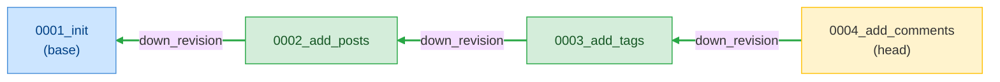
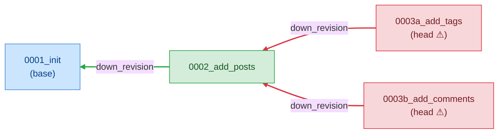

# F13 — Alembic Support

> **Status:** Approved
>
> **Version:** 0.2   ·   **Last updated:** 2026-06-18
>
> **Purpose:** The Alembic half of the server — it reads migration files into facts, diagnoses a broken or forked migration history, completes and signs `op.*` calls, and jumps from a migration's table or column reference to the model it touches.
>
> **Depends on:** [constitution](../constitution.md), [E07-data-model](../foundations/E07-data-model.md), [E30-extraction-and-indexing](../foundations/E30-extraction-and-indexing.md)   ·   **Related:** [F01-orm-correctness-diagnostics](F01-orm-correctness-diagnostics.md), [F02-best-practice-lints](F02-best-practice-lints.md), [F03-completions](F03-completions.md), [F05-go-to-definition](F05-go-to-definition.md), [F09-signature-help](F09-signature-help.md)

> Requirement tag: **ALM**

---

## 1. Purpose & Scope

A SQLAlchemy project's migrations are as easy to break as its models, and the breakage is quieter — a forked history or a dangling `down_revision` doesn't surface until someone runs `alembic upgrade head` and it fails. This spec gives the server eyes on the migration directory: it links the revision chain, flags the three ways that chain goes wrong, and brings the same completion, signature, and navigation help to `op.*` calls that the model features bring to `mapped_column(...)`.

Everything here is cross-cutting. It consumes the extraction and index facts the foundations already define and the navigation, completion, and signature machinery the model features already own — Alembic is a second consumer of the same engine, not a new one.

This spec covers:

- **Migration extraction** — how `revision`, `down_revision`, and `op.*` calls become the facts the rest of this spec reads (consuming [E30](../foundations/E30-extraction-and-indexing.md) + [E07](../foundations/E07-data-model.md)).
- **Four diagnostics** — `SQLA-W701` broken-migration-chain, `SQLA-W702` multiple-heads, `SQLA-H703` unknown-migration-table, and `SQLA-W704` null-constraint-name.
- **`op.*` completions and signature help** — the Alembic slice of [F03](F03-completions.md) and [F09](F09-signature-help.md).
- **Go-to-definition** — from a migration's table or column reference to the model that defines it ([F05](F05-go-to-definition.md)).

## 2. Non-Goals / Out of Scope

- **The ORM correctness codes (`SQLA-1xx`–`4xx`)** — owned by [F01](F01-orm-correctness-diagnostics.md); this spec owns only the `7xx` Alembic class.
- **The best-practice lints (`SQLA-5xx`/`6xx`)** — owned by [F02](F02-best-practice-lints.md).
- **The extraction mechanics themselves** — the tree-sitter walk and indicators are [E30](../foundations/E30-extraction-and-indexing.md)'s ([REQ-EXTRACT-10](../foundations/E30-extraction-and-indexing.md#510-alembic-extraction)); this spec specifies what the Alembic facts *mean*, not how they are pulled from source.
- **The fact shapes** — `MigrationFile`, `OpCall`, `DownRevision` are defined in [E07](../foundations/E07-data-model.md); reproduced here only for reference.
- **Migration autogeneration and schema-drift detection** — deliberate Non-Goals of the whole product (see the [index](../index.md)'s Out-of-scope note and [ADR-004](../decisions/ADR-004-exclude-rawsql-and-drift.md)).
- **Generic Python in a migration file** — ordinary imports and helper functions belong to the user's Python LSP (P5); we fire only inside Alembic constructs.

## 3. Background & Rationale

Alembic tracks database schema versions as a linked list of revision files. Each file under `migrations/versions/` declares its own `revision` id and points at its parent with `down_revision`. Walk those pointers and you get the project's history; the one file no other file points back to is the **head**, the version the database should be at.

Two things go wrong often enough to be worth catching. First, a `down_revision` can name a revision that no longer exists — a deleted or renamed migration leaves a dangling pointer and `alembic` refuses to run. Second, two branches can both descend from the same parent without being merged, producing **multiple heads** — Alembic can't decide which to apply. Both are invisible in a single open file; both are obvious once the whole `revision_index` is in view. That is exactly what the server already builds.

The third diagnostic is softer. An `op.*` call names a table by string (`op.add_column("postz", …)`); if no indexed model owns that table, the name is probably a typo. We flag it as a *hint*, not an error, because a migration legitimately touches tables that have no model — a pure-SQL join table, a table from another app — and P4 forbids us from crying wolf.

The non-diagnostic features are the model features pointed at a new construct. `op.create_table` takes the same kind of arguments `mapped_column` does; an `op.add_column("users", …)` names a table the index already knows. So completions, signature help, and go-to-definition reuse the existing engine — this spec just declares the Alembic trigger sites.

## 4. Concepts & Definitions

- **Migration** — a file under `migrations/versions/` with `revision`, `down_revision`, and `upgrade()`/`downgrade()` bodies. (Canonical definition in [glossary](../glossary.md).)
- **Revision** — the unique id of a migration. (Canonical definition in [glossary](../glossary.md).)
- **`down_revision`** — the parent revision, or a tuple of parents for a merge. (Canonical definition in [glossary](../glossary.md).)
- **Head** — a revision no other migration names as its `down_revision`. A healthy history has exactly one. (Canonical definition in [glossary](../glossary.md).)
- **`op.*`** — the Alembic operations API (`op.add_column`, `op.create_table`, …). (Canonical definition in [glossary](../glossary.md).)
- **Migration chain** — the directed graph formed by following every `down_revision` pointer; a healthy chain is a single line ending in one head.

## 5. Detailed Specification

### 5.1 Migration extraction (consuming E30 + E07)

The Alembic features all read one fact per file — the `MigrationFile` — and two index maps. This subsection says what those facts are and how they reach the index; the mechanics live in [E30](../foundations/E30-extraction-and-indexing.md), the shapes in [E07](../foundations/E07-data-model.md).

**REQ-ALM-01 — Every migration file is extracted into a `MigrationFile` and indexed by revision.**

A file that passes the Alembic indicator ([E30 REQ-EXTRACT-03](../foundations/E30-extraction-and-indexing.md#52-detection-indicators)) is walked into a `MigrationFile`: its `revision`, its `down_revision` (a single parent, a tuple of parents, or `None` for a base), and the `op.*` calls inside `upgrade()`/`downgrade()`. The fact is stored in `migration_files[uri]`, and when it carries a `revision`, that id is keyed into `revision_index` → the file's URI ([E07 REQ-DATA-08](../foundations/E07-data-model.md), [REQ-EXTRACT-10](../foundations/E30-extraction-and-indexing.md#510-alembic-extraction)).

The shape, reproduced from [E07](../foundations/E07-data-model.md) for reference — `DownRevision` is an enum, not an `Option`, because a merge migration has several parents:

```rust
// src/alembic/mod.rs — owned by E07; see REQ-DATA-08
pub struct MigrationFile {
    pub revision: Option<String>,
    pub down_revision: DownRevision,
    pub revision_range: Option<Range>,
    pub down_revision_range: Option<Range>,
    pub op_calls: Vec<OpCall>,
}

pub enum DownRevision { None, Single(String), Multiple(Vec<String>) }
```

**REQ-ALM-02 — Each `op.*` call carries the table and column it names.**

For navigation and the unknown-table check to work, each operation keeps the references it points at. An `OpCall` records the operation name (`"add_column"`, `"create_table"`, …), the call's range, and the optional table and column — read positionally per operation, the way the legacy extractor did: `op.create_table("posts", …)` names a table; `op.drop_column("posts", "title")` names both; `op.add_column("posts", sa.Column("body", …))` reads the column out of the nested `Column(...)`.

```rust
// src/alembic/mod.rs — owned by E07; see REQ-DATA-09
pub struct OpCall {
    pub operation: String,
    pub full_range: Range,
    pub table_name: Option<TableRef>,
    pub column_name: Option<ColumnRef>,
}
```

A file can be both a model module and a migration; the two extractors run independently and neither suppresses the other ([E30 REQ-EXTRACT-03](../foundations/E30-extraction-and-indexing.md#52-detection-indicators)).

### 5.2 The Alembic diagnostics (`SQLA-7xx`)

Four rules read the migration facts. They follow the same six-part shape as the ORM rules ([F01 §5.0](F01-orm-correctness-diagnostics.md)) — code, trigger, message, range, example, detectability — and obey the same severity, suppression, and parity rules ([F01 §5.5](F01-orm-correctness-diagnostics.md), [§5.6](F01-orm-correctness-diagnostics.md)). All carry `source: "sqlalchemy-lsp"` and the `SQLA-` code in `Diagnostic.code`. The catalog is authoritative in the constitution ([§4.2](../constitution.md#42-naming--id-schemes)); this is the `7xx` slice.

**REQ-ALM-03 — `SQLA-W701` broken-migration-chain (warning).**

A `down_revision` must name a revision that exists. This fires when a parent id is in no file's `revision` — a deleted or renamed migration left a dangling pointer, and `alembic upgrade` will refuse to run.

- **Triggers when** a `DownRevision::Single(rev)` or any entry of `DownRevision::Multiple(revs)` is absent from `revision_index`. One finding per missing parent.
- **Message:** `` down_revision `{rev}` not found in migration chain ``
- **Range:** the `down_revision` literal (`down_revision_range`).
- **Example:** the [broken-migration-chain](../foundations/E17-testing.md#broken-migration-chain) fixture — `clean-blog`'s second migration with its `down_revision` typo'd.

```python
# migrations/versions/0002_add_posts.py
revision = "0002_add_posts"
down_revision = "0001_init_uzers"   # ← SQLA-W701: no revision `0001_init_uzers`
```

- **Detectability:** exact and cross-file. `revision_index` holds every known revision, so a name in *neither* the index nor this file is genuinely missing. A `down_revision = None` is a base migration and never fires. When the chain is still loading (the workspace scan is mid-flight), the rule runs only after pass 2 settles, so a not-yet-indexed sibling never false-positives.

**REQ-ALM-04 — `SQLA-W702` multiple-heads (warning).**

A healthy history ends in exactly one head. This fires when two or more revisions are named by no `down_revision` — the history has forked and Alembic can't pick a version to upgrade to.

- **Triggers when** more than one revision in `revision_index` is absent from the set of all `down_revision` parents, *and* this file's own `revision` is one of those heads.
- **Message:** `` Multiple head revisions detected: {head_a}, {head_b} ``
- **Range:** this file's `revision` literal (`revision_range`).
- **Example:** the [multiple-heads](../foundations/E17-testing.md#multiple-heads) fixture — two migrations both naming `0002_add_posts` as their `down_revision`.

```python
# migrations/versions/0003a_add_tags.py
revision = "0003a_add_tags"      # ← SQLA-W702: also a head: 0003b_add_comments
down_revision = "0002_add_posts"
```

- **Detectability:** workspace-wide and exact. The head set is computed across every `migration_files` entry, so the count is real. We report on *each* head file so the user sees the fork from either branch; the fix is an Alembic merge migration, not something we auto-apply (P4 — there's no single correct merge).

**REQ-ALM-05 — `SQLA-H703` unknown-migration-table (hint).**

An `op.*` call that names a table no indexed model owns is *probably* a typo — but only probably, so this is a hint. It points at the table string, never the whole call.

- **Triggers when** an `OpCall` has a `table_name` whose `name` is absent from `table_index`. The `create_table` operation is skipped — it's *creating* the table, so the absence is expected.
- **Message:** `` Table `{table}` not found in indexed models ``
- **Range:** the table-string reference (`TableRef.range`).
- **Example:** the [unknown-migration-table](../foundations/E17-testing.md#unknown-migration-table) fixture — `op.add_column("postz", …)` against a `posts` table.

```python
# migrations/versions/0004_add_body.py
def upgrade():
    op.add_column("postz", sa.Column("body", sa.Text()))  # ← SQLA-H703: no model owns `postz`
```

- **Detectability:** a hint by design (P4). A migration legitimately touches tables with no model — a bare association table, a table owned by another service, a view. So we never escalate past a hint, we skip `create_table`, and a project that intentionally migrates model-less tables can silence the rule wholesale ([E15](../foundations/E15-app-config.md)) or per line with `# noqa: SQLA-H703`.

**REQ-ALM-11 — `SQLA-W704` null-constraint-name (warning).**

A constraint operation should name the constraint it touches. This fires when an `op.*` call that takes a constraint name passes `None` (or omits it) — the way Alembic's autogenerate writes a constraint it couldn't name. An unnamed constraint can't be reliably targeted later, and the name a database invents for it differs across backends, so the migration stops being reproducible.

This is the migration-time counterpart of the model-side constraint-naming hints, `SQLA-H106` and `SQLA-H107` ([F02](F02-best-practice-lints.md)). Those push you toward explicit names or a `naming_convention` on the model; this one catches the same gap once it has leaked into a migration script.

- **Triggers when** an `OpCall` whose operation names a constraint — `drop_constraint`, `create_foreign_key`, `create_unique_constraint`, `create_check_constraint` — has its constraint-name argument set to the `None` literal or absent. That argument is the first positional for each of these operations.
- **Message:** `` op.{operation} uses None as the constraint name; name the constraint explicitly (or rely on a configured naming_convention) so the migration is reproducible and targetable ``
- **Range:** the `None` literal when present; otherwise the `op.*` call itself.
- **Example:** the [null-constraint-name](../foundations/E17-testing.md#null-constraint-name) fixture — an autogenerated `op.drop_constraint(None, …)`.

```python
# migrations/versions/0005_drop_fk.py
def upgrade():
    op.drop_constraint(None, "posts", type_="foreignkey")  # ← SQLA-W704: name the constraint
```

- **Detectability:** medium. We read the constraint-name argument off the extracted `OpCall` and fire only when it is the `None` literal or missing. A non-literal the tree can't resolve — a variable, a call, an f-string — leaves the name unknowable, so we stay silent rather than guess (P4). There is no quick-fix: the right name is a project decision (the existing constraint's real name, or one derived from a `naming_convention`), and inventing one risks renaming the wrong constraint, so we surface the warning and leave the fix to you.

### 5.3 `op.*` completions (the Alembic slice of F03)

Inside a migration, typing `op.` should offer the operations API, and inside an `op.*` call the server should complete the table and column names it already knows. This is [F03](F03-completions.md)'s engine fired at Alembic sites.

**REQ-ALM-06 — `op.` completes the Alembic operations API.**

When the cursor follows `op.` in a migration file, the server returns the `op.*` operations as completion items — `add_column`, `drop_column`, `create_table`, `create_index`, `alter_column`, and the rest — each with a snippet body and a one-line doc. The `"."` trigger character drives this ([F03](F03-completions.md)). This fires only in an Alembic-candidate file (P5) — `op.` in an ordinary module gets nothing from us.

**REQ-ALM-07 — Table and column arguments complete against the index.**

Inside an `op.*` call, the first string argument completes against `table_index` (every indexed table name), and — once a table is chosen — a column argument completes against that table's model columns. So `op.add_column("posts", …)` then offers `posts`' columns, and `op.drop_column("users", "…")` offers `users`' columns. The resolution path is the same `table_index → model_index → columns` join the model features use ([E07 REQ-DATA-10](../foundations/E07-data-model.md)); this spec only declares the trigger site.

### 5.4 `op.*` signature help (the Alembic slice of F09)

While the cursor sits inside an `op.*` argument list, the server shows the operation's signature with the active parameter highlighted — the Alembic case of [F09](F09-signature-help.md).

**REQ-ALM-08 — `op.*` calls get signature help with active-parameter highlighting.**

When the cursor is inside the parentheses of a recognized `op.*` call, the server returns a `SignatureHelp` describing that operation's parameters (`op.add_column(table_name, column, *, schema=None)`, and so on) and highlights the parameter the cursor is on. The signatures are a static table of the common operations, paired with the [REQ-ALM-06](#53-op-completions-the-alembic-slice-of-f03) completion set so a user gets the snippet and then the live signature. Like every non-diagnostic feature, it fires only in Alembic contexts (P5).

### 5.5 Go-to-definition: migration → model (the Alembic slice of F05)

The payoff of indexing both halves is navigation between them. Go-to-definition on a table or column inside a migration jumps to the model that defines it — [F05](F05-go-to-definition.md)'s resolver pointed at an `OpCall`.

**REQ-ALM-09 — A table reference in an `op.*` call resolves to its model's class.**

Invoke go-to-definition on the table string in an `op.*` call and the server resolves it through `table_index["posts"] → "Post"` and `model_index["Post"]` to the model's class-name range, then returns that `Location` ([E07 REQ-DATA-10](../foundations/E07-data-model.md)). Jumping from `op.add_column("posts", …)` lands on `class Post` in `models/post.py`.

**REQ-ALM-10 — A column reference in an `op.*` call resolves to its column's attribute.**

When the operation also names a column (`op.drop_column("posts", "title")`), go-to-definition on the column string resolves the table to its model, then looks up the column by name in that model and returns the column's `name_range`. The jump lands on `title:` in `Post`. When the table resolves but the named column isn't on the model, navigation stays silent (P4) — the unknown-table hint, not a definition jump, is the right signal.

> **Note:** All five non-diagnostic behaviors (REQ-ALM-06..10) are *consumers* of the model features. They add Alembic trigger sites and reuse the existing completion, signature, and definition engines — they introduce no second engine. When a target can't be resolved, every one of them returns nothing rather than guessing (P4).

## 7. Visualizations

The migration chain is a graph, and the two chain diagnostics are facts about its shape. The first diagram shows `clean-blog`'s healthy history — a single line ending in one head. The second shows the [multiple-heads](../foundations/E17-testing.md#multiple-heads) fixture, where the history forks after `0002` and `SQLA-W702` fires on both tips.

A healthy chain — every node points back to its parent, exactly one node is a head:



A forked chain — two revisions both descend from `0002` and neither is merged, so both are heads and each fires `SQLA-W702`:



The catalog of the four rules, for quick scanning:

| Code | Default | Slug | Reads | Range |
|---|---|---|---|---|
| `SQLA-W701` | warning | broken-migration-chain | `down_revision` + `revision_index` | the `down_revision` literal |
| `SQLA-W702` | warning | multiple-heads | head set across `migration_files` | the `revision` literal |
| `SQLA-H703` | hint | unknown-migration-table | `OpCall.table_name` + `table_index` | the table string |
| `SQLA-W704` | warning | null-constraint-name | `OpCall` constraint-name arg | the `None` literal (or the call) |

## 8. Data Shapes

The four diagnostics are ordinary LSP `Diagnostic`s, identical in shape to the ORM findings ([F01 §8](F01-orm-correctness-diagnostics.md)): the `SQLA-` code in `code`, `source: "sqlalchemy-lsp"`, and the resolved severity integer (1 error · 2 warning · 3 info · 4 hint). This is the `SQLA-W701` finding from the [broken-migration-chain](../foundations/E17-testing.md#broken-migration-chain) fixture, on the wire:

```json
{
  "code": "SQLA-W701",
  "source": "sqlalchemy-lsp",
  "severity": 2,
  "message": "down_revision `0001_init_uzers` not found in migration chain",
  "range": { "start": { "line": 1, "character": 16 }, "end": { "line": 1, "character": 35 } }
}
```

Go-to-definition returns a standard `Location` — the URI of the model file and the model's class-name range — exactly as [F05](F05-go-to-definition.md) returns for an FK string. Completion and signature payloads are [F03](F03-completions.md)'s and [F09](F09-signature-help.md)'s shapes, unchanged.

## 9. Examples & Use Cases

Walk the `clean-blog` migration directory. Four files form one clean line: `0001_init` (`down_revision = None`), `0002_add_posts`, `0003_add_tags`, `0004_add_comments`. Each `revision` is keyed into `revision_index`; the head set is `{0004_add_comments}` — size one, so `SQLA-W702` is silent. Every `down_revision` resolves, so `SQLA-W701` is silent. The migrations only touch `users`, `posts`, `tags`, `comments` — all indexed — so `SQLA-H703` is silent. The clean baseline yields zero Alembic findings.

Now you delete `0001_init.py` while keeping `0002`. On the next re-index, `revision_index` loses `0001_init`, and `0002`'s `down_revision = "0001_init"` resolves to nothing — `SQLA-W701` fires on `0002`'s `down_revision` literal (REQ-ALM-03). You open `0002`, hover help isn't enough, so you invoke go-to-definition on `op.add_column("posts", …)` and land on `class Post` (REQ-ALM-09). You start a new operation: typing `op.` offers `create_index`, `alter_column`, … (REQ-ALM-06); you pick `op.add_column`, the signature popover shows `(table_name, column, …)` with the first parameter active (REQ-ALM-08); typing the table string offers `posts`, `users`, … from the index (REQ-ALM-07).

## 10. Edge Cases & Failure Modes

- A base migration (`down_revision = None`) → never fires `SQLA-W701`; a chain root is correct, not broken.
- A merge migration (`down_revision = (a, b)`) → each parent is checked independently for `SQLA-W701`; a merge with two valid parents is the *fix* for multiple heads, not a finding.
- A single legitimate head → `SQLA-W702` silent; the rule fires only at count ≥ 2.
- `op.create_table("new_table", …)` against an unindexed table → no `SQLA-H703`; the operation creates the table, so its absence is expected (REQ-ALM-05).
- An `op.*` call against a model-less table the project owns on purpose → `SQLA-H703` fires as a hint; silence it via config or `# noqa: SQLA-H703` (P4 keeps it a hint, never an error).
- `op.drop_constraint(None, …)` or `op.create_foreign_key(None, …)` → `SQLA-W704` fires on the `None` literal; autogenerate emitted it because it couldn't name the constraint (REQ-ALM-11).
- A constraint op whose name argument is a variable or call we can't resolve → no `SQLA-W704`; an unknowable name isn't a missing one, so we stay silent (P4).
- A constraint op with an explicit string name (`op.drop_constraint("uq_posts_slug", …)`) → `SQLA-W704` silent; the migration is already reproducible.
- A migration with no `revision` (half-typed) → it contributes nothing to `revision_index`; chain diagnostics treat it as unlinkable and stay silent (P4, [E07](../foundations/E07-data-model.md)).
- A migration file with `ERROR` nodes mid-edit → the well-formed assignments and `op.*` calls extract; the broken statement is skipped; no crash (P3).
- Go-to-definition on a table whose model lives in a not-yet-indexed file → returns nothing until the scan settles; never a phantom location (P4).
- `op.` typed in an ordinary Python module (no Alembic indicator) → no completions from us; the Python LSP owns that position (P5).

## 11. Testing

Every Alembic rule is unit-tested on a minimal migration snippet, every chain rule on a multi-file revision fixture, and the whole feature on the `clean-blog` migration directory for the zero-findings guarantee. The non-diagnostic behaviors are tested at their trigger sites and against a plain-Python negative. Categories, tools, and fixtures defer to [E17-testing](../foundations/E17-testing.md); this section maps every `REQ-ALM-NN` to a test.

### 11.1 Scope & coverage

Target: **100% of this feature's behavior is covered.** Every `REQ-ALM-NN` below maps to at least one test, and every edge case (§10) has a test. The proof is the §11.4 table, not a line percentage. See the policy in [E17-testing](../foundations/E17-testing.md#2-coverage-policy).

### 11.2 Test plan

Each row is a behavior under test. The chain rules use multi-file fixtures so the cross-file head computation is real; the navigation rows assert a resolved `Location`.

| Behavior / scenario | Type | Fixtures | Verifies |
|---|---|---|---|
| A migration file extracts to a `MigrationFile` and keys its revision into `revision_index` | unit | [clean-blog](../foundations/E17-testing.md#clean-blog) | REQ-ALM-01 |
| `op.*` calls carry their positional table/column (incl. nested `Column(...)`) | unit | [clean-blog](../foundations/E17-testing.md#clean-blog) | REQ-ALM-02 |
| A dangling `down_revision` → `SQLA-W701` on the `down_revision` literal | integration | [broken-migration-chain](../foundations/E17-testing.md#broken-migration-chain) | REQ-ALM-03 |
| Two unmerged heads → `SQLA-W702` on each head's `revision` literal | integration | [multiple-heads](../foundations/E17-testing.md#multiple-heads) | REQ-ALM-04 |
| An `op.*` table no model owns → `SQLA-H703`; `create_table` skipped | unit | [unknown-migration-table](../foundations/E17-testing.md#unknown-migration-table) | REQ-ALM-05 |
| A constraint op with a `None`/absent name → `SQLA-W704`; an explicit string is silent | unit | [null-constraint-name](../foundations/E17-testing.md#null-constraint-name) | REQ-ALM-11 |
| Clean migration directory → zero Alembic findings | integration | [clean-blog](../foundations/E17-testing.md#clean-blog) | REQ-ALM-03, 04, 05 |
| `op.` offers the operations API; nothing in a non-Alembic file | unit | [clean-blog](../foundations/E17-testing.md#clean-blog) | REQ-ALM-06 |
| First string arg completes tables; a later arg completes that table's columns | unit | [clean-blog](../foundations/E17-testing.md#clean-blog) | REQ-ALM-07 |
| `op.*` call → signature help with the active parameter highlighted | unit | [clean-blog](../foundations/E17-testing.md#clean-blog) | REQ-ALM-08 |
| Definition on an `op.*` table string → the model's class range | integration | [clean-blog](../foundations/E17-testing.md#clean-blog) | REQ-ALM-09 |
| Definition on an `op.*` column string → the column's attribute range; unresolved → null | integration | [clean-blog](../foundations/E17-testing.md#clean-blog) | REQ-ALM-10 |
| A base migration / valid merge → no `SQLA-W701`/`W702` | unit | [clean-blog](../foundations/E17-testing.md#clean-blog) | §10 |
| A migration with `ERROR` nodes → partial facts, no crash | unit | [broken-migration-chain](../foundations/E17-testing.md#broken-migration-chain) | §10 |

### 11.3 Fixtures

The named fixtures live in the [E17 registry](../foundations/E17-testing.md#5-fixtures-registry) — reuse them, don't restate them. The [broken-migration-chain](../foundations/E17-testing.md#broken-migration-chain) and [multiple-heads](../foundations/E17-testing.md#multiple-heads) variants are minimal `clean-blog` mutations of its Alembic chain; [unknown-migration-table](../foundations/E17-testing.md#unknown-migration-table) typo's a table in one `op.*` call; [null-constraint-name](../foundations/E17-testing.md#null-constraint-name) passes `None` as a constraint name in one. The clean-baseline rows reuse the [clean-blog](../foundations/E17-testing.md#clean-blog) migration directory. F13 owns no feature-local fixtures.

### 11.4 Requirement coverage

Every load-bearing requirement maps to a test — this table is the proof.

| Requirement | Covered by |
|---|---|
| REQ-ALM-01 | `req_alm_01_migration_extracts_and_indexes_revision` |
| REQ-ALM-02 | `req_alm_02_opcall_carries_table_and_column` |
| REQ-ALM-03 | `req_alm_03_broken_chain_fires_w701` |
| REQ-ALM-04 | `req_alm_04_multiple_heads_fire_w702` |
| REQ-ALM-05 | `req_alm_05_unknown_table_fires_h703_skips_create_table` |
| REQ-ALM-11 | `req_alm_11_null_constraint_name_fires_w704`, `req_alm_11_named_constraint_is_silent` |
| REQ-ALM-06 | `req_alm_06_op_dot_completes_operations`, `req_alm_06_no_completion_outside_alembic` |
| REQ-ALM-07 | `req_alm_07_table_and_column_args_complete_from_index` |
| REQ-ALM-08 | `req_alm_08_op_signature_help_highlights_active_param` |
| REQ-ALM-09 | `req_alm_09_table_ref_jumps_to_model` |
| REQ-ALM-10 | `req_alm_10_column_ref_jumps_to_attribute`, `req_alm_10_unresolved_column_is_silent` |

## 12. End-to-End Test Plan

The journeys that prove the Alembic features over the real binary: the clean chain is quiet, each broken fixture surfaces its exact code and range, `op.` completes, and a migration jumps to its model. These drive the built server over stdio per [E29](../foundations/E29-e2e-testing.md), inheriting the shared protocol-conformance set.

### 12.1 Coverage target

**100% of the feature's scope, end to end** — the happy path (clean chain, working completions/navigation) plus every error path (broken chain, forked heads, unknown table, unresolved jump). See the policy in [E29 §2](../foundations/E29-e2e-testing.md#2-coverage-policy).

### 12.2 Scenarios

Each scenario opens the relevant fixture workspace against the built server and asserts a concrete outcome — a published code at a range, a completion set, or a resolved location.

| # | Journey | Path | Expected outcome |
|---|---|---|---|
| E2E-01 | Open the `clean-blog` migration directory | happy | Zero Alembic diagnostics published across all migration files. |
| E2E-02 | Open the broken-chain fixture | error | `SQLA-W701` published on the `down_revision` literal of the orphaned migration. |
| E2E-03 | Open the multiple-heads fixture | error | `SQLA-W702` published on the `revision` literal of *each* head file. |
| E2E-04 | Open the unknown-table fixture | error | `SQLA-H703` published (hint severity) on the table string; no finding on a `create_table`. |
| E2E-05 | Open the null-constraint-name fixture | error | `SQLA-W704` published on the `None` literal of the constraint op. |
| E2E-06 | Fix the broken chain (rename `down_revision` back), save | happy | On re-index, the `SQLA-W701` diagnostic clears without reopening. |
| E2E-07 | Request completion after `op.` in a migration | happy | The `op.*` operations are offered; the same position in a non-migration file offers none. |
| E2E-08 | Request completion at an `op.*` table argument | happy | Indexed table names are offered; after a table, that table's columns are offered. |
| E2E-09 | Request signature help inside an `op.add_column(…)` call | happy | A `SignatureHelp` returns with the active parameter highlighted. |
| E2E-10 | Go-to-definition on an `op.*` table string | happy | Resolves to the owning model's class range in its file. |
| E2E-11 | Go-to-definition on an `op.*` column string | happy | Resolves to the column's attribute range; an unresolved column returns null. |

### 12.3 Acceptance criteria & Definition of Done

The §12.2 scenarios, written Given/When/Then, are this feature's acceptance criteria:

| # | Given | When | Then |
|---|---|---|---|
| AC-01 | The clean-blog migration directory | the server indexes it | no Alembic diagnostics are published. |
| AC-02 | A migration whose `down_revision` names no existing revision | the server indexes the directory | `SQLA-W701` is published on the `down_revision` literal. |
| AC-03 | Two migrations forming unmerged heads | the server indexes the directory | `SQLA-W702` is published on each head's `revision` literal. |
| AC-04 | An `op.*` call naming a table no model owns | the server indexes the file | `SQLA-H703` (hint) is published on the table string; a `create_table` is exempt. |
| AC-05 | A constraint op passing `None` as the constraint name | the server indexes the file | `SQLA-W704` is published on the `None` literal. |
| AC-06 | A broken chain on disk | the user restores the `down_revision` and saves | the `SQLA-W701` diagnostic clears on the next re-index. |
| AC-07 | The cursor after `op.` in a migration | the user requests completion | the Alembic operations are offered; a plain module offers none. |
| AC-08 | The cursor on an `op.*` table reference | the user invokes go-to-definition | the editor navigates to the owning model's class. |

**Definition of Done:** every `REQ-ALM-NN` has a passing test (§11.4), every acceptance scenario above passes, and every enabled non-functional concern (§13) is verified.

## 13. Non-Functional Requirements

### 13.1 Security & Privacy

- **Access & authorization** — none crossed. The Alembic features are read-only static analysis (P1) over migration files already in the workspace; they never run `alembic`, never apply a migration, and never touch a database.
- **Input & validation** — migration source is untrusted-but-local, parsed by tree-sitter and never evaluated (P1). Revision ids and table strings are read as literals; a hostile revision id can do nothing but fail to resolve and stay silent (P4).
- **Data sensitivity** — no PII, secrets, or network calls. Findings carry only codes, ranges, and the revision/table names already in the source; navigation returns only file URIs and ranges within the workspace.
- **Baseline** — inherits the suite-wide posture (constitution §13.1): local files only, no code execution, no telemetry; logs go to stderr/`log_file`, never stdout.

## 15. Open Questions & Decisions

- **Decision** — The first three `7xx` rules ship as `SQLA-W701`/`W702`/`H703`, ported from the legacy server's `broken-migration-chain`/`multiple-heads`/`unknown-migration-table` with the constitution's `SQLA-` namespace. The unknown-table rule stays a *hint* because migrating model-less tables is legitimate (P4).
- **Decision** — `SQLA-W704` null-constraint-name ships without a quick-fix. The correct name is a project decision — the existing constraint's real name, or one derived from a `naming_convention` — so inventing one would risk targeting the wrong constraint and violate the deterministic-fix rule shared with [F11](F11-code-actions.md). We warn and leave the name to the author.
- **Decision** — `multiple-heads` reports on *each* head file, not just one, so the fork is visible from either branch.
- **OQ-ALM-1** — Should the server offer a "create merge migration" code action for `SQLA-W702`? Deferred: the merge content isn't deterministic (which head wins, what the merge body does), so it would violate the deterministic-fix rule shared with [F11](F11-code-actions.md)/the CLI `--fix`. Parked for a later milestone.
- **OQ-ALM-2** — Should `op.*` completions be data-driven from the installed Alembic version rather than a static table? Deferred; v1 ships the common-operations table, consistent with the static-analysis principle (P1 — we don't import the user's Alembic).

## 16. Cross-References

- **Depends on:** [E07-data-model](../foundations/E07-data-model.md) — the `MigrationFile`/`OpCall`/`DownRevision` shapes and the `revision_index`/`table_index` maps; [E30-extraction-and-indexing](../foundations/E30-extraction-and-indexing.md) — the migration extraction ([REQ-EXTRACT-10](../foundations/E30-extraction-and-indexing.md#510-alembic-extraction)) this spec consumes; [constitution](../constitution.md) — P1 (static only), P4 (silence on unresolvable input), P5 (companion to the Python LSP).
- **Related:** [F01-orm-correctness-diagnostics](F01-orm-correctness-diagnostics.md) — the ORM `1xx`–`4xx` codes and the rule-description and parity conventions this spec follows; [F02-best-practice-lints](F02-best-practice-lints.md) — the `5xx`/`6xx` lints; [F03-completions](F03-completions.md) — the completion engine `op.*` completions reuse; [F09-signature-help](F09-signature-help.md) — the signature engine `op.*` help reuses; [F05-go-to-definition](F05-go-to-definition.md) — the resolver migration→model navigation reuses; [F14-cli-linter](F14-cli-linter.md) — runs the `7xx` rules headlessly with everything else.
- **Testing:** [E17-testing](../foundations/E17-testing.md#5-fixtures-registry) — the [broken-migration-chain](../foundations/E17-testing.md#broken-migration-chain), [multiple-heads](../foundations/E17-testing.md#multiple-heads), and [unknown-migration-table](../foundations/E17-testing.md#unknown-migration-table) fixtures; [E29-e2e-testing](../foundations/E29-e2e-testing.md#2-coverage-policy) — the journey harness §12 drives.

## 17. Changelog

- **2026-06-18** — Approved.
- **2026-06-18** — v0.2: added `SQLA-W704` null-constraint-name (warning, on) — fires when an Alembic constraint op (`drop_constraint`, `create_foreign_key`, `create_unique_constraint`, `create_check_constraint`) passes `None` as the constraint name or omits it, the way autogenerate writes a constraint it couldn't name (REQ-ALM-11). Medium detectability — read off the `OpCall`, silent on non-literal names (P4); no quick-fix, since the name is the author's call. Framed as the migration-time counterpart of `SQLA-H106`/`SQLA-H107`. Added the `null-constraint-name` fixture link, the §11 plan/coverage rows, and the E2E scenario.
- **2026-06-17** — Initial draft. Ported the three Alembic diagnostics (`SQLA-W701` broken-migration-chain, `SQLA-W702` multiple-heads, `SQLA-H703` unknown-migration-table) from the legacy `diagnose_migration`, with the constitution's `SQLA-` namespace and the F01 rule-description shape. Specified migration extraction consuming [E30](../foundations/E30-extraction-and-indexing.md)/[E07](../foundations/E07-data-model.md), the `op.*` completion and signature-help trigger sites ([F03](F03-completions.md)/[F09](F09-signature-help.md)), and migration→model go-to-definition ([F05](F05-go-to-definition.md)). Added the healthy/forked migration-chain DAG visualizations.
