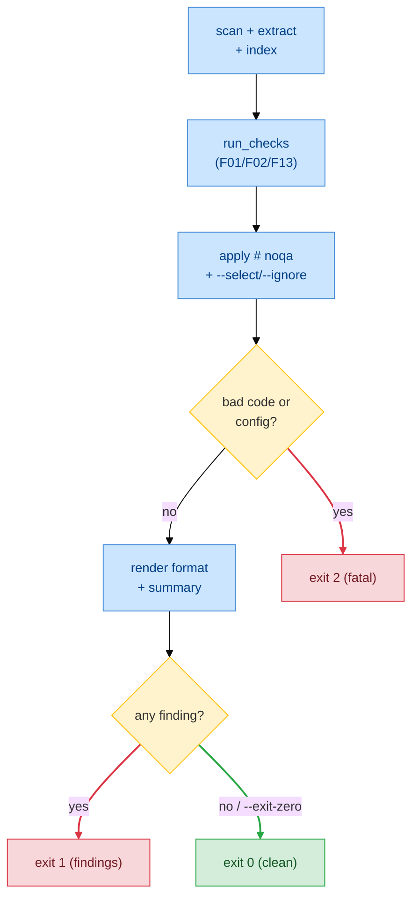

# F14 — CLI Linter

> **Status:** Draft
>
> **Version:** 0.1   ·   **Last updated:** 2026-06-17
>
> **Purpose:** The command-line surface — one binary that serves the LSP, and runs the *same* diagnostics engine headless as a CI-friendly linter with ruff/mypy-style output, plus `stats` and `schema` reporting subcommands.
>
> **Depends on:** [constitution](../constitution.md), [E07-data-model](../foundations/E07-data-model.md), [E30-extraction-and-indexing](../foundations/E30-extraction-and-indexing.md), [E15-app-config](../foundations/E15-app-config.md), [E16-conventions](../foundations/E16-conventions.md), [E17-testing](../foundations/E17-testing.md)   ·   **Related:** [F01-orm-correctness-diagnostics](F01-orm-correctness-diagnostics.md), [F02-best-practice-lints](F02-best-practice-lints.md), [F03-completions](F03-completions.md), [F05-go-to-definition](F05-go-to-definition.md), [F09-signature-help](F09-signature-help.md), [F11-code-actions](F11-code-actions.md), [F12-schema-visualization](F12-schema-visualization.md), [F13-alembic-support](F13-alembic-support.md)

> Requirement tag: **CLI**

---

## 1. Purpose & Scope

One binary, several subcommands. Your editor spawns `sqlalchemy-lsp lsp`; your CI runs `sqlalchemy-lsp check`; and you inspect a workspace with `sqlalchemy-lsp stats` and `sqlalchemy-lsp schema`. The headline is `check` — it scans the workspace once, runs every [F01](F01-orm-correctness-diagnostics.md)/[F02](F02-best-practice-lints.md)/[F13](F13-alembic-support.md) diagnostic, prints what it found in whichever shape your tooling wants, and exits with a code your pipeline can gate on.

The point of `check` is that it can't disagree with your editor. It builds the same `WorkspaceState`, runs the same two-pass pipeline, and calls the same diagnostics engine the server calls — the parity rule in [E17 REQ-TST-05](../foundations/E17-testing.md) keeps the two finding sets identical, byte-for-byte, including `--fix` edits versus editor quick-fixes ([F11](F11-code-actions.md)).

This spec covers:

- the subcommand surface — `lsp`, `check` (with `--fix`), `stats`, and `schema`;
- the `check` output contract — nine `--output-format` renderers and the ruff/mypy-style summary;
- the code filter (`--select`/`--ignore`), `# noqa` suppression, exit codes, and `--exit-zero`;
- the `stats` workspace summary and the `schema` subcommand (deferring diagram detail to [F12](F12-schema-visualization.md)).

## 2. Non-Goals / Out of Scope

- **The diagnostic catalog** — codes, severities, and firing conditions belong to [F01](F01-orm-correctness-diagnostics.md)/[F02](F02-best-practice-lints.md)/[F13](F13-alembic-support.md); `check` is a consumer.
- **Config resolution** — sources, per-key precedence, and discovery are [E15](../foundations/E15-app-config.md)'s; `check` reads the resolved config and only overrides it from flags.
- **The schema diagram itself** — the Mermaid/Graphviz/ASCII renderers and the `showSchema` execute-command are [F12](F12-schema-visualization.md)'s; this spec only declares the `schema` subcommand that drives them.
- **The fix edits** — the deterministic `WorkspaceEdit`s `--fix` applies are [F11](F11-code-actions.md)'s; this spec applies them to disk and reuses them, never reinvents them.
- **Non-deterministic fixes** — `check --fix` applies only the *deterministic* [F11](F11-code-actions.md) edits; ambiguous ones are left for a human, exactly as the editor leaves them (P4).
- **The LSP protocol conduct** — capabilities, encoding negotiation, and the pipeline are [E01](../foundations/E01-architecture.md)'s; the `lsp` subcommand only launches it.

## 3. Background & Rationale

A language server is only half the product. The other half runs in CI, in a pre-commit hook, and on a teammate's laptop who isn't using a supported editor. That's `check`: a one-shot run of the exact same analysis, printed for machines and humans instead of streamed over JSON-RPC.

The design choice that makes this safe is "one engine, two front-ends" — the constitution's fourth engineering principle. The CLI does not own a single check. It builds the same index ([E07](../foundations/E07-data-model.md)) from the same extraction ([E30](../foundations/E30-extraction-and-indexing.md)) and calls the same `run_checks`. So a finding the editor shows and a finding the CLI prints are the *same finding* — the parity test proves it. The same holds for fixes: `check --fix` writes the same `WorkspaceEdit` the editor's quick-fix applies.

The output contract mirrors ruff and mypy deliberately. A team already gating on ruff has wiring — GitHub annotations, a JUnit ingest, a pre-commit hook — that should consume our output unchanged. So the line format, the summary wording, the exit codes, and the nine renderer names all match what those integrations already expect. Familiar is correct here.

## 4. Concepts & Definitions

- **Finding** — one diagnostic result: a `SQLA-` code, a message, a file, a 1-based location, a resolved severity, and an optional fix. The CLI prints findings; the server publishes them.
- **CLI/server parity** — the rule that `check` and the editor server emit identical findings from one engine. (Canonical definition in [glossary](../glossary.md).)
- **`# noqa`** — an inline suppression comment honored identically by the CLI and the server. (Canonical definition in [glossary](../glossary.md).)
- **Output format** — one of nine renderers (§5.5); the format is a pure function of the same `Finding` set.
- **Deterministic fix** — a [F11](F11-code-actions.md) edit that is provably correct with no human choice; the only kind `--fix` applies.

## 5. Detailed Specification

### 5.1 `sqlalchemy-lsp lsp` — serve the language server

This is the subcommand your editor spawns. It runs the long-lived server over stdio — the one transport v1 ships ([ADR-005](../decisions/ADR-005-stdio-only-transport.md)).

**REQ-CLI-01 — The server subcommand speaks stdio, and the bare binary aliases it.**

`sqlalchemy-lsp lsp` serves the LSP over stdio. `--stdio` is implied when no flag is given, and the bare `sqlalchemy-lsp` with no subcommand is an alias for `sqlalchemy-lsp lsp --stdio`, because several editors' default configs assume that shape.

```text
# all three are equivalent — this is what an editor config spawns
sqlalchemy-lsp
sqlalchemy-lsp lsp
sqlalchemy-lsp lsp --stdio
```

No remote transport ships in v1 — `--tcp`/`--http` are deferred ([ADR-005](../decisions/ADR-005-stdio-only-transport.md)). The server's behavior is [E01](../foundations/E01-architecture.md)'s; this requirement only declares the entry point.

### 5.2 `sqlalchemy-lsp check` — headless diagnostics

This is the linter. It runs every diagnostic over the workspace, prints the findings, then exits with a code CI can gate on.

**REQ-CLI-02 — `check` runs the full diagnostics pipeline once and reports.**

You pass zero or more paths, each a file or directory; with no path, the current directory is the workspace. The run is exactly: scan → extract → index → every [F01](F01-orm-correctness-diagnostics.md)/[F02](F02-best-practice-lints.md)/[F13](F13-alembic-support.md) check → print → exit.

```text
# lint the whole workspace; default concise output
sqlalchemy-lsp check

# lint just two files
sqlalchemy-lsp check models/post.py migrations/versions/0002_add_posts.py
```

A path that is a single file still resolves config and links against the *enclosing* workspace (nearest `pyproject.toml`/`.git`), so cross-file checks — `SQLA-E301` unknown-FK-table, `SQLA-E102` duplicate-tablename, the `SQLA-W701`/`W702` chain rules — work. Only findings located in the given paths are printed.

**REQ-CLI-03 — `check` and the LSP server share one diagnostics engine.**

`check` constructs the same `WorkspaceState` ([E07](../foundations/E07-data-model.md)), runs the same pass 1 / pass 2, and calls the same diagnostics engine ([F01 §5.6](F01-orm-correctness-diagnostics.md)). No check exists in one mode and not the other. The parity test asserts this on the broken fixtures ([E17 REQ-TST-05](../foundations/E17-testing.md)): it compares the CLI's findings (code, file, range) against what the server publishes for the same workspace. This is the command CI and pre-commit run.

### 5.3 The code filter and suppression

You scope which checks fire. The flags mirror the config keys exactly ([E15](../foundations/E15-app-config.md)) so a `pyproject.toml` rule and a CLI flag mean the same thing.

**REQ-CLI-04 — `--select` and `--ignore` mirror the diagnostics config; the CLI overrides config.**

`--select` names the `SQLA-` codes (or `all`) to enable; `--ignore` names codes to drop, applied after `select` — identical resolution to the config, but the CLI flags win over the resolved config when both speak. An unknown code is a config error (exit 2), never a silent skip, so a typo can't quietly disable a check.

```text
# run only the FK and chain rules
sqlalchemy-lsp check --select SQLA-E301,SQLA-W303,SQLA-W701

# run everything except the two hint-heavy lints
sqlalchemy-lsp check --ignore SQLA-H205,SQLA-H703
```

Because every code carries the `SQLA-` namespace, a filter never collides with a co-resident ruff/flake8 code. Codes are parsed against the diagnostics catalog — the single source of valid spellings, shared by config and CLI.

**REQ-CLI-05 — `check` honors `# noqa` suppressions headlessly.**

The CLI honors the same inline suppressions the server does ([E15](../foundations/E15-app-config.md)): `# noqa: SQLA-W303` silences one code on a line, bare `# noqa` silences every finding on the line, and `# noqa: file` silences the whole file. A suppression that matched nothing is itself reported as `SQLA-W901` unused-noqa, so dead ignores get cleaned up in CI just as in the editor. The `SQLA-` namespace means `# noqa: SQLA-W303` never touches a flake8/ruff `# noqa: E501` on the same line.

### 5.4 `sqlalchemy-lsp check --fix` — apply the deterministic fixes

`--fix` turns the linter into a fixer: it runs the checks, applies the safe edits to disk, and re-reports what remains.

**REQ-CLI-06 — `--fix` applies the deterministic F11 edits to disk, byte-identical to the editor.**

`check --fix` runs the normal pass, then applies each finding's paired [F11](F11-code-actions.md) edit that is *deterministic* — provably correct with no human choice (P4): `backref`→`back_populates`, `declarative_base()`→`DeclarativeBase`, add `timezone=True`, wrap a mutable default in a callable, add `Optional[...]`, add `Mapped[...]`, generate a `__tablename__`. Ambiguous fixes are skipped and still reported. The edits the CLI writes are byte-identical to the editor's quick-fix edits — both come from the one [F11](F11-code-actions.md) action layer ([E17 REQ-TST-05](../foundations/E17-testing.md) extends parity to `--fix`). After fixing, the summary appends `Fixed K problems; R remaining.` (§5.6).

### 5.5 The `check` output contract

You pick an output shape with `--output-format`; the default is `concise`. The shapes match ruff's so existing pipeline integrations work unchanged. The exact rendered layout of the human-facing shapes is the §6 mockup contract.

**REQ-CLI-07 — `--output-format` selects one of nine renderers.**

| Format | Shape | Best for |
|---|---|---|
| `concise` | One line per finding: `path:line:col: CODE message` | The terminal, quick scans (default) |
| `full` | A source-snippet block per finding, with caret underline, `help:` and `note:` lines | Reading a finding in context |
| `json` | A pretty-printed JSON array of finding objects | Scripts, dashboards |
| `json-lines` | NDJSON — one finding object per line | Streaming, large result sets |
| `grouped` | Findings grouped under a per-file header, indented | Reading many findings across files |
| `github` | GitHub Actions workflow annotations | GitHub CI |
| `gitlab` | GitLab Code Quality report JSON | GitLab CI merge-request widgets |
| `junit` | JUnit XML — each finding a `<testcase>` failure | Generic CI test-report ingestion |
| `pylint` | One line per finding: `path:line: [CODE] message` | Pylint-compatible tooling |

`concise`, `full`, `grouped`, and `pylint` are human-facing; `json`, `json-lines`, `github`, `gitlab`, and `junit` are machine-facing. All nine are computed from the same `Finding` set — the format is purely a renderer.

**REQ-CLI-08 — The concise line format is exact.**

A `concise` line is `` `<rel-path>:<line>:<col>: <CODE> <message>` `` — the path relative to the workspace root, 1-based line and column, the `SQLA-` code, then the *human* message (the message text, not the slug). One line per finding, grep-friendly:

```text
models/post.py:14:5: SQLA-W303 FK type mismatch: `author_id` is Mapped[str] but `users.id` is Integer
```

**REQ-CLI-09 — The summary line follows ruff/mypy wording.**

After the findings, `check` prints a summary. When the run is clean:

```text
All checks passed! (checked 42 files)
```

When findings printed, an optional fixable-hint line (only when at least one finding is fixable), then the count line — zero-count severity categories omitted:

```text
[*] 2 fixable with the `--fix` option.
Found 4 problems (3 warnings, 1 info) in 3 files (checked 42 files).
```

The categories are `errors`, `warnings`, `info`, `hints`, in that order, each shown only when its count is non-zero. After `--fix`, the count line is followed by the fix result:

```text
Fixed 2 problems; 2 remaining.
```

The summary is omitted entirely for the machine formats (`json`, `json-lines`, `github`, `gitlab`, `junit`). Per the constitution's content rule, the result is carried in *words*, never by color alone ([constitution §6](../constitution.md#6-visualization-style-guide)). Color follows severity on a TTY only and is suppressed when `NO_COLOR` is set or the format is a machine one.

**REQ-CLI-10 — Exit codes gate the build.**

| Exit | Meaning |
|---|---|
| `0` | Clean — no findings (or `--exit-zero` forced it) |
| `1` | One or more findings present |
| `2` | Fatal — usage error, unknown code in a filter, or unreadable config |

Exit `1` fires on *any* finding regardless of severity — a hint counts, matching ruff. Scope with `--select`/`--ignore` rather than relying on severity to gate. `--exit-zero` forces exit `0` even with findings, for a reporting run that must not break the pipeline. Exit `2` is reserved for the CLI itself failing, never for findings.

### 5.6 `sqlalchemy-lsp stats` — workspace summary

`stats` answers "what's in this workspace?" without opening a file — the headless twin of a project overview.

**REQ-CLI-11 — `stats` reports the workspace summary read from the index.**

`sqlalchemy-lsp stats` scans and indexes the workspace, then prints a summary read straight from the index ([E07](../foundations/E07-data-model.md)): the count of models, columns, relationships, and foreign keys; the number of migration heads; and finding counts grouped by `SQLA-` code. It runs the same pass the linter runs, so the finding counts match a `check` run exactly. `--output-format json` emits the same numbers for a dashboard. The cost is near zero — the index already holds every number.

### 5.7 `sqlalchemy-lsp schema` — schema diagram

`schema` prints the workspace's ER diagram to stdout or a file — the headless twin of the `showSchema` execute-command.

**REQ-CLI-12 — `schema` emits the diagram in the format F12 defines.**

`sqlalchemy-lsp schema` builds the model graph and renders it via [F12](F12-schema-visualization.md): `--format mermaid` (default), `--format graphviz` (DOT), or `--format ascii`, with `--output FILE` to write to a path instead of stdout. The diagram content — what nodes, edges, PK/FK markers, and relationship cardinalities appear — is wholly [F12](F12-schema-visualization.md)'s; this subcommand only wires the renderer to the CLI and the `--output` path. When `--output` names a file, the CLI writes only that file and nothing else (§13.1).

## 6. UI Mockups

The CLI's surface is its terminal output — a UI made of text. These mockups are the layout contract for the human-facing surfaces, reproduced over the `clean-blog` cast with the broken mutations from [F01](F01-orm-correctness-diagnostics.md)/[F02](F02-best-practice-lints.md): an FK type mismatch and a `back_populates` typo in `post.py`, a missing `__tablename__` in `user.py`, and an import-alias lint in `tag.py`. Color (REQ-CLI-09) overlays this text on a TTY only; the words carry the meaning with or without it.

### 6.1 `sqlalchemy-lsp check` — concise output

What you get by default: one grep-friendly line per finding, then the summary block. This is what a terminal and a pre-commit hook see.

```
$ sqlalchemy-lsp check
models/post.py:14:5: SQLA-W303 FK type mismatch: `author_id` is Mapped[str] but `users.id` is Integer
models/post.py:22:5: SQLA-W402 back_populates mismatch: `Post.author` points to User.post, expected User.posts
models/user.py:9:5: SQLA-W101 model `User` has no __tablename__
models/tag.py:7:1: SQLA-I505 `import sqlalchemy as sql`; prefer `sa`
[*] 2 fixable with the `--fix` option.
Found 4 problems (3 warnings, 1 info) in 3 files (checked 42 files).
```

States: findings (above, exit 1) · clean (`All checks passed! (checked 42 files)`, exit 0) · `--exit-zero` (findings print, exit forced to 0) · `NO_COLOR`/non-TTY (identical text, no color).

### 6.2 `sqlalchemy-lsp check` — clean run

When nothing fires: a single line, exit 0. No findings, no count line.

```
$ sqlalchemy-lsp check
All checks passed! (checked 42 files)
```

States: clean (above) · `--output-format json` with zero findings (an empty array `[]`, no summary line).

### 6.3 `sqlalchemy-lsp check --fix` — after fixing

`--fix` applies the deterministic edits to disk, then reports what was fixed and what remains. The count line precedes the fix result.

```
$ sqlalchemy-lsp check --fix
Found 4 problems (3 warnings, 1 info) in 3 files (checked 42 files).
Fixed 2 problems; 2 remaining.
```

States: some fixed, some remain (above) · all fixed (`Fixed N problems; 0 remaining.`, exit 0) · nothing fixable (the `Fixed` line reads `Fixed 0 problems; N remaining.`).

### 6.4 `sqlalchemy-lsp check --output-format full` — the caret block

One source-snippet block per finding: a `-->` pointer to `file:line:col`, a numbered gutter, `^^^` carets under the offending span, a `help:` line, and a `note:` suppression hint. For reading a finding in context.

```
$ sqlalchemy-lsp check --output-format full
SQLA-W303 FK type mismatch
  --> models/post.py:14:5
   |
14 |     author_id: Mapped[str] = mapped_column(ForeignKey("users.id"))
   |     ^^^^^^^^^ this column is Mapped[str] but users.id is Integer
   |
   = help: change the column to Mapped[int], or align the target column type
   = note: disable with `# noqa: SQLA-W303` or in [tool.sqlalchemy-lsp]

Found 1 problem (1 warning) in 1 file (checked 42 files).
```

States: findings (above) · clean (only `All checks passed! (checked N files)`).

### 6.5 `sqlalchemy-lsp stats` — the workspace summary

A one-shot project overview: model/column/relationship/FK counts, migration heads, and finding counts by code. The headless twin of a project dashboard.

```
$ sqlalchemy-lsp stats
Workspace: /home/dev/clean-blog   (checked 42 files)

  Models           4    (User, Post, Comment, Tag)
  Columns         18
  Relationships    6
  Foreign keys     5
  Migration heads  1

Findings by code
  SQLA-W303   1
  SQLA-W402   1
  SQLA-W101   1
  SQLA-I505   1
  ─────────────
  Total       4
```

States: clean workspace (the `Findings by code` block reads `none`) · no models found (counts all `0`, `no SQLAlchemy models found` on stderr) · `--output-format json` (the same numbers as a JSON object, no table chrome).

## 7. Visualizations

The `check` run is a short pipeline that ends in one of three exit codes. This flow shows how a workspace becomes findings and how the exit code is chosen.



## 8. Data Shapes

The `json` and `json-lines` formats serialize each `Finding` to this object. Rows and columns are **1-based**, matching ruff; `end_location` is exclusive. `fix` carries the deterministic [F11](F11-code-actions.md) edit when one exists (the same edit `--fix` applies, REQ-CLI-06), or `null` when the finding has no automatic fix.

```json
{
  "code": "SQLA-W303",
  "message": "FK type mismatch: `author_id` is Mapped[str] but `users.id` is Integer",
  "location": { "row": 14, "column": 5 },
  "end_location": { "row": 14, "column": 14 },
  "filename": "models/post.py",
  "severity": "warning",
  "fix": null
}
```

`severity` is the resolved level after config overrides (`error` · `warning` · `info` · `hint`). The Rust surface, a thin layer over the shared engine:

```rust
// src/cli/mod.rs — clap derive
pub enum Cli {
    Lsp(LspArgs),
    Check(CheckArgs),
    Stats(StatsArgs),
    Schema(SchemaArgs),
}

pub struct CheckArgs {
    pub paths: Vec<PathBuf>,
    pub select: Vec<DiagCode>,   // mirrors diagnostics.select; CLI overrides config
    pub ignore: Vec<DiagCode>,   // mirrors diagnostics.ignore
    pub output_format: OutputFormat,
    pub fix: bool,
    pub exit_zero: bool,
}

pub enum OutputFormat {
    Concise, Full, Json, JsonLines, Grouped, Github, Gitlab, Junit, Pylint,
}

// src/cli/check.rs
pub fn run_check(args: CheckArgs) -> ExitCode;  // 0 clean · 1 findings · 2 fatal
pub enum CliError { BadCode(String), BadConfig(PathBuf), Io(std::io::Error) }  // all → exit 2
```

Files: `cli/mod.rs` (parse + dispatch), `cli/check.rs` (one-shot pipeline), `cli/format.rs` (the nine renderers), `cli/stats.rs`, `cli/schema.rs` (delegates to [F12](F12-schema-visualization.md)).

## 9. Examples & Use Cases

The findings below are the broken `clean-blog` from §6: an FK type mismatch and a `back_populates` typo in `post.py`, a missing `__tablename__` in `user.py`, and an import-alias lint in `tag.py`. §6 shows the human-facing shapes; here are the machine formats every CI integration consumes, each rendering that same finding set.

`json` — a pretty array; `--output-format json-lines` prints these objects one per line, unindented, with no wrapping array and no summary:

```json
[
  {
    "code": "SQLA-W303",
    "message": "FK type mismatch: `author_id` is Mapped[str] but `users.id` is Integer",
    "location": { "row": 14, "column": 5 },
    "end_location": { "row": 14, "column": 14 },
    "filename": "models/post.py",
    "severity": "warning",
    "fix": null
  }
]
```

`github` — one workflow-command annotation per finding; GitHub renders these inline on the PR diff:

```text
# sqlalchemy-lsp check --output-format github
::warning title=sqlalchemy-lsp (SQLA-W303),file=models/post.py,line=14,col=5::FK type mismatch: `author_id` is Mapped[str] but `users.id` is Integer
```

`gitlab` — a Code Quality JSON array; the `fingerprint` is a stable hash so GitLab tracks the finding across pushes:

```json
[
  {
    "check_name": "SQLA-W303",
    "description": "FK type mismatch: `author_id` is Mapped[str] but `users.id` is Integer",
    "severity": "minor",
    "fingerprint": "a1b2c3d4e5f60718293a4b5c6d7e8f90",
    "location": { "path": "models/post.py", "lines": { "begin": 14 } }
  }
]
```

`pylint` — the line-oriented pylint shape, for tools that already parse it:

```text
# sqlalchemy-lsp check --output-format pylint
models/post.py:14: [SQLA-W303] FK type mismatch: `author_id` is Mapped[str] but `users.id` is Integer
```

In CI, [F16](F16-release-ci.md) runs `sqlalchemy-lsp check --output-format github` so findings annotate the PR; a pre-commit hook runs plain `sqlalchemy-lsp check` and blocks the commit on exit `1`.

## 10. Edge Cases & Failure Modes

- A single-file path inside a larger project → the *workspace* is the enclosing project root, so cross-file linking works; only findings under the given paths print.
- An unknown code in `--select`/`--ignore` → exit 2 with the list of valid `SQLA-` codes; a silent skip would hide checks.
- `--select` and `--ignore` naming the same code → `ignore` wins (it applies after `select`), matching the config resolution — not an error.
- No models and no migrations under the paths → exit 0, `All checks passed! (checked N files)`, with a note on stderr if nothing was indexable.
- `--exit-zero` with findings → findings still print in full; only the exit code is forced to 0.
- `NO_COLOR` set, or output piped to a non-TTY → color suppressed; the text is otherwise identical.
- A machine format with zero findings → an empty but well-formed document (`[]`, no annotations, an empty JUnit suite), never the summary line.
- A `# noqa` that matched nothing → reported as `SQLA-W901` unused-noqa, headlessly, just as in the editor (REQ-CLI-05).
- `--fix` over a file with no deterministic fixes → nothing written; the summary reads `Fixed 0 problems; N remaining.`.
- `schema --output FILE` where the path is unwritable → exit 2 with an I/O error; no partial file left behind (§13.1).
- A broken or partial source file → the engine degrades to partial findings, never crashes (P3); `check` reports what it could analyze.

## 11. Testing

`check` is the headless twin of the LSP server, so its test plan is built around one rule above all: the CLI and the server must publish identical findings, and `check --fix` must match editor quick-fixes. The renderers are snapshot-tested byte-for-byte; categories, tools, and shared fixtures defer to [E17-testing](../foundations/E17-testing.md).

### 11.1 Scope & coverage

Target: **100% of this feature's behavior is covered.** Every `REQ-CLI-NN` below maps to at least one test; every terminal surface state (§6) and edge case (§10) has a test. See the policy in [E17 §2](../foundations/E17-testing.md#2-coverage-policy).

### 11.2 Test plan

Each row is a behavior under test. The renderer rows snapshot each `--output-format` byte-for-byte (`insta`); the parity rows are the CLI/server cross-checks.

| Behavior / scenario | Type | Fixtures | Verifies |
|---|---|---|---|
| `lsp` dispatches to the stdio server; bare `sqlalchemy-lsp` aliases it | unit | — | REQ-CLI-01 |
| `check` runs scan → index → checks → print → exit once over a workspace | integration | [clean-blog](../foundations/E17-testing.md#clean-blog) | REQ-CLI-02 |
| **Parity:** `check` and the server publish the identical finding set (code, file, range) | integration | [bad-fk](../foundations/E17-testing.md#bad-fk) | REQ-CLI-03 |
| `--select`/`--ignore` resolve like the config and override it; an unknown code → exit 2 | unit | [clean-blog](../foundations/E17-testing.md#clean-blog) | REQ-CLI-04, REQ-CLI-10 |
| `# noqa: SQLA-…` suppresses headlessly; an unused suppression → `SQLA-W901` | integration | [bad-fk](../foundations/E17-testing.md#bad-fk) | REQ-CLI-05 |
| `check --fix` writes the deterministic F11 edits to disk; ambiguous skipped; edits byte-identical to the editor | integration | [backref-deprecated](../foundations/E17-testing.md#backref-deprecated) | REQ-CLI-06 |
| Each of the nine `--output-format` renderers emits its exact documented shape | unit (snapshot) | [bad-fk](../foundations/E17-testing.md#bad-fk) | REQ-CLI-07 |
| A concise line is `rel-path:line:col: CODE message` with 1-based line/col | unit (snapshot) | [bad-fk](../foundations/E17-testing.md#bad-fk) | REQ-CLI-08 |
| The summary reads `All checks passed!`/`Found T problems (…)`/`Fixed K; R remaining.`; categories with zero count omitted; omitted for machine formats | unit (snapshot) | [clean-blog](../foundations/E17-testing.md#clean-blog), [bad-fk](../foundations/E17-testing.md#bad-fk) | REQ-CLI-09 |
| Exit 0 clean, 1 on any finding (incl. hint), 2 on bad code/config; `--exit-zero` forces 0 | integration | [clean-blog](../foundations/E17-testing.md#clean-blog), [bad-fk](../foundations/E17-testing.md#bad-fk) | REQ-CLI-10 |
| `stats` prints model/column/relationship/FK counts, heads, and finding-by-code counts; `--output-format json` matches | integration | [clean-blog](../foundations/E17-testing.md#clean-blog) | REQ-CLI-11 |
| `schema` emits Mermaid/Graphviz/ASCII and writes `--output FILE` | integration | [clean-blog](../foundations/E17-testing.md#clean-blog) | REQ-CLI-12 |
| A machine format with zero findings yields an empty, well-formed document | unit (snapshot) | [clean-blog](../foundations/E17-testing.md#clean-blog) | §10 |

### 11.3 Fixtures

The named fixtures live in the [E17 registry](../foundations/E17-testing.md#5-fixtures-registry) — reuse them, don't restate them. The parity row reuses [bad-fk](../foundations/E17-testing.md#bad-fk) so the CLI's findings can be diffed against the server's published set ([REQ-TST-05](../foundations/E17-testing.md)); the `--fix` row reuses [backref-deprecated](../foundations/E17-testing.md#backref-deprecated) (a deterministic `backref`→`back_populates` fix); the clean rows reuse [clean-blog](../foundations/E17-testing.md#clean-blog). F14 owns no feature-local fixtures.

### 11.4 Requirement coverage

Every load-bearing requirement maps to a test — this table is the proof.

| Requirement | Covered by |
|---|---|
| REQ-CLI-01 | `req_cli_01_lsp_subcommand_speaks_stdio` |
| REQ-CLI-02 | `req_cli_02_check_runs_pipeline_once` |
| REQ-CLI-03 | `req_cli_03_check_and_server_publish_identical_findings` |
| REQ-CLI-04 | `req_cli_04_select_ignore_override_config`, `req_cli_04_unknown_code_exits_two` |
| REQ-CLI-05 | `req_cli_05_noqa_honored_headlessly`, `req_cli_05_unused_noqa_reports_w901` |
| REQ-CLI-06 | `req_cli_06_fix_applies_deterministic_edits_byte_identical` |
| REQ-CLI-07 | `req_cli_07_nine_renderers_emit_exact_shape` |
| REQ-CLI-08 | `req_cli_08_concise_line_format_exact` |
| REQ-CLI-09 | `req_cli_09_summary_line_wording_and_color` |
| REQ-CLI-10 | `req_cli_10_exit_codes_gate_build`, `req_cli_10_exit_zero_forces_clean` |
| REQ-CLI-11 | `req_cli_11_stats_reports_workspace_summary` |
| REQ-CLI-12 | `req_cli_12_schema_emits_formats_and_writes_output` |

## 12. End-to-End Test Plan

The journeys that prove `check` behaves like a real CI gate: a clean fixture exits 0 with `All checks passed!`, a broken one exits 1 with the concise lines and summary, `--fix` repairs the tree with parity, each format renders its shape, the filters and `# noqa` work headlessly, and an unknown code is a fatal exit 2. These drive the built binary as a subprocess the way a pipeline does, per [E29](../foundations/E29-e2e-testing.md).

### 12.1 Coverage target

**100% of the feature's scope, end to end** — the happy path (clean, `--fix`, `stats`, `schema`) plus every error path (findings present, a bad code, `# noqa`, format shapes, parity). See the policy in [E29 §2](../foundations/E29-e2e-testing.md#2-coverage-policy).

### 12.2 Scenarios

Each scenario runs the real `sqlalchemy-lsp` binary as a subprocess and asserts both the exit code and the rendered output (or, for parity, the diff against the server's publish).

| # | Journey | Path | Expected outcome |
|---|---|---|---|
| E2E-01 | `check` over a clean fixture | happy | Exit 0; stdout is exactly `All checks passed! (checked N files)`. |
| E2E-02 | `check` over a broken fixture | error | Exit 1; the concise lines print (`models/post.py:14:5: SQLA-W303 …`), then the `[*] K fixable` hint and `Found T problems (…) in F files (checked N files).`. |
| E2E-03 | `check --output-format json` over the broken fixture | error | Exit 1; stdout is a JSON array matching the §8 shape (1-based location), no summary line. |
| E2E-04 | `check --fix` over a fixable fixture, then re-run | happy | The deterministic edit is written to disk; the re-run drops that finding; the edit is byte-identical to the editor quick-fix (parity). |
| E2E-05 | `check --select`/`--ignore` over the broken fixture | happy | Only the selected codes (after `--ignore`) print; the CLI flags override config. |
| E2E-06 | `check` over a fixture with a `# noqa: SQLA-W303` line | happy | The suppressed code is absent; a `# noqa` matching nothing reports `SQLA-W901`. |
| E2E-07 | `check --output-format github`/`junit`/`gitlab` over the broken fixture | error | Each emits its valid documented shape; no summary line. |
| E2E-08 | `check --select SQLA-NOPE` (unknown code) | error | Exit 2 with the list of valid codes; nothing analyzed. |
| E2E-09 | `check` vs. the server over one workspace | parity | The CLI's finding set (code, file, range) equals the server's published set — [REQ-TST-05](../foundations/E17-testing.md). |
| E2E-10 | `stats` over the broken fixture | happy | Exit 0; the workspace summary prints (4 models, 1 head, finding counts by code). |
| E2E-11 | `schema --format mermaid --output FILE` | happy | Exit 0; the Mermaid diagram is written to `FILE` and nothing else. |

### 12.3 Acceptance criteria & Definition of Done

The §12.2 scenarios, written Given/When/Then, are this feature's acceptance criteria:

| # | Given | When | Then |
|---|---|---|---|
| AC-01 | A clean fixture on disk | the user runs `sqlalchemy-lsp check` | it exits 0 and prints `All checks passed! (checked N files)`. |
| AC-02 | A broken fixture on disk | the user runs `sqlalchemy-lsp check` | it exits 1 and prints the concise finding lines plus the `Found T problems (…)` summary. |
| AC-03 | The same fixture | the user runs `check --output-format json` | it exits 1 and stdout is a JSON array matching the §8 shape, no summary. |
| AC-04 | A fixture with a deterministic fix available | the user runs `check --fix` | the edit is applied to disk, byte-identical to the editor's, and the re-report drops that finding. |
| AC-05 | A broken fixture | the user runs `check --select`/`--ignore` | only the in-scope codes print; the CLI flags override config. |
| AC-06 | A fixture with a `# noqa: SQLA-…` line | the user runs `check` | the suppressed finding is absent and an unused suppression reports `SQLA-W901`. |
| AC-07 | A filter naming an unknown code | the user runs `check --select SQLA-NOPE` | it exits 2 and lists the valid codes. |
| AC-08 | One workspace | both `check` and the server analyze it | the two finding sets are identical (REQ-TST-05). |

**Definition of Done:** every `REQ-CLI-NN` has a passing test (§11.4), every acceptance scenario above passes, and every enabled non-functional concern (§13) is verified.

## 13. Non-Functional Requirements

### 13.1 Security & Privacy

- **Access & authorization** — none crossed. The CLI is a single-user local tool over local files; `check`, `stats`, and `schema` are read-only static analysis (P1) over the source already in the workspace. `--fix` is the only writer.
- **Input & validation** — source text is untrusted-but-local, parsed by tree-sitter and never evaluated (P1); a hostile file can do nothing but parse poorly and degrade to partial findings (P3). `--fix` writes only deterministic, provably-correct edits, and only to the user's own files (REQ-CLI-06). `schema --output FILE` writes only to the single path the user named, never elsewhere (REQ-CLI-12).
- **Data sensitivity** — no PII, secrets, or network calls; output carries only codes, ranges, messages, and the model/migration names already in the source — never file contents beyond the span a finding points at.
- **Baseline** — inherits the suite-wide posture (constitution §13.1): local files only, no code execution, no telemetry; logs go to stderr/`log_file`, never stdout (it carries the report).

## 15. Open Questions & Decisions

- **Decision** — `check --fix` ships in v1 (REQ-CLI-06), applying the deterministic [F11](F11-code-actions.md) fixes to disk and matching editor quick-fixes byte-for-byte ([E17 REQ-TST-05](../foundations/E17-testing.md)). This makes the F11 action layer's editor-independence a v1 requirement.
- **Decision** — `stats` (REQ-CLI-11) and `schema` (REQ-CLI-12) ship in v1; both reuse the index at near-zero cost. `schema` defers all diagram content to [F12](F12-schema-visualization.md).
- **Decision** — `check` exits `1` on *any* finding severity (ruff semantics), not only warning/error; scope with `--select`/`--ignore` rather than relying on severity.
- **Decision** — Findings are filtered by code, not family, matching [E15](../foundations/E15-app-config.md); a `SQLA-7xx` glob is a possible later convenience.
- **OQ-CLI-1** — A `--statistics`/`--min-findings` CI gate (fail below/above a threshold) and a per-code documentation `url` field in the JSON shape are recorded as follow-ups, not v1.

## 16. Cross-References

- **Depends on:** [E07-data-model](../foundations/E07-data-model.md) — the `WorkspaceState` and index queries `check`/`stats` read; [E30-extraction-and-indexing](../foundations/E30-extraction-and-indexing.md) — the extraction the one-shot pipeline runs; [E15-app-config](../foundations/E15-app-config.md) — `--select`/`--ignore` mirror the config and `# noqa` resolution; [E16-conventions](../foundations/E16-conventions.md) — the never-log-to-stdout rule and the resilience contract; [E17-testing](../foundations/E17-testing.md) — REQ-TST-05 CLI/server-and-`--fix` parity; [constitution](../constitution.md) — P1 (static only), P3 (degrade), P4 (deterministic fixes only), P5 (companion).
- **Related:** [F01-orm-correctness-diagnostics](F01-orm-correctness-diagnostics.md) / [F02-best-practice-lints](F02-best-practice-lints.md) / [F13-alembic-support](F13-alembic-support.md) — the diagnostics `check` runs; [F11-code-actions](F11-code-actions.md) — the deterministic edits `--fix` applies; [F12-schema-visualization](F12-schema-visualization.md) — the renderers `schema` drives; [F03-completions](F03-completions.md) / [F05-go-to-definition](F05-go-to-definition.md) / [F09-signature-help](F09-signature-help.md) — editor-only features the CLI does not surface; [F16-release-ci](F16-release-ci.md) — runs `check` in CI and pre-commit.
- **Testing:** [E17-testing](../foundations/E17-testing.md#2-coverage-policy) — the coverage policy and the [fixtures registry](../foundations/E17-testing.md#5-fixtures-registry) §11 reuses ([bad-fk](../foundations/E17-testing.md#bad-fk) for parity, [backref-deprecated](../foundations/E17-testing.md#backref-deprecated) for `--fix`); [E29-e2e-testing](../foundations/E29-e2e-testing.md#2-coverage-policy) — the journey harness §12 drives.

## 17. Changelog

- **2026-06-17** — Initial draft. Defined the `lsp`/`check`/`stats`/`schema` subcommand surface mirroring babel-lsp's CLI; the `check` output contract with nine ruff-style `--output-format` renderers, the exact concise line `rel-path:line:col: CODE message`, and the ruff/mypy summary (`All checks passed!` / `Found T problems (…) in F files (checked N files).` / `Fixed K; R remaining.`); `--select`/`--ignore` config override, `# noqa` honoring with `SQLA-W901`, `--fix` deterministic-edit parity with [F11](F11-code-actions.md), `--exit-zero`, and exit codes 0/1/2; the `stats` workspace summary and the `schema` subcommand deferring to [F12](F12-schema-visualization.md). Added the five console mockups, the machine-format examples, and the `check` exit-code flow diagram.
