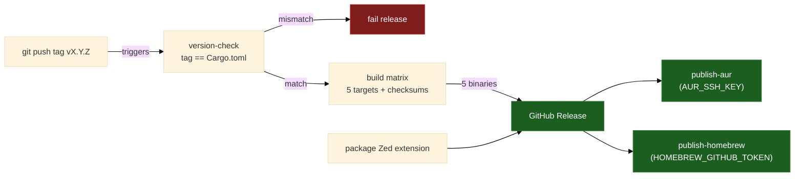

# F16 — Release & CI

> **Status:** Draft
>
> **Version:** 0.1   ·   **Last updated:** 2026-06-17
>
> **Purpose:** The GitHub Actions pipeline — quality gates on every push, and cross-compiled binaries published to a GitHub Release, AUR, and Homebrew on every version tag.
>
> **Depends on:** [E03-tech-stack](../foundations/E03-tech-stack.md), [E17-testing](../foundations/E17-testing.md), [constitution](../constitution.md), [E01-architecture](../foundations/E01-architecture.md)   ·   **Related:** [E29-e2e-testing](../foundations/E29-e2e-testing.md), [F14-cli-linter](F14-cli-linter.md), [F15-editor-integration](F15-editor-integration.md), [ADR-002](../decisions/ADR-002-tower-lsp-server-fork.md), [ADR-007](../decisions/ADR-007-companion-to-python-lsp.md)

> Requirement tag: **REL**

---

## 1. Purpose & Scope

This spec defines how `sqlalchemy-lsp` is checked and shipped. Two GitHub Actions workflows do the work: one gates every change, the other builds and publishes binaries.

The first, `qa.yml`, runs on every push and pull request. It formats, lints, tests, measures coverage, and runs the end-to-end suite over both the MSRV and stable toolchains. Nothing merges until it is green.

The second, `release.yml`, runs when you push a version tag. It checks the tag against `Cargo.toml`, cross-compiles the binary for five targets, attaches the per-platform artifacts plus checksums and the Zed extension to a GitHub Release, then refreshes the AUR and Homebrew packages.

This spec covers:

- The QA workflow — its steps, its pinned toolchains, the coverage gate, and what blocks merge.
- The release workflow — the build matrix, the version-parity gate, and the published assets.
- AUR and Homebrew publishing, each gated on its own secret.
- The `release_assets` test that asserts every artifact is produced.

## 2. Non-Goals / Out of Scope

- The contents of the tests themselves — owned by [E17-testing](../foundations/E17-testing.md) and [E29-e2e-testing](../foundations/E29-e2e-testing.md).
- The editor artifacts' structure (the Zed/VS Code extensions, the config snippets) — owned by [F15-editor-integration](F15-editor-integration.md); this spec only packages and publishes them.
- The `sqlalchemy-lsp check` command's behavior — owned by [F14-cli-linter](F14-cli-linter.md); this spec only invokes it as a self-lint.
- **crates.io and PyPI publishing** — deferred (OQ-REL-1). The GitHub Release binaries, AUR, and Homebrew channels are the v1 distribution.

## 3. Background & Rationale

CI exists so the constitution's principles stay true under change. P3 (never panic) and P6 (fast enough) are easy to regress; a gate that runs the end-to-end suite on every push catches that before it lands. The toolchain pins in [E03 REQ-STACK-01](../foundations/E03-tech-stack.md) — Rust edition 2024, MSRV 1.85 — are only real if CI enforces them, so `qa.yml` builds on both 1.85 and stable.

Coverage is part of the gate, not an afterthought. The suite's testing policy is 100% per-feature coverage traced through each spec's §11.4 table ([E17](../foundations/E17-testing.md)), so `qa.yml` measures coverage with `cargo llvm-cov` and a build that leaves a requirement uncovered fails the merge just as a failing test does.

Release automation exists because the binary targets five platforms. Cross-compiling and uploading five assets by hand is error-prone; a tag-triggered workflow makes a release a single `git push`.

## 4. Concepts & Definitions

- **QA gate** — a required status check on `qa.yml`. A pull request cannot merge while it is red.
- **Version tag** — an annotated git tag of the form `vX.Y.Z` that triggers `release.yml`. The tag is the source of truth for the released version.
- **Build matrix** — the set of `(target, runner)` pairs the release job fans out across, one binary per pair.
- **Version-parity gate** — the first release job, which fails the whole release if the tag does not equal the `version` in `Cargo.toml`.

## 5. Detailed Specification

### 5.1 The QA workflow

`qa.yml` runs on push and pull request. It lands at M0, before any feature work, so every later commit is gated from the first day.

**REQ-REL-01 — QA runs fmt, clippy, test, coverage, and e2e on every push and PR.**

The workflow runs the full gate: `cargo fmt --check`, `cargo clippy --all-targets -- -D warnings`, `cargo test`, `cargo llvm-cov` for coverage, and the `pytest-lsp` end-to-end suite at `tests/e2e` ([E29 REQ](../foundations/E29-e2e-testing.md)). Any failing step fails the job. Clippy warnings are errors, per [E16](../foundations/E16-conventions.md) and [E03 REQ-STACK-01](../foundations/E03-tech-stack.md).

**REQ-REL-02 — QA builds over MSRV and stable.**

The Rust job matrixes over two toolchains, `1.85` and `stable`. Building on 1.85 proves the MSRV claim; building on stable catches forward-looking breakage early. Both must pass.

**REQ-REL-03 — A failing test or an uncovered requirement blocks merge.**

The gate has two failure modes, and both are blocking. A red `cargo test` or a red e2e run fails the merge, as you'd expect. So does an *uncovered requirement*: the suite's policy is that every `REQ-<TAG>-NN` maps to a passing test (§11.4 in each feature), so `cargo llvm-cov` enforcing the coverage floor means a green test run with an untested requirement still fails ([E17](../foundations/E17-testing.md)). A green QA is the proof that the constitution's testing rule holds.

**REQ-REL-04 — A self-lint step runs `sqlalchemy-lsp check`.**

After the build, the workflow runs `sqlalchemy-lsp check` over the [clean-blog](../foundations/E17-testing.md#5-fixtures-registry) fixture workspace ([F14](F14-cli-linter.md)). This dogfoods the CLI and asserts it exits zero on clean input — a cheap, high-signal guard that the shared engine still produces no findings on a known-clean schema.

Here is the QA workflow. It pins toolchains with `dtolnay/rust-toolchain` and caches the Cargo build:

```yaml
# .github/workflows/qa.yml
name: QA
on: [push, pull_request]

jobs:
  rust:
    strategy:
      matrix:
        toolchain: ["1.85", "stable"]
    runs-on: ubuntu-latest
    steps:
      - uses: actions/checkout@v4
      - uses: dtolnay/rust-toolchain@master
        with:
          toolchain: ${{ matrix.toolchain }}
          components: rustfmt, clippy, llvm-tools-preview
      - uses: Swatinem/rust-cache@v2
      - run: cargo fmt --check
      - run: cargo clippy --all-targets -- -D warnings
      - run: cargo test
      - run: cargo install cargo-llvm-cov --locked
      - run: cargo llvm-cov --fail-under-lines 100

  e2e:
    runs-on: ubuntu-latest
    steps:
      - uses: actions/checkout@v4
      - uses: dtolnay/rust-toolchain@stable
      - uses: Swatinem/rust-cache@v2
      - run: cargo build
      - uses: actions/setup-python@v5
        with: { python-version: "3.12" }
      - run: pip install pytest pytest-lsp
      - run: pytest tests/e2e
```

### 5.2 The release workflow

`release.yml` runs on a `v*` tag push (and a manual `workflow_dispatch` with the tag as input). It checks the version, fans out across the build matrix, collects the binaries into one GitHub Release, then refreshes the OS packages.

**REQ-REL-05 — The tag is the source of truth; `Cargo.toml` must match.**

The release uses semver tags `vX.Y.Z`. A first job strips the leading `v` and asserts the result equals the `version` in `Cargo.toml`, read via `cargo metadata`. A mismatch fails the whole release before any build starts — you never ship a binary whose self-reported version disagrees with its tag.

**REQ-REL-06 — The binary is cross-compiled for five targets, with per-platform checksums.**

A matrix builds one stripped binary per target, and a checksum (`.sha256`) is computed for each. The targets and their runners:

| Target | Runner | Artifact name |
|---|---|---|
| `x86_64-unknown-linux-gnu` | `ubuntu-latest` | `sqlalchemy-lsp-linux-x86_64` |
| `aarch64-unknown-linux-gnu` | `ubuntu-latest` | `sqlalchemy-lsp-linux-aarch64` |
| `x86_64-apple-darwin` | `macos-latest` | `sqlalchemy-lsp-macos-x86_64` |
| `aarch64-apple-darwin` | `macos-latest` | `sqlalchemy-lsp-macos-aarch64` |
| `x86_64-pc-windows-msvc` | `windows-latest` | `sqlalchemy-lsp-windows-x86_64.exe` |

Linux aarch64 cross-compiles via `cross`; the Apple and Windows targets build natively on their runners. Each non-Windows binary is stripped before upload.

**REQ-REL-07 — A GitHub Release collects the binaries, checksums, and the Zed extension.**

A final job creates the GitHub Release for the tag and attaches every matrix artifact and its checksum. It also packages the Zed extension with `scripts/package-zed-extension.sh` ([F15](F15-editor-integration.md)) and attaches it. The release body is generated from the commit log between tags. macOS artifacts ship **unsigned** in v1 — no Apple Developer certificate is used — and the README documents the one-time Gatekeeper override (`xattr -d com.apple.quarantine sqlalchemy-lsp`).

Here is the release workflow, abbreviated to the load-bearing steps:

```yaml
# .github/workflows/release.yml
name: Release
on:
  push:
    tags: ["v*"]
  workflow_dispatch:
    inputs:
      tag: { description: "Tag to release (e.g. v0.1.0)", required: true }

jobs:
  version-check:
    runs-on: ubuntu-latest
    steps:
      - uses: actions/checkout@v4
      - name: Tag matches Cargo.toml
        env:
          DISPATCH_TAG: ${{ github.event.inputs.tag }}
        run: |
          ref="${DISPATCH_TAG:-$GITHUB_REF_NAME}"
          tag="${ref#v}"
          crate=$(cargo metadata --no-deps --format-version 1 \
            | jq -r '.packages[0].version')
          test "$tag" = "$crate" || { echo "tag $tag != Cargo.toml $crate"; exit 1; }

  build:
    needs: version-check
    strategy:
      fail-fast: false
      matrix:
        include:
          - { target: x86_64-unknown-linux-gnu,  os: ubuntu-latest,  name: linux-x86_64 }
          - { target: aarch64-unknown-linux-gnu, os: ubuntu-latest,  name: linux-aarch64, cross: true }
          - { target: x86_64-apple-darwin,        os: macos-latest,   name: macos-x86_64 }
          - { target: aarch64-apple-darwin,       os: macos-latest,   name: macos-aarch64 }
          - { target: x86_64-pc-windows-msvc,     os: windows-latest, name: windows-x86_64 }
    runs-on: ${{ matrix.os }}
    steps:
      - uses: actions/checkout@v4
      - uses: dtolnay/rust-toolchain@stable
        with: { targets: ${{ matrix.target }} }
      - name: Build (cross)
        if: matrix.cross == true
        run: cargo install cross --locked && cross build --release --target ${{ matrix.target }}
      - name: Build
        if: matrix.cross != true
        run: cargo build --release --target ${{ matrix.target }}
      # strip, rename to sqlalchemy-lsp-${{ matrix.name }}, write its .sha256, upload-artifact

  release:
    needs: build
    runs-on: ubuntu-latest
    permissions: { contents: write }
    steps:
      - uses: actions/checkout@v4
      - uses: actions/download-artifact@v4
        with: { path: dist, merge-multiple: true }
      - name: Package Zed extension
        run: ./scripts/package-zed-extension.sh dist/
      - uses: softprops/action-gh-release@v2
        with:
          files: dist/**
          generate_release_notes: true
```

### 5.3 AUR publishing

Arch users install with `yay -S sqlalchemy-lsp`, so a `publish-aur` job keeps the AUR package current on every release.

**REQ-REL-08 — A `publish-aur` job bumps `pkg/aur/PKGBUILD` and pushes to the AUR, gated on `AUR_SSH_KEY`.**

The job downloads the two Linux release binaries, computes their `sha256` sums, rewrites `pkg/aur/PKGBUILD` with the new `pkgver` and checksums, regenerates `.SRCINFO`, and pushes to `ssh://aur@aur.archlinux.org/sqlalchemy-lsp.git`. It runs only when the `AUR_SSH_KEY` secret is set, so a fork without the secret skips it cleanly rather than failing. The committed `pkg/aur/PKGBUILD` is the template:

```bash
# pkg/aur/PKGBUILD
# Maintainer: Alex Oleshkevich <alex.oleshkevich@gmail.com>
pkgname=sqlalchemy-lsp
pkgver=0.1.0
pkgrel=1
pkgdesc="Language server for SQLAlchemy and Alembic: diagnostics, completion, hover, navigation"
arch=('x86_64' 'aarch64')
url="https://github.com/alex-oleshkevich/sqlalchemy-lsp"
license=('MIT')
provides=('sqlalchemy-lsp')
conflicts=('sqlalchemy-lsp')

source_x86_64=("${pkgname}-linux-x86_64::${url}/releases/download/v${pkgver}/sqlalchemy-lsp-linux-x86_64")
source_aarch64=("${pkgname}-linux-aarch64::${url}/releases/download/v${pkgver}/sqlalchemy-lsp-linux-aarch64")
sha256sums_x86_64=('SKIP')
sha256sums_aarch64=('SKIP')

package() {
    case "$CARCH" in
        x86_64)  install -Dm755 "${srcdir}/${pkgname}-linux-x86_64"  "${pkgdir}/usr/bin/sqlalchemy-lsp" ;;
        aarch64) install -Dm755 "${srcdir}/${pkgname}-linux-aarch64" "${pkgdir}/usr/bin/sqlalchemy-lsp" ;;
    esac
}
```

The `publish-aur` job (abbreviated) gates on the secret, then clones, rewrites, and pushes:

```yaml
  publish-aur:
    needs: release
    runs-on: ubuntu-latest
    steps:
      - uses: actions/checkout@v4
      - name: Publish to AUR
        if: env.AUR_SSH_KEY != ''
        env:
          AUR_SSH_KEY: ${{ secrets.AUR_SSH_KEY }}
          GH_REPO: ${{ github.repository }}
          GH_TAG: ${{ github.event.inputs.tag || github.ref_name }}
        run: |
          VERSION="${GH_TAG#v}"
          # compute sha256 of the two linux assets, sed them + pkgver into PKGBUILD,
          # makepkg --printsrcinfo > .SRCINFO, then:
          #   git push to ssh://aur@aur.archlinux.org/sqlalchemy-lsp.git
```

### 5.4 Homebrew publishing

macOS users install with `brew install sqlalchemy-lsp`, so a `publish-homebrew` job opens a formula-bump PR against a tap on every release.

**REQ-REL-09 — A `publish-homebrew` job runs `brew bump-formula-pr` against the tap, gated on a token.**

The job computes the macOS binary's `sha256`, taps `alex-oleshkevich/homebrew-tap`, and runs `brew bump-formula-pr` with the new version, download URL, and checksum. It runs only when the `HOMEBREW_GITHUB_TOKEN` secret is set:

```yaml
  publish-homebrew:
    needs: release
    runs-on: macos-latest
    steps:
      - name: Bump Homebrew formula
        if: env.HOMEBREW_GITHUB_TOKEN != ''
        env:
          HOMEBREW_GITHUB_TOKEN: ${{ secrets.HOMEBREW_GITHUB_TOKEN }}
          GH_REPO: ${{ github.repository }}
          GH_TAG: ${{ github.event.inputs.tag || github.ref_name }}
        run: |
          VERSION="${GH_TAG#v}"
          CHECKSUM=$(curl -sL \
            "https://github.com/${GH_REPO}/releases/download/${GH_TAG}/sqlalchemy-lsp-macos-aarch64" \
            | shasum -a 256 | cut -d' ' -f1)
          brew tap alex-oleshkevich/tap https://github.com/alex-oleshkevich/homebrew-tap
          brew bump-formula-pr \
            --version "${VERSION}" \
            --url "https://github.com/${GH_REPO}/releases/download/${GH_TAG}/sqlalchemy-lsp-macos-aarch64" \
            --sha256 "${CHECKSUM}" --no-audit --no-browse \
            alex-oleshkevich/tap/sqlalchemy-lsp
```

### 5.5 The `release_assets` test

The release workflow is itself under test, so a regression can't silently drop a target or a publish job.

**REQ-REL-10 — A `release_assets` test asserts every artifact and job exists.**

A Rust test, `tests/release_assets.rs`, includes the `release.yml` and `package-zed-extension.sh` files as strings and asserts the load-bearing pieces are present: the `version-check` job and its `cargo metadata` comparison, all five build targets, `cross` for aarch64-linux, binary stripping, the Zed-extension packaging step, the `publish-aur` job (with `aur.archlinux.org` and `AUR_SSH_KEY`), the `publish-homebrew` job (with `bump-formula-pr` and `HOMEBREW_GITHUB_TOKEN`), and that no `${{ github.* }}` context is interpolated directly inside a `run:` script (a known injection pitfall — contexts go through `env:`). The test fails the QA gate if the release pipeline loses any of these.

## 6. Visualizations

The release flow: a tag fans out into the matrix, the matrix collects into one Release, and the Release feeds the OS-package jobs.



## 7. Examples & Use Cases

You cut release `0.4.0`. First you bump `version = "0.4.0"` in `Cargo.toml` and merge that — `qa.yml` gates the bump like any change, including the coverage floor. Then you tag and push:

```bash
git tag -a v0.4.0 -m "sqlalchemy-lsp 0.4.0"
git push origin v0.4.0
```

`release.yml` wakes up. The `version-check` job confirms `0.4.0` matches `Cargo.toml`, so the matrix runs. Five jobs each cross-compile and upload one binary plus its checksum; a sixth packages the Zed extension. The `release` job creates the `v0.4.0` Release with every asset and notes generated from the commits since `v0.3.0`. Then `publish-aur` bumps the AUR package and `publish-homebrew` opens a formula-bump PR on the tap. An Arch user runs `yay -S sqlalchemy-lsp`, a macOS user `brew install sqlalchemy-lsp`, and anyone else downloads `sqlalchemy-lsp-linux-x86_64` and verifies it against the published `.sha256`.

## 8. Edge Cases & Failure Modes

- **Tag/`Cargo.toml` mismatch** → the `version-check` job fails before any build runs, and no Release is created. Delete the bad tag, fix the version, re-tag.
- **A QA gate fails** → the PR's required check is red and the branch cannot merge. A failing test *or* an uncovered requirement (coverage floor) both block (REQ-REL-03).
- **A single matrix leg fails** → that platform's binary is missing; the job fails loudly rather than publishing a partial release silently (`fail-fast: false` still surfaces the failure). Fix and re-run.
- **Release re-run idempotency** → re-running for an existing tag re-uploads assets to the same Release; `action-gh-release` overwrites by filename. Deleting and re-pushing a tag is the clean way to redo a botched release.
- **No AUR/Homebrew secret in a fork** → the `publish-aur` and `publish-homebrew` jobs skip cleanly via their `if: env.* != ''` guard, so a fork's release succeeds without the OS-package channels.

## 11. Testing

F16's "tests" are the gates themselves — the two workflows are validated by running them, on every push and on every tag — plus the `release_assets` test that inspects the release pipeline statically. A green `qa.yml` *is* the proof that fmt, clippy, the Rust suites, the coverage floor, and the e2e suite pass; a failing `version-check` *is* the proof that the tag/`Cargo.toml` rule holds. So this section maps each release requirement to the workflow job, check, or test that exercises it.

### 11.1 Scope & coverage

Target: **100% of this feature's behavior is covered.** Every `REQ-REL-NN` below maps to the workflow job, gate, or test that exercises it. See the policy in [E17 §2](../foundations/E17-testing.md#2-coverage-policy).

### 11.2 Test plan

Each row is a workflow behavior under test. The workflows run the same unit and integration suites defined in [E17-testing](../foundations/E17-testing.md) and the end-to-end suite in [E29-e2e-testing](../foundations/E29-e2e-testing.md); the release-specific behaviors are gated by their own jobs and the `release_assets` test.

| Behavior / scenario | Type | How it runs | Verifies |
|---|---|---|---|
| `qa.yml` runs fmt, clippy, `cargo test`, `cargo llvm-cov`, and the e2e suite on every push and PR | integration | the `rust` + `e2e` jobs, both toolchains | REQ-REL-01 |
| The Rust matrix builds and tests on MSRV `1.85` and `stable` | integration | the `rust` job's `toolchain` matrix | REQ-REL-02 |
| A failing test or an uncovered requirement fails the gate | integration | `cargo test` + `cargo llvm-cov --fail-under-lines 100` | REQ-REL-03 |
| The self-lint `sqlalchemy-lsp check` exits zero on the clean fixture | integration | the `check` step over [clean-blog](../foundations/E17-testing.md#5-fixtures-registry) | REQ-REL-04 |
| A tag whose number disagrees with `Cargo.toml` fails the release | unit | the `version-check` job (deliberate mismatch fails it) | REQ-REL-05 |
| The build matrix produces one stripped binary + checksum per target | integration | the `build` job's five-leg `target` matrix | REQ-REL-06 |
| The release collects every binary, checksum, and the packaged Zed extension | integration | the `release` job (download-artifact → gh-release) | REQ-REL-07 |
| The tag refreshes the AUR package, gated on `AUR_SSH_KEY` | integration | the `publish-aur` job | REQ-REL-08 |
| The tag opens a Homebrew formula-bump PR, gated on the token | integration | the `publish-homebrew` job | REQ-REL-09 |
| Every target, checksum, and publish job is present in `release.yml` | unit | the `release_assets` test (`tests/release_assets.rs`) | REQ-REL-10 |

### 11.3 Fixtures

The QA and self-lint steps reuse the shared workspaces from the [E17 fixtures registry](../foundations/E17-testing.md#5-fixtures-registry) rather than defining their own.

- **[clean-blog](../foundations/E17-testing.md#5-fixtures-registry)** — the workspace the `sqlalchemy-lsp check` self-lint step runs over; the step asserts a clean exit (REQ-REL-04).
- **version-mismatch tag** — a feature-local check: a tag like `v9.9.9` pushed against an unbumped `Cargo.toml` must fail the `version-check` job (REQ-REL-05). Exercised by deliberately mismatching the two.

### 11.4 Requirement coverage

Every load-bearing requirement maps to the workflow job, gate, or test that proves it — this table is that index.

| Requirement | Covered by |
|---|---|
| REQ-REL-01 | `qa.yml` `rust` job (fmt/clippy/test/llvm-cov) + `e2e` job, every push/PR |
| REQ-REL-02 | `qa.yml` `rust` job, `toolchain: ["1.85", "stable"]` matrix |
| REQ-REL-03 | `cargo test` + `cargo llvm-cov` coverage floor in the `rust` job |
| REQ-REL-04 | `qa.yml` self-lint `sqlalchemy-lsp check` over [clean-blog](../foundations/E17-testing.md#5-fixtures-registry) |
| REQ-REL-05 | `release.yml` `version-check` job; mismatch case from §11.3 |
| REQ-REL-06 | `release.yml` `build` job, five-target matrix + checksums |
| REQ-REL-07 | `release.yml` `release` job (artifacts + checksums + Zed extension) |
| REQ-REL-08 | `release.yml` `publish-aur` job, gated on `AUR_SSH_KEY` |
| REQ-REL-09 | `release.yml` `publish-homebrew` job, gated on the token |
| REQ-REL-10 | the `release_assets` test (`tests/release_assets.rs`) |

## 12. End-to-End Test Plan

The end-to-end surface of this spec is the pipeline run itself: a dry-run release exercises the version gate and the build/publish jobs without shipping a real tag, and the QA gate runs on every push.

### 12.1 Coverage target

**100% of the feature's scope, end to end** — the green-QA happy path, the matching-tag dry-run release, and the version-mismatch error path. See the policy in [E29 §2](../foundations/E29-e2e-testing.md#2-coverage-policy).

### 12.2 Scenarios

The canonical scenarios are a green QA run, a dry-run release whose tag matches `Cargo.toml`, and a deliberate version mismatch that the gate must reject.

| # | Journey | Path | Expected outcome |
|---|---|---|---|
| E2E-01 | Push a clean commit; `qa.yml` runs fmt/clippy/test/coverage/e2e on both toolchains | happy | All jobs green; the branch is mergeable (REQ-REL-01..03). |
| E2E-02 | Dry-run `release.yml` (`workflow_dispatch`) for a tag matching `Cargo.toml` | happy | `version-check` passes, the matrix produces five binaries + checksums + the Zed extension, and the `release_assets` test passes (REQ-REL-05..07, REQ-REL-10). |
| E2E-03 | Push a commit that leaves a `REQ-<TAG>-NN` uncovered | error | The coverage floor fails the `rust` job; the branch cannot merge (REQ-REL-03). |
| E2E-04 | Trigger `release.yml` with a tag that disagrees with `Cargo.toml` | error | `version-check` fails before any build runs; no Release is created (REQ-REL-05). |

### 12.3 Acceptance criteria & Definition of Done

The §12.2 scenarios, written Given/When/Then, are this feature's acceptance criteria:

| # | Given | When | Then |
|---|---|---|---|
| AC-01 | A clean commit on a branch | `qa.yml` runs on the push | fmt/clippy/test/coverage/e2e all pass on 1.85 and stable, and the branch is mergeable. |
| AC-02 | A tag equal to the `Cargo.toml` version | `release.yml` runs (dry-run) | `version-check` passes, five binaries + checksums + the Zed extension are produced, and `release_assets` passes. |
| AC-03 | A tag that disagrees with `Cargo.toml` | `release.yml` runs | `version-check` fails before any build, and no Release is created. |

**Definition of Done:** every `REQ-REL-NN` has a passing job, gate, or test (§11.4), every acceptance scenario above passes, and the §13.1 security review holds.

## 13. Non-Functional Requirements

### 13.1 Security & Privacy

Release is where `sqlalchemy-lsp`'s supply chain lives, so this is the section that matters most for F16. The trust boundary is the one every user crosses: they download and run a prebuilt binary they did not compile, so everything below exists to make that binary trustworthy.

- **Provenance & build integrity** — every release artifact is built in CI from the exact tagged commit, never from a developer's laptop. The `version-check` job (REQ-REL-05) asserts the tag equals `Cargo.toml`, so a binary's self-reported version always matches the source it was built from. The committed `Cargo.lock` pins the dependency graph, so a release builds the same graph every time. Per-platform checksums (REQ-REL-06) let users verify their download.
- **Secrets handled only via the CI secret store, never logged** — the `AUR_SSH_KEY` and `HOMEBREW_GITHUB_TOKEN` live only in GitHub Actions encrypted secrets, are read into `env:` (never inlined into `run:` scripts, asserted by the `release_assets` injection check, REQ-REL-10), and are never echoed to workflow output. Each channel uses a **narrowly scoped** credential, so a leak of one cannot reach the others; a fork without a secret skips that publish job rather than exposing anything.
- **Unsigned macOS binaries (v1)** — macOS artifacts ship **unsigned** (REQ-REL-07): no Apple Developer cert is used, so Gatekeeper quarantines them and the README documents the one-time `xattr -d com.apple.quarantine sqlalchemy-lsp` override. A deliberate, documented trust gap pending a macOS user base that justifies a paid signing cert.
- **Privacy** — the workflows handle no user data; they operate only on the repo's source, the CI secrets above, and the published artifacts. There is nothing personal to classify or retain, and the server they ship sends no telemetry (constitution §4.6).

## 14. Open Questions & Decisions

- **Decision (resolves OQ-REL-1)** — v1 does **not** publish to crates.io or PyPI. Distribution is the prebuilt binaries on the GitHub Release plus the AUR package and Homebrew formula ([F15](F15-editor-integration.md)). Unlike babel-lsp, there is no PyPI wheel — `sqlalchemy-lsp` is a standalone binary tool, not a pip-installed Python package, and its users reach for `yay`/`brew`/direct download. A `cargo install` source path can be added later if demand appears.
- **Decision (resolves OQ-REL-2)** — the project maintains an **AUR package and a Homebrew formula**, refreshed on every release (REQ-REL-08, REQ-REL-09), each gated on its own secret so forks degrade gracefully.
- **Decision (resolves OQ-REL-3)** — macOS binaries ship **unsigned** in v1, with a documented Gatekeeper override (REQ-REL-07). Signing and notarization need a paid Apple Developer cert and CI secrets; deferred until a macOS user base warrants the cost.

## 15. Cross-References

- **Depends on:** [E03-tech-stack](../foundations/E03-tech-stack.md) — the toolchain, MSRV, and MIT license the gates enforce; [E17-testing](../foundations/E17-testing.md) — the coverage policy and the `clean-blog` fixture the QA gate runs; [constitution](../constitution.md) — P3, P6, and the testing rule the gate protects; [E01-architecture](../foundations/E01-architecture.md) — the single stdio binary the release ships.
- **Related:** [E29-e2e-testing](../foundations/E29-e2e-testing.md) — the `pytest-lsp` e2e suite `qa.yml` runs; [F15-editor-integration](F15-editor-integration.md) — the Zed/VS Code artifacts the release packages and the AUR/Homebrew install targets; [F14-cli-linter](F14-cli-linter.md) — the `sqlalchemy-lsp check` self-lint step; [ADR-002](../decisions/ADR-002-tower-lsp-server-fork.md) — the `tower-lsp-server` floor that sets MSRV 1.85; [ADR-007](../decisions/ADR-007-companion-to-python-lsp.md) — the companion positioning that shapes the install channels.

## 16. Changelog

- **2026-06-17** — Initial draft: the `qa.yml` gate (fmt/clippy/test/`llvm-cov` coverage floor/e2e over MSRV 1.85 + stable, where a failing test *or* an uncovered requirement blocks merge), the `release.yml` tag-triggered build matrix over five targets with per-platform checksums, the tag↔`Cargo.toml` version-parity gate, the GitHub Release packaging binaries + checksums + the Zed extension, the `publish-aur` job (→ `ssh://aur@aur.archlinux.org/sqlalchemy-lsp.git`, gated on `AUR_SSH_KEY`), the `publish-homebrew` job (`brew bump-formula-pr` against `homebrew-tap`, gated on a token), the `release_assets` test, and the §11 Testing + §12 E2E (incl. the dry-run release and version-gate paths) + §13.1 Security (secrets only via the CI secret store, never logged). Records the no-crates.io/no-PyPI, AUR+Homebrew, and unsigned-macOS decisions. No §6 UI Mockups and no §13.2 Accessibility — F16 is CI/packaging with no rendered surface (constitution §4.6).
</content>
</invoke>
