# E01 — Architecture

> **Status:** Approved
>
> **Version:** 0.2   ·   **Last updated:** 2026-06-18
>
> **Purpose:** The system shape: one Rust binary, a two-pass index over Python source and Alembic migrations, and pure-function features. Read this before any feature spec.
>
> **Depends on:** [constitution](../constitution.md)   ·   **Related:** [E07-data-model](E07-data-model.md), [E30-extraction-and-indexing](E30-extraction-and-indexing.md), [E03-tech-stack](E03-tech-stack.md), [E17-testing](E17-testing.md)

> Requirement tag: **ARCH**

---

## 1. Purpose & Scope

This spec defines how the server is put together: its process model, the two-pass indexing pipeline, how SQLAlchemy and Alembic files are detected and parsed, how the index stays in sync with disk, and how LSP features read the result. Feature specs assume everything here.

This spec covers:

- The process model — one binary, stdio only, `lsp` and `check` sharing one pipeline.
- The two-pass pipeline — per-file extraction, then a debounced workspace relink.
- File detection — indicator-gated scanning, with force-parse on open.
- Pure-function feature dispatch and the no-stale-data guarantee.
- The single-traversal diagnostics engine — one tree walk, a rule registry, span-ordered signals, suppression at flush.
- Protocol conduct — ordering, encoding, diagnostics, progress, refresh, file watching, and lazy code-action resolution.
- Measurable performance budgets, tested against the `large-workspace` fixture.

## 2. Non-Goals / Out of Scope

- The concrete index and fact types — owned by [E07-data-model](E07-data-model.md).
- The tree-sitter extraction rules and reference resolution — owned by [E30-extraction-and-indexing](E30-extraction-and-indexing.md).
- What each feature does with the index — owned by the `F##` specs.
- The full error/resilience contract (partial input, `ERROR`-node tolerance, null-on-failure handlers) — summarized here, detailed in [E16-conventions](E16-conventions.md).
- Config resolution and auto-discovery — owned by [E15-app-config](E15-app-config.md).
- Test harness and fixture details — owned by [E17-testing](E17-testing.md) and [E29-e2e-testing](E29-e2e-testing.md).

## 3. Background & Rationale

The shape — an LSP framework crate, tree-sitter parsing, a concurrent-map index — is the one production Rust language servers converge on, and we adopt it wholesale from babel-lsp ([ADR-001](../decisions/ADR-001-adopt-babel-lsp-architecture.md)).

What's specific to SQLAlchemy is that a model's meaning is split across files. A `relationship("Post", back_populates="author")` on `User` in `models/user.py` is only half the story. The other half — `Post`'s table, its `author` relationship, the `posts.author_id` foreign key — lives in `models/post.py`. Per-file extraction alone can't answer "does this `back_populates` point at a real reverse relationship?" or "does this `ForeignKey("users.id")` name a real column?" So a workspace-level linking step, which joins each file's facts against a shared index, becomes the heart of the design.

Alembic adds a second cross-file graph: a migration's `down_revision` names its parent, and the chain of these forms the history. The same two-pass shape serves both — extract per file, then resolve references across the workspace.

## 4. Concepts & Definitions

Fact, Pass 1 / Pass 2, workspace index, and generation counter are canonical in the [glossary](../glossary.md). Two terms matter most here:

- **Debounce window** — the short delay after a change before Pass 2 re-runs, so a burst of keystrokes triggers one relink, not twenty. Fixed at ~300 ms ([ADR-006](../decisions/ADR-006-debounce-and-generation-counter.md)).
- **Generation counter** — the monotonic workspace counter that stops a stale Pass 2 from publishing after a newer edit has landed. (Canonical definition in [glossary](../glossary.md).)

## 5. Detailed Specification

### 5.1 Process model

The server is one binary speaking LSP over stdio; that's the whole deployment story.

**REQ-ARCH-01 — Single static binary, stdio only.**

The server ships as one Rust binary with no runtime dependencies. The `lsp` subcommand speaks JSON-RPC over stdio — the one transport v1 ships ([ADR-005](../decisions/ADR-005-stdio-only-transport.md)). Bare `sqlalchemy-lsp` with no subcommand is shorthand for `lsp --stdio`.

The `check`, `schema`, and `stats` subcommands reuse the *same* pipeline headless — the full CLI surface is [F14](../features/F14-cli-linter.md). This is the "one engine, two front-ends" engineering principle: the editor server and `check` run the same extraction and the same diagnostics engine, so they can never disagree (CLI/server parity, [E17](E17-testing.md)). `tower-lsp-server` handles the framing ([E03](E03-tech-stack.md)); all request handlers live in one `impl LanguageServer for Backend`.

> **Note:** Remote transports are deferred (see [ADR-005](../decisions/ADR-005-stdio-only-transport.md)). `tower-lsp-server` could serve over a TCP socket, and a real HTTP transport would need a custom wrapper, but neither is built in v1 — stdio reaches every first-class editor (Zed, Helix, Neovim, VS Code).

**REQ-ARCH-02 — Static analysis only.**

The server never executes user code, never imports user modules, and never instantiates `MetaData` to discover models (constitution P1). tree-sitter parses Python source; every fact derives from the syntax tree. A broken or half-typed file is therefore always safe to analyze, and the schema command and all diagnostics work without ever running the user's app.

### 5.2 The two-pass pipeline

Everything the server knows flows through two passes: extract facts per file, then resolve references across files into the workspace index.

**REQ-ARCH-03 — Pass 1 runs per file, on every change.**

On `didOpen`, `didChange`, `didSave`, and during the initial workspace scan, the changed file is parsed and its facts extracted ([E30](E30-extraction-and-indexing.md)). For a model file that means its models, columns, relationships, and table-args; for a migration file that means its `revision`, `down_revision`, and `op.*` calls ([E07](E07-data-model.md)). The file's old facts are replaced atomically — Pass 1 touches only that one file.

Text sync is `TextDocumentSyncKind::INCREMENTAL`. Incoming edits are applied to the stored source through the single offset/encoding module (REQ-ARCH-10), then the file is fully re-parsed — a single-file parse fits the budget. Feeding edits to `Tree::edit` for an incremental reparse is recorded as a later optimization, not built now.

**REQ-ARCH-04 — Pass 2 rebuilds the workspace index, debounced.**

After any Pass 1 change, a debounced Pass 2 rebuilds the workspace index from the current facts: it keys every model by class name and table name, every column by its owning model, and every migration by its revision id, then re-resolves all cross-file references against the rebuilt tables ([E07](E07-data-model.md), [E30](E30-extraction-and-indexing.md)). Pass 2 is a pure in-memory walk over facts — it re-parses nothing.

A **generation counter** keeps the passes from racing ([ADR-006](../decisions/ADR-006-debounce-and-generation-counter.md)). Every Pass 1 change bumps the workspace generation. Pass 2 records the generation it started from and discards its result if the counter moved before it published, then reschedules. A published snapshot therefore always reflects one consistent set of facts.

The debounce window is a fixed ~300 ms — the conventional LSP debounce. A burst of keystrokes collapses into a single relink rather than one per character.

**REQ-ARCH-05 — No stale data: facts and references re-resolve on every event.**

This is the guarantee that ties Pass 1 and Pass 2 together. Every edit, save, or watcher event re-extracts the file and atomically replaces its facts, then rebuilds the model, table, and revision indexes. A delete purges the file's facts and clears its diagnostics (REQ-ARCH-11).

Cross-file references re-resolve against the rebuilt index, never against cached results. A `ForeignKey("users.id")` in `Post` re-resolves to `User.id`; a `back_populates="posts"` on `Post.author` re-resolves to `User.posts`; a migration's `down_revision` re-resolves to its parent. So renaming or removing `User` never leaves a dangling target in hover, completion, or a diagnostic. An [E29](E29-e2e-testing.md) journey pins this: edit a model in file A, and a diagnostic in file B updates without reopening file B.

### 5.3 File detection

A workspace scan must not parse every Python file in a large monorepo, so cheap indicators gate the parse.

**REQ-ARCH-06 — Indicator-gated scanning, force-parse on open.**

During the workspace scan, a Python file is parsed only if it contains a SQLAlchemy or Alembic indicator substring — for example `DeclarativeBase`, `mapped_column`, `relationship`, `__tablename__`, `Mapped[`, `import sqlalchemy`, or, for migrations, `down_revision` and `op.` ([E30](E30-extraction-and-indexing.md) owns the full indicator set). A file may match SQLAlchemy indicators, Alembic indicators, or both; the server processes each match independently, so a file that is both a model and a migration is handled as both.

On `didOpen`, `didChange`, and `didSave`, a file is parsed unconditionally. That way features still work in a file that uses an aliased base class or an unusual import the scan-time indicators missed. The scan is a fast filter, not the final word.

`pyproject.toml`, `sqlalchemy-lsp.toml`, and `alembic.ini` are watched too; a change re-runs config resolution ([E15](E15-app-config.md)) and triggers Pass 2.

### 5.4 Feature dispatch

**REQ-ARCH-07 — Features are pure functions.**

Every LSP capability is a function in `src/features/` taking the shared state plus the request's URI and position, returning the LSP response type. A feature reads one consistent index snapshot and answers from it. Features hold no state and take no locks beyond `DashMap`'s per-entry reads, so concurrent requests just work, and features never call each other (constitution: dependencies flow downward).

### 5.5 Resilience

**REQ-ARCH-08 — Partial input degrades, never breaks.**

Extractors walk whatever tree tree-sitter produced — `ERROR` nodes and all — and return the facts they can find (constitution P3). A relationship target that isn't a literal or a known model is stored unresolved and excluded from lookups rather than guessed at (P4). A request handler that hits a bug returns an empty or null LSP response, never a crash.

This is the summary; the full error and resilience contract — the `ERROR`-node tolerance rules, the null-on-failure handler pattern, and the never-log-to-stdout rule — lives in [E16-conventions](E16-conventions.md).

### 5.6 Protocol conduct

These are the rules from the LSP spec and hard-won ecosystem experience that the implementation honors from day one — each cheap to build in, expensive to retrofit.

**REQ-ARCH-09 — Document notifications apply in order; parsing never blocks the runtime.**

`tower-lsp-server` runs handlers concurrently, which can apply two `didChange` events out of order and corrupt the stored source. Document mutations (`didOpen`/`didChange`/`didClose`) are serialized **per URI**: each document's notifications apply in arrival order, while unrelated documents and read requests proceed concurrently. CPU-bound work — parsing and the index rebuild — runs under `tokio::task::spawn_blocking`, never directly in an async handler.

**REQ-ARCH-10 — Position encoding is negotiated, preferring UTF-8.**

The server advertises `positionEncoding: "utf-8"` when the client offers it (LSP 3.17) and falls back to the mandatory UTF-16 — surrogate pairs included — otherwise. This matters here because models, columns, and docstrings carry multi-byte identifiers, so an off-by-encoding range lands a squiggle mid-character. All offset conversion goes through one utility module; [E17](E17-testing.md) pins the edge cases with the `non-ascii` fixture.

**REQ-ARCH-11 — Both push and pull diagnostics; publish every change, including to empty.**

The server publishes diagnostics after each relink (`textDocument/publishDiagnostics`) *and* advertises the pull model (`textDocument/diagnostic`) for clients that prefer it. Diagnostics are workspace-scoped: closing a file clears nothing, and a finding disappears only when a relink removes it or the file is deleted.

Two edges are easy to get wrong, so they are spelled out. A file whose findings vanished gets an explicit **empty publish**, or stale squiggles linger. And a newly opened file **always** receives a publish, possibly empty — the "the server looked at this file" signal the [E29](E29-e2e-testing.md) harness waits on.

**REQ-ARCH-12 — The workspace scan never blocks `initialize`.**

`initialize` returns immediately; the workspace scan and first index build run in the background after `initialized`. When the client advertises `window.workDoneProgress`, the server reports scan progress on a created token; otherwise it scans silently. Requests arriving mid-scan answer from whatever is indexed so far.

**REQ-ARCH-13 — Derived UI is refreshed after each relink.**

When a relink changes the index, any editor UI derived from it can be stale until the editor re-pulls. When the client advertises support, the server fires `inlayHint/refresh` after each relink so editors re-pull the FK and relationship hints ([F10](../features/F10-inlay-hints.md)). The server reparses nothing to do this — it only nudges the client to ask again. If Code Lens is adopted later, `codeLens/refresh` fires the same way (parked in [roadmap](../roadmap.md)).

**REQ-ARCH-14 — The index follows the disk: file watching is mandatory.**

Migrations and models are edited outside the editor — by `alembic revision`, by a teammate's commit, by a search-and-replace — so the index must track disk. The server registers `workspace/didChangeWatchedFiles` dynamically when the client supports it, and falls back to native watching (the `notify` crate) over the same glob set otherwise. The watched set: the Python source globs, the migration directory, and the config files (`pyproject.toml`, `sqlalchemy-lsp.toml`, `alembic.ini`).

The handler keeps the index honest, with **open-buffer-overlay precedence** as the key rule:

- **Created** → Pass 1 on the new file; relink.
- **Changed**, for a file *not* open in the editor → re-extract from disk; relink.
- **Changed**, for a file *open* in the editor → ignore the watcher event. The editor's `didChange` buffer is the truth (the unsaved overlay), so a disk event must never clobber unsaved edits.
- **Deleted** → drop the file's facts; relink. Its models, columns, and revisions vanish from every index, and its diagnostics clear per REQ-ARCH-11.

Renames arrive as delete + create and need no special handling. Config-file changes trigger config re-resolution before the relink.

**REQ-ARCH-15 — Code actions resolve lazily; the edit is computed only when chosen.**

A single line of source can carry several fixable diagnostics, and a large file can carry hundreds. Computing the full `WorkspaceEdit` for every fix up front — for actions the user will mostly never click — burns the budget for nothing. So the server splits the work in two, the way the LSP code-action lifecycle is designed for.

The server advertises `codeActionProvider.resolveProvider = true`. A `textDocument/codeAction` request then returns only lightweight metadata for each action: its `title`, its `kind`, and the `diagnostic` it fixes. The heavy part — the actual `WorkspaceEdit` — is left empty. Building that edit is deferred to `codeAction/resolve`, which the client sends only for the one action the user actually selects.

The effect is that listing the fixes on a line is cheap, and we compute exactly one edit per accepted fix instead of one per offered fix. The fixes themselves — what each one rewrites — are owned by [F11](../features/F11-code-actions.md); the Diff preview that shows a fix before it is applied is described in [E16](E16-conventions.md).

### 5.7 The diagnostics engine

Features are pure functions (REQ-ARCH-07), but diagnostics are special: many rules need to look at the same file, and the naive shape — every rule walking the whole tree itself — re-traverses the source once per rule. With dozens of rules that work balloons fast. We borrow Biome's analyzer shape instead and walk the tree once, fanning each node out to the rules that asked for it.

**REQ-ARCH-16 — The diagnostics engine walks the tree once and dispatches to a rule registry.**

A single traversal visits every node of a file's tree-sitter tree exactly once. At each node, the engine consults a **rule registry** keyed by node kind and dispatches the node to every rule registered for that kind — a query-matcher fan-out, not a per-rule re-walk. A rule that only cares about `call` nodes is never woken for anything else.

Rules don't return diagnostics directly; they emit **signals** into a queue. Each signal is a finding plus its source span. The queue is ordered by that span, so findings come out in source order no matter which rule or which node produced them. As the queue is flushed, suppression is applied: a signal covered by a `# noqa` comment is dropped at flush time, in one place, rather than each rule checking for its own suppression. The flushed, suppression-filtered signals become the file's published diagnostics.

This is the engine behind both halves of the pipeline. Pass 1's per-file diagnostics and the relink's cross-file checks (REQ-ARCH-03, REQ-ARCH-04) both run through this one traversal, which is what keeps a relink inside the §8 performance budget — the alternative, N rules each re-walking the tree, would not fit. It composes cleanly with the two passes: the per-file rules run during Pass 1's single-file parse, and the cross-file rules run during Pass 2 against the rebuilt index.

The engine owns *how* rules run; it does not own the rules. Each rule's definition, its metadata, and its stable code live in the diagnostic catalogs ([F01](../features/F01-orm-correctness-diagnostics.md), [F02](../features/F02-best-practice-lints.md)) and the central code registry ([E15](E15-app-config.md)). The engine reads that registry to know which rules exist and which node kinds each one wants; the diagnostic model those signals conform to is owned by [E16](E16-conventions.md).

## 6. Examples & Use Cases

You add a `bio` column to `Post` in `models/post.py`. Pass 1 re-extracts that one file on each keystroke — cheap and single-file — and the cross-file checks run against the existing index. Meanwhile a teammate's `git pull` lands a renamed `User.full_name` column on disk. The file watcher fires on `models/user.py`, Pass 1 re-reads it, the debounced Pass 2 rebuilds the index, and the `back_populates` and FK references from `Post` re-resolve against the new `User` — clearing or raising diagnostics in `post.py`, a file you never opened. The generation counter ensures that if you keep typing during the relink, the stale Pass 2 is discarded and a fresh one runs.

## 7. Edge Cases & Failure Modes

- A model file is deleted → its models and columns are purged, Pass 2 re-runs, and any FK or `back_populates` that pointed at it re-resolve to "unresolved" — silently (P4), since the target genuinely no longer exists.
- A file fails to parse cleanly → the extractor returns the facts from the readable subtree; the `ERROR` region is skipped, not fatal (P3).
- A model edit with no cross-file impact → Pass 1 replaces that file's facts and Pass 2 relinks, but downstream references are unchanged, so no new diagnostics appear.
- A burst of keystrokes → one debounced relink, not twenty; intermediate generations are superseded.
- A huge workspace with no SQLAlchemy → the scan finds no indicators, parses almost nothing, and idles at near-zero cost.
- A watcher event for an open file → ignored in favor of the unsaved buffer (REQ-ARCH-14).

## 8. Performance Budgets

Latency is a feature (constitution P6), so the budgets are measurable and regression-tested, not aspirational. They are validated against the generated `large-workspace` fixture in [E17](E17-testing.md), and per constitution §4.6 feature specs do not restate them.

| Operation | Budget | Measured against |
|---|---|---|
| Initial scan + index build | ≤ 2 s per 1,000 indicator-matched files | `large-workspace` cold scan |
| Relink latency (Pass 2) | ≤ 100 ms | `large-workspace` after a single-file edit |
| Hover p95 | ≤ 50 ms | `large-workspace` repeated hover |
| Completion p95 | ≤ 50 ms | `large-workspace` repeated completion |

Read requests answer from the in-memory index, never by re-parsing, which is what keeps hover and completion inside the p95 budget. The debounce window keeps relink cost off the typing path. If a real workspace proves a budget too tight, the constant is tuned in [E17](E17-testing.md), where the regression test lives.

## 9. Visualizations

The diagram below traces a single change through the two-pass pipeline: Pass 1 extracts one file's facts into the shared state, the debounced Pass 2 rebuilds the index and re-resolves cross-file references, and feature requests read the result as pure functions.

```mermaid
%%{init: {'theme': 'base', 'themeVariables': {'fontSize': '14px'}}}%%
flowchart LR
    classDef proc fill:#CCE5FF,stroke:#4A90D9,color:#004085
    classDef link fill:#D4EDDA,stroke:#28A745,color:#155724
    classDef store fill:#34495E,stroke:#2C3E50,color:#fff
    classDef out fill:#FFF3CD,stroke:#FFC107,color:#333

    edit(["didChange / save / watch / scan"]):::proc
    p1["Pass 1\nextract facts (one file)"]:::proc
    state[("WorkspaceState\nmodel · table · revision")]:::store
    p2["Pass 2\nrebuild index + re-resolve refs"]:::link
    diag["publish diagnostics\n+ inlayHint/refresh"]:::out
    req(["LSP request"]):::proc

    edit -->|"parse one file"| p1
    p1 -->|"replace file facts atomically"| state
    state -.->|"debounced ~300ms, gen-checked"| p2
    p2 -->|"key by name/table/revision"| state
    p2 -->|"after relink"| diag
    req -->|"pure read"| state

    linkStyle 0 stroke:#4A90D9,stroke-width:2px
    linkStyle 1 stroke:#4A90D9,stroke-width:2px
    linkStyle 2 stroke:#28A745,stroke-width:2px
    linkStyle 3 stroke:#28A745,stroke-width:2px
    linkStyle 4 stroke:#FFC107,stroke-width:2px
    linkStyle 5 stroke:#95A5A6,stroke-width:2px
```

## 10. Open Questions & Decisions

- **Decision ([ADR-005](../decisions/ADR-005-stdio-only-transport.md)) — stdio only for v1.** No `--tcp` and no `--http`: stdio reaches every first-class editor (Zed, Helix, Neovim, VS Code), so a remote transport is surface to build and secure for no current need. `tower-lsp-server` could serve over a TCP socket and HTTP would need a custom wrapper — both are deferred, not built.
- **Decision ([ADR-006](../decisions/ADR-006-debounce-and-generation-counter.md)) — fixed ~300 ms debounce plus a workspace generation counter.** The debounce collapses keystroke bursts into one relink; the generation counter discards any Pass 2 whose facts were superseded before it published. Together they keep relinks cheap and snapshots consistent. The window is not configurable in v1; the [E17](E17-testing.md) performance fixture validates it and is where it is tuned.
- **Decision — Pass 2 rebuilds the index wholesale, not incrementally.** Simplicity wins until a real workspace proves it too slow; the index is small relative to the source it summarizes.

## 11. Cross-References

- **Depends on:** [constitution](../constitution.md) — principles P1, P3, P4, P6, and the "one engine, two front-ends" engineering principle, all cited above.
- **Related:** [E07-data-model](E07-data-model.md) — the fact and index types Pass 2 builds; [E30-extraction-and-indexing](E30-extraction-and-indexing.md) — the extraction rules, indicator set, and reference resolution; [E03-tech-stack](E03-tech-stack.md) — the framing crate, tree-sitter, and `notify`; [E15-app-config](E15-app-config.md) — the watched config files, resolution, and the code registry the diagnostics engine reads; [E16-conventions](E16-conventions.md) — the full error/resilience contract, the diagnostic model signals conform to, and the Diff preview for fixes; [E17-testing](E17-testing.md) — the performance budgets and `large-workspace`/`non-ascii` fixtures; [E29-e2e-testing](E29-e2e-testing.md) — the protocol-conformance journeys that pin this conduct; [F01-orm-correctness-diagnostics](../features/F01-orm-correctness-diagnostics.md) and [F02-best-practice-lints](../features/F02-best-practice-lints.md) — the rule definitions the engine dispatches; [F10-inlay-hints](../features/F10-inlay-hints.md) — the refresh consumer; [F11-code-actions](../features/F11-code-actions.md) — the fixes resolved lazily; [F14-cli-linter](../features/F14-cli-linter.md) — the headless front-end sharing this pipeline.

## 12. Changelog

- **2026-06-18** — Approved.
- **2026-06-18** (v0.2) — Added two patterns adapted from Biome. New §5.7 specifies the single-traversal diagnostics engine (REQ-ARCH-16): one tree walk dispatching each node to a rule registry keyed by node kind, rules emitting span-ordered signals, `# noqa` suppression applied at flush — replacing the per-rule re-walk and serving both Pass 1 and the relink inside the §8 budget. New REQ-ARCH-15 in §5.6 specifies lazy code-action resolution: `codeActionProvider.resolveProvider = true`, with `textDocument/codeAction` returning action metadata and the `WorkspaceEdit` computed only on `codeAction/resolve`. Cross-linked [F01](../features/F01-orm-correctness-diagnostics.md), [F02](../features/F02-best-practice-lints.md), [F11](../features/F11-code-actions.md), [E15](E15-app-config.md), and [E16](E16-conventions.md).
- **2026-06-17** — Initial draft: the single stdio binary sharing one pipeline across `lsp` and `check`, static-analysis-only operation, the two-pass pipeline with a ~300 ms debounce and generation counter, indicator-gated file detection, pure-function feature dispatch, the no-stale-data guarantee, protocol conduct (per-URI ordering + `spawn_blocking`, UTF-8/16 negotiation, push+pull diagnostics, non-blocking `initialize`, refresh-after-relink, mandatory file watching with open-buffer-overlay precedence), the measurable performance budgets, and the two-pass pipeline diagram. Records [ADR-005](../decisions/ADR-005-stdio-only-transport.md) (stdio-only) and [ADR-006](../decisions/ADR-006-debounce-and-generation-counter.md) (debounce + generation counter).
