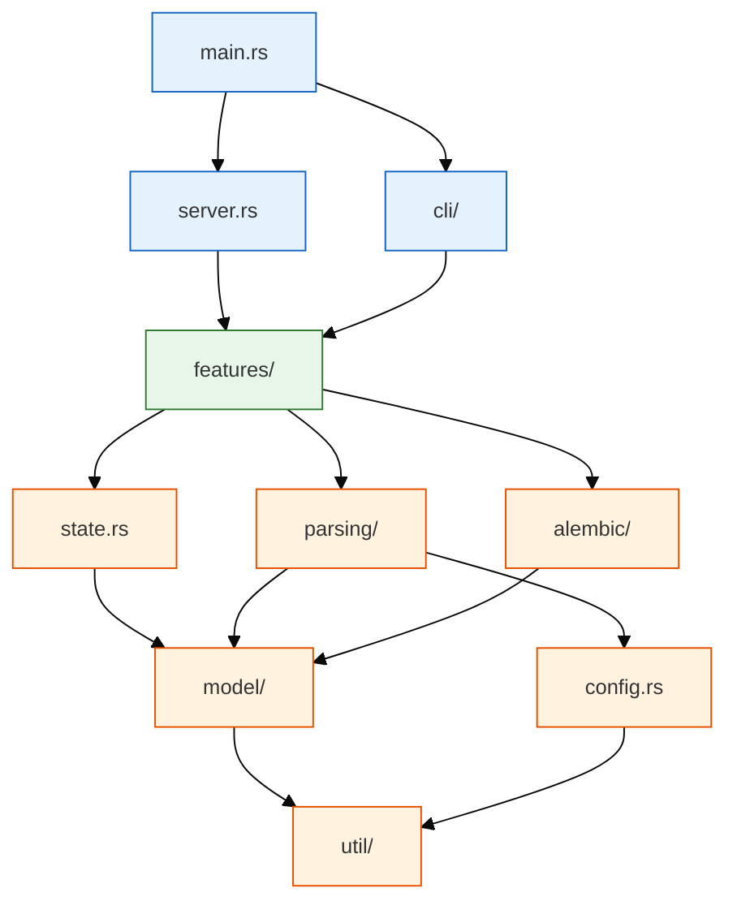

# E02 — Folder Structure

> **Status:** Approved
>
> **Version:** 0.1   ·   **Last updated:** 2026-06-18
>
> **Purpose:** Where code lives in the `src/` tree and which way dependencies point — the source layout every module follows, and the test split that mirrors it.
>
> **Depends on:** [constitution](../constitution.md)   ·   **Related:** [E01-architecture](E01-architecture.md), [E03-tech-stack](E03-tech-stack.md), [E16-conventions](E16-conventions.md), [E17-testing](E17-testing.md), [E29-e2e-testing](E29-e2e-testing.md)

> Requirement tag: **FOLD**

---

## 1. Purpose & Scope

This spec defines the crate's module layout and the layering rule that keeps it from tangling.

The server is one Rust binary that does a lot — it parses Python, indexes a workspace, answers a dozen LSP requests, and runs a headless CLI. Without a clear home for each responsibility, that surface turns into a knot fast. The layout below gives every concern one place to live and one direction to depend in, mirroring the two-pass architecture from [E01](E01-architecture.md): per-file extraction feeds a workspace index, and pure-function features read from it.

This spec covers:

- The `src/` module tree and what each module owns.
- The downward-only dependency rule between modules.
- The split between inline unit tests, integration tests, and the `pytest-lsp` end-to-end suite.
- Where generated and fixture files live, and the rules that keep them out of the way.

## 2. Non-Goals / Out of Scope

- The *content* of each module — the actual types, handlers, and algorithms — is owned by the relevant foundation or feature spec ([E07](E07-data-model.md), [E30](E30-extraction-and-indexing.md), [F01](../features/F01-orm-correctness-diagnostics.md)…). This spec only says where things go.
- The lint/format/layering rules a handler must obey are owned by [E16-conventions](E16-conventions.md). This spec defines the *shape* of the layering; E16 defines the *discipline* inside it.
- The named fixtures registry (`clean-blog` and the per-code variants) is owned by [E17-testing](E17-testing.md). This spec only says where fixture files sit on disk.

## 3. Background & Rationale

The layout is adopted wholesale from babel-lsp, a sibling LSP in the same family — see [ADR-001](../decisions/ADR-001-adopt-babel-lsp-architecture.md). Sharing the skeleton means anyone who has worked on one server can navigate the other, and the hard-won shape (pure-function features, a `util` floor, an out-of-tree e2e suite) carries over for free.

The legacy SQLAlchemy LSP grew its modules organically — `features/`, `parsing/`, `model/`, `alembic/`, `analysis/`, `sql/`, `visualization/`. We keep the parts that earned their place and regroup the rest so the dependency direction is unambiguous. The biggest change: a real `cli/` tree (the legacy server had no headless mode) and a `util/` floor for offset, encoding, and `# noqa` helpers.

## 4. Concepts & Definitions

- **Foundation module** — a module features depend *on*: `state`, `config`, `parsing`, `model`, `alembic`, `util`. (See the engineering principle "dependencies flow downward" in the [constitution](../constitution.md).)
- **Feature handler** — a pure function under `features/` that takes the shared state plus a request and returns an LSP response. (Canonical definition in [glossary](../glossary.md).)
- **Workspace index** — the in-memory model/table/revision lookup tables, owned by [E07](E07-data-model.md) and built by the pass-2 relink.

## 5. Detailed Specification

### 5.1 The layout

The server is a single binary crate. Modules group by *what they do*, not by which LSP method calls them — so `hover.rs` and `definition.rs` both live under `features/`, while everything they read lives in the foundation modules below them.

**REQ-FOLD-01 — One crate, modules by responsibility.**

The tree below is the canonical layout. A new module joins the group whose responsibility it shares; it does not get a new top-level home unless it introduces a genuinely new responsibility.

```text
# src/ — the sqlalchemy-lsp binary crate
src/
├── main.rs            # clap entry: subcommand dispatch, transport, tracing setup
├── server.rs          # impl LanguageServer for Backend — every request/notification handler
├── state.rs           # WorkspaceState, DocumentState, the model/table/revision indexes (E07)
├── config.rs          # three-source config load + model/Alembic auto-discovery (E15)
│
├── parsing/           # pass 1: source → facts (E30)
│   ├── extractor.rs   # tree-sitter-python walk → Model/Column/Relationship/TableArg
│   └── python.rs      # SA/Alembic detection indicators, node helpers
│
├── model/             # the extracted data types (E07)
│   └── types.rs       # Model, Column, Relationship, TableArg, MappedType
│
├── alembic/           # migration extraction + types (F13)
│   ├── mod.rs         # MigrationFile, OpCall, TableRef, ColumnRef, DownRevision
│   └── extractor.rs   # tree-sitter walk of revision/down_revision/op.* calls
│
├── features/          # pure-function LSP capabilities (F03–F13)
│   ├── completion.rs       hover.rs            definition.rs
│   ├── references.rs       rename.rs           symbols.rs
│   ├── signature_help.rs   inlay_hints.rs      code_action.rs
│   ├── diagnostics.rs # the shared diagnostics engine: SQLA-* findings (F01/F02/F13)
│   └── schema.rs      # ER-diagram rendering for the schema command (F12)
│
├── cli/               # headless subcommands (F14)
│   ├── check.rs       # the CI linter + its output formats
│   ├── format.rs      # output formatting shared across formats
│   └── stats.rs       # workspace summary counts
│
└── util/              # the dependency floor: offset/encoding math, URI, # noqa parsing
```

Two notes on the regrouping from legacy. The legacy `analysis/`, `sql/`, and `visualization/` modules fold into their natural homes — analysis logic lives in `features/diagnostics.rs`, schema rendering in `features/schema.rs`. And `cli/` is entirely new, because the legacy server had no headless mode; it reuses the same indexing pipeline rather than duplicating it ([F14](../features/F14-cli-linter.md)).

### 5.2 What each module owns

A one-line tour, so you know where to look before you open a file:

- **`main.rs`** — the clap entry point. It parses subcommands, and with no subcommand defaults to `lsp --stdio`. It picks the transport, initializes `tracing` (to stderr or `log_file`, never stdout), and hands off to the server or a CLI command.
- **`server.rs`** — the one place the `LanguageServer` trait is implemented. Each handler is thin: it pulls state, calls the matching pure function in `features/`, and returns the response. Notification serialization per URI and `spawn_blocking` for parsing live here ([E01](E01-architecture.md)).
- **`state.rs`** — the `WorkspaceState`: the `DashMap` of open documents and the model/table/revision indexes every feature reads ([E07](E07-data-model.md)).
- **`config.rs`** — loads the three config sources in precedence order and runs model/Alembic auto-discovery ([E15](E15-app-config.md)).
- **`parsing/` + `model/`** — pass 1. `parsing/` walks the tree-sitter tree and emits the facts; `model/` defines what those facts *are* ([E30](E30-extraction-and-indexing.md), [E07](E07-data-model.md)).
- **`alembic/`** — the migration counterpart to `parsing/` + `model/`: it extracts revision links and `op.*` calls into its own types ([F13](../features/F13-alembic-support.md)).
- **`features/`** — one file per LSP capability, each a pure function of the state. `diagnostics.rs` is special: it is the single shared engine that both the server and the CLI call, so they can never disagree (CLI/server parity, [E17](E17-testing.md)).
- **`cli/`** — the headless subcommands. They build the same index and call the same `diagnostics.rs` engine, then format the findings for CI ([F14](../features/F14-cli-linter.md)).
- **`util/`** — the floor. Byte/UTF-8/UTF-16 offset conversion, URI path handling, and `# noqa` comment parsing. It depends on nothing internal.

### 5.3 The layering rule

The whole point of grouping by responsibility is to make the dependency direction obvious. Dependencies flow strictly downward, and features never reach sideways to each other.

**REQ-FOLD-02 — Dependencies flow downward; features never call each other.**

`util` depends on nothing internal — it is the floor. `model` and `config` sit on `util`. `parsing`, `alembic`, and `state` depend on `model`, `config`, and `util`. The `features/` modules depend on everything below them — `state`, `parsing`, `alembic`, `model`, `config`, `util` — but **never on each other**. Each feature is a pure function of the state ([E01](E01-architecture.md)), so a feature calling another feature would smuggle in hidden coupling and break that contract. `server.rs` and `cli/` sit on top, wiring requests to features.

**REQ-FOLD-03 — Shared logic moves down, never sideways.**

When two features need the same helper, the helper moves *down* into `util`, `parsing`, or `model` — not sideways into a sibling feature. For example, if both `hover.rs` and `inlay_hints.rs` need to render a relationship's resolved target as `→ User`, that formatting belongs in a shared helper below `features/`, not in one feature imported by the other. This keeps the "features are pure functions" rule true and stops `features/` from growing an internal web.

The enforcement of this rule — the forbidden-import lint that fails the build if a feature imports a sibling — is owned by [E16-conventions](E16-conventions.md). This spec defines the *shape*; E16 defines the *guardrail*.

### 5.4 Tests

Tests live in two homes, matching how they run.

**REQ-FOLD-04 — Unit tests inline, integration and e2e tests out of tree.**

Rust unit tests live in `#[cfg(test)]` modules beside the code they test — an extractor test sits at the bottom of `parsing/extractor.rs`, a diagnostics-engine test at the bottom of `features/diagnostics.rs`. Integration tests that exercise the crate as a library (for example, "build an index from a fixture directory, assert the findings") live in the top-level `tests/` directory. The end-to-end suite — a real LSP client driving the *built binary* over stdio against fixture workspaces — lives in `tests/e2e/` and is driven by `pytest-lsp` ([E29](E29-e2e-testing.md)).

The directory shape:

```text
# the test tree, rooted at the repo
tests/
├── *.rs               # Rust integration tests (library-level, e.g. index → findings)
├── release_assets.rs  # asserts every release artifact exists (F16)
└── e2e/               # pytest-lsp suite against the built binary (E29)
    ├── conftest.py    # fixture-workspace setup + teardown
    ├── test_*.py      # one module per feature surface
    └── fixtures/      # the clean-blog workspace + per-code broken variants (E17)
```

### 5.5 Generated and fixture files

Two kinds of files are *not* hand-edited source, and they get clear rules so nobody mistakes them for it.

**REQ-FOLD-05 — Generated files are reproducible and never hand-edited.**

A `build.rs` at the crate root stamps build-time values (such as `BUILD_TIMESTAMP`) into the binary via `cargo`'s `OUT_DIR` mechanism ([E03](E03-tech-stack.md)). Generated artifacts are reproducible from a clean checkout; nobody edits them by hand, and a stale generated file is regenerated, never patched.

**REQ-FOLD-06 — Fixtures are real workspaces under `tests/e2e/fixtures/`.**

Test fixtures are real, on-disk SQLAlchemy/Alembic workspaces — the `clean-blog` baseline and its minimal per-code broken variants. They live under `tests/e2e/fixtures/`, owned and named by the registry in [E17](E17-testing.md). A fixture is a normal Python project tree (`models/{user,post,comment,tag}.py`, `migrations/versions/…`), so the server reads it exactly as it would a user's workspace. Fixtures are never generated at test time; the one exception is the `large-workspace` performance fixture, which is generated by a checked-in script so its size stays tunable.

## 6. Visualizations

The dependency direction is the load-bearing idea here, so it's worth a picture. Arrows point from a module to what it depends on — and every arrow points downward.



The rule reads off the diagram directly: no arrow ever points sideways within `features/`, and no foundation module points up at a feature.

## 7. Examples & Use Cases

Say you're adding the relationship inlay hint from the `clean-blog` cast — the `‹list[Comment]›` that renders at the end of `Post.comments`. Where does each piece go?

The hint-building logic is a new capability, so it lives in `features/inlay_hints.rs`. To render the target it needs to resolve `"Comment"` to the indexed `Comment` model and format it as `list[Comment]`. That resolution reads the workspace index in `state.rs` and the model types in `model/types.rs` — both *below* features, so the import is allowed. The `‹ ›` bracket formatting is shared with hover, so it moves *down* into a helper in `util/` rather than being imported from `features/hover.rs` (REQ-FOLD-03). The handler in `server.rs` stays thin: pull state, call `features::inlay_hints`, return the hints. The test sits inline in `inlay_hints.rs` for the unit case, and a `pytest-lsp` scenario in `tests/e2e/` drives the built binary against the `clean-blog` fixture.

## 8. Edge Cases & Failure Modes

- **A feature needs another feature's output** → push the shared logic down into a foundation module; never import the sibling feature (REQ-FOLD-02, REQ-FOLD-03).
- **A new responsibility doesn't fit any module** → it earns a new top-level module only if it's a genuinely new concern; otherwise it joins the closest existing group. Resist a `misc/` or `helpers/` dumping ground.
- **A generated file drifts from its source** → it is regenerated from `build.rs`, never hand-patched (REQ-FOLD-05).
- **A fixture needs to trigger two findings at once** → split it into two single-finding variants; each broken fixture in `tests/e2e/fixtures/` triggers exactly one code (REQ-FOLD-06, see [E17](E17-testing.md)).

## 9. Cross-References

- **Depends on:** [constitution](../constitution.md) — the "dependencies flow downward" and "features are pure functions" engineering principles this layout encodes.
- **Related:**
  - [E01-architecture](E01-architecture.md) — the two-pass pipeline the module groups mirror, and the pure-function feature-dispatch rule.
  - [E03-tech-stack](E03-tech-stack.md) — the crates each module uses and the `build.rs` build stamp.
  - [E07-data-model](E07-data-model.md) — the types `model/`, `alembic/`, and `state.rs` hold.
  - [E30-extraction-and-indexing](E30-extraction-and-indexing.md) — what `parsing/` produces.
  - [E15-app-config](E15-app-config.md) — what `config.rs` loads.
  - [E16-conventions](E16-conventions.md) — the lint that enforces the layering rule, and the never-log-to-stdout rule `main.rs` honors.
  - [E17-testing](E17-testing.md) — the fixtures registry under `tests/e2e/fixtures/`.
  - [E29-e2e-testing](E29-e2e-testing.md) — the `pytest-lsp` suite in `tests/e2e/`.
  - [F14-cli-linter](../features/F14-cli-linter.md) — the `cli/` subcommands.

## 10. Changelog

- **2026-06-18** — Approved.
- **2026-06-17** — Initial draft: the `parsing` / `model` / `alembic` / `features` / `cli` / `util` layout, the downward-only layering rule, the new `cli/` tree and `util/` floor relative to legacy, the unit/integration/e2e test split, and the generated-file and fixture rules.
