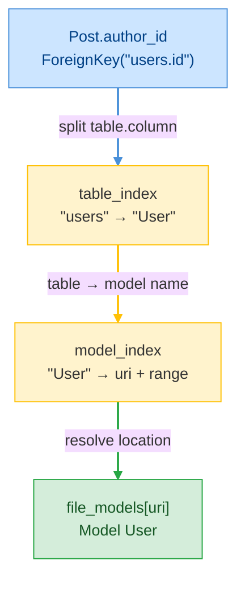

# E07 — Data Model

> **Status:** Approved
>
> **Version:** 0.2   ·   **Last updated:** 2026-06-18
>
> **Purpose:** The in-memory shapes the whole server reads — the model, column, relationship, and Alembic facts, plus the workspace index that joins them. Every feature reads these structures; none re-parses.
>
> **Depends on:** [constitution](../constitution.md), [E30-extraction-and-indexing](E30-extraction-and-indexing.md)   ·   **Related:** [E01-architecture](E01-architecture.md), [F01-orm-correctness-diagnostics](../features/F01-orm-correctness-diagnostics.md), [F04-hover](../features/F04-hover.md), [F13-alembic-support](../features/F13-alembic-support.md)

> Requirement tag: **DATA**

---

## 1. Purpose & Scope

This spec defines the data structures the indexer builds and every feature reads. It is the single source of truth for "what we know about the workspace" — the SQLAlchemy model facts, the Alembic migration facts, and the lookup tables that let a feature answer a question in one step instead of re-walking a syntax tree.

This spec covers:

- The SQLAlchemy fact types — `Model`, `Column`, `Relationship`, `TableArg`, and the `MappedType` enum.
- The foreign-key and column-args shapes those facts carry.
- The Alembic fact types — `MigrationFile`, `OpCall`, `TableRef`, `ColumnRef`, and `DownRevision`.
- The `WorkspaceState` index — its seven maps, how they key, and how they replace atomically.

## 2. Non-Goals / Out of Scope

- **How** these facts are extracted from source — owned by [E30](E30-extraction-and-indexing.md).
- The pipeline that drives updates (debounce, generation counter, watcher events) — owned by [E01](E01-architecture.md).
- The meaning of any particular diagnostic that reads these shapes — owned by [F01](../features/F01-orm-correctness-diagnostics.md)/[F02](../features/F02-best-practice-lints.md)/[F13](../features/F13-alembic-support.md).

## 3. Background & Rationale

A language server answers a lot of questions about the same few facts. Hover wants a column's type; go-to-definition wants the model a foreign key points at; a diagnostic wants every relationship that names a `back_populates` counterpart. If each feature re-parsed the file to answer, the server would be slow and inconsistent.

So we extract once and store once. The constitution's first engineering principle says it plainly: **one source of truth for every fact.** A model, column, or revision is extracted once into the workspace index; features read it, never re-parse. This spec is that source of truth, written down as Rust types.

The shapes here are ported from the legacy SQLAlchemy LSP, which proved them against real-world projects. We keep their structure and refine the field set where the new resolution rules in [E30](E30-extraction-and-indexing.md) demand it (a column's DB-name alias, for instance).

## 4. Concepts & Definitions

These terms are canonical across the suite; the glossary owns the full definitions.

- **Model** — a mapped class, e.g. `User` → table `users`. (Canonical definition in [glossary](../glossary.md).)
- **Fact** — a single extracted datum (a model, column, relationship, or op call), replaced atomically when its file changes. (Canonical definition in [glossary](../glossary.md).)
- **Workspace index** — the in-memory model/table/revision lookup tables every feature reads. (Canonical definition in [glossary](../glossary.md).)
- **Range** — a half-open span in a source file (`start_line`, `start_col`, `end_line`, `end_col`), all zero-based. End columns are exclusive. Features translate these to LSP positions under the negotiated encoding ([E01](E01-architecture.md)).

## 5. Detailed Specification

### 5.1 The model fact

The central SQLAlchemy fact is the **model** — one mapped class with its columns, relationships, and table metadata.

**REQ-DATA-01 — A `Model` holds everything known about one mapped class.**

A `Model` records the class name, its resolved table name, its base classes, and its columns and relationships keyed by Python attribute name. It also keeps its docstring and two ranges — the class-name identifier (for go-to-definition and rename) and the whole class body (for symbols). The shape, quoted from the type it describes:

```rust
// src/model/types.rs
pub struct Model {
    pub name: String,
    pub table_name: Option<String>,            // from __tablename__
    pub bases: Vec<String>,                    // superclass names, as written
    pub columns: HashMap<String, Column>,      // keyed by Python attribute
    pub relationships: HashMap<String, Relationship>,
    pub table_args: Vec<TableArg>,             // from __table_args__
    pub duplicate_columns: Vec<(String, Range)>,
    pub docstring: Option<String>,
    pub name_range: Range,                      // the class-name identifier
    pub full_range: Range,                      // the whole class
}
```

`table_name` is an `Option` because a model may inherit a base without declaring `__tablename__` — a fact a diagnostic reads to fire `SQLA-W101` (missing-tablename). `duplicate_columns` carries the earlier definition's name range so the duplicate-column diagnostic (`SQLA-E103`) can point at the collision; the live entry in `columns` is always the last one seen.

> **Note:** `bases` stores the names exactly as written in source (`"Base"`, `"DeclarativeBase"`, `"TimestampMixin"`). Resolving which of those is the project's real declarative base — and reading its `MetaData` — is [E30](E30-extraction-and-indexing.md)'s job, not a field on `Model`.

### 5.2 The column fact

A **column** is one mapped attribute backed by `mapped_column(...)` — the workhorse fact behind hover, FK navigation, and most type diagnostics.

**REQ-DATA-02 — A `Column` records its type, its column-level args, and its optional foreign key.**

Take `User.full_name` from the `clean-blog` cast: a `String(120)`, unique, mapped from the Python attribute `name` via `mapped_column(name="full_name")`. The column fact captures the Python attribute name, the resolved `MappedType`, the parsed argument flags, an optional `ForeignKeyRef`, the column's `doc=`, and the DB-column alias when it differs from the attribute:

```rust
// src/model/types.rs
pub struct Column {
    pub name: String,                    // the Python attribute, e.g. "name"
    pub key: Option<String>,             // the DB column name when aliased, e.g. "full_name"
    pub mapped_type: MappedType,
    pub args: ColumnArgs,
    pub foreign_key: Option<ForeignKeyRef>,
    pub doc: Option<String>,             // from mapped_column(doc=…)
    pub name_range: Range,               // the attribute identifier
    pub full_range: Range,               // the whole statement
}
```

The `key` field is the only addition over the legacy shape. When `mapped_column(name="full_name")` (or `key="full_name"`) renames the database column, the Python attribute (`name`) and the DB column (`full_name`) diverge. Hover ([F04](../features/F04-hover.md)) shows both, so `key` stores the DB name and `name` stays the attribute. When they agree, `key` is `None`.

**REQ-DATA-03 — `ColumnArgs` carries the boolean flags and the default expression.**

The argument flags drive nullability, primary-key, uniqueness, and index diagnostics. They default the way SQLAlchemy does — a column is nullable unless told otherwise:

```rust
// src/model/types.rs
pub struct ColumnArgs {
    pub primary_key: bool,   // default false
    pub nullable: bool,      // default true
    pub unique: bool,        // default false
    pub index: bool,         // default false
    pub default: Option<String>,  // the default expression, as source text
}
```

When `mapped_column(...)` sets `nullable=` explicitly, the extractor takes that value verbatim. When it doesn't, nullability is inferred from the annotation — `Mapped[Optional[str]]` is nullable, `Mapped[str]` is not (the inference rule lives in [E30](E30-extraction-and-indexing.md)). `default` is stored as raw source text, because a default can be a literal, a callable, or an expression, and the modernization lints read its shape rather than its value.

**REQ-DATA-04 — A `ForeignKeyRef` records the target table, column, and the literal's range.**

`mapped_column(ForeignKey("users.id"))` produces a foreign-key fact split into its table and column halves, with the raw text kept for hover and the range kept for go-to-definition onto the FK string itself:

```rust
// src/model/types.rs
pub struct ForeignKeyRef {
    pub table: String,    // "users"  (or a model name, for ForeignKey(User.id))
    pub column: String,   // "id"
    pub raw_text: String, // "users.id"
    pub range: Range,     // the FK argument node
}
```

Both string FKs (`ForeignKey("users.id")`) and attribute FKs (`ForeignKey(User.id)`) land in this same shape; the difference is whether `table` holds a table name or a model name, which [E30](E30-extraction-and-indexing.md) resolves at lookup time through the index.

### 5.3 The relationship fact

A **relationship** is a `relationship(...)` attribute wiring two models together — `User.posts` ↔ `Post.author`, for instance.

**REQ-DATA-05 — A `Relationship` records its target, its wiring kwargs, and the ranges of the parts features navigate.**

The relationship fact is the richest one, because relationships carry the most diagnostics and the most navigation targets. It records the resolved target model, the explicitly-written target (string or identifier, when present), and the wiring kwargs — `back_populates`, `lazy`, `uselist`, `secondary`, `cascade`. It keeps `is_list` (whether the annotation is a collection) and the ranges of the target, `back_populates`, and `cascade` so each can be a navigation or quick-fix anchor:

```rust
// src/model/types.rs
pub struct Relationship {
    pub name: String,                    // the Python attribute, e.g. "posts"
    pub target_model: String,            // resolved target, e.g. "Post"
    pub explicit_target: Option<String>, // the written arg, when relationship("Post"|Post|…)
    pub back_populates: Option<String>,
    pub lazy: Option<String>,
    pub uselist: Option<bool>,
    pub secondary: Option<String>,
    pub cascade: Option<String>,
    pub is_list: bool,                   // collection vs scalar, from the annotation
    pub name_range: Range,
    pub full_range: Range,
    pub target_range: Option<Range>,
    pub back_populates_range: Option<Range>,
    pub cascade_range: Option<Range>,
}
```

`target_model` is the resolved name the index can look up; `explicit_target` is what the user actually typed, kept because a forward reference (`relationship("Post")`), a lambda (`relationship(lambda: Post)`), and a bare annotation (`Mapped[list["Post"]]` with no positional arg) all resolve to the same target but read differently. `is_list` distinguishes a one-to-many (`Mapped[list["Post"]]`) from a scalar (`Mapped["User"]`), which the `uselist`-mismatch diagnostic (`SQLA-W404`) reads.

### 5.4 The table-args fact

`__table_args__` carries table-level constructs — indexes, unique constraints, primary keys.

**REQ-DATA-06 — A `TableArg` records a construct's kind and the columns it names.**

Each entry in `__table_args__` becomes one `TableArg`. We keep the construct kind (`"Index"`, `"UniqueConstraint"`, `"PrimaryKeyConstraint"`), the column names it references, the range of each column string (so an unresolved column can be diagnosed precisely), and the whole construct's range:

```rust
// src/model/types.rs
pub struct TableArg {
    pub kind: String,               // "Index" | "UniqueConstraint" | "PrimaryKeyConstraint"
    pub columns: Vec<String>,       // the column names referenced
    pub column_ranges: Vec<Range>,  // one per column, parallel to `columns`
    pub full_range: Range,
}
```

`column_ranges` runs parallel to `columns` so the table-arg-column diagnostic (`SQLA-E105`) can underline the exact string that names a column the model doesn't have.

### 5.5 The mapped-type enum

`MappedType` is the type a `Mapped[...]` annotation resolves to — the thing hover renders and FK-type diagnostics compare.

**REQ-DATA-07 — `MappedType` enumerates the type shapes the server understands.**

We don't model Python's whole type system — only the shapes that drive SQLAlchemy behavior. Scalars (`int`, `str`, `float`, `bool`, `datetime`), the wrappers (`Optional`, `List`), a forward reference (a quoted model name), an explicit SQL type (`String(120)`), and an escape hatch for anything we can't classify:

```rust
// src/model/types.rs
pub enum MappedType {
    Int,
    Str,
    Float,
    Bool,
    DateTime,
    Optional(Box<MappedType>),               // Mapped[Optional[str]] / Mapped[str | None]
    List(String),                            // Mapped[list["Post"]] → "Post"
    ForwardRef(String),                      // Mapped["User"] → "User"
    SqlType { name: String, args: Vec<String> }, // String(120), Numeric(10, 2)
    Unknown(String),                         // anything unclassified, kept verbatim
}
```

`Unknown` is the honesty valve. When the server can't classify a type, it keeps the source text and stays silent rather than guessing — the constitution's P4 in a single variant. A type diagnostic that compares an FK column against its target skips the check entirely when either side is `Unknown`.

`MappedType` renders for hover via a `display()` method: `Optional(Str)` shows as `Optional[str]`, `List("Post")` as `List[Post]`, `SqlType { name: "String", args: ["120"] }` as `String(120)`.

### 5.6 The Alembic facts

The migration facts mirror the model facts: one per file, indexed by revision, with the table and column references inside each operation kept for navigation. The full set lives in [F13](../features/F13-alembic-support.md); the shapes live here.

**REQ-DATA-08 — A `MigrationFile` records the revision, its parent, its message, and the operations inside it.**

A migration file declares `revision` and `down_revision` at module scope and calls `op.*` inside `upgrade()`/`downgrade()`. The fact captures all of it, with ranges so chain diagnostics can point at the offending revision string. It also carries the revision's human label — the `message`, taken from the filename slug and/or the first line of the module docstring — so a migration can be found by what it does, not just its id ([F08](../features/F08-symbols.md)):

```rust
// src/alembic/mod.rs
pub struct MigrationFile {
    pub revision: Option<String>,
    pub down_revision: DownRevision,
    pub message: Option<String>, // human label: filename slug / docstring first line
    pub revision_range: Option<Range>,
    pub down_revision_range: Option<Range>,
    pub op_calls: Vec<OpCall>,
}

pub enum DownRevision {
    None,               // a base migration (chain root)
    Single(String),     // the usual case
    Multiple(Vec<String>), // a merge migration
}
```

`DownRevision` is an enum, not an `Option<String>`, because a merge migration has *several* parents — and the multiple-heads diagnostic (`SQLA-W702`) needs to tell a merge apart from a base.

**REQ-DATA-09 — An `OpCall` records the operation and its optional table and column references.**

Each `op.*` call becomes an `OpCall` carrying the operation name, the call's range, and — when present — the table and column the operation names. Those references power go-to-definition from a migration onto the model it touches:

```rust
// src/alembic/mod.rs
pub struct OpCall {
    pub operation: String,            // "add_column", "create_table", …
    pub full_range: Range,
    pub table_name: Option<TableRef>,
    pub column_name: Option<ColumnRef>,
}

pub struct TableRef  { pub name: String, pub range: Range }
pub struct ColumnRef { pub name: String, pub range: Range }
```

`table_name` and `column_name` are optional because not every operation names both — `op.create_table("posts", …)` names a table but no single column.

### 5.7 The workspace index

All of the facts above live in one shared struct — the **workspace index** — behind seven `DashMap`s for lock-free concurrent reads.

**REQ-DATA-10 — `WorkspaceState` holds seven maps, all keyed for one-step lookup.**

`WorkspaceState` is the single object every feature receives. It keeps the per-file model facts, two reverse indexes that answer cross-file questions, the raw sources and parse trees (so a feature can re-walk a tree when it needs a node the facts didn't capture), and the two Alembic maps:

```rust
// src/state.rs
pub struct WorkspaceState {
    pub file_models: DashMap<Uri, FileModels>,      // uri → that file's models
    pub model_index: DashMap<String, ModelLocation>, // model name → where it lives
    pub table_index: DashMap<String, String>,        // table name → model name
    pub file_sources: DashMap<Uri, String>,          // uri → current source text
    pub parse_trees: DashMap<Uri, Tree>,             // uri → tree-sitter tree
    pub migration_files: DashMap<Uri, MigrationFile>, // uri → migration facts
    pub revision_index: DashMap<String, Uri>,        // revision id → file
}
```

The two reverse indexes are what make cross-file features cheap. A foreign key names a *table* (`"users.id"`); to navigate to the model, a feature reads `table_index["users"]` → `"User"`, then `model_index["User"]` → its file and range. A migration names a *table*; the same path resolves it to a model. None of this re-parses anything.

**REQ-DATA-11 — Updating a file replaces its facts atomically.**

When a file changes, the server re-extracts it and swaps in the new facts in one operation. The update first purges the file's *old* contributions from the reverse indexes — every model name and table name it used to define — then inserts the new ones, then replaces the per-file entry:

```rust
// src/state.rs
impl WorkspaceState {
    pub fn update_file(&self, uri: &Uri, models: FileModels) {
        // 1. purge old model_index / table_index entries this file owned
        // 2. insert the new ones
        // 3. file_models.insert(uri, models)
    }
}
```

This purge-then-insert order is what prevents stale data. Rename a model and the old name vanishes from `model_index` before the new one lands, so no feature ever reads a name that no longer exists. The constitution's "no stale data" rule ([E01](E01-architecture.md)) rests on this method.

**REQ-DATA-12 — Removing a file purges its facts and its diagnostics.**

When a file is deleted or closed-without-disk-backing, the server removes its models from both reverse indexes, drops its migration (and the revision it claimed), and clears its source and parse tree. A cross-file reference that pointed at the removed file's model now resolves to nothing — and per P4, the feature reading it stays silent rather than reporting a phantom.

**REQ-DATA-13 — The index is the single source of truth features read.**

Per the constitution's first engineering principle, a feature handler receives `&WorkspaceState` and answers from these maps. It never re-runs the extractor and never opens a file off disk. When a feature genuinely needs a syntax node the facts didn't capture (a rare case), it reads the cached `parse_trees` entry — still no re-parse. This is the contract that keeps the editor server and the `check` CLI ([F14](../features/F14-cli-linter.md)) in lockstep: both read the same index, so they can never disagree.

## 7. Visualizations

The index is a join. One foreign-key string fans out through the two reverse indexes to the model it targets, without re-parsing anything.



## 8. Data Shapes

The Rust types in §5 are the data shapes this spec owns — they are the contract every feature reads against. The two that cross the most feature boundaries are repeated here for quick reference; treat the §5 definitions as authoritative.

The model fact, keyed in `file_models[uri]`:

```rust
// src/model/types.rs — see REQ-DATA-01
pub struct Model {
    pub name: String,
    pub table_name: Option<String>,
    pub columns: HashMap<String, Column>,
    pub relationships: HashMap<String, Relationship>,
    // … table_args, bases, docstring, ranges
}
```

The reverse-index entry, keyed in `model_index[name]`:

```rust
// src/model/types.rs
pub struct ModelLocation {
    pub uri: Uri,
    pub model_name: String,
    pub range: Range,   // the class-name identifier
}
```

## 9. Examples & Use Cases

Consider the `clean-blog` cast. After indexing, `Post` lives as a `Model` in `file_models["…/post.py"]`, with `author_id` as a `Column` carrying a `ForeignKeyRef { table: "users", column: "id", … }` and `author` as a `Relationship { target_model: "Post"→"User", back_populates: Some("posts"), is_list: false, … }`.

When you hover `Post.author_id`, the hover feature reads the `Column`, sees the `foreign_key`, and follows `table_index["users"] → "User"` and `model_index["User"]` to render `→ users.id (User.id)` — all from the index, no file touched. When you rename `User`, `update_file` purges `"User"` from `model_index` and `table_index`, the file re-extracts, and the new name lands — so the next hover on `author_id` resolves correctly without reopening anything.

## 10. Edge Cases & Failure Modes

- A class with neither `__tablename__` nor a resolved base → not a model; it never enters `file_models` ([E30](E30-extraction-and-indexing.md) decides this).
- Two models in different files declaring the same `__tablename__` → `table_index` holds the last writer; the collision is the `SQLA-E102` diagnostic, not an index error.
- A column whose type can't be classified → `MappedType::Unknown(text)`; comparisons that need a known type skip it (P4).
- A migration with no `revision` → it stays in `migration_files` but contributes nothing to `revision_index`; chain diagnostics treat it as unlinkable.
- A forward-reference target that names no indexed model → `target_model` holds the unresolved name; the relationship-target diagnostic (`SQLA-E401`) reads it, but navigation stays silent (P4).

## 16. Cross-References

- **Depends on:** [constitution](../constitution.md) — P4 (silence on unresolvable input) and the "one source of truth" engineering principle these shapes embody; [E30](E30-extraction-and-indexing.md) — the extraction that fills every field here.
- **Related:** [E01-architecture](E01-architecture.md) — the two-pass pipeline and atomic-replacement rules that keep the index fresh; [F01-orm-correctness-diagnostics](../features/F01-orm-correctness-diagnostics.md) — the diagnostics that read these facts; [F04-hover](../features/F04-hover.md) — reads the column alias (`key`) and FK target; [F13-alembic-support](../features/F13-alembic-support.md) — owns the meaning of the Alembic facts.

## 17. Changelog

- **2026-06-18** — v0.2: added a `message` field to `MigrationFile` (REQ-DATA-08) — the revision's human label, taken from the filename slug and/or the module docstring's first line — so a migration can be found by message, feeding the narrowed [F08](../features/F08-symbols.md) Alembic-revision workspace symbols.
- **2026-06-18** — Approved.
- **2026-06-17** — Initial draft. Ported the SQLAlchemy facts (`Model`, `Column` + `ColumnArgs` + `ForeignKeyRef`, `Relationship`, `TableArg`, `MappedType`) and the Alembic facts (`MigrationFile`, `OpCall`, `TableRef`, `ColumnRef`, `DownRevision`) from the legacy types, added the `Column.key` alias field for [F04](../features/F04-hover.md), and specified the seven-map `WorkspaceState` index with its atomic-replacement and single-source-of-truth rules.
