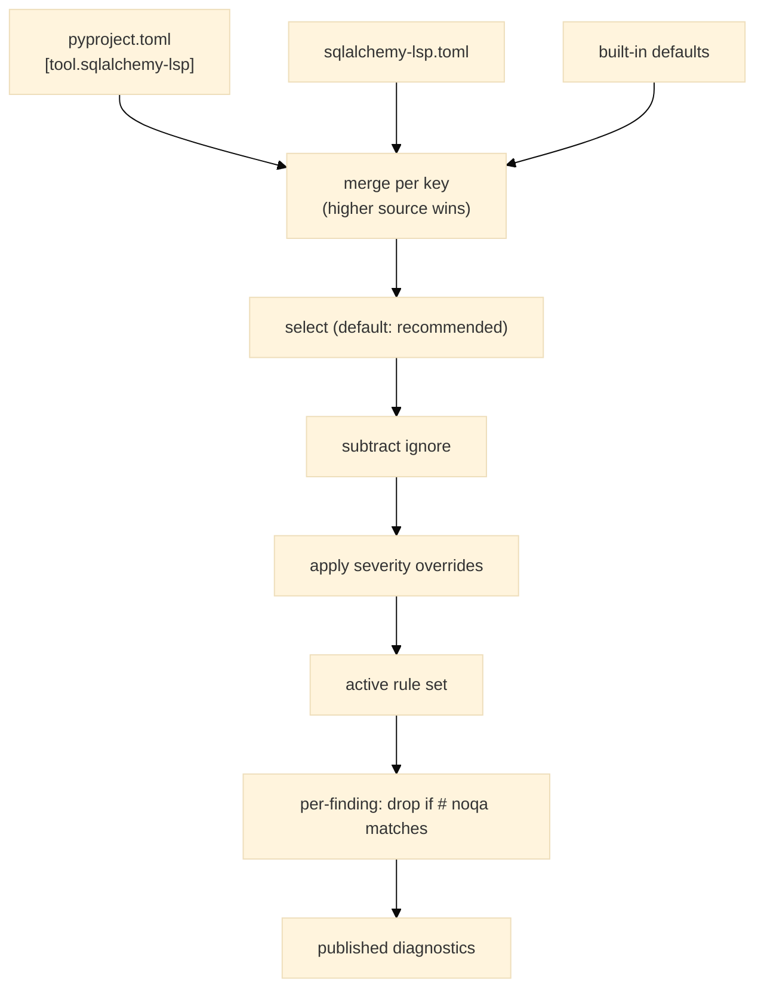

# E15 — App Config

> **Status:** Draft
>
> **Version:** 0.4   ·   **Last updated:** 2026-06-18
>
> **Purpose:** Where the server's settings come from, how it finds your models and migrations when you say nothing, every config key it reads, the `SQLA-` diagnostic-code scheme, and how to silence a finding inline with `# noqa`.
>
> **Depends on:** [constitution](../constitution.md), [E01-architecture](E01-architecture.md)   ·   **Related:** [F01-orm-correctness-diagnostics](../features/F01-orm-correctness-diagnostics.md), [F02-best-practice-lints](../features/F02-best-practice-lints.md), [F13-alembic-support](../features/F13-alembic-support.md), [F14-cli-linter](../features/F14-cli-linter.md)

> Requirement tag: **CFG**

---

## 1. Purpose & Scope

Configuration is how you tune the server to your project without touching its code. This spec defines where settings are read from, how the sources layer on top of each other, how the server finds your model packages and Alembic root when you leave it unconfigured, the full key reference, the diagnostic-code naming scheme every finding uses, and the `# noqa` comments that suppress a finding on a line or in a whole file.

This spec covers:

- The three config sources and their per-key precedence.
- Auto-discovery of model packages and the Alembic root.
- The full config-key reference, including per-rule diagnostic toggles.
- The `SQLA-<SEV><CLASS><NN>` diagnostic-code scheme and its default-on policy.
- Inline `# noqa` suppression, and the `SQLA-W901 unused-noqa` meta-finding.
- Config-file watching that re-resolves and re-indexes on change.

## 2. Non-Goals / Out of Scope

- The diagnostic catalog itself — the rules, messages, and quick-fixes — lives in [F01](../features/F01-orm-correctness-diagnostics.md), [F02](../features/F02-best-practice-lints.md), and [F13](../features/F13-alembic-support.md). This spec defines only how those rules are *toggled and re-leveled*.
- The CLI flags that mirror this config (`--select`/`--ignore`) are owned by [F14](../features/F14-cli-linter.md); they read the same resolved config defined here.
- Tree-sitter extraction and the index built from the discovered packages are owned by [E30](E30-extraction-and-indexing.md).

## 3. Background & Rationale

A good linter is invisible until you need to argue with it. Most projects should need zero config — the server finds your models, finds your migrations, and turns on every rule worth running. When you *do* need to disagree — to silence a rule your team has decided against, or to bump an info-level hint up to an error — the knobs should be obvious and live where your project already keeps its settings.

We follow the same three-source, per-key model as the sibling [babel-lsp](E15-app-config.md), and the same ruff-style `select`/`ignore`/`severity` shape developers already know from their Python toolchain. The legacy SQLAlchemy LSP had no configuration at all; everything here is new.

## 4. Concepts & Definitions

- **Config source** — one of the three files (or the built-in defaults) a setting can come from. Defined in §5.1.
- **Per-key precedence** — a later source overrides individual keys it sets, not the whole file. Defined in §5.1.
- **Diagnostic code** — a `SQLA-<SEV><CLASS><NN>` identifier for a finding. (Canonical definition in [glossary](../glossary.md); scheme in §5.5.)
- **`# noqa`** — an inline comment that suppresses a finding. (Canonical definition in [glossary](../glossary.md); rules in §5.6.)
- **`target_dialect`** — the SQL dialect that gates dialect-sensitive rules such as `SQLA-H206`. Defined in §5.4.

## 5. Detailed Specification

### 5.1 Config sources and precedence

Settings resolve from three files plus the built-in defaults, and a later source overrides only the individual keys it sets.

**REQ-CFG-01 — Three sources, per-key precedence, defaults underneath.**

Settings resolve from these sources, highest precedence first:

1. `pyproject.toml` → `[tool.sqlalchemy-lsp]` — the preferred home, since your project already has this file.
2. `sqlalchemy-lsp.toml` → root-level keys — a dedicated file when you'd rather keep LSP config out of `pyproject.toml`.
3. Built-in defaults — under everything.

Precedence is **per key, not per file**. A `pyproject.toml` may set `target_dialect` while leaving `model_paths` to `sqlalchemy-lsp.toml`, and both win for the keys they set. List-valued keys like `diagnostics.ignore` accumulate across sources; map-valued keys like `diagnostics.severity` merge, with the higher-precedence source winning per entry.

### 5.2 Model-package discovery

When you don't point the server at your models, it finds them by scanning the workspace.

**REQ-CFG-02 — Find model packages automatically when unconfigured.**

When `model_paths` is empty, the server discovers your models so a typical project needs zero config. It scans for two signals: directories named `models/` (a common convention), and Python files that define a declarative base or a mapped class — a `class Base(DeclarativeBase)`, a `declarative_base()` call, or a class with `__tablename__`. The resolved-base rule that turns a project's own `class Base(...)` into the base every model inherits is owned by [E30](E30-extraction-and-indexing.md); discovery only locates the files to feed it. Any explicit `model_paths` merges with what discovery finds.

### 5.3 Alembic-root discovery

The server finds your migration history the same way you would — by looking for Alembic's own landmarks.

**REQ-CFG-03 — Find the Alembic root automatically when unconfigured.**

When `alembic_path` is unset, the server locates the migration root by looking for an `alembic.ini` at the workspace root, and for a `migrations/versions/` (or `alembic/versions/`) directory holding revision files. The discovered root feeds the migration index that [F13](../features/F13-alembic-support.md) reads. A project with no Alembic landmarks simply has no migration intelligence; the server stays silent rather than guessing.

### 5.4 The key reference

These are every setting the server reads, with its type, default, and what it does.

**REQ-CFG-04 — The configuration keys.**

| Key | Type | Default | Purpose |
|---|---|---|---|
| `model_paths` | `string[]` | `[]` (auto-discover) | Extra directories to scan for models ([E30](E30-extraction-and-indexing.md)). |
| `alembic_path` | `string` | `null` (auto-discover) | Path to the Alembic migration root ([F13](../features/F13-alembic-support.md)). |
| `target_dialect` | `string` | `null` | SQL dialect (`postgresql`, `mysql`, `sqlite`, …) gating dialect-sensitive rules like `SQLA-H206`. |
| `diagnostics.select` | `string[]` | `["recommended"]` | Codes, class tokens (`SQLA-3xx`), or a preset (`recommended`/`all`/`none`) to enable (§5.8). |
| `diagnostics.ignore` | `string[]` | `[]` | Codes or class tokens to disable, applied after `select` (§5.8). |
| `diagnostics.severity` | `map` | `{}` | Per-code or per-class severity override, e.g. `{ "SQLA-H205" = "warning" }` (§5.8). |
| `overrides` | `object[]` | `[]` | Glob-scoped config layers; each has `includes` and its own `diagnostics` block (§5.9). |
| `log_level` | `string` | `null` | `error` … `trace`; controls `tracing` verbosity. |
| `log_file` | `string` | `null` (stderr) | Optional log-file path; logs never go to stdout ([E16](E16-conventions.md)). |

### 5.5 The diagnostic-code scheme

Every finding the server emits carries a stable `SQLA-`-namespaced code, so it can be configured, suppressed, and grepped without colliding with other linters.

**REQ-CFG-05 — `SQLA-<SEV><CLASS><NN>` codes.**

A code has four parts:

- `SQLA-` — the namespace. It keeps our codes from colliding with pycodestyle/flake8 (`E`/`W`/`F`) and flake8-sqlalchemy (`SQA`), so a co-resident `# noqa: E501` never touches us.
- `<SEV>` — the *default* severity letter: `E` error, `W` warning, `I` info, `H` hint. It is a mnemonic only.
- `<CLASS>` — the hundreds digit, the diagnostic class: `1xx` structure & constraints, `2xx` columns & types, `3xx` foreign keys, `4xx` relationships, `5xx` modernization & conventions, `6xx` ORM extensions, `7xx` Alembic, `9xx` tooling.
- `<NN>` — the specific rule within its class.

So `SQLA-W303` is the warning-by-default FK-type-mismatch rule in the foreign-keys class. The catalog itself is authoritative in [F01](../features/F01-orm-correctness-diagnostics.md)/[F02](../features/F02-best-practice-lints.md)/[F13](../features/F13-alembic-support.md).

**REQ-CFG-06 — The code is a stable identifier; severity is overridable.**

The code never changes when you override a rule's severity. `SQLA-H205` stays `SQLA-H205` even after you bump it from a hint to a warning — the `H` records the *default*, not the current level. This is what lets you write `# noqa: SQLA-H205` and have it keep working regardless of how anyone re-levels the rule.

**REQ-CFG-07 — Default-on policy and the three off-by-default rules.**

Every rule defaults **on** except three, recorded in [ADR-008](../decisions/ADR-008-default-off-missing-column-comment.md) (which amends [ADR-003](../decisions/ADR-003-comprehensive-lints-defaults.md)). The off-by-default set is `{SQLA-H416, SQLA-H602, SQLA-I207}`, and the three are off for two distinct reasons:

- `SQLA-H416` (viewonly-write) and `SQLA-H602` (association-proxy-misconfigured) are off because they're shaky heuristics that false-positive too readily. These two are the **preview** rules — the "preview" label means *unproven heuristic*, and applies only to them.
- `SQLA-I207` (missing-column-comment) is off because it's an opt-in style opinion that fires on nearly every column, so leaving it on would drown you in noise — even though its detection is exact, not heuristic. It is an opt-in style rule, not a preview rule.

The `recommended` preset (the default for `diagnostics.select`, §5.8) turns on every rule *except* these three. To enable one, name it explicitly in `diagnostics.select`, or opt into the whole catalog with the `all` preset.

**REQ-CFG-08 — Resolution order: select, then ignore, then severity.**

The server resolves the active rule set in a fixed order. It starts from `select` (default `["recommended"]`), subtracts `ignore`, then applies `severity` overrides to whatever survives. Within each step, a preset, a class token, and a specific code are resolved by specificity (§5.8). An unknown code or class token in `select` or `ignore` is detected the same way everywhere, but the two front-ends respond differently by design: the **LSP server logs a config warning and ignores the bad entry**, never dying — a typo must not silence the whole server mid-session. The **`check` CLI treats it as a fatal usage error (exit 2)** so a typo can't quietly disable a check in CI ([F14](../features/F14-cli-linter.md)). Both read this same resolved config; only the reaction to a bad entry differs.

### 5.6 Inline suppression with `# noqa`

When a rule is right in general but wrong on one line, you silence it there with a `# noqa` comment — the same syntax flake8 and ruff use.

**REQ-CFG-09 — Line, bare-line, and file-level suppression.**

Three forms suppress findings:

- `# noqa: SQLA-W303` — suppresses *only* that code on the line it sits on. List several comma-separated: `# noqa: SQLA-W303, SQLA-W402`.
- `# noqa` (bare) — suppresses *all* SQLA findings on its line.
- `# noqa: file` — placed anywhere in a file, suppresses all SQLA findings in the whole file.

Because our codes carry the `SQLA-` namespace, `# noqa: SQLA-W303` targets only our diagnostic and leaves a co-resident `# noqa: E501` (flake8/ruff) untouched. The CLI ([F14](../features/F14-cli-linter.md)) honors the identical markers, so a suppression that quiets the editor also quiets CI.

**REQ-CFG-10 — Report unused suppressions as `SQLA-W901`.**

A `# noqa` that matched no finding is itself reported as `SQLA-W901 unused-noqa`, so dead ignores get noticed and cleaned up. A bare `# noqa` on a clean line, or a `# noqa: SQLA-W303` on a line that never triggered `SQLA-W303`, both surface this meta-finding. Like any rule, `SQLA-W901` can be disabled in config.

### 5.7 Watching and re-resolution

Config is live: edit a config file and the server catches up without a restart.

**REQ-CFG-11 — Config changes re-resolve and re-index.**

The three config files are watched. A change to any of them re-runs the full resolution of §5.1 and triggers a workspace re-index ([E01](E01-architecture.md)), so a newly ignored rule disappears from diagnostics and a newly added `model_paths` entry gets scanned — all without reopening a file.

### 5.8 Group-level config, class tokens, and presets

You rarely want to toggle rules one at a time. Because every code embeds a class digit (§5.5), you can configure a whole diagnostic class in one token, or reach for a named preset that covers the catalog at once.

**REQ-CFG-12 — Class tokens and presets in `select`/`ignore`/`severity`.**

`select`, `ignore`, and `severity` accept three kinds of target, from broadest to most specific:

- A **preset** in `select` — one of `recommended`, `all`, or `none`. `recommended` (the default) turns on every rule except the three off-by-default rules (REQ-CFG-07); `all` turns on the whole catalog including those three; `none` starts from an empty set you then build up with explicit codes or class tokens.
- A **class token** — the severity letter dropped and the rule number replaced with `xx`, e.g. `SQLA-3xx` means "all foreign-key rules" and `SQLA-7xx` means "all Alembic rules." A class token in `select` enables the group, in `ignore` disables it, and in `severity` re-levels every rule in it.
- A **specific code** — a single rule like `SQLA-W303`, exactly as before.

Specificity decides who wins when targets overlap: **a specific code overrides a class token overrides a preset.** So `select = ["none", "SQLA-3xx"]` with `ignore = ["SQLA-W303"]` turns on every foreign-key rule but that one. The same rule applies inside `severity` — a per-code entry beats a per-class entry for the codes it names.

To warn on every relationship rule while leaving the rest at their defaults, name the class in `severity`:

```toml
# pyproject.toml
[tool.sqlalchemy-lsp.diagnostics]
severity = { "SQLA-4xx" = "warn" }
```

Every `4xx` relationship rule is now reported at warning severity. A later per-code entry — say `severity = { "SQLA-4xx" = "warn", "SQLA-H401" = "error" }` — pins `SQLA-H401` to error while its classmates stay at warning, because the specific code wins.

### 5.9 Per-glob overrides

The same rules rarely fit every corner of a project. Generated migrations want looser linting; your hand-written model layer wants it stricter. The `overrides` array layers glob-scoped config on top of the base.

**REQ-CFG-13 — Glob-scoped `overrides` layered on the base config.**

`overrides` is an array. Each entry has an `includes` list of glob patterns and its own `diagnostics` block — the same `select`/`ignore`/`severity` shape (with class tokens and presets, §5.8) as the top level. For a given file, the base `diagnostics` config resolves first, then every override whose `includes` matches the file's path is applied **on top**, in array order. Later-matching overrides win per key — an override's `severity` entry for a code beats an earlier one, and its `ignore` adds to what came before.

The `clean-blog` project keeps its migrations forgiving and its models exacting. Generated migrations under `migrations/**` shouldn't trip the manual-`server_default` warning, while everything under `models/**` should treat naive datetimes as an error:

```toml
# pyproject.toml
[[tool.sqlalchemy-lsp.overrides]]
includes = ["migrations/**"]
diagnostics.ignore = ["SQLA-W104"]

[[tool.sqlalchemy-lsp.overrides]]
includes = ["models/**"]
diagnostics.severity = { "SQLA-H205" = "error" }
```

A file at `migrations/0007_add_post.py` resolves the base config and then drops `SQLA-W104`. A file at `models/post.py` resolves the base config and then bumps `SQLA-H205` to error. A file matched by neither — say `app/main.py` — keeps the base config untouched. The CLI ([F14](../features/F14-cli-linter.md)) applies the identical per-glob layering, so editor and CI agree on which rules fire where.

### 5.10 The central code registry

Every code the server knows about lives in one place. The catalogs developers read and the toggles this spec defines all draw from the same table, so they can never drift apart.

**REQ-CFG-14 — One authoritative registry is the source of truth.**

There is a single in-code registry of every diagnostic code, and it is the *only* place a code is defined. Each entry carries the code's full metadata: the code itself, its rule name, its default severity, its group (the `CLASS` digit, §5.5), whether it is on or off by default, its `FixKind`, and its tags. The `FixKind` and tag model are owned by [E16](E16-conventions.md) — the registry references that model rather than redefining it.

Everything downstream is generated from this registry, never hand-maintained alongside it:

- The rule catalogs in [F01](../features/F01-orm-correctness-diagnostics.md), [F02](../features/F02-best-practice-lints.md), and [F13](../features/F13-alembic-support.md) are projections of the registry.
- The class-token and preset expansion of §5.8 reads the registry to know which codes a token covers and which are on by default.
- The published docs are generated from it too.

This is what keeps the default-on policy honest: the registry is where `SQLA-H416`, `SQLA-H602`, and `SQLA-I207` are marked as the three **off-by-default** rules (REQ-CFG-07), so the `recommended` preset, the catalogs, and the docs all report the same three without anyone keeping three lists in sync.

## 6. Examples & Use Cases

The `clean-blog` project is on Postgres and has decided two things: naive datetimes are fine for now, and the deprecated-`backref` warning should be an error the team can't merge past. Both go in `pyproject.toml`, the file the project already has:

```toml
# pyproject.toml
[tool.sqlalchemy-lsp]
target_dialect = "postgresql"
model_paths = ["models"]

[tool.sqlalchemy-lsp.diagnostics]
ignore = ["SQLA-H205"]
severity = { "SQLA-W501" = "error" }
```

After this resolves, `SQLA-H205` (naive-datetime) stops firing entirely, and `SQLA-W501` (legacy-backref) is reported at error severity instead of its default warning — but its code stays `SQLA-W501`, so an existing `# noqa: SQLA-W501` somewhere in the codebase keeps working.

When a single line needs an exception, the suppression lives right there:

```python
# models/post.py
created_at: Mapped[datetime] = mapped_column()  # noqa: SQLA-H205
```

## 7. Visualizations

The resolution pipeline turns the three sources into one active rule set, then applies inline suppressions per finding.



## 8. Data Shapes

The resolved config the server holds in memory has this shape. It is the single object every feature reads its settings from:

```jsonc
{
  "model_paths": ["models"],
  "alembic_path": "migrations",
  "target_dialect": "postgresql",
  "diagnostics": {
    "select": ["recommended"],
    "ignore": ["SQLA-H205"],
    "severity": { "SQLA-4xx": "warn", "SQLA-W501": "error" }
  },
  "overrides": [
    { "includes": ["migrations/**"], "diagnostics": { "ignore": ["SQLA-W104"] } },
    { "includes": ["models/**"], "diagnostics": { "severity": { "SQLA-H205": "error" } } }
  ],
  "log_level": null,
  "log_file": null
}
```

## 9. Edge Cases & Failure Modes

- No config files and no recognizable model/migration layout → the server runs, indexes nothing it can find, and stays silent. Opening a model file still works once discovery picks it up.
- Conflicting keys across the two files → the highest-precedence source wins *per key*, so `sqlalchemy-lsp.toml` can override one `pyproject.toml` key while inheriting the rest (§5.1).
- An unknown code in `select`/`ignore` → in the **server**, a config warning, never a hard failure; the rest of the config still resolves. In the **CLI**, exit 2 (REQ-CFG-08; [F14](../features/F14-cli-linter.md)).
- A `# noqa: SQLA-H205` on a line that has no such finding → reported as `SQLA-W901 unused-noqa` (REQ-CFG-10).
- An off-by-default rule (`SQLA-H416`/`SQLA-H602`/`SQLA-I207`) named in `ignore` but never in `select` → stays off; ignoring an already-off rule is a no-op, not an error.
- `target_dialect` unset → dialect-sensitive rules like `SQLA-H206` stay silent rather than guessing a dialect (P4).
- A class token and a specific code both target one rule (`select = ["SQLA-3xx"]`, `ignore = ["SQLA-W303"]`) → the specific code wins, so `SQLA-W303` stays off while the rest of `3xx` is on (REQ-CFG-12).
- An unknown class token (`SQLA-8xx`, no such class) → handled like any unknown code: a server-side config warning, a CLI exit 2 (REQ-CFG-08, REQ-CFG-12).
- A file matched by two overlapping overrides → both apply in array order, later-matching wins per key (REQ-CFG-13).
- A file matched by no override → it keeps the base config, untouched (REQ-CFG-13).
- A catalog and the registry disagree → impossible by construction; the catalogs are generated from the registry, never hand-edited (REQ-CFG-14).

## 10. Testing

Configuration is tested by resolving fixtures with known config files and asserting the active rule set and suppressions, mirroring babel-lsp's `config.rs` tests. Shared fixtures live in [E17](E17-testing.md); the CLI/server parity that `--select`/`--ignore` must honor is verified in [F14](../features/F14-cli-linter.md).

### 10.1 Scope & coverage

Target: **100% of this spec's behavior is covered.** Every `REQ-CFG-NN` maps to at least one test, and every edge case in §9 has a test. See the policy in [E17-testing](E17-testing.md#2-coverage-policy).

### 10.2 Test plan

| Behavior / scenario | Type | Verifies |
|---|---|---|
| No config files → built-in defaults, all rules on except the three off-by-default | unit | REQ-CFG-01, REQ-CFG-07 |
| `sqlalchemy-lsp.toml` key overridden per-key by `pyproject.toml` | unit | REQ-CFG-01 |
| `diagnostics.ignore` accumulates across both files; `severity` merges with higher source winning | unit | REQ-CFG-01 |
| Empty `model_paths` → discovers `models/` and declarative-base files | unit | REQ-CFG-02 |
| Unset `alembic_path` → discovers `alembic.ini` / `migrations/versions/` | unit | REQ-CFG-03 |
| Each key parses to its resolved type with the documented default | unit | REQ-CFG-04 |
| `SQLA-<SEV><CLASS><NN>` parses into namespace/severity/class/rule parts | unit | REQ-CFG-05 |
| Severity override leaves the code unchanged | unit | REQ-CFG-06 |
| Resolution order select → ignore → severity; unknown code → config warning | unit | REQ-CFG-08 |
| `# noqa: SQLA-W303`, bare `# noqa`, and `# noqa: file` each suppress the right scope | integration | REQ-CFG-09 |
| `# noqa: SQLA-E501` (foreign namespace) does not suppress an SQLA finding | unit | REQ-CFG-09 |
| Unused `# noqa` → `SQLA-W901` | integration | REQ-CFG-10 |
| Editing a config file re-resolves and re-indexes | integration | REQ-CFG-11 |
| Class token enables/disables a whole group; specific code overrides class overrides preset | unit | REQ-CFG-12 |
| `recommended`/`all`/`none` presets resolve to the expected rule sets | unit | REQ-CFG-12 |
| Per-glob override layers on the base; later-matching override wins per key; unmatched file untouched | unit | REQ-CFG-13 |
| Catalogs and class/preset expansion derive from the central registry | unit | REQ-CFG-14 |

### 10.3 Requirement coverage

| Requirement | Covered by |
|---|---|
| REQ-CFG-01 | defaults / per-key override / list-accumulation tests |
| REQ-CFG-02 | model-package discovery test |
| REQ-CFG-03 | Alembic-root discovery test |
| REQ-CFG-04 | per-key parse-and-default test |
| REQ-CFG-05 | code-scheme parse test |
| REQ-CFG-06 | severity-override stability test |
| REQ-CFG-07 | default-on policy test |
| REQ-CFG-08 | resolution-order / unknown-code test |
| REQ-CFG-09 | three-form suppression + foreign-namespace test |
| REQ-CFG-10 | unused-noqa test |
| REQ-CFG-11 | config-watch re-index test |
| REQ-CFG-12 | class-token / preset / specificity test |
| REQ-CFG-13 | per-glob override layering test |
| REQ-CFG-14 | registry-as-source-of-truth generation test |

## 11. Cross-References

- **Depends on:** [constitution](../constitution.md) — the `SQLA-` scheme (§4.2) and the engineering principles this config honors; [E01-architecture](E01-architecture.md) — config files are watched and a change triggers re-index.
- **Related:** [F01](../features/F01-orm-correctness-diagnostics.md), [F02](../features/F02-best-practice-lints.md), [F13](../features/F13-alembic-support.md) — the rule catalogs toggled here, generated from the central registry (REQ-CFG-14); [F14-cli-linter](../features/F14-cli-linter.md) — `--select`/`--ignore` parity that honors class tokens and presets (§5.8), per-glob overrides (§5.9), and headless `# noqa`; [E16-conventions](E16-conventions.md) — the `FixKind`/tag model the registry references (REQ-CFG-14) and the never-log-to-stdout rule `log_file` honors; [E30-extraction-and-indexing](E30-extraction-and-indexing.md) — consumes the discovered `model_paths`.

## 12. Changelog

- **2026-06-18** — v0.4: per [ADR-008](../decisions/ADR-008-default-off-missing-column-comment.md) (amending [ADR-003](../decisions/ADR-003-comprehensive-lints-defaults.md)), the off-by-default set is now three rules; `SQLA-I207` (missing-column-comment) joins `SQLA-H416`/`SQLA-H602` (§5.5 REQ-CFG-07, §5.8, §5.10). The reasons differ: H416/H602 are off as shaky **preview** heuristics that false-positive, while I207 is off as an opt-in style rule that fires on nearly every column — its detection is exact, just noisy. The `recommended` preset now excludes all three; `all` still includes them.
- **2026-06-18** — v0.3: added three capabilities adapted from Biome. Glob-scoped `overrides` (§5.9, REQ-CFG-13) layer `diagnostics` config on top of the base per file path. `select`/`ignore`/`severity` now accept **class tokens** (`SQLA-3xx`) and `select` accepts the **presets** `recommended` (new default), `all`, and `none`, with specificity code > class > preset (§5.8, REQ-CFG-12); the default `diagnostics.select` changed from `["all"]` to `["recommended"]`. Added a single authoritative **code registry** as the source of truth from which the F01/F02/F13 catalogs and docs are generated (§5.10, REQ-CFG-14), referencing the `FixKind`/tag model in [E16](E16-conventions.md); `SQLA-H416`/`SQLA-H602` are now framed as the two "preview" off-by-default rules. The §5.5 code scheme and §5.6 `# noqa` rules are unchanged.
- **2026-06-18** — v0.2: removed the `naming_convention` config key. The naming convention is now read **only from the resolved declarative base's `MetaData`** in code ([E30](E30-extraction-and-indexing.md)); `SQLA-H106`/`SQLA-H107` and the F11 scaffold no longer consult config. Trade-off: a project that sets its convention in Alembic's `env.py` rather than on the base is no longer seen, so `SQLA-H107` may false-positive there — disable the rule or use `# noqa` (see [F02](../features/F02-best-practice-lints.md) §10).
- **2026-06-17** — Initial draft: three-source per-key config, model/Alembic auto-discovery, the key reference, the `SQLA-<SEV><CLASS><NN>` scheme with default-on policy, `# noqa` suppression and the `SQLA-W901` meta-finding, and config-watch re-resolution.
