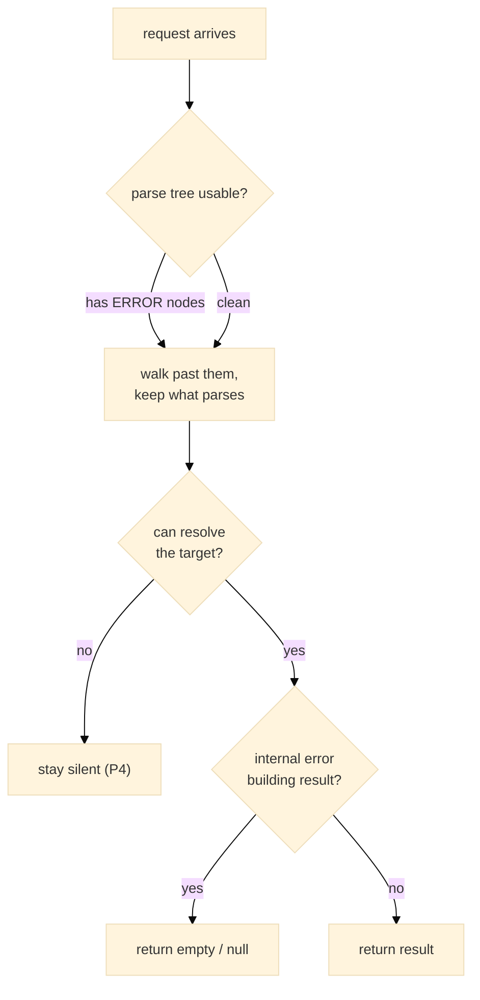

# E16 — Conventions

> **Status:** Approved
>
> **Version:** 0.2   ·   **Last updated:** 2026-06-18
>
> **Purpose:** The code conventions the whole suite enforces — the shared diagnostic data model every finding wears, the error/resilience contract every handler obeys, the never-log-to-stdout rule, the formatting and lint gates, and the layering rules that keep features pure and dependencies flowing downward.
>
> **Depends on:** [constitution](../constitution.md), [E01-architecture](E01-architecture.md)   ·   **Related:** [E02-folder-structure](E02-folder-structure.md), [E03-tech-stack](E03-tech-stack.md), [E15-app-config](E15-app-config.md), [E17-testing](E17-testing.md), [F11-code-actions](../features/F11-code-actions.md), [F14-cli-linter](../features/F14-cli-linter.md)

> Requirement tag: **CONV**

---

## 1. Purpose & Scope

These are the rules every line of the server obeys, stated once so no feature has to restate them. They cover how code behaves when the input is broken or unresolvable, where logs may and may not go, the formatting and lint gates a change must pass, and the layering that keeps the codebase from tangling. [E01](E01-architecture.md) defers the resilience detail here; [E02](E02-folder-structure.md) defers the layering detail here.

This spec covers:

- The shared diagnostic data model — the `Diagnostic` shape, structured advices, tags, and the `FixKind` enum every renderer reads.
- The error/resilience contract: partial-input degradation, `ERROR`-node tolerance, silence on unresolvable input, and handlers that never panic.
- The never-log-to-stdout rule.
- The `clippy -D warnings` + `rustfmt` gate.
- The forbidden-import and layering rules that keep features pure.

## 2. Non-Goals / Out of Scope

- The concrete module layout these layering rules apply to is owned by [E02-folder-structure](E02-folder-structure.md); this spec states the *rule*, not the directory tree.
- The exact crate and tool versions behind `clippy`/`rustfmt` are owned by [E03-tech-stack](E03-tech-stack.md).
- The test categories and coverage gate are owned by [E17-testing](E17-testing.md); this spec covers only the formatting/lint gates, not the test gate.

## 3. Background & Rationale

A language server lives inside a developer's editor, reading code that is broken more often than not — half-typed, mid-refactor, syntactically wrong. The constitution's P3 ("never panic on partial code") and P4 ("only diagnose what's positively wrong") are the beliefs; this spec is the contract that turns them into rules a handler author can follow without rereading the constitution each time.

The other conventions are the boring guardrails that keep a multi-feature codebase coherent: logs that never corrupt the JSON-RPC stream, a green `clippy` run on every change, and a strict one-way dependency flow so two features can never reach into each other.

## 4. Concepts & Definitions

- **`ERROR` node** — the node tree-sitter produces where it couldn't parse the source. Extractors must tolerate these.
- **Handler** — a feature function that takes the shared state plus a request and returns an LSP response. (Pure function, per the constitution's engineering principles.)
- **Degrade, don't fail** — return partial or empty results rather than erroring. (Constitution engineering principle.)
- **Layering** — the rule that dependencies flow downward only: features → foundations, never sideways. Defined in §5.4.

## 5. Detailed Specification

### 5.1 The error & resilience contract

The server reads broken code all day and must never crash, never guess, and never stall on it. This is the contract that makes that true, promoted out of [E01](E01-architecture.md) so every handler can cite it.

**REQ-CONV-01 — Degrade on partial input (P3).**

The user is mid-keystroke most of the time, so every extractor and handler must work on whatever tree-sitter produced. A function that can extract three of five columns returns those three; it does not abort because the fourth is incomplete. Partial input yields partial results, never an error.

**REQ-CONV-02 — Tolerate `ERROR` nodes.**

Tree-sitter emits `ERROR` nodes where it couldn't parse the source. Extractors walk the tree `ERROR` nodes and all, skipping what they can't read and keeping what they can. An `ERROR` node is a signal to move on, never a reason to stop walking the tree.

**REQ-CONV-03 — Stay silent on the unresolvable (P4).**

When the server can't positively resolve something — a relationship target it can't see, a dynamic `__tablename__`, a type it can't parse — it says nothing. No guess, no speculative warning, no "did you mean". A false positive is worse than a missed finding, so silence is the correct answer to ambiguity.

**REQ-CONV-04 — Handlers return empty or null, never panic.**

A handler that hits an internal bug or an unexpected shape returns an empty result — an empty diagnostic list, `null` hover, no completions — never a panic. A panic would take down the request (or the server); an empty result degrades one feature for one request and is invisible to the user. Handlers must not `unwrap()`/`expect()` on anything derived from user input or the parse tree.

### 5.2 Logging: never to stdout

Stdout is the JSON-RPC wire. Anything written there that isn't a protocol message corrupts the stream and can wedge the editor.

**REQ-CONV-05 — All logs go to stderr or `log_file`, never stdout.**

The server communicates with the editor over stdout using JSON-RPC, so stdout is reserved for protocol messages alone. Every log line — from `tracing`, from `println!`-style debugging, from a panic backtrace — goes to stderr, or to the `log_file` path when [E15](E15-app-config.md) sets one. A stray `println!` is a bug, not a style nit: it can desynchronize the client. Use the structured `tracing` macros, which [E01](E01-architecture.md) wires to stderr/`log_file`.

### 5.3 Formatting and lint gates

Every change passes the same two mechanical gates before it lands, so style and lint never become a review topic.

**REQ-CONV-06 — `rustfmt` and `clippy -D warnings` must pass.**

Code is formatted with `rustfmt` (checked in CI via `cargo fmt --check`) and lints clean under `cargo clippy -D warnings` — warnings are denied, so a clippy warning fails the build exactly like an error. These run in the `qa.yml` CI defined in [F16](../features/F16-release-ci.md) and are part of the Definition of Done (constitution §4.6). Suppress a lint only with a narrowly-scoped `#[allow(...)]` carrying a comment that says why.

### 5.4 Layering and forbidden imports

The codebase has one dependency direction, and features can never reach into each other.

**REQ-CONV-07 — Features are pure functions.**

A feature handler takes the shared workspace state plus the request position and returns an LSP response. It holds no hidden state of its own and mutates nothing. This is what lets the `check` CLI and the editor server call the same handler and get the same answer (CLI/server parity, [E17](E17-testing.md)).

**REQ-CONV-08 — Dependencies flow downward only.**

Features depend on foundations — the model types, the workspace state, the extractor. Foundations never depend on features. A foundation that needs to know about a feature is a layering violation and a sign the abstraction is in the wrong place.

**REQ-CONV-09 — Features never import each other.**

No feature module imports another feature module. If two features need the same logic, that logic moves *down* into a foundation (a shared helper, the state, the model types) and both read it from there. This keeps each feature independently testable and prevents the web of cross-feature coupling that makes a server impossible to reason about. The concrete module boundaries this rule polices live in [E02](E02-folder-structure.md).

### 5.5 The diagnostic model

Every finding the suite produces — whether it ends up as a squiggle in your editor, a line in a CI log, or a JSON object in a dashboard — is the *same* value underneath. This section is the home for that value's shape, adapted from Biome's `biome_diagnostics`. We define it once here so no feature has to redescribe what a finding is, and so every renderer reads one model instead of inventing its own.

The payoff is parity. A finding the LSP server publishes and a finding the `check` CLI prints are not two formats of the same idea — they are the *same struct*, rendered twice. That makes the CLI/server parity in [E17](E17-testing.md) (REQ-TST-05) structural rather than coincidental: there is nothing to drift, because there is only one source of truth.

**REQ-CONV-10 — Every finding is a `Diagnostic` carrying code, severity, message, location, advices, and tags.**

Think of the missing-`__tablename__` warning the server shows on a model class. Behind it is one `Diagnostic` value, and every finding in the suite wears the same six fields:

- **`code`** — the stable `SQLA-<SEV><CLASS><NN>` identifier and its category, defined in [E15](E15-app-config.md). This is what you configure, suppress, and grep for.
- **`severity`** — one of `Error`, `Warning`, `Info`, `Hint`. This is the *current* level (after any config override), distinct from the default severity letter baked into the code.
- **`message`** — the human-readable sentence shown to the developer.
- **`location`** — the file plus a tree-sitter byte range pinning the finding to its source span.
- **advices** — an ordered list of structured detail (REQ-CONV-11).
- **tags** — a bitflag set of metadata (REQ-CONV-12).

The rule that makes this worth stating: **all renderers consume this one model.** The LSP server maps it to `lsp_types::Diagnostic`; the CLI's `concise`, `full`, `json`, and `github` reporters in [F14](../features/F14-cli-linter.md) each render it their own way; the editor quick-fixes in [F11](../features/F11-code-actions.md) read its code and tags to decide what to offer. None of them reformat a finding by hand — they all walk the same struct. That is why the output stays consistent across surfaces, and why parity is free.

**REQ-CONV-11 — Advices are an ordered list of structured items, never hand-formatted text.**

A finding often needs to say more than its one-line message — show the offending source, suggest a fix, explain a subtlety. It does this through **advices**: an ordered list the renderers walk in turn, each item a typed variant rather than a pre-baked string. There are four:

- **`CodeFrame`** — a source excerpt with a caret span marking the exact characters. This is what produces the snippet block in the CLI's `full` output, and the rich related-information the LSP server attaches to a diagnostic.
- **`Note`** — a plain explanatory remark, the `note:` line a reader sees beneath a finding.
- **`Diff`** — a before/after pair showing the change a fix would make. This powers fix previews in both the editor and the CLI.
- **`Suggestion`** — a recommended next step phrased for the developer.

Because the items are typed, the renderer decides *how* to draw each one for its surface — a `CodeFrame` becomes ANSI carets in the terminal but a related-information span in the editor. Renderers walk advices; they never hand-format.

> **Note:** Biome builds its `CodeFrame` spans from a rowan CST. We don't need that — tree-sitter already gives us byte ranges, so a `CodeFrame` is just a byte span into the source file plus the caret range within it.

**REQ-CONV-12 — Tags are a bitflag set: `Fixable`, `Deprecated`, `Unnecessary`.**

Some metadata about a finding isn't severity and isn't a message — it's a property the editor renders specially. We carry these as **tags**, a small bitflag set so a finding can hold several at once:

- **`Fixable`** — a quick-fix exists for this finding. The CLI's summary counts these (`[*] N fixable`), and the editor shows the lightbulb.
- **`Deprecated`** — maps to LSP `DiagnosticTag::Deprecated`, which editors render struck through. The [F02](../features/F02-best-practice-lints.md) modernization lints set this — flagging a legacy `backref` or `declarative_base()` marks the deprecated construct.
- **`Unnecessary`** — maps to LSP `DiagnosticTag::Unnecessary`, which editors render greyed out, for code that is redundant rather than wrong.

The mapping to `lsp_types::DiagnosticTag` is direct, so the editor gets the strike-through and grey-out for free off the same flags the CLI reads.

**REQ-CONV-13 — `FixKind` is `Safe`, `Unsafe`, or `None`, and governs what `--fix` may touch unasked.**

When a finding can be repaired, *how trustworthy* that repair is matters as much as that it exists. We classify every fix with one enum, defined here as its home:

- **`Safe`** — an unambiguous correction with exactly one right answer that changes no schema and no runtime behavior. Annotation and string edits live here: adding `Optional[...]`, adding `Mapped[...]`, rewriting `declarative_base()` to `DeclarativeBase`, generating a `__tablename__`.
- **`Unsafe`** — a fix that changes the database schema or runtime behavior, or one that involves a guess about intent. These are correct often but not always, so a human should look first.
- **`None`** — no automatic fix; the finding is informational only.

The governing principle is the dividing line: **Safe means one right answer with no schema or runtime change; Unsafe means a schema change, a behavior change, or a guess.** This is the constitution's "never guess" (P4) applied to fixes.

Two features lean on this enum. [F11](../features/F11-code-actions.md) tags each code action with its `FixKind`, so the editor can present safe fixes prominently and gate the risky ones. [F14](../features/F14-cli-linter.md)'s `check --fix` applies only `Safe` fixes by default; the `Unsafe` ones are skipped and still reported, applied only when you pass `--unsafe`. The same finding, the same `FixKind`, the same decision in both front-ends.

## 6. Examples & Use Cases

Consider the hover handler asked for a card on `Post.author_id` while the user is mid-edit and `models/post.py` has a syntax error two lines down. Tree-sitter hands back a tree with an `ERROR` node near the broken line. The extractor walks past the `ERROR` node (REQ-CONV-02), still reads the intact `author_id` column above it (REQ-CONV-01), and the hover handler renders its card. If the FK target `users.id` can't be resolved because `models/user.py` failed to parse entirely, the handler omits the resolved-target line rather than guessing (REQ-CONV-03) — and if anything unexpected happens deeper in, it returns a `null` hover instead of panicking (REQ-CONV-04). Throughout, any trace logging it emits goes to stderr (REQ-CONV-05), leaving the JSON-RPC response on stdout clean.

## 7. Visualizations

This is the decision a handler makes for every request — the resilience contract as a flow.

## 8. Edge Cases & Failure Modes

- File is entirely unparseable (one giant `ERROR` node) → extractor returns no facts for it; handlers return empty/null; no crash (REQ-CONV-01, REQ-CONV-04).
- A handler hits an `unwrap()` on a `None` it didn't expect → this is a bug to fix, not behavior to rely on; the contract is that handlers must not write such `unwrap()`s in the first place (REQ-CONV-04).
- Debug output accidentally sent to stdout → corrupts JSON-RPC; caught by the never-log-to-stdout rule and by E29 protocol-conformance tests (REQ-CONV-05).
- A feature needs another feature's helper → the helper moves down to a foundation; the cross-feature import is forbidden (REQ-CONV-09).

## 9. Testing

These conventions are enforced partly by tooling (the formatting/lint gate) and partly by behavioral tests (resilience). Shared fixtures live in [E17](E17-testing.md); the partial-parse and protocol-conformance journeys live in [E29](E29-e2e-testing.md).

### 9.1 Scope & coverage

Target: **100% of this spec's behavior is covered.** Every `REQ-CONV-NN` maps to at least one test or CI gate, and every edge case in §8 has a test. See the policy in [E17-testing](E17-testing.md#2-coverage-policy).

### 9.2 Test plan

| Behavior / scenario | Type | Verifies |
|---|---|---|
| Partial model (some columns incomplete) → the complete columns are still extracted | unit | REQ-CONV-01 |
| Source with `ERROR` nodes → extractor skips them and keeps valid facts | unit | REQ-CONV-02 |
| Unresolvable relationship target / dynamic tablename → no diagnostic emitted | unit | REQ-CONV-03 |
| Handler given malformed state/position → returns empty/null, no panic | unit | REQ-CONV-04 |
| Logs land on stderr/`log_file`; stdout carries only JSON-RPC | integration | REQ-CONV-05 |
| `cargo fmt --check` and `cargo clippy -D warnings` pass in CI | CI gate | REQ-CONV-06 |
| A feature module imports no other feature module (verified by review / module-graph check) | static / review | REQ-CONV-07, REQ-CONV-08, REQ-CONV-09 |
| One `Diagnostic` renders to LSP, `concise`, `full`, `json`, and `github` with identical code/severity/message | unit | REQ-CONV-10 |
| A finding with `CodeFrame`/`Note`/`Diff`/`Suggestion` advices renders each item per surface | unit | REQ-CONV-11 |
| `Deprecated`/`Unnecessary` tags map to the matching `lsp_types::DiagnosticTag`; `Fixable` counts in the CLI summary | unit | REQ-CONV-12 |
| `check --fix` applies only `Safe` fixes; `Unsafe` skipped without `--unsafe` | integration | REQ-CONV-13 |

### 9.3 Requirement coverage

| Requirement | Covered by |
|---|---|
| REQ-CONV-01 | partial-extraction test |
| REQ-CONV-02 | `ERROR`-node tolerance test |
| REQ-CONV-03 | silence-on-unresolvable test |
| REQ-CONV-04 | handler-never-panics test |
| REQ-CONV-05 | logging-destination test |
| REQ-CONV-06 | `fmt`/`clippy` CI gate |
| REQ-CONV-07 | pure-function / module-graph check |
| REQ-CONV-08 | downward-dependency module-graph check |
| REQ-CONV-09 | no-cross-feature-import check |
| REQ-CONV-10 | one-model-many-renderers test |
| REQ-CONV-11 | advices-rendering test |
| REQ-CONV-12 | tag-mapping test |
| REQ-CONV-13 | `--fix` safe-only / `--unsafe` test |

## 10. Cross-References

- **Depends on:** [constitution](../constitution.md) — P3, P4, and the engineering principles this spec turns into rules; [E01-architecture](E01-architecture.md) — defers the resilience detail and the `tracing`-to-stderr wiring here.
- **Related:** [E02-folder-structure](E02-folder-structure.md) — the module boundaries the layering rules police; [E03-tech-stack](E03-tech-stack.md) — the `clippy`/`rustfmt` toolchain; [E15-app-config](E15-app-config.md) — the `SQLA-<SEV><CLASS><NN>` code scheme the `Diagnostic.code` carries and the `log_file` setting the logging rule honors; [E17-testing](E17-testing.md) — the coverage gate alongside these formatting/lint gates, and the CLI/server parity (REQ-TST-05) the one diagnostic model makes structural.
- **Consumed by:** [F01-orm-correctness-diagnostics](../features/F01-orm-correctness-diagnostics.md) and [F02-best-practice-lints](../features/F02-best-practice-lints.md) — the lints that produce `Diagnostic` values, with F02's modernization lints setting the `Deprecated` tag; [F11-code-actions](../features/F11-code-actions.md) — tags each action with a `FixKind` and reads `Fixable`; [F14-cli-linter](../features/F14-cli-linter.md) — the `concise`/`full`/`json`/`github` reporters that render the model, and the `--fix`/`--unsafe` gate keyed on `FixKind`.

## 11. Changelog

- **2026-06-18** — Approved.
- **2026-06-18** — Added §5.5 "The diagnostic model" (REQ-CONV-10..13), adapted from Biome's `biome_diagnostics`: the `Diagnostic` shape (code, severity, message, location, advices, tags) as the single model every renderer consumes; structured advices (`CodeFrame`, `Note`, `Diff`, `Suggestion`) over tree-sitter byte ranges; the `Fixable`/`Deprecated`/`Unnecessary` tag bitflags and their LSP `DiagnosticTag` mapping; and the `FixKind` (`Safe`/`Unsafe`/`None`) enum with its governing principle and the F11/F14 `--fix` gate. Cross-links to F01/F02/F11/F14/E15/E17 added. Version 0.1 → 0.2.
- **2026-06-17** — Initial draft: the error/resilience contract (partial-input degradation, `ERROR`-node tolerance, silence on the unresolvable, handlers never panic) promoted out of E01; the never-log-to-stdout rule; the `rustfmt` + `clippy -D warnings` gate; and the pure-function, downward-only, no-cross-feature-import layering rules.
