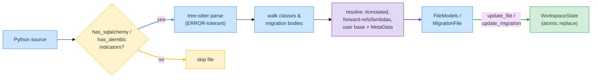

# E30 — Extraction & Indexing

> **Status:** Draft
>
> **Version:** 0.2   ·   **Last updated:** 2026-06-18
>
> **Purpose:** How the server turns Python source into the facts [E07](E07-data-model.md) defines — the tree-sitter walk, the detection indicators that decide what to look at, what counts as a model, the per-file symbol table that resolves every import alias, and the resolution rules for annotated columns, forward references, and user-defined base classes.
>
> **Depends on:** [E07-data-model](E07-data-model.md), [constitution](../constitution.md)   ·   **Related:** [E01-architecture](E01-architecture.md), [F01-orm-correctness-diagnostics](../features/F01-orm-correctness-diagnostics.md), [F02-best-practice-lints](../features/F02-best-practice-lints.md), [F13-alembic-support](../features/F13-alembic-support.md)

> Requirement tag: **EXTRACT**

---

## 1. Purpose & Scope

This spec is the bridge between source code and the workspace index. It says how the server decides a file is worth looking at, how it walks the tree-sitter parse to pull out models and migrations, and — the hard part — how it resolves the indirect ways SQLAlchemy lets you name a type, a base, or another model.

This spec covers:

- The tree-sitter Python parse and the resilience rule for partial/`ERROR` trees.
- The fast string-check **indicators** that gate SQLAlchemy and Alembic extraction.
- What is and isn't a model — the `__tablename__`-or-resolved-base rule.
- The class-body walk that produces columns, relationships, and table-args.
- **Import & symbol resolution** — a per-file table that resolves every alias: modules (`import sqlalchemy as sa`), constructs (`relationship as rel`), column types (`String as Str`), bases (`Base as SuperBase`), models (`User as SomeUser`), and typing helpers (`Optional as Opt`).
- **Three resolution rules:** `Annotated[...]` columns, forward references / lambdas / quoted names, and user-defined base classes (with their `MetaData`).

## 2. Non-Goals / Out of Scope

- The **shapes** extraction produces — owned by [E07](E07-data-model.md).
- The **pipeline** that calls extraction (debounce, generation counter, `spawn_blocking`, watcher events) — owned by [E01](E01-architecture.md).
- The **meaning** of any diagnostic that reads the resolved facts — owned by [F01](../features/F01-orm-correctness-diagnostics.md)/[F02](../features/F02-best-practice-lints.md)/[F13](../features/F13-alembic-support.md).
- Raw-SQL parsing inside `text()` — a deliberate Non-Goal of the whole product (see the index's Out-of-scope note).

## 3. Background & Rationale

SQLAlchemy is friendly to humans and hard on parsers. The same column can be written four ways; a model's type can travel inside an `Annotated[...]`; a relationship can name its target as a class, a string, or a lambda that defers to a name not yet defined. A naive "look for `mapped_column`" pass catches the easy cases and silently misses the rest — which then surface as false diagnostics, the one thing the constitution's P4 forbids.

So extraction is two jobs. The first is mechanical: walk the tree, find the class bodies, read the assignments. The second is **resolution** — turning the indirect forms into the same resolved fact the easy forms produce, so a feature never has to know which spelling the user chose. We do all of this statically, on the tree-sitter tree, never importing or running the user's code (P1).

The mechanical walk is ported from the legacy extractor, which handled the common forms well. The three resolution rules are the new work this spec adds, drawn from the plan's foundation row.

## 4. Concepts & Definitions

- **Indicator** — a cheap substring check (`from sqlalchemy`, `Mapped[`) that decides whether a file is worth a full parse-and-walk. (Defined in §5.2.)
- **`Annotated[...]` column** — a 2.0 idiom where column config travels with the type. (Canonical definition in [glossary](../glossary.md).)
- **Forward reference** — a model named as a string or lambda before the class exists. (Canonical definition in [glossary](../glossary.md).)
- **Declarative base** — the project's own root class all models inherit; it owns the shared `MetaData`. (Canonical definition in [glossary](../glossary.md).)
- **Resolution** — turning an indirect spelling (a quoted name, an alias, a `type_annotation_map` entry) into the same resolved fact a direct spelling would produce.
- **Symbol table** — the per-file map from each local name to the canonical `(module, original-name)` it was imported as. Built from the import statements; consulted by every resolution rule. (Defined in §5.5.)

## 5. Detailed Specification

### 5.1 Parse first, walk second

Extraction always starts from a tree-sitter Python parse — never a regex over raw text.

**REQ-EXTRACT-01 — Parse with tree-sitter; never reject a partial tree.**

The server parses every Python file with `tree-sitter-python` and walks the resulting tree. The user is mid-keystroke most of the time, so the tree will often contain `ERROR` nodes. The walk treats those as ordinary nodes it simply can't read — it extracts what it can from the well-formed siblings and returns the rest. A handler that hits an unexpected node shape returns what it has, never panics. This is the constitution's P3 made concrete: degrade, don't fail.

### 5.2 Detection indicators

Before the full walk, a fast string check decides whether a file is even relevant — most files in a Python project are neither models nor migrations.

**REQ-EXTRACT-02 — A file is a SQLAlchemy candidate if it contains any model indicator.**

The server runs cheap substring checks over the raw source before parsing. A file is worth extracting models from if it contains any of:

- `from sqlalchemy` or `import sqlalchemy`
- `Mapped[`
- `mapped_column`
- `DeclarativeBase`

```rust
// src/parsing/python.rs
pub fn has_sqlalchemy_indicators(source: &str) -> bool {
    source.contains("from sqlalchemy")
        || source.contains("import sqlalchemy")
        || source.contains("Mapped[")
        || source.contains("mapped_column")
        || source.contains("DeclarativeBase")
}
```

These are deliberately broad — a false positive just means one wasted parse, while a false negative means a model goes un-indexed and cross-file diagnostics break. We err toward parsing.

**REQ-EXTRACT-03 — A file is an Alembic candidate if it imports alembic.**

A migration file is detected independently:

```rust
// src/parsing/python.rs
pub fn has_alembic_indicators(source: &str) -> bool {
    source.contains("from alembic") || source.contains("import alembic")
}
```

The two checks are independent. A single file can match both — a migration that also references model classes — so the server runs model extraction and migration extraction on it separately, and neither suppresses the other.

### 5.3 What counts as a model

Not every class in a SQLAlchemy file is a mapped model. The walk applies one rule.

**REQ-EXTRACT-04 — A class is a model if it declares `__tablename__` or extends a resolved base.**

The walk recurses through the module — including nested scopes — and inspects each `class_definition`. A class becomes a `Model` if either holds:

1. It assigns `__tablename__` in its body, **or**
2. One of its base classes resolves to a declarative base (see [REQ-EXTRACT-09](#59-resolving-user-defined-base-classes)).

A class that matches neither — a plain helper, a Pydantic schema, a dataclass — is skipped entirely and never enters the index. This keeps the index to genuine models and keeps every model-reading diagnostic from firing on the wrong class.

### 5.4 The class-body walk

Once a class is a model, the walk reads its body statement by statement.

**REQ-EXTRACT-05 — The walk classifies each annotated assignment as a column, a relationship, or neither.**

For each assignment in the class body, the walk reads the attribute name, the type annotation, and the value:

- `__tablename__ = "posts"` → sets the model's `table_name`.
- `__table_args__ = (…)` → parsed into `TableArg`s.
- An attribute typed `Mapped[...]` whose value is a `relationship(...)` call → a `Relationship`.
- An attribute typed `Mapped[...]` or assigned `mapped_column(...)`, value *not* a relationship call → a `Column`.
- The first statement, if a bare string → the model's docstring.
- Anything else → ignored.

The relationship check happens before the column check, because a relationship attribute is also `Mapped[...]`-typed. The discriminator is the value: a `relationship(...)` call (under any tracked alias, §5.5) makes it a relationship; otherwise it's a column. This ordering is what stops an attribute literally named `customer_relationship: Mapped[str] = mapped_column(...)` from being mistaken for a relationship — its value is `mapped_column`, not a `relationship(...)` call.

**REQ-EXTRACT-06 — A duplicate column attribute is recorded, not dropped.**

If the body assigns the same attribute name twice, the later one wins in `columns`, and the earlier one's name range is pushed onto `duplicate_columns` — the raw material for the duplicate-column diagnostic (`SQLA-E103`).

### 5.5 Import & symbol resolution

Everything downstream depends on knowing what a name *means*. SQLAlchemy code aliases names constantly — `import sqlalchemy as sa`, `from sqlalchemy.orm import relationship as rel`, `from sqlalchemy import String as Str`, `from .models import Base as SuperBase`, `from .users import User as SomeUser`. The extractor resolves all of them through one per-file **symbol table**, so the rest of the walk reasons about *canonical* identities, never surface spellings. Resolve by what a name is *bound to*, never by how it's spelled.

**REQ-EXTRACT-07 — Build a per-file symbol table from the imports.**

Before walking classes, the extractor reads every import statement into a table mapping each local name to the canonical `(module, original-name)` it binds. It handles every import form:

- `import sqlalchemy` · `import sqlalchemy as sa` · `import sqlalchemy.orm as orm` — module bindings, resolved later through attribute access.
- `from sqlalchemy import String` · `from sqlalchemy import String as Str` — direct and aliased symbol imports.
- `from sqlalchemy.orm import relationship as rel, mapped_column as mc` — several, mixed aliased/plain, on one line.
- `from .models import Base as SuperBase` · `from .users import User as SomeUser` — local (project) imports, aliased.
- `from typing import Optional as Opt` · `from sqlalchemy import *` — typing helpers, and star imports (recorded as a wildcard source, resolved best-effort).

```python
# models/post.py — every name below is recorded in the symbol table
import sqlalchemy as sa                                   # sa      -> sqlalchemy
from sqlalchemy.orm import relationship as rel, Mapped    # rel     -> sqlalchemy.orm.relationship
from sqlalchemy import String as Str                      # Str     -> sqlalchemy.String
from .models import Base as SuperBase                     # SuperBase -> .models.Base
if TYPE_CHECKING:
    from .users import User as SomeUser                   # SomeUser -> .users.User  (still recorded)
```

Names imported under `if TYPE_CHECKING:` are recorded too — that block is the common home for forward-reference imports.

**REQ-EXTRACT-07b — Resolve SQLAlchemy *construct* references through the table.**

The classifier (§5.4) decides whether a value is a `relationship(...)`, `mapped_column(...)`, `column(...)`, or `ForeignKey(...)` by resolving the *called name* to its canonical SQLAlchemy symbol — not by matching literal text. A call resolves whether it's spelled canonical (`relationship(...)`), bare-aliased (`rel(...)`), or attribute-style (`orm.relationship(...)`, `sa.orm.relationship(...)`, via the `orm`/`sa` module bindings). The same resolution recognizes `Mapped`, `DeclarativeBase`, and the abstract bases under any alias. This subsumes the legacy's relationship-only alias tracking.

**REQ-EXTRACT-07c — Resolve column *type* references through the table.**

A type named in `Mapped[...]` or passed to `mapped_column(<Type>(...))` resolves to its canonical SQLAlchemy type even when aliased — `from sqlalchemy import String as Str` then `mapped_column(Str(50))`, or `sa.String(50)`, or `Integer as Int`. The resolved `MappedType::SqlType` carries the *canonical* name (`String`), so hover, the FK-type-mismatch check (`SQLA-W303`), and the unbounded-string lint (`SQLA-H206`) all see the real type regardless of spelling.

**REQ-EXTRACT-07d — Resolve the declarative base through the table, across files and re-exports.**

Base resolution ([REQ-EXTRACT-09](#59-resolving-user-defined-base-classes)) consults the symbol table first. A base imported under an alias — `from .models import Base as SuperBase` then `class User(SuperBase)` — resolves `SuperBase` to `.models.Base`, then follows that to a declarative base via the cross-file base registry. Re-export chains resolve transitively, best-effort: a `Base` defined in `models/base.py` and re-exported from `models/__init__.py` still resolves for a model that imports it from the package.

**REQ-EXTRACT-07e — Resolve model references: symbols by binding, strings by class name.**

A relationship or FK names its target two ways, and they resolve *differently* — conflating them is a false-diagnostic generator, so this rule is exact:

- **Symbol reference** (unquoted) — `relationship(SomeUser)`, `ForeignKey(SomeUser.id)`, `Mapped[SomeUser]`. The local name resolves through the symbol table to the canonical model. With `from .users import User as SomeUser`, `relationship(SomeUser)` targets model `User`.
- **String reference** (quoted) — `relationship("User")`, `Mapped["User"]`. SQLAlchemy resolves these against its class **registry by the class's own `__name__`**, *not* the local import alias. So `relationship("User")` targets the class named `User` even where it's imported as `SomeUser`; and `relationship("SomeUser")` resolves only if a model class is actually *named* `SomeUser`. The extractor mirrors this exactly: strings resolve against `model_index` by registered class name, symbols resolve through the local table.

```python
from .users import User as SomeUser
# symbol ref → resolves via the table to model `User`:
author:  Mapped[SomeUser]   = relationship(SomeUser)
# string ref → resolves by class name; "User" hits, "SomeUser" would NOT:
editor:  Mapped["User"]     = relationship("User")
```

**REQ-EXTRACT-07f — Resolve typing helpers through the table.**

`Optional`, `List`/`list`, and `Annotated` resolve through the table too. `from typing import Optional as Opt` then `Mapped[Opt[str]]` still infers nullability ([REQ-EXTRACT-08d](#58-resolving-column-nullability-and-cardinality)); `Annotated` under an alias still unwraps ([REQ-EXTRACT-08a](#56-resolution-rule-a-annotated-columns)).

**REQ-EXTRACT-07g — Resolve by binding, not surface name; unresolvable → silence.**

Resolution keys off the binding, never the spelling — which cuts both ways:

- A name that merely *looks* like a SQLAlchemy symbol but is bound to something else — `from mypkg import Thing as String` — is **not** treated as SQLAlchemy's `String`. The surface text is ignored; the binding wins. (This is the negative half of alias support, and it prevents a whole class of false positives.)
- A name that can't be resolved — it came from `from sqlalchemy import *`, a dynamic re-export, or a module the workspace hasn't indexed — is left unresolved. The construct is handled conservatively and the reference stays silent rather than mis-resolved (P4). Star imports are resolved best-effort against the known SQLAlchemy export set; anything ambiguous stays unresolved.

### 5.6 Resolution rule (a): `Annotated[...]` columns

SQLAlchemy 2.0 lets column configuration travel inside the type via `Annotated`, often funneled through a `registry`. Extraction resolves both.

**REQ-EXTRACT-08a — Unwrap `Annotated[...]` to its base type and merge any embedded `mapped_column`.**

A column can carry its config in the annotation rather than the value. Take `Mapped[Annotated[int, mapped_column(primary_key=True)]]` — the real type is `int`, and the `mapped_column(primary_key=True)` inside the `Annotated` configures it exactly as a value-side `mapped_column` would. Extraction unwraps `Annotated[T, …]` to `T` for the `MappedType`, and reads any `mapped_column(...)` found among the `Annotated` metadata into the same `ColumnArgs`/`ForeignKeyRef` it would read from the value side.

**REQ-EXTRACT-08b — Resolve `registry` / `type_annotation_map` aliases to their underlying column config.**

A project can register a named type alias once and reuse it:

```python
# models/types.py — a registered annotation alias
intpk = Annotated[int, mapped_column(primary_key=True)]
str50 = Annotated[str, mapped_column(String(50))]

class Base(DeclarativeBase):
    registry = registry(type_annotation_map={...})
```

When a column is typed `Mapped[intpk]`, extraction resolves `intpk` to its `Annotated[...]` definition (collected from module-level assignments and any `registry.type_annotation_map`) and applies the embedded config. The resolved column is identical to one that spelled the `mapped_column` out inline — so `id: Mapped[intpk]` is indexed as a primary-key `int`, and no diagnostic falsely flags it as missing a primary key. When an alias can't be resolved, the type falls back to `Unknown` and the column stays silent (P4).

### 5.7 Resolution rule (b): forward references, lambdas, quoted names

A model can be named before it exists — as a string, a quoted annotation, or a lambda. All of these must resolve to the same indexed model.

**REQ-EXTRACT-08c — Resolve every deferred model name to the indexed model.**

SQLAlchemy offers several ways to name a target that isn't defined yet. Extraction normalizes all of them to a single resolved `target_model` the index can look up:

- `Mapped["User"]` — a quoted forward reference in the annotation.
- `relationship("User")` — a string target argument.
- `relationship(lambda: User)` — a lambda deferring to a name.
- `Mapped[list["Post"]]` — a quoted name inside a collection.

For each, extraction strips the quoting or lambda wrapper to recover the bare name (`"User"` → `User`), stores it as `target_model`, and keeps the literal spelling in `explicit_target` so navigation can anchor on what the user actually typed. At lookup time the name resolves against `model_index` ([E07](E07-data-model.md)). The same recovery feeds `MappedType::ForwardRef` and `MappedType::List`, so hover renders `list[Post]` whether the source said `list["Post"]` or `List[Post]`.

When the recovered name matches no indexed model, `target_model` keeps the unresolved name and navigation stays silent — but the relationship-target diagnostic (`SQLA-E401`) may still read it. Extraction resolves; it never invents.

### 5.8 Resolving column nullability and cardinality

Two facts are inferred from the annotation when the call doesn't state them.

**REQ-EXTRACT-08d — Infer nullability from `Optional`, cardinality from the collection wrapper.**

When `mapped_column(...)` sets `nullable=` explicitly, that value is taken verbatim. When it doesn't, a column is nullable exactly when its resolved type is `Optional[...]` — and `Mapped[str | None]` is treated identically to `Mapped[Optional[str]]`. A relationship's `is_list` is `true` exactly when its annotation is a collection (`Mapped[list["Post"]]`, `List[...]`) and `false` for a scalar or `Optional[scalar]`. These inferences feed the nullable-not-Optional (`SQLA-W201`) and uselist-mismatch (`SQLA-W404`) diagnostics.

### 5.9 Resolving user-defined base classes

A project almost always defines its own declarative base; base-dependent rules must read *that* base, not the literal `DeclarativeBase`.

**REQ-EXTRACT-09 — Resolve the project's own declarative base and mixins, and read the resolved base's `MetaData`.**

SQLAlchemy users rarely subclass `DeclarativeBase` directly. They write `class Base(DeclarativeBase): ...` once and inherit `Base` everywhere — often with mixins (`class Post(Base, TimestampMixin)`). Extraction must follow that chain.

The walk treats a class as a declarative base if it extends a known SQLAlchemy abstract base (`DeclarativeBase`, `DeclarativeBaseNoMeta`, `MappedAsDataclass`) **or** another resolved base. Each base name resolves through the symbol table first ([REQ-EXTRACT-07d](#55-import--symbol-resolution)), so an aliased or cross-file base is recognized. So when `User(Base)` is checked against [REQ-EXTRACT-04](#53-what-counts-as-a-model), `Base` resolves transitively to `DeclarativeBase` and `User` is recognized as a model — even though it never names `DeclarativeBase` itself, and the same holds for `class User(SuperBase)` where `SuperBase` is `Base` imported under an alias.

> **Warning:** This is the subtle one. A literal allow-list of `["DeclarativeBase", "Base"]` (as the legacy code used) misfires two ways: it treats *any* class named `Base` as a base even when it isn't one, and it misses a project base named `Model` or `Entity`. Resolution by inheritance chain is what gets both right.

Base resolution also carries the base's **`MetaData`**, including its `naming_convention=`. The no-naming-convention lint (`SQLA-H107`) reads the *resolved* base's `MetaData` — so a model inheriting a `Base` that sets a `naming_convention` is clean, while one whose resolved base sets none is flagged. The rule reads the resolved base, never the literal `DeclarativeBase`, which never carries a project convention.

### 5.10 Alembic extraction

Migration files are walked separately, producing the Alembic facts.

**REQ-EXTRACT-10 — Extract revision metadata and the `op.*` calls inside upgrade/downgrade.**

For an Alembic candidate, the walk reads the module-level `revision` and `down_revision` assignments (a string, a tuple, or `None`) into a `MigrationFile`, and walks the bodies of the `upgrade()` and `downgrade()` functions for `op.*` calls. Each call's operation name, table reference, and column reference become an `OpCall` ([E07](E07-data-model.md)). The revision feeds `revision_index` so chain diagnostics ([F13](../features/F13-alembic-support.md)) can resolve parents to files.

### 5.11 Indexing

Extraction's output is handed to the index, which keys it for cross-file lookup.

**REQ-EXTRACT-11 — Hand resolved facts to the index; let it replace atomically.**

Extraction returns the resolved `FileModels` (and `MigrationFile`) for a single file. It does not touch the reverse indexes itself — it hands the facts to `WorkspaceState::update_file` / `update_migration`, which purge the file's old contributions and insert the new ones in one operation ([E07 REQ-DATA-11](E07-data-model.md)). Extraction is per-file and pure; indexing is the workspace-wide step. This split is what lets pass 1 (extract one file) and pass 2 (rebuild the index) stay independent, as [E01](E01-architecture.md) requires.

## 7. Visualizations

The flow runs left to right: a file is gated by indicators, parsed, walked into resolved facts, then handed to the index that keys them for every feature.



## 9. Examples & Use Cases

Walk the `clean-blog` `Post` through extraction. The file passes `has_sqlalchemy_indicators` on `Mapped[`. The parse yields a tree; the walk finds `class Post(Base, …)`, resolves `Base` transitively to `DeclarativeBase` ([REQ-EXTRACT-09](#59-resolving-user-defined-base-classes)) and recognizes `Post` as a model. It reads `__tablename__ = "posts"`, then `author_id: Mapped[int] = mapped_column(ForeignKey("users.id"))` as a `Column` with a `ForeignKeyRef`, and `author: Mapped["User"] = relationship(back_populates="posts")` as a `Relationship` — the quoted `"User"` resolved to `target_model = "User"` ([REQ-EXTRACT-08c](#57-resolution-rule-b-forward-references-lambdas-quoted-names)). The resolved `FileModels` goes to `update_file`, which inserts `"Post"` into `model_index` and `"posts"` into `table_index`. Now hover on `author_id` resolves its FK in one lookup, and `SQLA-H107` reads the `naming_convention` off the resolved `Base`'s `MetaData`.

## 10. Edge Cases & Failure Modes

- A half-typed class with `ERROR` nodes → the well-formed columns extract; the broken one is skipped; no crash (P3).
- `Mapped[intpk]` where `intpk` is never defined → type falls back to `Unknown`; the column is indexed with no flags and stays silent (P4).
- `relationship("Ghost")` where no `Ghost` model exists → `target_model = "Ghost"`, unresolved; navigation silent, but `SQLA-E401` may report it.
- A class named `Base` that is *not* a declarative base (doesn't extend one) → correctly *not* treated as a base, because resolution follows the inheritance chain, not the name.
- A file that is both a model module and a migration → both extractors run; neither suppresses the other ([REQ-EXTRACT-03](#52-detection-indicators)).
- A dynamic `__tablename__` (computed, not a literal) → `table_name` stays `None`; the model is still indexed if it has a resolved base; no guess at the name (P4).
- An aliased construct, type, base, or model (`relationship as rel`, `String as Str`, `Base as SuperBase`, `User as SomeUser`) → resolved through the symbol table to its canonical identity; indistinguishable downstream from the un-aliased form ([REQ-EXTRACT-07](#55-import--symbol-resolution)).
- A non-SQLAlchemy name that *looks* like a construct/type — `from mypkg import Thing as String` → **not** treated as SQLAlchemy's `String`; the binding wins, not the spelling (REQ-EXTRACT-07g). No false column type, no false diagnostic.
- A string target whose spelling matches a local alias but not a class name — `relationship("SomeUser")` where the class is `User` → unresolved (strings resolve by class name, REQ-EXTRACT-07e); `SQLA-E401` may report it, navigation stays silent.
- A name from `from sqlalchemy import *` or an unindexed re-export → resolved best-effort; if ambiguous, left unresolved and silent (REQ-EXTRACT-07g, P4).

## 11. Testing

Extraction is the most unit-testable part of the server, and alias resolution is where the bugs hide — so every resolvable kind is tested in **both** its plain and aliased form, plus combined "complex" cases. Shared fixtures live in [E17](E17-testing.md#5-fixtures-registry); this section is the matrix each `REQ-EXTRACT-NN` is held to.

### 11.1 Coverage policy

Target: **100% of this spec's behavior.** Every `REQ-EXTRACT-NN` maps to at least one test, and every edge case in §10 has one. The alias matrix below (§11.2) is the load-bearing part: a plain case and its aliased twin must produce the **identical resolved fact** — that equivalence *is* the assertion.

### 11.2 The alias resolution matrix

Each row is tested twice — plain and aliased — and both must yield the same resolved fact. Fixtures are named under the [E17 registry](E17-testing.md#5-fixtures-registry).

| # | What resolves | Plain form | Aliased form | Verifies | Fixture |
|---|---|---|---|---|---|
| 1 | Module import | `import sqlalchemy` → `sqlalchemy.String` | `import sqlalchemy as sa` → `sa.String` | REQ-EXTRACT-07/07c | `alias-module` |
| 2 | Submodule import | `from sqlalchemy.orm import relationship` | `import sqlalchemy.orm as orm` → `orm.relationship(...)` | REQ-EXTRACT-07b | `alias-submodule` |
| 3 | Construct import | `relationship(...)` / `mapped_column(...)` | `relationship as rel` / `mapped_column as mc` | REQ-EXTRACT-07b | `alias-construct` |
| 4 | Attribute-style construct | `relationship(...)` | `sa.orm.relationship(...)` | REQ-EXTRACT-07b | `alias-attr-construct` |
| 5 | Column type | `mapped_column(String(50))` | `String as Str` → `mapped_column(Str(50))` | REQ-EXTRACT-07c | `alias-type` |
| 6 | Base class (same file) | `class User(Base)` | `Base as SuperBase` → `class User(SuperBase)` | REQ-EXTRACT-07d/09 | `alias-base` |
| 7 | Base class (cross-file + re-export) | base in `models/base.py`, imported plainly | imported aliased via `models/__init__.py` re-export | REQ-EXTRACT-07d | `alias-base-crossfile` |
| 8 | Model ref — symbol | `relationship(User)` / `ForeignKey(User.id)` / `Mapped[User]` | `User as SomeUser` → `relationship(SomeUser)` etc. | REQ-EXTRACT-07e | `alias-model-symbol` |
| 9 | Model ref — string (by class name) | `relationship("User")` resolves to class `User` | `"User"` still resolves under `User as SomeUser`; `"SomeUser"` does **not** | REQ-EXTRACT-07e | `string-ref-classname` |
| 10 | Typing helper | `Mapped[Optional[str]]` | `Optional as Opt` → `Mapped[Opt[str]]` | REQ-EXTRACT-07f | `alias-typing` |
| 11 | `Annotated` alias | `Mapped[Annotated[int, mapped_column(...)]]` | `Annotated as Ann` / aliased `mapped_column` inside | REQ-EXTRACT-07f/08a | `alias-annotated` |
| 12 | Negative — fake symbol | — | `from mypkg import Thing as String` → not SA's `String` | REQ-EXTRACT-07g | `alias-fake-symbol` |
| 13 | Negative — unresolved | — | `from sqlalchemy import *` → ambiguous name stays unresolved | REQ-EXTRACT-07g | `alias-star-import` |

### 11.3 Complex / combined cases

- **Everything aliased at once** — an aliased base, an aliased model target, an aliased type, and an aliased `relationship`, in one model, resolve to the same facts as the plain spelling. Fixture: `alias-complex`.
- **Mixed line** — `from sqlalchemy import String as Str, Integer` (one aliased, one not) resolves both correctly. Fixture: `alias-mixed`.
- **Two names, one symbol** — the same canonical type imported under two aliases; both resolve identically.
- **Shadowing** — a class or variable named `String` defined in the module shadows the imported type within its scope; resolution prefers the nearest binding. Fixture: `alias-shadow`.
- **`TYPE_CHECKING` import** — a model imported only under `if TYPE_CHECKING:` still resolves as a symbol target. Fixture: `alias-type-checking`.
- **Aliased relationship → aliased model, bidirectional** — `rel(SomeUser, back_populates="posts")` with the counterpart also aliased, resolves the `back_populates` pair (feeds `SQLA-W402`).

### 11.4 Requirement coverage

| Requirement | Covered by |
|---|---|
| REQ-EXTRACT-01 | partial/`ERROR`-tree extraction test |
| REQ-EXTRACT-02 / 03 | indicator gating (incl. aliased-import lines still match) |
| REQ-EXTRACT-04 | model-recognition (tablename or resolved base) |
| REQ-EXTRACT-05 / 06 | class-body classification + duplicate-column |
| REQ-EXTRACT-07 | symbol-table build over every import form |
| REQ-EXTRACT-07b | matrix rows 2–4 |
| REQ-EXTRACT-07c | matrix row 5 |
| REQ-EXTRACT-07d | matrix rows 6–7 |
| REQ-EXTRACT-07e | matrix rows 8–9 |
| REQ-EXTRACT-07f | matrix rows 10–11 |
| REQ-EXTRACT-07g | matrix rows 12–13 |
| REQ-EXTRACT-08a/b/c/d | Annotated, forward-ref/lambda/quoted, nullability/cardinality tests |
| REQ-EXTRACT-09 | base resolution + `MetaData` (plain + aliased + cross-file) |
| REQ-EXTRACT-10 / 11 | Alembic extraction + atomic index handoff |

## 16. Cross-References

- **Depends on:** [E07-data-model](E07-data-model.md) — the fact types extraction populates; [constitution](../constitution.md) — P1 (static only), P3 (never panic on partial code), P4 (silence on unresolvable input).
- **Related:** [E01-architecture](E01-architecture.md) — the pipeline that drives extraction and the atomic-replacement contract; [F01-orm-correctness-diagnostics](../features/F01-orm-correctness-diagnostics.md) / [F02-best-practice-lints](../features/F02-best-practice-lints.md) — read the resolved facts (e.g. `SQLA-H107` reads the resolved base's `MetaData`); [F13-alembic-support](../features/F13-alembic-support.md) — consumes the Alembic extraction.

## 17. Changelog

- **2026-06-18** — v0.2: generalized §5.5 from relationship-only alias tracking into full **import & symbol resolution** — a per-file symbol table (REQ-EXTRACT-07) resolving aliased modules, constructs, column types, bases, models, and typing helpers (REQ-EXTRACT-07b–07g), including the symbol-vs-string model-reference distinction and the resolve-by-binding-not-spelling negative rule. Added the §11 Testing section with the plain-vs-aliased resolution matrix, complex/combined cases, and the requirement-coverage table; added the alias edge cases in §10.
- **2026-06-17** — Initial draft. Ported the tree-sitter walk, detection indicators, the model-recognition rule, the class-body classification, and relationship-alias tracking from the legacy extractor. Added the three new resolution rules: `Annotated[...]`/`type_annotation_map` columns (REQ-EXTRACT-08a/b), forward references / lambdas / quoted names (REQ-EXTRACT-08c), and user-defined base + `MetaData` resolution feeding `SQLA-H107` (REQ-EXTRACT-09). Added the extract→index Mermaid flow.
